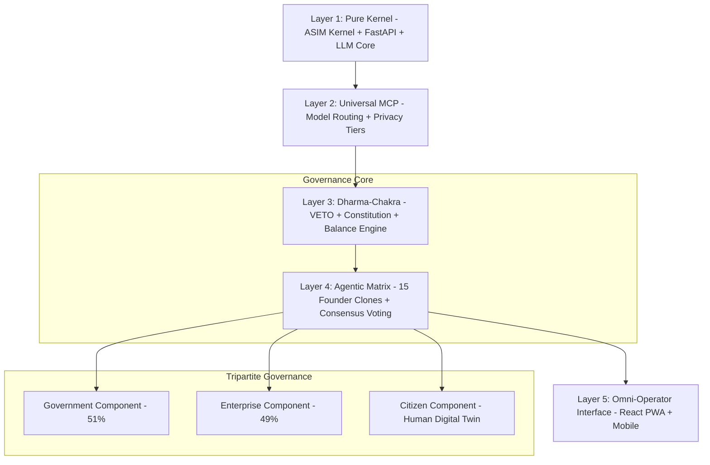

# AsimNexus Technical Specification Document
## Tripartite Digital Governance Infrastructure for Nepal

**Version:** 1.0.0+rc1-governance  
**Date:** 2026-06-15  
**Status:** Production Implementation Specification

---

## Executive Summary

AsimNexus is a tripartite digital governance infrastructure designed for Nepal's digital transformation, integrating Government (51%), Enterprise (49%), and Citizen (Human Digital Twin) modules through a secure, ethically-governed platform. This specification formalizes the architecture for production deployment.

---

## 1. System Architecture Overview

### 1.1 Five-Layer Architecture



### 1.2 Component Classification

| Component | Status | Lines of Code | Priority |
|-----------|--------|---------------|----------|
| **Core Kernel** | REAL | 4,130 | P0 |
| **Power Balance Constitution** | REAL | 726 | P0 |
| **Dharma VETO Engine** | REAL | 842 | P0 |
| **Founder Clone System** | REAL | 2,754 | P0 |
| **Personal OS** | REAL | 1,068 | P0 |
| **Mesh Network** | REAL | 12,000+ | P0 |
| **ZKP Privacy System** | PARTIAL | 600 | P1 |
| **Nexus Connector API** | CONCEPT | TBD | P1 |
| **Digital Twin (HDT)** | CONCEPT | TBD | P1 |

---

## 2. Governance Architecture

### 2.1 Power Balance Constitution (51/49 Model)

```python
# security/power_balance_constitution.py - PRODUCTION CONFIGURATION

SECTOR_BALANCE_MAP = {
    "infrastructure": SectorControl.PUBLIC_COORDINATED,  # 51% Government
    "governance": SectorControl.PUBLIC_COORDINATED,     # 51% Government
    "healthcare": SectorControl.PUBLIC_COORDINATED,       # 51% Government
    "education": SectorControl.PUBLIC_COORDINATED,       # 51% Government
    "commercial": SectorControl.PRIVATE_OPERATED,        # 49% Government
    "finance": SectorControl.MIXED,                    # Case-by-case
    "technology": SectorControl.PRIVATE_OPERATED,        # 49% Government
    "communication": SectorControl.MIXED,               # Case-by-case
}

# Environment Variables for Production
ASIM_POWER_BALANCE_DB_PATH = "data/power_balance.jsonl"
ASIM_POWER_BALANCE_AUDIT_MAX = "100000"
```

### 2.2 Dharma VETO Engine - 5-Tier Ethical Validation

```python
# core/dharma/dharma_veto.py - PRODUCTION LAYERS

class DharmaVetoLayers:
    LAYER_0 = "Immutable Constitution Check"     # Rule: Never violate constitutional principles
    LAYER_1 = "Critical Forbidden Patterns"      # Block: rm -rf, drop table, bomb making
    LAYER_2 = "Block Patterns (Human Required)"  # Require Level-3 approval
    LAYER_3 = "ΔT Anti-Concentration Check"      # Max 7% influence per entity
    LAYER_4 = "Cultural Compliance"            # Nepal law + cultural norms

# Severity Levels
VetoSeverity.CRITICAL = "critical"  # Cannot override - STOP
VetoSeverity.BLOCK = "block"        # Requires human Level-3 approval
VetoSeverity.WARN = "warn"          # Proceed with caution
VetoSeverity.PASS = "pass"          # Clear to proceed
```

### 2.3 Constitutional AI Council (15 Member Voting)

```python
# core/founder_clones/founder_clone_system.py - CONSENSUS MECHANISM

class CloneConsensusVoting:
    QUORUM_THRESHOLD = 0.51    # 51% required for approval
    GOVERNANCE_QUORUM = 0.67   # 8/15 required for system changes
    CRITICAL_QUORUM = 0.67     # 8/15 required for critical decisions
    SOVEREIGNTY_QUORUM = 1.0   # 15/15 required for sovereignty changes
    
    AsyncVoteFlow:
        1. Propose = FounderCloneSystem.coordinate_founders()
        2. Debate = Parallel LLM calls to relevant founders
        3. Vote = CloneConsensusEngine.start_round()
        4. Tally = 8/15 consensus required
        5. Execute = ZKPConfirmationManager.confirm()
```

---

## 3. Tripartite Component Architecture

### 3.1 Government Component (51% Stake)

| Feature | Implementation | Security Control |
|---------|----------------|------------------|
| Policy Definition | `governance/` modules | Level-3 biometric + HSM |
| Audit Access | `security/audit_log.py` | Read-only with approval |
| Emergency Controls | `dharma_veto.py` Layer 3 | Kill Switch activation |
| Data Oversight | `mesh/offline_sync.py` | Public sector > 51% |

### 3.2 Enterprise Component (49% Stake)

| Feature | Implementation | Security Control |
|---------|----------------|------------------|
| Service Delivery | `connectors/` modules | Company API keys |
| Revenue Operations | `founder_clones/` CFO/VP_SALES | Threshold-based approval |
| Data Processing | `core/routing/hybrid_router.py` | Private data isolation |
| Market Access | `frontend/` marketplace | Role-based permissions |

### 3.3 Citizen Component (Human Digital Twin)

| Feature | Implementation | Privacy Protection |
|---------|----------------|-------------------|
| Personal OS | `core/identity/personal_os.py` | Local-first storage |
| Digital Identity | `core/identity/user_identity.py` | DID + ZKP verification |
| Agent Interaction | `frontend/react/src/api/asimnexus.js` | User consent required |
| Mesh Participation | `mesh/p2p_transport.py` | Offline capability |

---

## 4. Nexus Secure Connector API Specification

### 4.1 API Contract

```python
# NEW FILE: connectors/nexus_secure_connector.py

class NexusSecureConnector:
    """
    Zero-Knowledge Proof API for cross-module authentication and data exchange.
    Facilitates Government ↔ Enterprise ↔ Citizen interaction.
    """
    
    def __init__(self):
        self.zkp_manager = get_zkp_manager()
        self.veto_engine = get_veto_engine()
        self.power_balance = get_power_balance()
        
    async def validate_cross_module_request(
        self,
        source_module: "government|enterprise|citizen",
        target_module: "government|enterprise|citizen",
        action: str,
        context: Dict[str, Any]
    ) -> VetoResult:
        """Validate request against sector rules and veto engine."""
        pass
        
    async def create_zkp_verification(
        self,
        action_hash: str,
        sector: str,
        requires_level3: bool = False
    ) -> PendingConfirmation:
        """Create ZKP-based human confirmation requirement."""
        pass
        
    async def route_to_module(
        self,
        module: str,
        payload: Dict[str, Any]
    ) -> Dict[str, Any]:
        """Securely route payload to target module."""
        pass
```

### 4.2 Endpoints

| Endpoint | Method | Authentication | Purpose |
|----------|--------|----------------|---------|
| `/connector/validate` | POST | JWT + Sector Token | Cross-module validation |
| `/connector/route` | POST | JWT + ZKP Token | Secure routing |
| `/connector/status` | GET | Admin | Connector health |

---

## 5. Database Migration Architecture

### 5.1 Tiered PostgreSQL Architecture

```yaml
# NEW FILE: infra/database/tiered_postgres.yaml

Primary DB (Government Sector):
  - Host: pg-gov-primary.asim.nexus
  - SSL: Required
  - Encryption: HSM-backed
  - Replication: Async to backup

Secondary DB (Enterprise Sector):
  - Host: pg-ent-secondary.asim.nexus
  - SSL: Required
  - Encryption: Company-managed keys
  - Replication: Async to backup

Citizen DB (Partitioned):
  - Host: pg-citizen-partitioned.asim.nexus
  - Sharding: By geographic region
  - Encryption: User-controlled keys
  - Replication: Mesh-based sync
```

### 5.2 Migration Path

```sql
-- MIGRATION SCRIPT: migrations/001_tiered_pg.sql

-- Citizen Data Migration
CREATE TABLE citizen_personal_os (
    user_id UUID PRIMARY KEY,
    identity_did TEXT UNIQUE NOT NULL,
    settings JSONB,
    clones JSONB,
    memory_encrypted BYTEA,
    created_at TIMESTAMP DEFAULT NOW()
);

-- Audit Trail (Immutable)
CREATE TABLE audit_log (
    id UUID PRIMARY KEY DEFAULT gen_random_uuid(),
    event_type TEXT NOT NULL,
    actor TEXT NOT NULL,
    action_hash TEXT NOT NULL,
    sector TEXT,
    timestamp TIMESTAMP DEFAULT NOW(),
    zkp_proof TEXT
);
```

---

## 6. DevOps Pipeline Specification

### 6.1 Branching Strategy

```
main                    # Production - protected, requires PR + CI
├── release/rc-1        # Release candidate - frozen (current)
├── release/rc-2        # Next release
└── develop             # Active development
    ├── feature/gov-api
    ├── feature/zkp-offline
    └── feature/mesh-routing
```

### 6.2 CI/CD Pipeline

```yaml
# .github/workflows/ci-cd.yml - PRODUCTION PIPELINE

stages:
  security_scan:
    - bandit: Python security analysis
    - trivy: Container vulnerability scanning
    - semgrep: Code pattern analysis
    
  unit_tests:
    - pytest: All tests under 5 minutes
    - coverage: Minimum 90% coverage
    
  build:
    - docker-build: Multi-stage production image
    - k8s-manifests: Generate manifests
    
  deploy_staging:
    - helm-upgrade: staging environment
    - smoke-tests: Health checks
    
  deploy_production:
    - canary-deployment: 10% traffic
    - health-monitoring: 30 minutes
    - full-deployment: 100% traffic
```

### 6.3 Kubernetes Deployment

```yaml
# k8s/production/asimnexus.yaml

apiVersion: apps/v1
kind: Deployment
metadata:
  name: asimnexus-kernel
spec:
  replicas: 3
  selector:
    matchLabels:
      app: asimnexus-kernel
  template:
    spec:
      containers:
      - name: kernel
        image: asimnexus/kernel:1.0.0
        ports:
        - containerPort: 8000
        envFrom:
        - secretRef:
            name: asimnexus-secrets
---
apiVersion: v1
kind: Service
metadata:
  name: asimnexus-mesh-service
spec:
  selector:
    app: asimnexus-kernel
  ports:
  - port: 8000
    targetPort: 8000
```

---

## 7. Production Implementation Roadmap

### Phase 1: Core Governance Hardening (Weeks 1-4)

| Week | Task | Files | Priority |
|------|------|-------|----------|
| 1 | Complete Power Balance Constitution tests | `tests/real/test_power_balance.py` | P0 |
| 2 | Implement Clone Consensus Voting | `core/clone_consensus.py` | P0 |
| 3 | Harden Dharma VETO Engine | `core/dharma/veto_engine.py` | P0 |
| 4 | ZKP Confirmation improvements | `core/dharma_chakra/zkp_manager.py` | P0 |

### Phase 2: Component Refactoring (Weeks 5-8)

| Week | Task | Files | Priority |
|------|------|-------|----------|
| 5 | Nexus Secure Connector API | `connectors/nexus_secure_connector.py` | P1 |
| 6 | Personal OS enhancements | `core/identity/personal_os.py` | P1 |
| 7 | Digital Twin foundation | `core/identity/digital_twin.py` | P1 |
| 8 | Enterprise SDK modules | `connectors/enterprise_sdk.py` | P1 |

### Phase 3: Data Infrastructure (Weeks 9-12)

| Week | Task | Files | Priority |
|------|------|-------|----------|
| 9 | PostgreSQL schema design | `migrations/*.sql` | P0 |
| 10 | HSM integration | `security/hsm_integration.py` | P0 |
| 11 | Biometric Level-3 approval | `security/biometric_approval.py` | P1 |
| 12 | Offline sync optimization | `mesh/offline_sync_engine.py` | P0 |

### Phase 4: Deployment & Monitoring (Weeks 13-16)

| Week | Task | Files | Priority |
|------|------|-------|----------|
| 13 | K8s manifests production | `k8s/production/*.yaml` | P0 |
| 14 | Monitoring dashboards | `monitoring/observability.py` | P0 |
| 15 | Security audit | `security/security_audit.py` | P0 |
| 16 | Production launch | All | P0 |

---

## 8. Granular File-by-File Execution Plan

### 8.1 Must Implement (P0)

```python
# CRITICAL FUNCTIONS TO IMPLEMENT

# 1. Clone Consensus Voting (MISSING)
core/clone_consensus.py
├── clone_consensus_voting()     # NEEDS IMPLEMENTATION
├── calculate_consensus()        # NEEDS IMPLEMENTATION
└── execute_proposal()           # NEEDS IMPLEMENTATION

# 2. Nexus Secure Connector (MISSING)
connectors/nexus_secure_connector.py
├── validate_cross_module_request() # NEW FILE
├── create_zkp_verification()      # NEW FILE
└── route_to_module()              # NEW FILE

# 3. Digital Twin Manager (MISSING)
core/identity/digital_twin.py
├── create_hdt()                   # NEW FILE
├── sync_with_citizen()            # NEW FILE
└── offline_capability()           # NEW FILE

# 4. HSM Integration (PARTIAL → REAL)
security/hsm_integration.py
├── encrypt_with_hsm()             # NEEDS IMPLEMENTATION
└── decrypt_with_hsm()             # NEEDS IMPLEMENTATION
```

### 8.2 Must Modify (P0)

```python
# MODIFICATIONS REQUIRED

# FOUNDER CLONE SYSTEM - Add consensus flow
core/founder_clones/founder_clone_system.py:
- Add method: `clone_consensus_voting()` after line 534
- Modify: `coordinate_founders()` to integrate consensus check
- Add method: `get_consensus_status()` for governance audit

# OFFLINE SYNC - Add Nepal-specific mesh protocols
mesh/offline_sync_engine.py:
- Add: SMS fallback routing for remote areas
- Add: P2P device discovery for mesh networking
- Modify: `queue_operation()` for priority queuing

# PERSONAL OS - Add government/enterprise modes
core/identity/personal_os.py:
- Add: Government mode switching (lines 540-600)
- Add: Enterprise integration hooks (lines 600-700)
- Add: `get_gov_dashboard()` method

# ROUTER - Add sector-based routing
core/routing/hybrid_router.py:
- Modify: Add sector classification for government/enterprise/citizen
- Add: `route_by_sector()` method
```

### 8.3 Must Remove/Deprecate (P2)

```python
# DEPRECATED/CONCEPT ITEMS

# Remove or mark as CONCEPT:
infra/docker/Docker Compose.yml    # Replace with k8s
mobile/react_native/               # Not production ready
economy/                          # CONCEPT - future implementation
deployment/                       # CONCEPT - replace with CI/CD
```

---

## 9. Success Criteria

| Metric | Target | Measurement |
|--------|--------|-------------|
| System Uptime | 99.9% | Kubernetes health probes |
| Test Coverage | 90% | pytest --cov |
| Security Score | A+ | OWASP ZAP scan |
| Response Time | <200ms | Load testing |
| Offline Sync | 100% | Mesh network tests |
| ZKP Verification | Working | Integration tests |

---

## 10. Risk Mitigation

| Risk | Mitigation Strategy |
|------|---------------------|
| Data Sovereignty | Local-first architecture, Nepal data residency |
| Government Adoption | JV partnership model (51/49) |
| Offline Connectivity | SMS + Bluetooth mesh fallback |
| Security Breach | HSM + ZKP + Audit trail |
| Scalability | Kubernetes + PostgreSQL sharding |