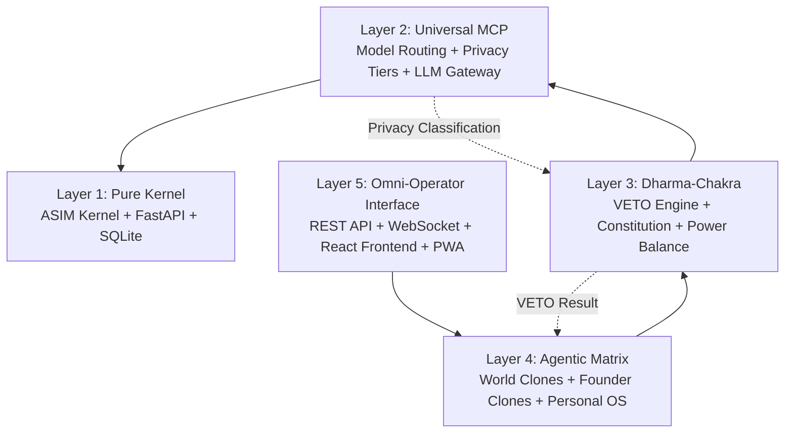
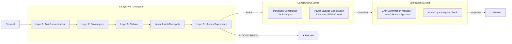
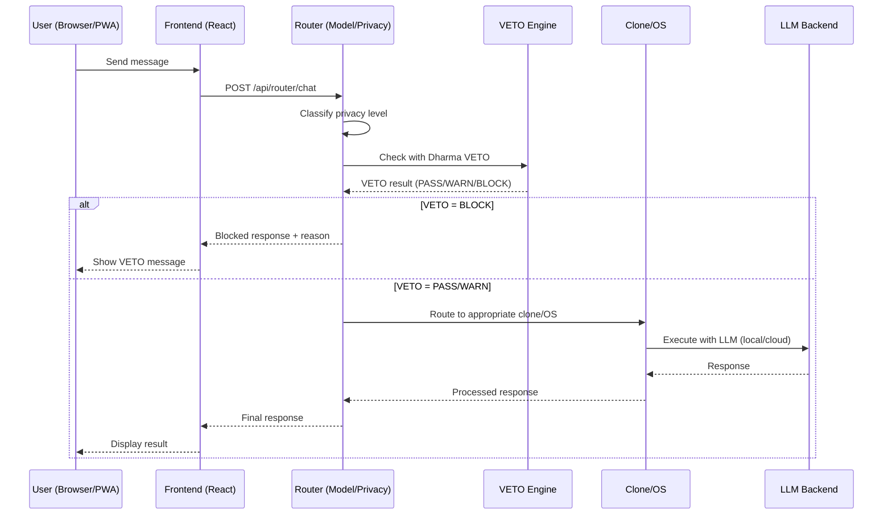
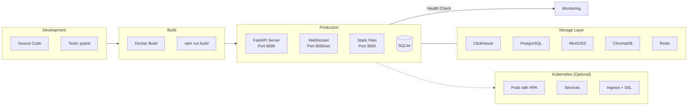
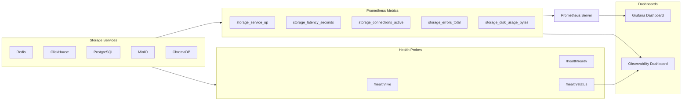

# AsimNexus Architecture

> **Version:** 1.0.1+build43  
> **Status:** Canonical reference for the AsimNexus system architecture  
> **See also:** [`plans/comprehensive_analysis.md`](plans/comprehensive_analysis.md)

---

## 1. Architectural Philosophy

AsimNexus is a **constitutional AI platform** — a unified operating system for human-AI collaboration built on five foundational principles:

1. **Privacy-First:** Local-first architecture, zero-knowledge proofs, no-cloud-for-highly-sensitive-data
2. **Ethical by Construction:** Every action passes through the Dharma-Chakra VETO engine before execution
3. **Constitutional Immutability:** Core governance principles are hard-coded and integrity-verified
4. **Decentralized by Design:** Mesh networking, P2P discovery, offline-first operation
5. **Universal Access:** One platform serving individuals, families, communities, companies, governments, and global entities

---

## 2. Five-Layer Architecture



### Layer 1: Pure Kernel

| Component | File | Role |
|-----------|------|------|
| ASIM Kernel | [`kernel/asim_kernel.py`](kernel/asim_kernel.py) | Async FastAPI kernel, lifecycle management, request processing |
| SQLite Database | [`data/asim_core.db`](data/asim_core.db) | Persistent storage for users, messages, jobs, tokens |
| Version System | [`backend/version.py`](backend/version.py) | Single-source-of-truth for version, build ID, git SHA, release channel |
| Release Manager | [`backend/release.py`](backend/release.py) | Release lifecycle: publish, list, set-current, rollback |

### Layer 2: Universal MCP (Model Communication Protocol)

| Component | File | Role |
|-----------|------|------|
| Model Router | [`backend/router.py`](backend/router.py) | Privacy-tier routing: local-first, no-cloud-for-highly-sensitive |
| AsimBrain | [`core/asim_brain.py`](core/asim_brain.py) | Local GGUF + cloud fallback with Dharma inline check |
| Smart Router | [`connectors/smart_model_router.py`](connectors/smart_model_router.py) | Cost- and latency-aware model selection |
| LLM Gateway | [`connectors/unified_llm_gateway.py`](connectors/unified_llm_gateway.py) | OpenAI, Anthropic, Gemini, DeepSeek integration |

### Layer 3: Dharma-Chakra (Ethics & Balance)



### Layer 4: Agentic Matrix

| Component | File | Role |
|-----------|------|------|
| World Clone Orchestrator | [`core/founder_clones/world_clones.py`](core/founder_clones/world_clones.py) | 15 world-role clones with Dharma VETO, local-first execution |
| Founder Clone System | [`core/founder_clones/founder_clone_system.py`](core/founder_clones/founder_clone_system.py) | 15 corporate founder clones with multi-model NVIDIA API |
| Personal OS | [`core/identity/personal_os.py`](core/identity/personal_os.py) | Personal OS shell: offline sync, notifications, clone configs, memory, rules, documents |
| User Identity | [`core/identity/user_identity.py`](core/identity/user_identity.py) | Registration, login, JWT, HDT affinity, workspace management |

### Layer 5: Omni-Operator Interface

| Component | File | Role |
|-----------|------|------|
| REST API | [`core/api_endpoints.py`](core/api_endpoints.py) | 100+ endpoints covering all system functions |
| WebSocket | [`core/api_endpoints.py`](core/api_endpoints.py) (line 928) | Real-time chat with personal context + VETO + LLM |
| React Frontend | [`frontend/react/src/App.js`](frontend/react/src/App.js) | SPA with 7 routes, 6 themes, 6 universe contexts |
| API Client | [`frontend/react/src/api/asimnexus.js`](frontend/react/src/api/asimnexus.js) | 15+ API modules for all backend services |

---

## 3. Request Lifecycle



---

## 4. Security Model

### Privacy Tiers (in [`backend/router.py`](backend/router.py:99))

| Tier | Description | Route |
|------|-------------|-------|
| `public` | General queries, no personal data | Cloud LLM allowed |
| `personal` | Contains personal preferences | Local-first, cloud with consent |
| `sensitive` | Financial, health, identity data | **Local only** |
| `highly_sensitive` | Biometric, legal, private keys | **Local only, never cloud** |

### ZKP System (in [`security/zkp_privacy.py`](security/zkp_privacy.py))

```
Proof Types:  Identity | Age | Balance | Statement
Protocols:    SNARK | STARK | Bulletproof | Ring Signature
Workflow:     Commitment → Proof Generation → Verification → Result
```

### Constitutional Layer (in [`security/immutable_constitution.py`](security/immutable_constitution.py))

10+ principles with:
- **Category:** DigitalRights, Privacy, Ethics, Governance, Security, Transparency
- **Severity:** Advisory, Required, Enforced, Inviolable
- **Verification:** SHA-256 integrity check detects any tampering

### Power Balance (in [`security/power_balance_constitution.py`](security/power_balance_constitution.py))

8 sectors, each with 51% public control / 49% private control:
- Sector voting weighted by stake
- Amendments require supermajority (67%+)
- JSONL append-only persistence for full audit trail

---

## 5. Data Flow Diagrams

### Authentication Flow
```
User → POST /auth/register → IdentitySystem.register()
  → Hash password (SHA-256)
  → Create AsimUser with AsimID
  → Create personal workspace (data/users/{asim_id}/)
  → Persist to JSONL
  → Return JWT token
  
User → POST /auth/login → IdentitySystem.login()
  → Verify password hash
  → Generate JWT with role
  → Return token + user profile
```

### Personal OS Flow
```
User → GET /personal/status → PersonalOS.get_status()
  → Load PersonalOS singleton (pool-based)
  → Gather: mode, notifications, clone configs, documents, recent memory
  → Apply rules for context-aware suggestions
  → Return dashboard summary

User → POST /personal/mode → PersonalOS.set_mode()
  → Update mode (focus/social/creative/offline)
  → Return updated status
```

### Dharma VETO Flow
```
Action → DharmaVeto.check(action, node_id, timestamp)
  → Layer 1: ΔT Engine — check Gini, PoS concentration, attenuation
  → Layer 2: Sovereignty — cultural compatibility
  → Layer 3: Cultural Compiler — regional norms
  → Layer 4: Anti-accumulation — wealth concentration
  → Layer 5: Human Supremacy — final human override
  
  Result: {severity: PASS|WARN|BLOCK|CRITICAL, veto_id, layers_crossed}
  → Audit log entry written
  → If BLOCK/CRITICAL: action denied with reason
```

---

## 6. File Structure (Key Directories)

```
c:/AsimNexus/
├── backend/           # Backend utilities (version, release, deployment, health, auth)
├── core/              # Core business logic
│   ├── api_endpoints.py     # 100+ REST + WebSocket endpoints
│   ├── asim_brain.py        # Local/cloud LLM brain
│   ├── identity/            # User Identity, Personal OS, HDT
│   ├── founder_clones/      # World Clones, Founder Clones
│   ├── dharma/              # Dharma VETO, ΔT Engine
│   ├── dharma_chakra/       # Veto Engine, ZKP Confirmation Manager
│   ├── dreaming/            # Dreaming Engine, Bug Triage
│   ├── federation/          # Federation protocol, global federation governor
│   └── math/                # Complex Math Engine
├── security/          # Security modules
│   ├── zkp_privacy.py              # Zero-Knowledge Proof System
│   ├── immutable_constitution.py    # Constitutional Principles
│   ├── power_balance_constitution.py # 51/49 Governance
│   ├── identity_manager.py          # Identity Management
│   └── ...                         # 15+ security modules
├── storage/           # 4-layer storage architecture (ClickHouse, PostgreSQL, MinIO, ChromaDB)
├── monitoring/        # Prometheus metrics, observability dashboard, Grafana dashboards
├── governance/        # Governance audit, cross-border compliance, founder structure
├── kernel/            # ASIM Kernel
├── frontend/react/    # React SPA frontend
├── mesh/              # Mesh networking
├── os_control/        # OS Control Layer (tool registry, sandbox)
├── deploy/release/    # Release artifacts (version.txt, releases.json)
├── docker/            # Dockerfiles + init scripts (ClickHouse DDL, PostgreSQL DDL)
├── k8s/               # Kubernetes manifests (storage services, PVC)
├── docs/              # Documentation (runbooks, architecture, status)
├── tests/             # Test suites (real/, integration/, regression/)
├── config/            # Configuration files (storage.yaml, founder YAMLs)
├── connectors/        # External service connectors
└── main.py            # Entry point
```

---

## 7. Technology Stack

| Layer | Technology |
|-------|-----------|
| Runtime | Python 3.10+, Node.js 18+ |
| Web Framework | FastAPI (backend), React (frontend) |
| Database | SQLite (backend core), JSONL (append-only audit) |
| Storage (Warehouse) | ClickHouse — 6 tables, TTL-based retention, SQLite/JSONL fallback |
| Storage (OLTP) | PostgreSQL — 10 tables, SQLite/in-memory fallback |
| Storage (Object) | MinIO / S3 — 8 buckets, local filesystem fallback |
| Storage (Vector) | ChromaDB — 4 collections, SQLite/in-memory fallback |
| Storage (Cache) | Redis — rate limiting, session store, pub/sub |
| Authentication | JWT with HS256 |
| LLM Runtime | Local GGUF (via llama.cpp), Cloud (OpenAI/Anthropic/Gemini) |
| Container | Docker + Docker Compose (storage services) |
| Orchestration | Kubernetes (manifests in `k8s/`) |
| WebSocket | FastAPI WebSocket for real-time chat + system metrics |
| ZKP | Custom implementation (SHA-256 commitments, multi-protocol proofs) |
| Monitoring | Prometheus metrics (`monitoring/metrics.py`) |
| Dashboards | Grafana (`monitoring/grafana/dashboards/`) |
| Health Probes | FastAPI endpoints (`/health/live`, `/health/ready`, `/health/status`) |

---

## 8. Deployment Architecture



---

## 9. Storage Architecture (4-Layer)

AsimNexus uses a 4-layer storage architecture, each with a specific role and graceful degradation chain:

| Layer | Primary Engine | Fallback 1 | Fallback 2 | Role |
|-------|---------------|------------|------------|------|
| ClickHouse | ClickHouse | SQLite | JSONL | Primary warehouse — timeseries, analytics, telemetry |
| OLTP DB | PostgreSQL | SQLite | In-memory Dict | App transactions — users, economy, governance |
| Object Storage | S3/MinIO | Local Filesystem | — | Raw files — logs, exports, snapshots |
| Vector DB | ChromaDB | SQLite | In-memory Dict | Semantic memory — agent context, retrieval |

**Key Principle**: Every layer is optional. If the primary engine is unavailable, each layer degrades gracefully without crashing the system.

**Data Flow**:
1. All writes go through the wrapper class for the appropriate layer
2. Each wrapper attempts the primary engine, then falls back
3. The migration script can dual-write during transition periods
4. Configuration is centralized in [`config/storage.yaml`](config/storage.yaml) with env var overrides

### ClickHouse Layer ([`storage/clickhouse_engine.py`](storage/clickhouse_engine.py))

**Class**: `AsimNexusEngine` — Primary warehouse for timeseries and analytics.

**Tables** (6, with TTL-based retention):

| Table | TTL | Partition |
|-------|-----|-----------|
| `auth_events` | 12 months | `toYYYYMM(timestamp)` |
| `routing_metrics` | 6 months | `toYYYYMM(timestamp)` |
| `latency_data` | 3 months | `toYYYYMM(timestamp)` |
| `mesh_events` | 6 months | `toYYYYMM(timestamp)` |
| `websocket_events` | 6 months | `toYYYYMM(timestamp)` |
| `ui_telemetry` | 12 months | `toYYYYMM(timestamp)` |

**Fallback chain**: ClickHouse -> SQLite -> JSONL append

```python
from storage import AsimNexusEngine

engine = AsimNexusEngine()
await engine.connect()
await engine.insert("auth_events", {"user_id": "...", "action": "login", ...})
stats = await engine.health()  # {"connected": bool, "mode": str, ...}
```

### OLTP DB Layer ([`storage/oltp_engine.py`](storage/oltp_engine.py))

**Class**: `OltpEngine` — Application transaction store with full ACID semantics.

**Tables** (10): `users`, `sessions`, `credit_accounts`, `credit_transactions`, `governance_state`, `governance_decisions`, `did_registry`, `node_registry`, `federation_state`, `notifications`.

**Critical Fix**: [`economy/nexus_credits.py`](economy/nexus_credits.py) financial data is no longer RAM-only — it persists via PostgreSQL with SQLite fallback.

**Fallback chain**: PostgreSQL -> SQLite -> In-memory dict

```python
from storage import OltpEngine

oltp = OltpEngine()
await oltp.connect()
user = await oltp.insert("users", {"asim_id": "...", "handle": "..."})
result = await oltp.query("SELECT * FROM users WHERE asim_id = ?", [...] )
```

### Object Storage Layer ([`storage/object_store.py`](storage/object_store.py))

**Class**: `ObjectStore` — Raw file storage for logs, exports, snapshots, and artifacts.

**Buckets** (8): `raw-logs`, `exports`, `snapshots`, `deployment-artifacts`, `user-uploads`, `mesh-offline-buffers`, `backups`, `audit-archive`.

**Fallback chain**: S3/MinIO -> Local filesystem (`data/object_store/`)

```python
from storage import ObjectStore

store = ObjectStore()
await store.connect()
await store.put("backups", "config_2026.json", data)
data = await store.get("backups", "config_2026.json")
```

### Vector DB Layer ([`storage/vector_store.py`](storage/vector_store.py))

**Class**: `VectorStore` — Semantic memory with 4 collections and TTL management.

**Collections** (4):

| Collection | Description | TTL |
|------------|-------------|-----|
| `semantic_memory` | Long-term knowledge storage | None |
| `agent_context` | Agent conversation/session context | 24 hours |
| `retrieval` | RAG document retrieval index | None |
| `clone_silos` | Per-clone isolated memory silos | 7 days |

**Fallback chain**: ChromaDB -> SQLite (embedding JSON blobs) -> In-memory dict

```python
from storage import VectorStore

vec = VectorStore()
await vec.connect()
await vec.insert("semantic_memory", text="...", embedding=[...], metadata={...})
results = await vec.search("semantic_memory", query_embedding=[...], top_k=5)
```

### Migration CLI ([`scripts/migrate_storage.py`](scripts/migrate_storage.py))

A unified CLI tool that migrates legacy storage to the 4-layer architecture:

```
python scripts/migrate_storage.py --all              # Full migration
python scripts/migrate_storage.py --clickhouse       # JSONL -> ClickHouse
python scripts/migrate_storage.py --oltp             # In-memory -> OLTP
python scripts/migrate_storage.py --object-store     # Filesystem -> Object Store
python scripts/migrate_storage.py --vector           # Legacy vectors -> VectorStore
python scripts/migrate_storage.py --dry-run          # Preview without executing
python scripts/migrate_storage.py --status           # Check migration status
python scripts/migrate_storage.py --enable-dual-write  # Enable dual-write mode
```

### Migration Adapters

| Adapter | Source | Target | File |
|---------|--------|--------|------|
| JSONL Migrator | JSONL files | ClickHouse | [`storage/adapters/jsonl_migrator.py`](storage/adapters/jsonl_migrator.py) |
| In-Memory Migrator | RAM-only dicts | PostgreSQL/OLTP | [`storage/adapters/in_memory_migrator.py`](storage/adapters/in_memory_migrator.py) |
| Vector Migrator | Legacy vector storage | ChromaDB | [`storage/adapters/vector_migrator.py`](storage/adapters/vector_migrator.py) |

---

## 10. Observability Architecture

AsimNexus provides full observability for all storage services through health probes, Prometheus metrics, Grafana dashboards, and an integrated observability dashboard with real-time health scoring.

### 10.1 Health Check Endpoints

Defined in [`backend/health.py`](backend/health.py). Three tiers of health probes for all 5 storage services (Redis, ClickHouse, PostgreSQL, MinIO, ChromaDB):

| Endpoint | Type | Purpose | Response |
|----------|------|---------|----------|
| `/health/live` | Liveness | Is the service alive? | `{"status": "ok"}` or HTTP 503 |
| `/health/ready` | Readiness | Is the service ready to accept traffic? | `{"status": "ok", "services": {...}}` or HTTP 503 |
| `/health/status` | Detailed | Full health report with per-service status | `{"overall": "healthy"/"degraded"/"down", "services": {"redis": {...}, "clickhouse": {...}, ...}}` |

Each storage service implements its own probe method with a timeout and returns:
- `status`: `"healthy"`, `"degraded"`, or `"down"`
- `latency_ms`: Response time in milliseconds
- `error`: Error message if unhealthy
- `details`: Service-specific metadata (e.g., table count, disk usage)

**Graceful degradation**: If a library is missing (e.g., `clickhouse-driver` not installed), the health probe returns `"degraded"` with a descriptive error rather than crashing.

### 10.2 Prometheus Metrics Collector

Defined in [`monitoring/metrics.py`](monitoring/metrics.py). Exposes storage service metrics on the `/metrics` endpoint for Prometheus scraping:

| Metric Name | Type | Labels | Description |
|-------------|------|--------|-------------|
| `storage_service_up` | Gauge | `service` | 1 if the storage service is reachable, 0 otherwise |
| `storage_latency_seconds` | Histogram | `service`, `operation` | Request latency in seconds for storage operations |
| `storage_connections_active` | Gauge | `service` | Current number of active connections |
| `storage_errors_total` | Counter | `service`, `error_type` | Total count of storage errors by type |
| `storage_disk_usage_bytes` | Gauge | `service`, `mount` | Disk space used by the storage service |

**Scrape configuration**: Prometheus should be configured to scrape `/metrics` at a 15-second interval. Metrics are available at `http://<host>:8000/metrics`.

### 10.3 Grafana Dashboard

Defined in [`monitoring/grafana/dashboards/storage-pod-stability.json`](monitoring/grafana/dashboards/storage-pod-stability.json). A production-grade Grafana dashboard with:

| Feature | Details |
|---------|---------|
| **Title** | "Storage Pod Stability" |
| **UID** | `storage-pod-stability` |
| **Tags** | `production`, `storage`, `asimus-nexus` |
| **Refresh** | 15s auto-refresh |
| **Time Range** | Last 30 minutes (configurable) |

**Service Rows** (5 rows, each collapsible):
1. **ClickHouse** — Uptime, active queries, merge speed, connection pool
2. **PostgreSQL** — Uptime, active transactions, cache hit ratio, connection count
3. **MinIO** — Uptime, bucket count, object count, disk usage
4. **ChromaDB** — Uptime, collection count, query latency
5. **Redis** — Uptime, memory usage, hit ratio, connected clients

**Panels per service** (7 standard panels):
- Uptime gauge (0-100%)
- Connection count (active vs. idle)
- Latency heatmap (p50/p90/p99)
- Error rate (per-minute)
- Disk usage (used/total)
- Alert threshold indicators
- Annotations timeline

**Alerting Thresholds**:
| Threshold | Service Down | Service Degraded |
|-----------|-------------|-----------------|
| Uptime | < 99.0% | < 99.9% |
| Latency (p99) | > 5s | > 1s |
| Error Rate | > 5% | > 1% |
| Connection Pool | < 5% available | < 20% available |
| Disk Usage | > 95% | > 85% |

### 10.4 Observability Dashboard (Python)

Defined in [`monitoring/observability_dashboard.py`](monitoring/observability_dashboard.py). A real-time Python dashboard that provides:

- **Health scoring**: Overall system health on a 0-100 scale, with storage layer weighted at 50%
- **Per-service status**: Individual health, latency, and error status for each of the 5 storage services
- **Aggregated metrics**: Connection pool usage, disk utilization, error rates across all services
- **Fallback status**: Which fallback layers are active for each storage tier
- **Alert generation**: Alerts when thresholds are breached (latency > 1s, error rate > 5%, disk > 90%)
- **System metrics integration**: CPU, memory, and disk metrics include storage layer contribution

### 10.5 Recovery Runbook

Defined in [`docs/runbooks/storage-service-recovery.md`](docs/runbooks/storage-service-recovery.md). A comprehensive 964-line runbook covering:
- **Common failure scenarios** for each of the 5 storage services
- **Step-by-step recovery procedures** with verification steps
- **Graceful degradation paths** when a service is down
- **Kubernetes-specific recovery** commands for each service type
- **Data integrity checks** after recovery
- **Rollback procedures** if recovery fails
- **Escalation paths** with contact information

### 10.6 Metrics Flow



---

*For the complete 13-section analysis, see [`plans/comprehensive_analysis.md`](plans/comprehensive_analysis.md).*
*For component status, see the frozen [`docs/STATUS.md`](docs/STATUS.md).*
