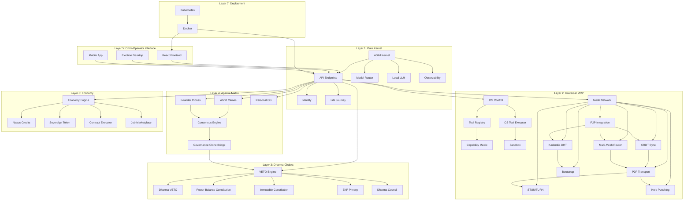

# AsimNexus Architecture

> **Version:** 1.1.0-rc.1  
> **Date:** 2026-06-08  
> **Status:** RC-1 FROZEN

---

## Table of Contents

1. [What is AsimNexus?](#1-what-is-asimnexus)
2. [Status Classification](#2-status-classification)
3. [7-Layer Architecture](#3-7-layer-architecture)
4. [Layer 1: Pure Kernel](#4-layer-1-pure-kernel)
5. [Layer 2: Universal MCP](#5-layer-2-universal-mcp)
6. [Layer 3: Dharma-Chakra](#6-layer-3-dharma-chakra)
7. [Layer 4: Agentic Matrix](#7-layer-4-agentic-matrix)
8. [Layer 5: Omni-Operator Interface](#8-layer-5-omni-operator-interface)
9. [Layer 6: Economy & Spot Market](#9-layer-6-economy--spot-market)
10. [Layer 7: Worldwide Deployment](#10-layer-7-worldwide-deployment)
11. [Event Bus Architecture](#11-event-bus-architecture)
12. [Storage & Data Lake](#12-storage--data-lake)
13. [Monitoring & Observability](#13-monitoring--observability)
14. [Testing & CI/CD](#14-testing--cicd)
15. [Technology Stack](#15-technology-stack)
16. [Component Dependency Graph](#16-component-dependency-graph)
17. [Data Flow](#17-data-flow)
18. [Security Boundaries](#18-security-boundaries)
19. [Directory Structure](#19-directory-structure)
20. [Design Principles](#20-design-principles)

---

## 1. What is AsimNexus?

**AsimNexus** is a **World Operating System (World OS)** -- a unified digital infrastructure platform designed to serve **all 8 billion humans** from a single architectural kernel while preserving **individual sovereignty, privacy, and choice**.

It is NOT a company. It is NOT a cloud service. It is an **open-source operating system for civilization** -- a layer between humanity and digital infrastructure that is:

| Property | Implementation |
|----------|---------------|
| **Local-first** | All data stays on your device by default; cloud is optional fallback |
| **Privacy-preserving** | ZKP (Zero-Knowledge Proof) system ensures data never leaves without consent |
| **Constitutionally governed** | Dharma-Chakra VETO engine enforces ethical boundaries on ALL actions |
| **Offline-capable** | Full offline mode with local GGUF models (Qwen3-4B) |
| **Mesh-networked** | P2P mesh routing with auto-discovery, Kademlia DHT, CRDT sync |
| **Multi-tenant** | Personal / Family / Community / Company / Government / Global universes |
| **Extensible** | Universal MCP (Model Context Protocol) for connecting ANY system |

**Core philosophy:** *"Machine proposes. Human decides. Always."*

---

## 2. Status Classification

Every component file carries a `STATUS:` header that honestly classifies its maturity:

| Status | Meaning | Examples |
|--------|---------|---------|
| **REAL** | Working, tested, wired to backend | `core/asim_brain.py`, `core/dharma/dharma_veto.py`, `backend/router.py` |
| **PARTIAL** | Works but missing key features | `core/multi_agent_orchestrator.py`, `connectors/universal_model_gateway.py` |
| **CONCEPT** | Blueprint / architecture only | `os_control/microkernel.py`, `nexus_event_bus.py`, `economy/job_marketplace.py` |

- REAL components have tests in `tests/real/`
- PARTIAL components have tests in `tests/prototype/`
- 68+ tests passing overall

---

## 3. 7-Layer Architecture

AsimNexus is organized as a **7-layer stack**, each layer building on the one below:

```
+------------------------------------------------------------------------------------+
|  LAYER 7: WORLDWIDE DEPLOYMENT                                                     |
|  Docker - Kubernetes - Multi-Region - Scale-to-8B Plan                             |
|  Phase 1: Nepal -> Phase 2: South Asia -> Phase 3: Global                          |
+------------------------------------------------------------------------------------+
|  LAYER 6: ECONOMY & SPOT MARKET                                                    |
|  Nexus Credits - Sovereign Token - Contract Executor                               |
|  Job Marketplace - Reputation System - Task Bus                                    |
+------------------------------------------------------------------------------------+
|  LAYER 5: OMNI-OPERATOR INTERFACE                                                  |
|  React Frontend - Electron Desktop - Mobile (React Native)                         |
|  Dashboard - Chat UI - OS Panels - Settings - PWA                                  |
+------------------------------------------------------------------------------------+
|  LAYER 4: AGENTIC MATRIX                                                           |
|  15 World Clones - 15 Founder Clones - 6 Essential Clones                          |
|  Personal OS (per-user) - AsimBrain - Hybrid Router                                |
|  Consensus Engine - Multi-Agent Orchestrator - Governance Bridge                   |
+------------------------------------------------------------------------------------+
|  LAYER 3: DHARMA-CHAKRA (Constitutional Guard)                                     |
|  Dharma VETO Engine (6 layers) - Power Balance Constitution                        |
|  Immutable Constitution (10 principles) - ZKP Privacy System                       |
|  dT Engine (Gini - PoS - Attenuation - L_max=7%)                                  |
|  Council Review - Veto Power - Cultural Compliance                                 |
+------------------------------------------------------------------------------------+
|  LAYER 2: UNIVERSAL MCP (OS Abstraction)                                           |
|  OS Control - Tool Registry - Capability Matrix - Sandbox                          |
|  Mesh Network: P2P Transport - Kademlia DHT - STUN/TURN - CRDT                     |
|  Bootstrap - Hole Punching - Multi-Mesh Router - Auto-Discovery                    |
|  File System - MCP Connectors - MicroKernel (Hardware Interface)                   |
+------------------------------------------------------------------------------------+
|  LAYER 1: PURE KERNEL                                                              |
|  FastAPI Backend (5,896+ lines) - AsimBrain - LLM Core                             |
|  Local LLM (Qwen3-4B GGUF) - Identity - Life Journey Module                       |
|  Storage: SQLite/PostgreSQL/ChromaDB/ClickHouse/MinIO                              |
|  Observability - Metrics - Vector Memory - Audit Logging                           |
|  Event Bus - Release Management - Pipeline                                         |
+------------------------------------------------------------------------------------+
```

**Key principles of the layered design:**

1. **Each layer is independent** -- can be replaced without affecting others
2. **Security flows upward** -- lower layers enforce constraints on higher layers
3. **VETO is cross-layer** -- the constitutional guard inspects ALL layers
4. **Local-first** -- Layer 1 runs entirely on-device; cloud is optional

---

## 4. Layer 1: Pure Kernel

The **foundation** -- everything runs on top of this. It provides the runtime environment, API surface, LLM orchestration, persistence, and core system services.

### Key Files

| File | Status | Purpose |
|------|--------|---------|
| `simple_backend.py` | REAL | Main FastAPI backend -- 5,896 lines, 75+ endpoints, JWT auth, SQLite |
| `main.py` | REAL | System entry point -- 7-step initialization with graceful degradation |
| `core/asim_brain.py` | REAL | Unified intelligence layer -- clone routing, model priority chain, Dharma inline check |
| `core/api_endpoints.py` | REAL | Economy + Identity REST endpoints |
| `backend/router.py` | REAL | Local-first model router with privacy tiers. Hard rule: no-cloud-for-highly-sensitive-data |
| `core/routing/hybrid_router.py` | PARTIAL | Intent detection + model routing. Maps user intent to best model tier |
| `core/identity/personal_os.py` | REAL | Per-user OS -- settings, notifications, clones, memory, documents, offline cache, dashboard |
| `core/identity/user_identity.py` | REAL | User registration, JWT auth, bcrypt passwords, role-based access |
| `core/life_journey.py` | PARTIAL | Life Journey Module -- 8 life stages state machine |
| `kernel/asim_kernel.py` | REAL | AI Kernel -- FastAPI app with LLM Core, Resource Manager, Memory Manager, Agent Orchestrator |
| `core/vectormemory.py` | REAL | Vector memory for semantic search (ChromaDB-backed) |
| `core/event_bus.py` | CONCEPT | ASIMEventBus -- pub/sub, event filtering, history, Redis support |
| `nexus_event_bus.py` | CONCEPT | Central nervous system -- in-memory event bus, 5 priority levels, 17+ event types |
| `runtime/llm_runtime.py` | PARTIAL | Local LLM runtime bridge |
| `runtime/model_catalog.py` | PARTIAL | Model registry and capability catalog |
| `bridge/hybrid_manager.py` | PARTIAL | Local <-> cloud hybrid execution manager |
| `backend/release.py` | REAL | Release lifecycle management -- publish, list, retrieve, rollback |

### How It Works

1. **Startup** (`main.py`):
   - Hardware detection -> Core Engine -> Automation OS -> Universal API Bridge -> Auto Discovery -> Local LLM -> API Server (uvicorn)
   - Each step has **graceful degradation** -- if a dependency is missing, it logs a warning and continues

2. **AsimBrain** (`core/asim_brain.py`):
   - **Priority chain:** Local GGUF (Qwen3-4B) -> Ollama -> Cloud API (OpenAI/Anthropic/Gemini/DeepSeek/Grok) -> Graceful offline fallback
   - **Clone routing:** Maps requests to 9 system prompts (coding, health, finance, legal, creative, reasoning, education, farming, general)
   - **Dharma inline check:** Every request passes through Dharma VETO before cloud calls

3. **API Server** (`simple_backend.py`):
   - FastAPI app with CORS middleware, JWT security
   - Routes: `/api/chat/*`, `/api/clones/*`, `/api/os/*`, `/api/identity/*`, `/api/mesh/*`, `/api/veto/*`, `/api/local-llm/*`, `/api/system/*`

4. **Model Routing** (`backend/router.py`):
   - `RouterManager.determine_route()` classifies privacy -> checks cloud trust tier -> routes to local or cloud
   - **Hard rule**: Highly sensitive data is NEVER sent to cloud
   - Cloud trust tiers: `trusted_cloud` (OpenAI, Azure, Gemini), `forbidden_cloud` (all others)

5. **Local LLM** (`models/Qwen3-4B-distill-deepseek-opus-gemini-Q8_0.gguf`):
   - Real quantized GGUF model file (~4B parameters)
   - Loaded via `llama-cpp-python` when available
   - Fully offline capable

---

## 5. Layer 2: Universal MCP

The **OS Abstraction Layer** -- connects AsimNexus to the outside world. Provides the tool execution pipeline, mesh networking, external integrations, and hardware abstraction.

### OS Control Subsystem

| File | Status | Purpose |
|------|--------|---------|
| `os_control/tool_registry.py` | REAL | Registry of 45+ OS tools with capability gating, audit logging |
| `os_control/capability_matrix.py` | REAL | Maps 7 agent profiles to 22 capabilities |
| `os_control/os_tool_executor.py` | REAL | 6-stage pipeline: gate -> approval -> sandbox -> execution -> audit |
| `os_control/os_control_bridge.py` | REAL | Unified `call_tool()` entry point |
| `os_control/microkernel.py` | CONCEPT | Hardware monitoring (18 categories) and power management |

**Tool Execution Pipeline** (`backend/tools.py`):
1. **DECISION** -- Decide if tool execution is appropriate
2. **SELECTION** -- Choose correct tool and resolve parameters
3. **VALIDATION** -- Validate parameters against safety boundaries
4. **APPROVAL** -- Enforce policy-based and human-gated approval
5. **EXECUTION** -- Run the tool safely (possibly sandboxed)
6. **AUDIT** -- Write append-only record to the audit trail

### Mesh Networking Subsystem

| File | Lines | Status | Purpose |
|------|-------|--------|---------|
| `mesh/p2p_transport.py` | 1,441 | REAL | P2P transport -- UDP, WebSocket, TLS, HELLO/ACK, PING/PONG, fragmentation, rate limiting |
| `mesh/bootstrap.py` | 804 | REAL | Bootstrap service -- TCP, DNS resolution, TLS, exponential backoff |
| `mesh/stun_turn.py` | 909 | REAL | STUN RFC 5389 implementation -- Google STUN servers, NAT classification, TURN |
| `mesh/hole_punching.py` | 1,330 | REAL | UDP hole punching -- 4 strategies (DIRECT->STUN_PUNCH->RENDEZVOUS->TURN_RELAY) |
| `mesh/kademlia_dht.py` | 830 | REAL | Kademlia DHT -- 160-bit node IDs, KBuckets, iterative lookup |
| `mesh/multi_mesh_router.py` | 781 | REAL | 4 mesh types, auto-switching, health checks |
| `mesh/crdt_sync.py` | 676 | REAL | CRDT sync -- GCounter, LWWRegister, ORSet |
| `mesh/p2p_integration.py` | 657 | PARTIAL | Orchestrator -- transport + DHT + CRDT, WebRTC |
| `core/mesh/p2p_node.py` | -- | REAL | WebSocket P2P node implementation |
| `mesh/mesh_routing_agent_v2.py` | -- | PARTIAL | Task routing over WebSocket with load balancing |

**Mesh Routing Strategy:**
1. **LOCAL_LAN** -- Direct subnet communication (lowest latency)
2. **SECURE_MESH** -- Encrypted mesh with trusted peers
3. **PUBLIC_CLOUD** -- Relay through cloud bootstrap nodes
4. **FALLBACK_RELAY** -- TURN relay for symmetric NAT (highest latency)

**NAT Traversal Strategy:**
1. **Direct** -- Try direct UDP connection first
2. **STUN Punch** -- Use STUN to discover mapped address, then punch
3. **Rendezvous** -- Coordinate via rendezvous server
4. **TURN Relay** -- Fall back to TURN relay for symmetric NAT

**Mesh Ports:** 7331-7336 (UDP/TCP)

### Sandbox Subsystem

| File | Status | Purpose |
|------|--------|---------|
| `os_control/sandbox/docker_sandbox.py` | REAL | Docker container isolation |
| `os_control/sandbox/wasm_sandbox.py` | CONCEPT | WASM sandbox for code execution |
| `os_control/sandbox/low_priv_user_runner.py` | CONCEPT | Low-privilege OS user runner |

### Connector Ecosystem

| File | Status | Purpose |
|------|--------|---------|
| `connectors/universal_model_gateway.py` | PARTIAL | Unified LLM provider interface |
| `connectors/smart_model_router.py` | PARTIAL | Smart model routing across providers |
| `connectors/openai_connector.py` | REAL | OpenAI API connector |
| `connectors/anthropic_connector.py` | REAL | Anthropic Claude connector |
| `connectors/google_connector.py` | REAL | Google Gemini connector |
| `connectors/deepseek_connector.py` | REAL | DeepSeek connector |
| `connectors/grok_connector.py` | REAL | xAI Grok connector |
| `connectors/cloudinary_connector.py` | PARTIAL | Cloudinary media management |
| `connectors/supabase_connector.py` | PARTIAL | Supabase backend |
| `connectors/nepal_banking.py` | CONCEPT | Nepal banking API integration |
| `connectors/government_api.py` | CONCEPT | Government API integration (50+ countries) |

---

## 6. Layer 3: Dharma-Chakra

The **Constitutional Guard** -- the ethics and balance layer. Every action in AsimNexus passes through this layer before execution.

### Key Files

| File | Status | Purpose |
|------|--------|---------|
| `core/dharma/dharma_veto.py` | REAL | 6-layer VETO enforcer -- runs BEFORE every critical action |
| `core/dharma_chakra/veto_engine.py` | REAL | Constitutional VETO engine -- 6 immutable rules, sector-based human confirmation |
| `core/dharma/delta_t_engine.py` | REAL | Anti-concentration engine -- Gini coefficient, PoS, economic attenuation |
| `security/power_balance_constitution.py` | REAL | 51/49 public/private sector balance enforcement |
| `security/immutable_constitution.py` | REAL | 10 immutable constitutional principles |
| `security/zkp_privacy.py` | PARTIAL | ZKP Privacy System (small-group demo math, not production SNARKs) |
| `security/consent_manager.py` | REAL | User consent management for data sharing |
| `governance/dharma_chakra_council.py` | PARTIAL | Council review system with abuse detection |
| `governance/governance_clone_bridge.py` | PARTIAL | Bridges governance decisions to clone voting |
| `core/dharma/cultural_compiler.py` | PARTIAL | Local law + cultural norms compilation |

### Dharma VETO -- 6 Layers

0. **Immutable Constitution** -- 10 foundational principles (cannot be overridden)
1. **Critical Forbidden Check** -- hard-coded forbidden actions (immutable stop)
2. **Block Pattern Check** -- known harmful patterns (human override possible)
3. **Monopoly/ESG Check** -- sovereignty risk / narrative manipulation filter
4. **Anti-Concentration Check** -- dT Engine cap enforcement (max 7% per entity)
5. **Cultural Compliance** -- local law + cultural_compiler integration

**Severity levels:** `PASS` -> `WARN` -> `REQUIRE_HUMAN` -> `BLOCK` -> `CRITICAL` (immutable)

### Power Balance Constitution

- 8 sectors with control types: `PUBLIC_COORDINATED`, `PRIVATE_OPERATED`, `MIXED`
- `check_decision()` enforces >=51% public control in public-coordinated sectors
- Amendment system with supermajority voting
- JSONL persistence for audit trail

### Governance Subsystem

| File | Status | Purpose |
|------|--------|---------|
| `governance/founder_structure.py` | CONCEPT | Founder-level governance structure |
| `governance/government_layers.py` | CONCEPT | Multi-layer government model |
| `governance/cross_border_compliance.py` | CONCEPT | Cross-border regulatory compliance |
| `governance/blockchain_constitution_anchor.py` | CONCEPT | Blockchain-based constitution anchoring |
| `governance/compliance_engine.py` | CONCEPT | Automated compliance checking |
| `governance/jurisdiction_router.py` | CONCEPT | Multi-jurisdiction legal routing |
| `governance/country_packs/` | CONCEPT | Per-country legal and cultural packs |

---

## 7. Layer 4: Agentic Matrix

The **Intelligence Layer** -- all AI agents, clones, personal operating systems, and the unified AsimBrain.

### Key Files

| File | Status | Purpose |
|------|--------|---------|
| `core/asim_brain.py` | REAL | Unified intelligence layer -- model priority chain, clone routing, Dharma inline check |
| `core/founder_clones/world_clones.py` | REAL | 15 World Clones with local-first/cloud routing, ensemble consensus voting |
| `core/founder_clones/founder_clone_system.py` | PARTIAL | 15 Founder Clones -- corporate C-suite roles |
| `core/founder_clones/consensus_engine.py` | PARTIAL | Ensemble consensus voting engine |
| `core/consensus/consensus_engine.py` | PARTIAL | Full consensus engine with delegation, domain veto, arbiter override |
| `core/multi_agent_orchestrator.py` | PARTIAL | 6 Essential Clones orchestrator (CEO, CTO, CFO, CMO, COO, CHRO) |
| `core/identity/personal_os.py` | REAL | Per-user OS -- settings, notifications, clones, memory, documents, offline cache |
| `core/life_journey.py` | PARTIAL | Life Journey Module -- 8 life stages state machine |
| `core/dreaming/dreaming_engine.py` | REAL | Async background consolidation (learning from past interactions) |
| `core/self_learning_engine.py` | CONCEPT | Self-learning from user feedback |
| `agents/unified_agent_system.py` | PARTIAL | Unified agent system with tool registration |
| `agents/simplified_agents.py` | PARTIAL | Simplified agent interfaces |

### 15 World Clones

| # | Clone | Specialty |
|---|-------|-----------|
| 1 | Tech Architect | Code, System Design, DevOps |
| 2 | Strategic Planner | Long-term Planning, Risk Analysis |
| 3 | Financial Oracle | Finance, Investment, Tax |
| 4 | Legal Guardian | Law, Contracts, Rights |
| 5 | Health Sage | Health, Medicine, Wellness |
| 6 | Education Mentor | Learning, Teaching, Skills |
| 7 | Creative Muse | Writing, Art, Music, Design |
| 8 | Research Explorer | Science, Research, Data Analysis |
| 9 | Security Sentinel | Cybersecurity, Privacy, Threats |
| 10 | Logistics Master | Transport, Supply Chain, Travel |
| 11 | Environmental Steward | Environment, Climate, Sustainability |
| 12 | Social Harmonizer | Relationships, Community, Conflict |
| 13 | Governance Advisor | Policy, Government, Democracy |
| 14 | Innovation Catalyst | New Ideas, Startups, Future Tech |
| 15 | Harmony Keeper | System Balance, Ethics, dT Monitoring |

Each clone:
- Has a unique system prompt + capabilities
- Routes local-first -> cloud fallback (Ollama -> OpenAI/Anthropic/Gemini/DeepSeek/Grok)
- Goes through Dharma VETO before execution
- Supports Nepali + Hindi + Unicode keyword matching
- Graceful offline fallback

### Personal OS

- **Settings**: notifications_enabled, theme, language, privacy_level, operating_mode
- **Notifications**: Push, mark_read, dismiss, get_active, unread count, flush_old
- **Clones**: 15 personal clones (deep-copied from defaults), customize, reset
- **Memory**: Private memory with context window, search, tags
- **Documents**: Save/list/read/delete with public/private visibility
- **Offline Cache**: Enqueue/get_pending/mark_sent/mark_failed with JSONL persistence
- **Dashboard**: Aggregated view of user info, clones, recent activity, notifications
- **Mode Switching**: personal / work / public / emergency / offline
- **Pool-based singleton**: `get_personal_os()` / `reset_personal_os()`

### Consensus Voting System

1. **Majority Vote** -- Simple majority for low-stakes decisions
2. **Pairwise Comparison** -- Elo-style ranking when clones disagree
3. **Confidence Weighting** -- Each clone votes with confidence score; weighted sum decides
4. **Role-Based Arbitration** -- Certain clones have veto power in their domain

---

## 8. Layer 5: Omni-Operator Interface

The **User Interface** -- frontend for humans to interact with the system.

### Key Files

| File | Status | Purpose |
|------|--------|---------|
| `frontend/react/src/App.js` | REAL | Main app -- router with 8 routes |
| `frontend/react/src/api/asimnexus.js` | REAL | API integration layer (433 lines) |
| `frontend/react/src/api/unified_api.js` | REAL | Centralized API client |
| `frontend/react/src/api/websocket.js` | REAL | WebSocket client |
| `frontend/react/src/components/chat/UniversalChat.jsx` | REAL | Universal chat interface |
| `frontend/react/src/components/os/PersonalOS.jsx` | REAL | Personal OS UI panel |
| `frontend/react/src/components/os/WorldOSDashboard.jsx` | REAL | World OS dashboard |
| `desktop/electron/` | PARTIAL | Electron desktop app |
| `mobile/react-native/` | PARTIAL | React Native mobile app |
| `interface/universal/` | PARTIAL | Cross-platform universal interface |
| `web/` | PARTIAL | Web admin dashboard, chat interface, PWA |

### Navigation Rail (8 Routes)

| Route | Page | Description |
|-------|------|-------------|
| `/` | Chat | Universal chat with all clones |
| `/dashboard` | Dashboard | System overview, metrics |
| `/os` | OS Hub | Personal OS + World OS + Control Panel |
| `/marketplace` | Economy Hub | Agents, Contracts, MCP Marketplace |
| `/ai` | AI Hub | Memory, Local LLM, AI Settings |
| `/identity` | Identity Hub | ID, Blockchain, ZKP |
| `/network` | Network Hub | Mesh, Nodes, Peers |
| `/settings` | Settings | User settings, themes |

### Frontend Structure

```
frontend/react/src/
+-- App.js                    # Main app with router + 8 routes
+-- api/
|   +-- asimnexus.js          # All API calls (433 lines)
|   +-- unified_api.js        # Centralized API client
|   +-- websocket.js          # WebSocket client
+-- components/
|   +-- chat/                 # UniversalChat, ChatHeader, ChatInput, ChatMessage
|   +-- dashboard/            # Dashboard component
|   +-- identity/             # BlockchainIdentity, IdentityPanel
|   +-- layout/               # Sidebar, SettingsPage, OnboardingPage, AuthPage
|   +-- memory/               # MemoryDashboard, MemoryPage, LocalLLMChat
|   +-- mesh/                 # MeshPanel
|   +-- os/                   # PersonalOS, WorldOSDashboard, OSControlPanel
|   +-- pages/                # AIHub, EconomyHub, IdentityHub, NetworkHub, OSHub
|   +-- shared/               # AsimOrb, AsimNexusLogo, UnifiedChat, SmartHub
|   +-- _legacy/              # Legacy components
+-- hooks/                    # Custom hooks (useChatState, useSocket, useAIPersonalization)
+-- services/                 # AsimBrainService, WebSocketService, VoiceAnalysisService
+-- contexts/                 # ChatContext
+-- design-system/            # Design tokens, Button, Card, Input components
```

---

## 9. Layer 6: Economy & Spot Market

The **Economic Layer** -- digital economy, credits, tokenization, job marketplace, and reputation.

### Key Files

| File | Status | Purpose |
|------|--------|---------|
| `core/economy/nexus_credits.py` | PARTIAL | Digital credit system for ecosystem transactions |
| `core/economy/sovereign_token.py` | CONCEPT | Sovereign token economics |
| `core/economy/contract_executor.py` | CONCEPT | Smart contract execution engine |
| `core/economy/job_marketplace.py` | CONCEPT | Decentralized job marketplace |
| `core/economy/reputation_system.py` | CONCEPT | User and agent reputation scoring |
| `core/economy/task_bus.py` | CONCEPT | Distributed task queue and routing |
| `core/economy/token_bridge.py` | CONCEPT | Cross-chain token bridge |
| `economy/nexus_credits.py` | CONCEPT | Top-level economy module |

**Economic concepts:** Digital credits for agent services, sovereign token for governance participation, smart contracts for automated agreements, reputation-based trust scoring.

---

## 10. Layer 7: Worldwide Deployment

The **Deployment Layer** -- infrastructure, scaling strategy, and multi-platform distribution.

### Docker Deployments

| Compose File | Purpose | Services |
|-------------|---------|----------|
| `docker-compose.yml` | Base | asimnexus, redis (optional), postgres (optional), frontend (optional), nginx (optional) |
| `docker-compose.prod.yml` | Production | backend, frontend, postgres, redis, clickhouse, minio, chromadb, nginx |
| `docker-compose.local.yml` | Local dev | Minimal setup |
| `docker-compose.full.yml` | Full suite | All services |
| `docker-compose.storage.yml` | Storage only | Storage backends |
| `docker-compose.auto.yml` | Auto-config | Auto-configured deployment |

### Production Architecture

```
nginx:80/443
  |
  +-- backend:8000 (FastAPI + Uvicorn)
  |     |-- postgres:5432 (primary DB)
  |     |-- redis:6379 (cache)
  |     |-- clickhouse:9000 (analytics)
  |     |-- minio:9000 (S3 objects)
  |     |-- chromadb:8000 (vectors)
  |
  +-- frontend:3000 (React SPA)
```

### Scaling Strategy
| Phase | Target | Scope |
|-------|--------|-------|
| **Phase 1** | Nepal | 100 pilot families, mobile-first Android |
| **Phase 2** | South Asia | India/Bangladesh/Pakistan, regional languages |
| **Phase 3** | Global | 50+ countries, 10+ languages |
| **Phase 4** | Universal | 8B users, 50+ edge regions, auto-scaling |

### Container Ports
- 8000: Main API
- 3000: Frontend
- 8766: WebSocket
- 7331-7336: Mesh networking (UDP/TCP)
- 8080: Alternative API

---

## 11. Event Bus Architecture

AsimNexus has two event bus implementations forming the communication backbone:

| File | Status | Purpose |
|------|--------|---------|
| `nexus_event_bus.py` | CONCEPT | Central nervous system -- in-memory bus with RabbitMQ fallback |
| `core/event_bus.py` | CONCEPT | ASIMEventBus -- pub/sub with event filtering, history, Redis |

### NexusEventBus (`nexus_event_bus.py`)

- 5 priority levels: `LOW`, `MEDIUM`, `HIGH`, `CRITICAL`, `EMERGENCY`
- 17+ event types: `SYSTEM_BOOT`, `AGENT_SPAWNED`, `HACK_DETECTED`, `CONSTITUTIONAL_VIOLATION`, `GOVERNMENT_ACCESS_ATTEMPT`, etc.
- In-memory by default with optional RabbitMQ/Kafka backend
- Pub/sub pattern for decoupled component communication

### ASIMEventBus (`core/event_bus.py`)

- Typed event filtering
- Event history with configurable retention
- Redis support for distributed deployments
- 15+ registered event types

---

## 12. Storage & Data Lake

### Storage Subsystem

| File | Purpose |
|------|---------|
| `storage/oltp_engine.py` | OLTP -- SQLite (default) or PostgreSQL |
| `storage/clickhouse_engine.py` | Analytics -- ClickHouse |
| `storage/vector_store.py` | Vectors -- ChromaDB |
| `storage/object_store.py` | Objects -- MinIO (S3-compatible) |

### Data Lake (`data_lake/`)

- Ingestion, retrieval, storage, and verification subsystems
- Persistent data in `data/`:
  - Multiple SQLite DBs (asim_core.db, economy.db, chat.db, etc.)
  - ChromaDB vector indices
  - JSONL append-only audit logs
  - Clone memory and knowledge graph data

---

## 13. Monitoring & Observability

| File | Status | Purpose |
|------|--------|---------|
| `monitoring/metrics.py` | REAL | Metrics collection (request counts, latency, errors) |
| `monitoring/observability_dashboard.py` | REAL | Real-time observability dashboard |
| `monitoring/` | PARTIAL | Prometheus/Grafana integration referenced |

**WebSocket real-time metrics** for live system monitoring.
**Audit trail:** All critical actions logged to append-only JSONL files.
**Release lifecycle:** Tracked via `backend/release.py`.

---

## 14. Testing & CI/CD

### Test Structure

```
tests/
+-- real/              # Tests for REAL components (68+ tests)
+-- prototype/         # Tests for PARTIAL components
+-- ...
```

### Test Commands
- `pytest tests/` -- Run all tests
- `pytest tests/real/` -- Run tests for REAL components only
- `python run_all_tests.py` -- Comprehensive test suite

### CI/CD (`.github/`)

- GitHub Actions workflows
- Pre-commit hooks (`.pre-commit-config.yaml`)
- Gitleaks secrets scanning (`.gitleaks.toml`)
- Testing on commit and PR

---

## 15. Technology Stack

| Category | Technologies |
|----------|-------------|
| **Language** | Python 3.11 (primary), JavaScript/JSX, TypeScript |
| **API Framework** | FastAPI, Uvicorn, WebSockets, SSE |
| **Databases** | SQLite (default), PostgreSQL 15, Redis 7, ChromaDB, ClickHouse, MinIO (S3) |
| **LLM Runtime** | llama-cpp-python (local GGUF), Ollama, HuggingFace Transformers |
| **External LLMs** | OpenAI (GPT-4o), Anthropic (Claude 3), Google Gemini, DeepSeek, xAI Grok |
| **Frontend** | React, React Native, Electron, Tauri |
| **Auth** | JWT (HS256), bcrypt, mTLS, OAuth2 |
| **Crypto** | PyCryptodome, cryptography, pyjwt, passlib |
| **GPU** | CUDA 12.x, PyTorch, cupy, OpenCV with CUDA |
| **Messaging** | In-memory event bus, WebSocket, RabbitMQ (optional) |
| **P2P/Mesh** | websockets, Kademlia DHT, STUN/TURN, CRDT |
| **Orchestration** | Docker, Docker Compose, Kubernetes |
| **Cloud** | AWS (boto3), GCP, Azure |
| **Monitoring** | OpenTelemetry, Prometheus/Grafana (referenced) |
| **Testing** | pytest, pytest-asyncio |
| **AI/ML** | Llama.cpp, sentence-transformers, LangChain |
| **CI/CD** | GitHub Actions, pre-commit, Gitleaks |
| **Licensing** | AGPLv3 (core), proprietary (enterprise layer) |

---

## 16. Component Dependency Graph




---

## 17. Data Flow

### Request Flow

`
User Request
    |
    v
+--------------------------------------------------------------------+
|  Layer 5: Frontend / API Client                                    |
|  (React UI / curl / mobile app)                                    |
+--------------------------------------------------------------------+
    |
    v
+--------------------------------------------------------------------+
|  Layer 1: FastAPI Middleware                                       |
|  - JWT Authentication (auth header -> user identity)               |
|  - Rate Limiting (per-user, per-endpoint)                          |
|  - Request Logging (audit trail)                                   |
|  - CORS Enforcement                                                |
+--------------------------------------------------------------------+
    |
    v
+--------------------------------------------------------------------+
|  Layer 3: Dharma VETO Check (Pre-execution)                        |
|  0. Immutable Constitution Check                                   |
|  1. Critical Forbidden Check                                       |
|  2. Block Pattern Check                                            |
|  3. Monopoly/ESG Check                                             |
|  4. Anti-Concentration Check (dT < 7%)                             |
|  5. Cultural Compliance (local law)                                |
|                                                                    |
|  Result: PASS -> continue                                          |
|          WARN -> continue with warning                             |
|          REQUIRE_HUMAN -> wait for confirmation                     |
|          BLOCK -> return blocked                                   |
|          CRITICAL -> IMMUTABLE STOP                                |
+--------------------------------------------------------------------+
    | (if PASS/WARN)
    v
+--------------------------------------------------------------------+
|  Layer 4: Route to Clone / Tool                                    |
|  1. Intent detection (hybrid_router.py)                            |
|  2. Clone selection (world_clones.py)                              |
|  3. Model routing (backend/router.py)                              |
|     - Public: cloud allowed                                        |
|     - Confidential: trusted cloud only                             |
|     - Highly Sensitive: LOCAL ONLY (hard rule)                     |
+--------------------------------------------------------------------+
    |
    v
+--------------------------------------------------------------------+
|  Layer 2: Execute (with gates)                                     |
|  - Tool:     6-stage pipeline (Decision->Selection->Validation     |
|              ->Approval->Execution->Audit)                          |
|  - Clone:    LLM inference (local -> cloud fallback)               |
|  - Mesh:     P2P send via transport layer                          |
|  - Sandbox:  Docker/WASM/low-priv for high-risk actions            |
+--------------------------------------------------------------------+
    |
    v
+--------------------------------------------------------------------+
|  Layer 3: Post-Execution Audit                                     |
|  - Append-only JSONL audit trail                                   |
|  - Metrics recording                                               |
|  - Observability event                                             |
+--------------------------------------------------------------------+
    |
    v
Response to User
`

### Offline Flow

`
User Request (offline)
    |
    v
+----------------------------------------------------+
|  Offline Cache (mesh/offline_sync_engine.py)        |
|  - Queue operation with priority                    |
|  - Local LLM fallback (Qwen3-4B GGUF)              |
|  - Return cached/available response                 |
+----------------------------------------------------+
    |
    v (when online)
+----------------------------------------------------+
|  CRDT Sync (mesh/crdt_sync.py)                     |
|  - Conflict resolution (LWW, ORSet merge)          |
|  - Push pending operations                         |
|  - Converge state across peers                     |
+----------------------------------------------------+
`

---

## 18. Security Boundaries

AsimNexus implements **defense-in-depth** across all layers:

### Layer 1: Network Security
| Mechanism | Implementation |
|-----------|---------------|
| JWT Authentication | uth/identity_provider.py |
| mTLS | security/security_mtls.py |
| API Rate Limiting | ackend/middleware.py |
| SQL Injection Protection | SQLite with parameterized queries |
| Audit Trail | Append-only JSONL everywhere |

### Layer 2: Data Security
| Mechanism | Implementation |
|-----------|---------------|
| bcrypt Password Hashing | core/identity/user_identity.py |
| ZKP Privacy | security/zkp_privacy.py |
| Data Classification | Public / Confidential / Highly Sensitive |
| No-Cloud-for-Highly-Sensitive | ackend/router.py |

### Layer 3: Constitutional Security
| Mechanism | Implementation |
|-----------|---------------|
| Dharma VETO (6 layers) | core/dharma/dharma_veto.py |
| Power Balance Constitution | security/power_balance_constitution.py |
| Immutable Constitution | security/immutable_constitution.py |
| Consent Manager | security/consent_manager.py |

### Layer 4: Execution Security
| Mechanism | Implementation |
|-----------|---------------|
| Docker Sandbox | os_control/sandbox/docker_sandbox.py |
| WASM Sandbox | os_control/sandbox/wasm_sandbox.py |
| Low-Priv User Runner | os_control/sandbox/low_priv_user_runner.py |
| Capability Matrix gating | os_control/capability_matrix.py |
| 3-Layer Security Framework | security/security_3_layer.py (Prevent/Contain/Detect & Recover) |

### Unique Security Advantages

1. **No-cloud-for-highly-sensitive-data** -- hard-coded rule, cannot be overridden
2. **Dharma VETO CRITICAL level** -- immutable stop, cannot be overridden even by admin
3. **Power Balance Constitution** -- prevents any single entity from gaining >51% control
4. **Local-first architecture** -- by default, no data leaves the device
5. **ZKP privacy** -- prove without revealing

---

## 19. Directory Structure

`
AsimNexus/
+-- main.py                      # System entry point
+-- simple_backend.py            # FastAPI backend (5,896 lines, REAL)
+-- requirements.txt             # Python dependencies
+-- package.json                 # Node deps (d3)
|
+-- kernel/                      # Layer 1: Core kernel
|   +-- asim_kernel.py           # AI Kernel (FastAPI app)
|   +-- core.py                  # Core engine
|
+-- core/                        # Layer 1 & 4: Core logic
|   +-- api_endpoints.py         # REST endpoints
|   +-- asim_brain.py            # Unified intelligence layer
|   +-- agi_core.py              # AGI core engine
|   +-- context_router.py        # Context routing
|   +-- multi_agent_orchestrator.py
|   +-- vectormemory.py          # Vector memory
|   +-- dreaming/                # Dreaming engine (REAL)
|   +-- identity/                # User identity + Personal OS
|   +-- founder_clones/          # World Clones + Founder Clones + Consensus
|   +-- consensus/               # Full consensus engine
|   +-- dharma/                  # Dharma VETO (REAL)
|   +-- dharma_chakra/           # VETO engine (REAL)
|   +-- routing/                 # Hybrid router
|   +-- economy/                 # Economy subsystem
|   +-- mcp/                     # MCP protocol
|   +-- mesh/                    # Mesh networking
|   +-- security/                # Zero-trust, sandbox, post-quantum
|   +-- new_architecture_integration.py
|
+-- backend/                     # Layer 1: Backend modules
|   +-- release.py               # Release lifecycle
|   +-- router.py                # Model router (REAL)
|   +-- tools.py                 # Tool pipeline
|   +-- mesh.py                  # Mesh API routes
|   +-- auth.py                  # Authentication
|   +-- health.py                # Health checks
|   +-- middleware.py            # Rate limiting, CORS
|
+-- os_control/                  # Layer 2: OS Control
|   +-- tool_registry.py         # 45+ OS tools
|   +-- capability_matrix.py     # 7 agent profiles, 22 capabilities
|   +-- os_tool_executor.py      # 6-stage execution pipeline
|   +-- os_control_bridge.py     # Unified call_tool() bridge
|   +-- microkernel.py           # Hardware monitoring (CONCEPT)
|   +-- sandbox/                 # Docker, WASM, low-priv sandboxes
|
+-- mesh/                        # Layer 2: Mesh Networking
|   +-- p2p_transport.py         # UDP + WebSocket P2P transport
|   +-- bootstrap.py             # Bootstrap service
|   +-- stun_turn.py             # STUN/TURN (RFC 5389)
|   +-- hole_punching.py         # UDP hole punching
|   +-- kademlia_dht.py          # Kademlia DHT
|   +-- multi_mesh_router.py     # 4 mesh types, auto-switching
|   +-- crdt_sync.py             # CRDT sync
|   +-- p2p_integration.py       # Orchestrator
|   +-- offline_sync_engine.py   # Offline queue + sync
|   +-- node_registry.py         # SQLite node registry
|
+-- governance/                  # Layer 3: Governance
|   +-- dharma_chakra_council.py # Council review system
|   +-- governance_clone_bridge.py
|   +-- founder_structure.py
|   +-- government_layers.py
|   +-- cross_border_compliance.py
|   +-- compliance_engine.py
|   +-- jurisdiction_router.py
|   +-- country_packs/           # Per-country legal packs
|
+-- security/                    # Layer 3: Security
|   +-- power_balance_constitution.py
|   +-- immutable_constitution.py
|   +-- zkp_privacy.py
|   +-- dharma_policy.py
|   +-- consent_manager.py
|   +-- security_mtls.py
|   +-- security_3_layer.py
|   +-- ...                      # Audit, identity, vault, etc.
|
+-- connectors/                  # Layer 2: External integrations
|   +-- openai_connector.py      # OpenAI API connector
|   +-- anthropic_connector.py   # Anthropic Claude connector
|   +-- google_connector.py      # Google Gemini connector
|   +-- deepseek_connector.py    # DeepSeek connector
|   +-- grok_connector.py        # xAI Grok connector
|   +-- universal_model_gateway.py
|   +-- smart_model_router.py
|   +-- nepal_banking.py
|   +-- government_api.py
|   +-- ...                      # Cloudinary, Supabase, etc.
|
+-- frontend/react/              # Layer 5: React Frontend
|   +-- src/App.js               # Main app with 8 routes
|   +-- src/components/          # UI components
|   +-- src/api/                 # API integration
|   +-- public/                  # Static assets, PWA manifest
|
+-- agents/                      # Layer 4: Agents
|   +-- unified_agent_system.py
|   +-- simplified_agents.py
|   +-- economy_agent.py
|   +-- code_agent.py
|   +-- health_agent.py
|   +-- ...                      # 25 agent files
|
+-- monitoring/                  # Observability
|   +-- metrics.py               # Metrics collection
|   +-- observability_dashboard.py
|
+-- storage/                     # Storage subsystem
|   +-- oltp_engine.py           # SQLite/PostgreSQL
|   +-- clickhouse_engine.py     # ClickHouse analytics
|   +-- vector_store.py          # ChromaDB vectors
|   +-- object_store.py          # MinIO S3 objects
|
+-- data_lake/                   # Data lake
|   +-- ingestion/
|   +-- retrieval/
|   +-- storage/
|   +-- verification/
|
+-- runtime/                     # LLM runtime
|   +-- llm_runtime.py
|   +-- model_catalog.py
|   +-- universal_connector.py
|
+-- bridge/                      # Bridge layer
|   +-- hybrid_manager.py
|   +-- cloud_bridge.py
|   +-- hardware_bridge.py
|
+-- desktop/                     # Desktop apps
|   +-- electron/                # Electron wrapper
|   +-- tauri/                   # Tauri wrapper
|
+-- mobile/                      # Mobile apps
|   +-- react-native/            # React Native app
|
+-- interface/                   # Cross-platform UI
|   +-- universal/
|   +-- web/
|
+-- economy/                     # Economy (top-level)
+-- swarm/                       # Swarm intelligence
+-- evolution/                   # Evolutionary learning
+-- training/                    # Model training
+-- models/                      # Local GGUF models
+-- config/                      # Configuration
+-- deploy/                      # Deployment + release
|   +-- release/
|   +-- desktop/
|   +-- mobile/
|   +-- docker/
|   +-- k8s/
+-- tests/                       # Test files
|   +-- real/                    # 68+ REAL tests
|   +-- prototype/               # PARTIAL tests
+-- docs/                        # Documentation
|   +-- api/
|   +-- architecture/
|   +-- runbooks/
|   +-- vision/
|   +-- releases/
+-- plans/                       # Planning documents
+-- scripts/                     # Utility scripts
+-- tools/                       # Developer tools
+-- docker/                      # Dockerfiles
+-- k8s/                         # Kubernetes manifests
+-- infrastructure/              # Infra config
+-- .github/                     # GitHub Actions
+-- data/                        # Persistent data (gitignored)
+-- logs/                        # Log files
+-- secrets/                     # Secrets management
`

---

## 20. Design Principles

### 1. Local-First by Default
All data stays on the user's device unless explicitly shared. Cloud is an optional fallback, never the default.

### 2. Constitutional AI
All AI actions pass through the Dharma VETO engine before execution. CRITICAL-level blocks are immutable.

### 3. Graceful Degradation
If any component fails, the system continues with reduced functionality. No single point of failure. Every import is wrapped in try/except.

### 4. Pool-Based Singletons
Consistent get_*() / 
eset_*() pattern across all modules. Thread-safe, lazy-initialized singletons.

### 5. Append-Only Audit
All audit trails use append-only JSONL files. No mutation of historical records. SHA256 hashing for integrity verification.

### 6. Human Supremacy
Critical actions always require human confirmation. The machine proposes, the human decides. Level-3 confirmation for government/legal actions.

### 7. Privacy Tiers
Data classified as Public, Confidential, or Highly Sensitive. Routing decisions respect these tiers with hard-coded rules.

### 8. Capability Gating
Every tool execution passes through a 6-stage pipeline: Decision -> Selection -> Validation -> Approval -> Execution -> Audit.

### 9. Offline Resilience
The system works fully offline with local LLM inference. CRDT sync converges state when connectivity is restored.

### 10. Open Extensibility
New clones, tools, connectors, and endpoints can be added without modifying core infrastructure. MCP protocol for standardized tool interfaces.

### 11. Honest Status Tracking
Every component is labeled REAL / PARTIAL / CONCEPT to prevent overclaiming. The CONSTITUTION.md and TRUTH.md serve as immutable reference documents.

### 12. Multi-LLM Orchestration
6+ LLM providers with automatic failover, privacy-tiered routing, and local-first preference. No single provider lock-in.
