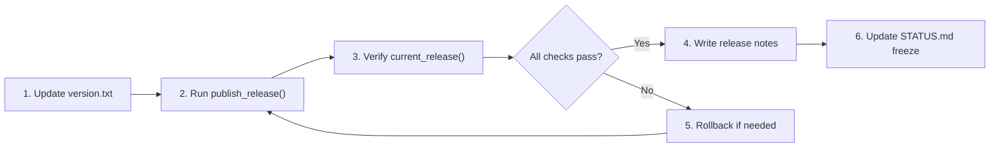

# Release Process

> **Version:** 1.0.0+build42 (RC-1)  
> **Last updated:** 2026-05-31  
> **System:** [`backend/release.py`](backend/release.py) + [`backend/version.py`](backend/version.py)

---

## Overview

AsimNexus uses a simple, file-based release lifecycle:

- **Version string** stored in [`deploy/release/version.txt`](deploy/release/version.txt) — single source of truth
- **Release records** stored in [`deploy/release/releases.json`](deploy/release/releases.json)
- **Rollback audit** stored in [`deploy/release/rollback_log.jsonl`](deploy/release/rollback_log.jsonl)
- **Version API** available via [`backend/version.py`](backend/version.py)

---

## Release Workflow



### Step 1: Update the Version

Edit [`deploy/release/version.txt`](deploy/release/version.txt):

```text
1.0.0+build43
```

Version format follows SemVer with optional build metadata:
- `MAJOR.MINOR.PATCH` (e.g., `1.0.0`)
- `+buildN` for build number (e.g., `+build43`)

### Step 2: Publish the Release

```python
from backend.release import publish_release

# Publish for docker target
publish_release(
    version="1.0.0+build43",        # must match version.txt
    target="docker",                 # deployment target
    checksum="sha256-of-artifact"    # artifact checksum
)
```

This automatically:
- Marks the new release as `is_current: true`
- Unmarks any previous current release for the same target
- Appends the record to [`deploy/release/releases.json`](deploy/release/releases.json)
- Logs to `AsimNexus.Release` logger

### Step 3: Verify the Release

```python
from backend.release import current_release

current = current_release(target="docker")
print(f"Current: {current['version']}")
assert current["is_current"] == True
```

### Step 4: Write Release Notes

Create or update the release notes document:

- [`docs/RELEASE_NOTES_RC1.md`](RELEASE_NOTES_RC1.md) — for RC-1
- For subsequent releases: `docs/RELEASE_NOTES_v{version}.md`

Include:
- Version number and date
- What's new (REAL components added)
- What's changed (PARTIAL → REAL upgrades)
- What's deferred (CONCEPT items)
- Upgrade/downgrade notes
- Known issues
- Checksums

### Step 5: Update STATUS.md Freeze

If this is a new RC or stable release:

1. Update the freeze banner in [`docs/STATUS.md`](docs/STATUS.md)
2. Change the version and date
3. Update any component status changes (PARTIAL → REAL, CONCEPT → PARTIAL)
4. Update Quick Stats
5. Update Next Milestones

---

## Version API Reference

All available via [`backend/version.py`](backend/version.py):

| Function | Returns | Description |
|----------|---------|-------------|
| `get_version()` | `"1.0.0+build42"` | Reads from `deploy/release/version.txt` |
| `get_build_id()` | `"20260531123456"` | UTC timestamp formatted as YYYYMMDDHHmmSS |
| `get_git_sha()` | `"a1b2c3d"` (or `"unknown"`) | Short git commit SHA |
| `get_release_channel()` | `"stable"` (or env var) | From `ASIM_RELEASE_CHANNEL` env |

### Usage

```python
from backend.version import get_version, get_build_id, get_git_sha, get_release_channel

print(f"AsimNexus {get_version()} (build {get_build_id()})")
print(f"Git SHA: {get_git_sha()}")
print(f"Channel: {get_release_channel()}")
```

---

## Release Targets

| Target | Description | Example |
|--------|-------------|---------|
| `docker` | Docker container deployment | `target="docker"` |
| `pwa` | Progressive Web App | `target="pwa"` |
| `desktop` | Desktop application | `target="desktop"` |
| `mobile` | Mobile application | `target="mobile"` |

---

## Release Channels

| Channel | Purpose | Version Suffix |
|---------|---------|----------------|
| `stable` | Production-ready | None |
| `rc` | Release candidate | `+rcN` |
| `beta` | Feature preview | `+betaN` |
| `dev` | Development build | `+dev` or `+buildN` |

Set via environment variable:

```bash
export ASIM_RELEASE_CHANNEL=rc
```

---

## Full Example: Creating RC-2

```bash
# 1. Update version
echo "1.1.0+rc1" > deploy/release/version.txt

# 2. Publish
python -c "
from backend.release import publish_release, current_release
r = publish_release(version='1.1.0+rc1', target='docker', checksum='sha256-abc123')
print('Published:', r['version'])
c = current_release(target='docker')
print('Current:', c['version'])
"

# 3. Write release notes
# → Create docs/RELEASE_NOTES_v1.1.0-rc1.md

# 4. Update STATUS.md freeze
# → Update freeze banner version and date in docs/STATUS.md

# 5. Commit
git add deploy/release/version.txt deploy/release/releases.json docs/
git commit -m "chore: publish RC-2 (1.1.0+rc1)"
git tag v1.1.0-rc1
```

---

## Rollback

See [`docs/ROLLBACK.md`](ROLLBACK.md) for the complete rollback procedure.

---

## Related

- [`docs/ROLLBACK.md`](ROLLBACK.md) — Rollback procedure
- [`docs/RELEASE_NOTES_RC1.md`](RELEASE_NOTES_RC1.md) — RC-1 release notes
- [`docs/STATUS.md`](STATUS.md) — Component status (frozen for RC-1)
- [`backend/release.py`](backend/release.py) — Release manager source
- [`backend/version.py`](backend/version.py) — Version utilities source
