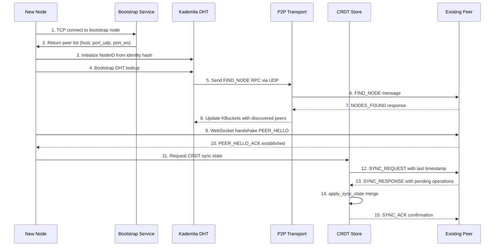
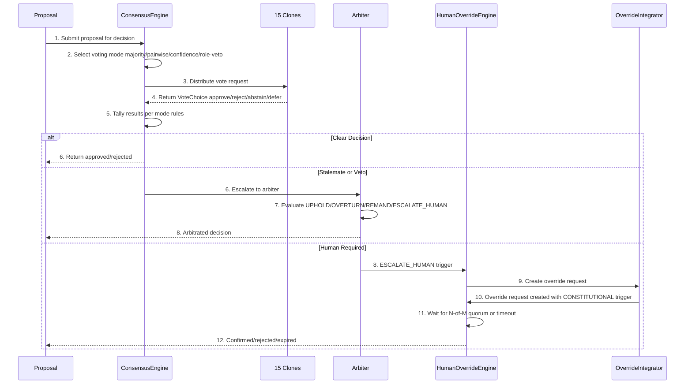
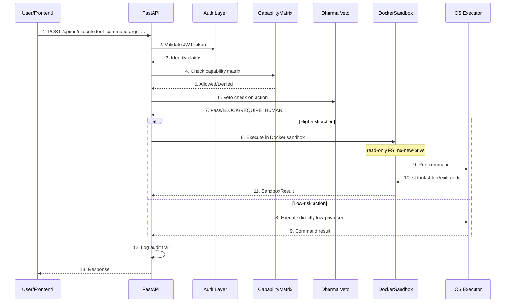
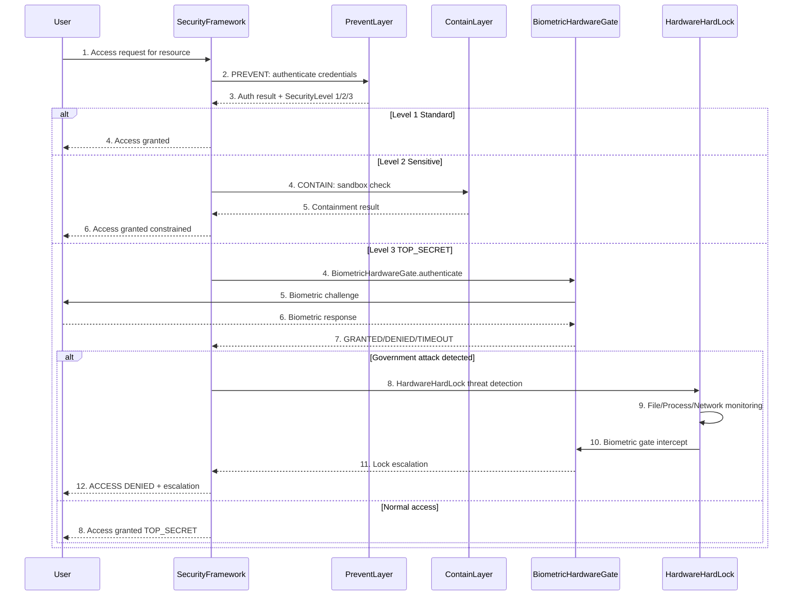
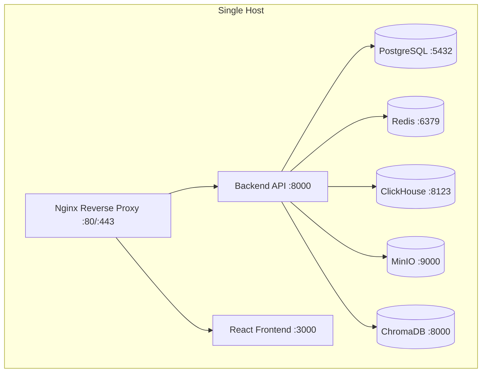
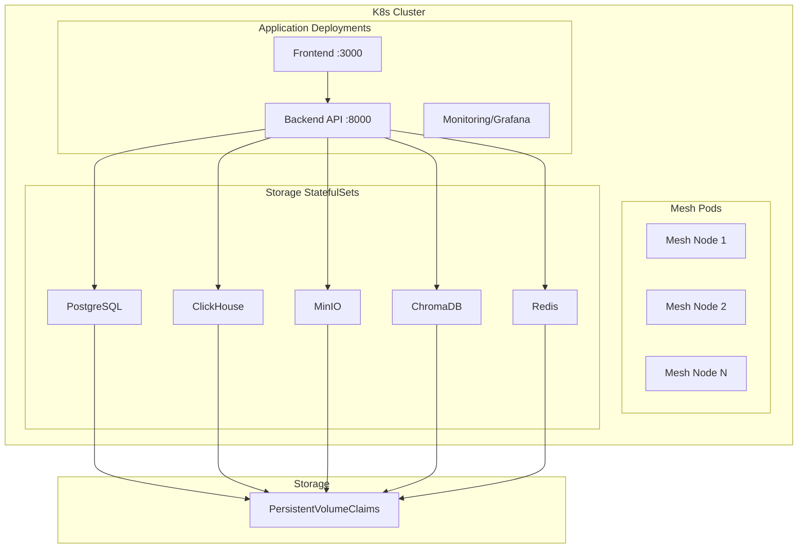

# System Architecture Map — AsimNexus v1.0.1

> **Document:** `docs/architecture/SYSTEM_ARCHITECTURE_MAP.md`
> **Version:** v1.0.1
> **Status:** LIVING — Update when components graduate

---

## 1. High-Level Overview

AsimNexus is a **sovereign AI operating system** with mesh networking, multi-clone consensus, OS control, and security-hardened governance. It is designed as a **local-first, human-governed, mesh-connected World Operating System and Civilization Architecture**.

Core design principles:
- **Local-first** by default — personal data stays on-device
- **Human sovereign** — every irreversible action requires human final authority
- **Zero-trust** — every tool action passes a Decision → Selection → Validation → Approval → Execution → Audit pipeline
- **Mesh-connected** — P2P networking across 4 mesh types (LOCAL, PERSONAL, CLOUD, PUBLIC)

---

## 2. Layer Diagram

```
┌─────────────────────────────────────────────────────────────────────┐
│                     Frontend React/Web Layer                        │
│  PersonalOS Dashboard | Universal Chat | Clones Panel | Sidebar     │
│  7 routes | 6 themes | 6 universes | 6 NAV_RAIL items               │
├─────────────────────────────────────────────────────────────────────┤
│                    FastAPI Backend 273+ routes                       │
│  Auth | Chat | Memory | Mesh | Clones | Deploy | Override | Health  │
│  Tools | OS Control | Analytics | Identity | Contracts | Federation │
│  Finance | Government | Universal | Dharma | MCP | Runtime          │
├──────┬──────┬──────┬──────┬──────┬──────┬──────┬──────┬────────────┤
│ Mesh │  OS  │Consen-│Over- │ Sec- │Dhar- │Econo-│Intell-│Governance │
│ Net- │Cont- │ sus   │ ride │urity │ ma   │ my   │igence│ / Federat-│
│ work │ rol  │Engine │Engine│      │Veto  │      │Layer │ ion       │
├──────┴──────┴──────┴──────┴──────┴──────┴──────┴──────┴────────────┤
│                      Storage Layer 5 services                        │
│  PostgreSQL OLTP | Redis Cache | ClickHouse Analytics               │
│       MinIO Object Storage | ChromaDB Vector Store                  │
├─────────────────────────────────────────────────────────────────────┤
│                   Deployment Infrastructure                          │
│  Docker | Docker Compose 8 services | K8s manifests | Nginx reverse │
└─────────────────────────────────────────────────────────────────────┘
```

---

## 3. Component Registry

### 3.1 Mesh Networking Layer

| Module | File Path | Lines | Status | Key Classes/Functions | Dependencies |
|--------|-----------|-------|--------|----------------------|--------------|
| P2P Transport | [`mesh/p2p_transport.py`](../../mesh/p2p_transport.py) | ~1095 | **REAL** | `P2PTransport`, `PeerInfo`, `P2PMessage`, `ConnectionState` | — |
| Kademlia DHT | [`mesh/kademlia_dht.py`](../../mesh/kademlia_dht.py) | ~759 | **REAL** | `KademliaDHT`, `NodeID`, `KBucket`, iterative lookup, pub/replicate | `P2PTransport` |
| CRDT Sync | [`mesh/crdt_sync.py`](../../mesh/crdt_sync.py) | ~651 | **REAL** | `CRDTStore`, `GCounter`, `LWWRegister`, `ORSet`, `CRDTOperation` | `P2PTransport` |
| Bootstrap Service | [`mesh/bootstrap.py`](../../mesh/bootstrap.py) | ~684 | **REAL** | `BootstrapService`, `BootstrapNode`, `BootstrapRegion` | `P2PTransport`, `KademliaDHT` |
| P2P Integration | [`mesh/p2p_integration.py`](../../mesh/p2p_integration.py) | ~723 | **REAL** | `P2PIntegrationBridge`, `WebRTCTransport`, `route_data()` | `MultiMeshRouter`, `P2PTransport`, `KademliaDHT`, `CRDTStore` |
| Hole Punching | [`mesh/hole_punching.py`](../../mesh/hole_punching.py) | ~1330 | **REAL** | `HolePuncher`, `RendezvousClient`, 5 punch strategies | `STUNClient`, `TURNClient` |
| STUN/TURN Client | [`mesh/stun_turn.py`](../../mesh/stun_turn.py) | — | **REAL** | `STUNClient`, `TURNClient`, `NATDetector`, `NATClassification` | — |
| Relay Service | [`mesh/relay.py`](../../mesh/relay.py) | — | **REAL** | `RelayService`, TCP relay with session management | `P2PTransport` |
| Multi-Mesh Router | [`mesh/multi_mesh_router.py`](../../mesh/multi_mesh_router.py) | ~782 | **REAL** | `MultiMeshRouter`, `MeshType` LOCAL/PERSONAL/CLOUD/PUBLIC | — |
| Offline-First Sync | [`mesh/offline_sync_engine.py`](../../mesh/offline_sync_engine.py) | ~873 | **REAL** | Priority sync engine, conflict resolution, bandwidth-aware | `CRDTStore` |
| Auto Discovery | [`mesh/autodiscovery.py`](../../mesh/autodiscovery.py) | — | **PARTIAL** | mDNS-based discovery | — |
| Node Registry | [`mesh/node_registry.py`](../../mesh/node_registry.py) | — | **PARTIAL** | `NodeRegistry`, `TrustLevel`, `NodeStatus` | — |
| Device Registry | [`mesh/device_registry.py`](../../mesh/device_registry.py) | — | **PARTIAL** | Device management | — |
| Air Gap Controller | [`core/mesh/air_gap_controller.py`](../../core/mesh/air_gap_controller.py) | — | **PARTIAL** | 5-level state machine, network filtering | — |

### 3.2 Security Layer

| Module | File Path | Lines | Status | Key Classes/Functions |
|--------|-----------|-------|--------|----------------------|
| Security Framework | [`security/security_framework.py`](../../security/security_framework.py) | ~885 | **REAL** | `SecurityManager`, `PreventLayer`, `AuthMethod`, 3-layer PREVENT/CONTAIN/DETECT |
| Biometric Hardware Gate | [`security/biometric_hardware_gate.py`](../../security/biometric_hardware_gate.py) | ~638 | **REAL** | `BiometricHardwareGate`, `BiometricGateState`, Level-3 gate |
| Identity Quantum Vault | [`security/identity_quantum_vault.py`](../../security/identity_quantum_vault.py) | ~1029 | **REAL** | PQC stubs: Kyber-512 KEM, Dilithium2, FALCON-512 |
| Hardware Hard Lock | [`security/hardware_hard_lock.py`](../../security/hardware_hard_lock.py) | ~1264 | **REAL** | `HardwareBackend` ABC, `TPMBackend`, `SoftwareBackend`, File/Process/Network monitoring |
| Audit Log | [`security/audit_log.py`](../../security/audit_log.py) | ~237 | **REAL** | `AuditLogEntry`, `AuditEventType`, JSONL audit trail |
| Identity Manager | [`security/identity_manager.py`](../../security/identity_manager.py) | — | **REAL** | Identity management |
| ZKP System | [`security/zkp_privacy.py`](../../security/zkp_privacy.py) | — | **REAL** | ZKPProtocol enum, proof generation/verification |
| Consent Manager | [`security/consent_manager.py`](../../security/consent_manager.py) | — | **REAL** | User consent management |
| Level-3 Confirmation | [`core/security/level3_confirmation.py`](../../core/security/level3_confirmation.py) | — | **PARTIAL** | State machine, no biometric hardware gate |
| Power Balance Constitution | [`security/power_balance_constitution.py`](../../security/power_balance_constitution.py) | — | **REAL** | 8-sector 51/49 control, amendment system |
| Immutable Constitution | [`security/immutable_constitution.py`](../../security/immutable_constitution.py) | — | **REAL** | 10+ principles, compliance checking, integrity verification |

### 3.3 Consensus & Override

| Module | File Path | Lines | Status | Key Classes/Functions |
|--------|-----------|-------|--------|----------------------|
| Consensus Engine | [`core/consensus/consensus_engine.py`](../../core/consensus/consensus_engine.py) | ~1710 | **REAL** | `ConsensusEngine`, 4 voting modes, `Voter`, `Vote`, `Proposal`, `ArbiterDecision` |
| Human Override Engine | [`core/human_override_engine.py`](../../core/human_override_engine.py) | ~838 | **REAL** | `HumanOverrideEngine`, 3-tier override, `OverrideTier`, N-of-M quorum, crypto proof |
| Override Integrator | [`core/override_integrator.py`](../../core/override_integrator.py) | ~396 | **REAL** | `veto_check_with_override()`, bridges VetoEngine + PolicyGate + FastAPI |
| Agent Contract System | [`core/agent_contract.py`](../../core/agent_contract.py) | ~1155 | **REAL** | 5/15/30 day contracts, lifecycle, audit trail, scope enforcement |
| Dharma Veto | [`core/dharma/dharma_veto.py`](../../core/dharma/dharma_veto.py) | — | **REAL** | 5-layer veto engine, pattern blocker, audit log |
| Veto Engine Dharma Chakra | [`core/dharma_chakra/veto_engine.py`](../../core/dharma_chakra/veto_engine.py) | — | **REAL** | `DharmaVetoEngine`, `VetoLevel`, `ZKPConfirmationManager` |
| Immutable Constitution | [`config/asim_constitution.json`](../../config/asim_constitution.json) | — | **REAL** | Hashed at boot; mismatch kills startup |

### 3.4 OS Control Layer

| Module | File Path | Lines | Status | Key Classes/Functions |
|--------|-----------|-------|--------|----------------------|
| Docker Sandbox | [`os_control/sandbox/docker_sandbox.py`](../../os_control/sandbox/docker_sandbox.py) | ~387 | **REAL** | `DockerSandbox`, `SandboxResult`, trusted image allowlist |
| Tool Registry | [`os_control/tool_registry.py`](../../os_control/tool_registry.py) | — | **PARTIAL** | Tool execution framework |
| Capability Matrix | [`os_control/capability_matrix.py`](../../os_control/capability_matrix.py) | — | **PARTIAL** | Capability tracking |
| Low-Priv User Runner | [`os_control/sandbox/low_priv_user_runner.py`](../../os_control/sandbox/low_priv_user_runner.py) | — | **PARTIAL** | User privilege separation |
| WASM Sandbox | [`os_control/sandbox/wasm_sandbox.py`](../../os_control/sandbox/wasm_sandbox.py) | — | **PARTIAL** | WebAssembly sandbox |

### 3.5 Backend & API

| Module | File Path | Lines | Status | Key Classes/Functions |
|--------|-----------|-------|--------|----------------------|
| Main Backend | [`simple_backend.py`](../../simple_backend.py) | — | **REAL** | FastAPI app, 273+ endpoints, JWT auth, SQLite |
| Auth Routes | [`backend/auth.py`](../../backend/auth.py) | ~498 | **REAL** | Register, Login, Verify, Logout, Refresh, Sessions |
| Mesh Routes | [`backend/mesh.py`](../../backend/mesh.py) | ~493 | **REAL** | Discovery, Nodes, DHT, P2P, Sync, Relay, Bootstrap |
| Health Probes | [`backend/health.py`](../../backend/health.py) | ~487 | **REAL** | `/health/live`, `/health/ready`, `/health/status`, 5 storage service checks |
| Deploy Routes | [`backend/deployment.py`](../../backend/deployment.py) | ~311 | **REAL** | Override routes, build/rollback/status/release |
| Chat Routes | [`backend/chat.py`](../../backend/chat.py) | — | **REAL** | Sessions, messages |
| Memory Routes | [`backend/memory.py`](../../backend/memory.py) | — | **REAL** | CRUD on memories, search, prune |
| Learning Routes | [`backend/learning.py`](../../backend/learning.py) | — | **REAL** | Datasets, training jobs, evaluation, adapter management |
| Model Registry | [`backend/registry.py`](../../backend/registry.py) | — | **REAL** | Model registration, versioning, rollback |
| OS Tools Routes | [`backend/tools.py`](../../backend/tools.py) | — | **REAL** | Tool execution, OS tool list, audit |
| Router Routes | [`backend/router.py`](../../backend/router.py) | — | **REAL** | Prompt routing, chat, metrics |
| Observability Routes | [`backend/observability.py`](../../backend/observability.py) | — | **REAL** | Telemetry, posture, traces, audit, events |
| Clones Routes | [`backend/clones.py`](../../backend/clones.py) | — | **REAL** | Clone listing, task assignment, consensus voting |

### 3.6 Storage Layer

| Module | File Path | Lines | Status | Key Info |
|--------|-----------|-------|--------|----------|
| ClickHouse Engine | [`storage/clickhouse_engine.py`](../../storage/clickhouse_engine.py) | — | **REAL** | 6 tables with TTL, analytics warehouse |
| OLTP Engine | [`storage/oltp_engine.py`](../../storage/oltp_engine.py) | — | **REAL** | 10 tables: users, sessions, economy, governance |
| Object Store | [`storage/object_store.py`](../../storage/object_store.py) | — | **REAL** | 8 buckets: logs, exports, snapshots, backups |
| Vector Store | [`storage/vector_store.py`](../../storage/vector_store.py) | — | **REAL** | 4 collections: semantic_memory, agent_context, retrieval, clone_silos |
| Config Loader | [`storage/config.py`](../../storage/config.py) | ~390 | **REAL** | Typed dataclass access with env var substitution |
| Migration CLI | [`scripts/migrate_storage.py`](../../scripts/migrate_storage.py) | — | **REAL** | `--clickhouse`, `--oltp`, `--object-store`, `--vector`, `--all` |

### 3.7 Monitoring Layer

| Module | File Path | Lines | Status | Key Info |
|--------|-----------|-------|--------|----------|
| Metrics | [`monitoring/metrics.py`](../../monitoring/metrics.py) | ~755 | **REAL** | Prometheus metrics: up gauge, latency histogram, connections, errors, disk |
| Observability Dashboard | [`monitoring/observability_dashboard.py`](../../monitoring/observability_dashboard.py) | ~495 | **REAL** | Real-time dashboard, health scoring 50% weight for storage |
| Grafana Dashboard | [`monitoring/grafana/dashboards/storage-pod-stability.json`](../../monitoring/grafana/dashboards/storage-pod-stability.json) | — | **REAL** | 5 service rows, 7 panels per service |
| OTEL Telemetry | [`monitoring/opentelemetry/telemetry.py`](../../monitoring/opentelemetry/telemetry.py) | — | **REAL** | OpenTelemetry integration |

### 3.8 Intelligence Layer

| Module | File Path | Lines | Status | Key Info |
|--------|-----------|-------|--------|----------|
| AsimBrain | [`core/asim_brain.py`](../../core/asim_brain.py) | — | **REAL** | Local GGUF + cloud fallback, Dharma inline check |
| Smart Router | [`connectors/smart_model_router.py`](../../connectors/smart_model_router.py) | — | **REAL** | AsimBrainRouter, model selection |
| LLM Gateway | [`connectors/unified_llm_gateway.py`](../../connectors/unified_llm_gateway.py) | — | **REAL** | OpenAI/Anthropic/Gemini/DeepSeek |
| 15 World Clones | [`core/founder_clones/world_clones.py`](../../core/founder_clones/world_clones.py) | — | **PARTIAL** | Configs real, NO ensemble consensus |
| 15 Founder Clones | [`core/founder_clones/founder_clone_system.py`](../../core/founder_clones/founder_clone_system.py) | — | **PARTIAL** | Multi-model NVIDIA API, NO ensemble voting |

### 3.9 Federation & Governance

| Module | File Path | Lines | Status | Key Info |
|--------|-----------|-------|--------|----------|
| Federation Protocol | [`core/federation/federation_protocol_enhanced.py`](../../core/federation/federation_protocol_enhanced.py) | — | **REAL** | 4-step DID handshake, CRDT sync, heartbeat |
| Global Federation Governor | [`core/federation/global_federation_governor.py`](../../core/federation/global_federation_governor.py) | — | **REAL** | Peer lifecycle, CloneConsensusEngine integration |
| Governance Audit | [`governance/governance_audit.py`](../../governance/governance_audit.py) | — | **REAL** | SHA-256 hash chain, 24+ AuditAction types |
| Cross-Border Compliance | [`governance/cross_border_compliance.py`](../../governance/cross_border_compliance.py) | — | **REAL** | 8 regional frameworks, 3 sovereignty levels |

### 3.10 Identity & Human Digital Twin

| Module | File Path | Lines | Status | Key Info |
|--------|-----------|-------|--------|----------|
| User Identity | [`core/identity/user_identity.py`](../../core/identity/user_identity.py) | — | **REAL** | Registration, login, JWT, HDT affinity, JSONL persistence |
| Personal OS | [`core/identity/personal_os.py`](../../core/identity/personal_os.py) | — | **REAL** | 121/121 tests, full OS shell, offline sync, notification center |
| Life Journey Module | [`core/life_journey.py`](../../core/life_journey.py) | ~744 | **REAL** | 6-stage state machine, transition verification |
| Human Digital Twin | [`core/hdt/human_digital_twin.py`](../../core/hdt/human_digital_twin.py) | — | **PARTIAL** | Data models real, no ZKP binding |

---

## 4. Data Flow Diagrams

### 4.1 Mesh Peer Discovery → DHT Routing → CRDT Sync



### 4.2 Consensus Voting → Delegation → Arbitration → Human Override



### 4.3 OS Tool Execution: API → Capability Gate → Sandbox → Executor



### 4.4 Security Access: Auth → Level Check → Biometric Gate → Hardware Lock



---

## 5. Deployment Topology

### 5.1 Single-Node Deployment



### 5.2 Multi-Node / K8s Deployment



### 5.3 Docker Services

| Service | Docker Image | Port(s) | Dependencies | Health Check |
|---------|-------------|---------|--------------|--------------|
| Backend | Custom `Dockerfile` multi-stage | 8000, 8766 | PG, Redis, CH, MinIO, CDB | `curl -f localhost:8000/health` |
| Frontend | `frontend/react/Dockerfile` | 3000 | Backend | — |
| PostgreSQL | `postgres:16-alpine` | 5432 | — | `pg_isready` |
| Redis | `redis:7-alpine` | 6379 | — | `redis-cli ping` |
| ClickHouse | `clickhouse/clickhouse-server:24.3` | 8123, 9000 | — | `wget --spider localhost:8123/ping` |
| MinIO | `minio/minio:latest` | 9001, 9002 | — | `curl -f localhost:9000/minio/health/live` |
| ChromaDB | `chromadb/chroma:latest` | 8000 | — | — |
| Nginx | `nginx:alpine` | 80, 443 | Backend, Frontend | — |

### 5.4 Resource Limits (Production)

| Service | CPU Limit | Memory Limit | CPU Reservation | Memory Reservation |
|---------|-----------|-------------|-----------------|-------------------|
| Backend | 4 CPUs | 8 GB | 2 CPUs | 4 GB |
| Redis | — | 512 MB maxmemory | — | — |
| ClickHouse | — | — | — | — |
| PostgreSQL | — | — | — | — |

---

## 6. Key Metrics

- **Total REAL components:** ~84
- **Total PARTIAL components:** ~8
- **Total CONCEPT components:** ~6
- **Backend routes:** 273+
- **Storage services:** 5 (PostgreSQL, Redis, ClickHouse, MinIO, ChromaDB)
- **Mesh transport types:** 4 (WebSocket, UDP, WebRTC, Relay)
- **Mesh types:** 4 (LOCAL, PERSONAL, CLOUD, PUBLIC)
- **Consensus voting modes:** 4 (Majority, Pairwise, Confidence-Weighted, Role-Based Veto)
- **Security levels:** 3 (Standard, Sensitive, TOP_SECRET)
- **Mesh tests:** 131 (P2PTransport: 19, NAT Traversal: 55, Kademlia DHT: 57)
- **Override engine tests:** 68 (Human Override Engine) + 11 (Override Integrator)
- **Agent contract tests:** 82
- **Storage monitoring tests:** 51
- **E2E tests:** 19 (Contract: 6, Federation: 4, Security Level: 6, Full Workflow: 3)

---

*Last updated: 2026-06-01 for v1.0.1 release documentation*
