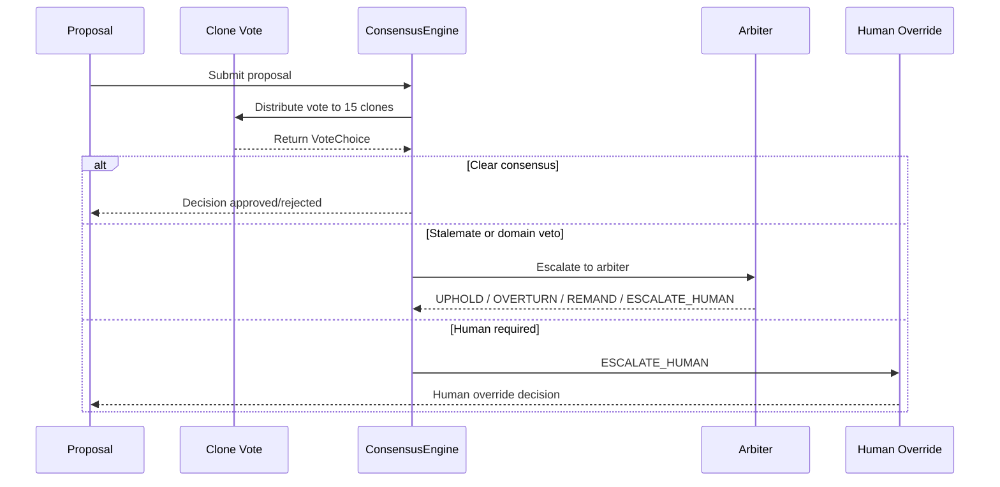
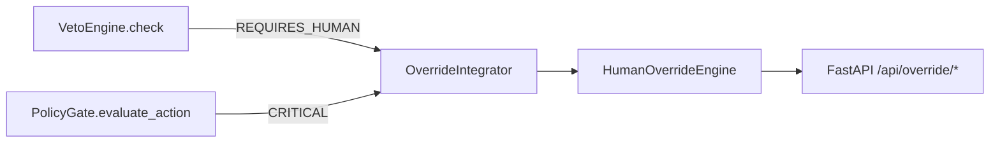
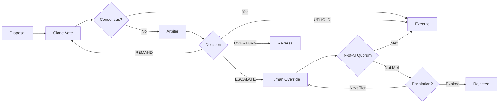

# Override & Consensus Behavior Guide — AsimNexus v1.0.1

> **Document:** `docs/operations/OVERRIDE_CONSENSUS_GUIDE.md`
> **Version:** v1.0.1
> **Status:** LIVING

---

## 1. Consensus Engine

The [`ConsensusEngine`](../../core/consensus/consensus_engine.py) provides **4 voting modes** for multi-clone decision making, used by the 15 Founder Clones and World Clones.

### Voting Modes

| Mode | Enum Value | Description | When to Use |
|------|-----------|-------------|-------------|
| **Majority Vote** | `MAJORITY_VOTE` | Simple majority >50% of clones agree, threshold configurable | General decisions |
| **Pairwise Comparison** | `PAIRWISE_COMPARISON` | Each clone pair votes, winner by Elo-style ranking | Ranking/prioritization |
| **Confidence-Weighted** | `CONFIDENCE_WEIGHTED` | Each vote weighted by clone's confidence score 0.0-1.0 | Expert domain decisions |
| **Role-Based Veto** | `ROLE_BASED_VETO` | Specific clones have veto power in their domain | Security/critical domains |

### Vote Choices

```python
class VoteChoice(Enum):
    APPROVE = "approve"
    REJECT  = "reject"
    ABSTAIN = "abstain"
    DEFER   = "defer"
```

### Proposal Statuses

```python
class ProposalStatus(Enum):
    PENDING       = "pending"
    APPROVED      = "approved"
    REJECTED      = "rejected"
    DEFERRED      = "deferred"
    VETOED        = "vetoed"
    EXPIRED       = "expired"
    HUMAN_OVERRIDE = "human_override"
    ARBITRATED    = "arbitrated"
```

### Voter Data Model

```python
@dataclass
class Voter:
    voter_id:   str
    name:       str
    domain:     str           # e.g. "security", "ethics", "technology"
    weight:     float = 1.0   # base influence weight
    elo_rating: int = 1500    # Elo rating for pairwise mode
```

### Audit Trail

All votes are logged to `data/consensus_audit.jsonl` with JSONL persistence.

---

## 2. Delegation Chain



### Delegation Flow

1. **Clone Vote**: All 15 clones cast votes via their assigned mode
2. **Arbiter**: If consensus cannot be reached, arbiter evaluates:
   - `UPHOLD` — Original decision stands
   - `OVERTURN` — Reverse the decision
   - `REMAND` — Send back for re-vote with guidance
   - `ESCALATE_HUMAN` — Escalate to human override
3. **Human Override**: Final authority for irreversible decisions

---

## 3. Arbitration Outcomes

```python
class ArbiterDecision(Enum):
    UPHOLD        = "uphold"
    OVERTURN      = "overturn"
    REMAND        = "remand"
    ESCALATE_HUMAN = "escalate_human"
```

| Outcome | Meaning | Next Action |
|---------|---------|-------------|
| `UPHOLD` | Clone decision stands | Execute decision |
| `OVERTURN` | Clone decision reversed | Execute opposite |
| `REMAND` | Insufficient information | Re-vote with additional context |
| `ESCALATE_HUMAN` | Requires human judgment | Create override request |

---

## 4. Domain Veto Registry

The Role-Based Veto mode uses domain-specific veto assignments. Based on the Dharmic principles and clone role system:

### Core Veto Domains

| Domain | Veto Clones | Description |
|--------|-------------|-------------|
| `security` | Security Expert Clone | Security-critical decisions |
| `ethics` | Chief Dharma Officer | Ethical boundary enforcement |
| `finance` | Economist Clone | Financial/economic decisions |
| `technology` | Tech Lead Clone | Technical architecture decisions |
| `governance` | Governance Clone | Constitutional decisions |
| `health` | Health Advisor Clone | Health/safety decisions |
| `legal` | Legal Expert Clone | Regulatory/compliance decisions |
| `education` | Education Clone | Learning/curriculum decisions |

### Global Veto Clones

| Clone ID | Role | Veto Scope |
|----------|------|------------|
| `clone_01` | Founder | Any domain, final override |
| `clone_02` | Co-Founder | Any domain, backup override |

---

## 5. Human Override Engine

The [`HumanOverrideEngine`](../../core/human_override_engine.py) provides a **3-tier hierarchical override** system with cryptographic proof and immutable audit trail.

### Override Tiers

```python
class OverrideTier(Enum):
    PERSONAL = "personal"          # Single human confirmation
    TRUSTED_CIRCLE = "trusted_circle"  # N-of-M human quorum
    INDEPENDENT = "independent"    # External arbiter/reviewer
```

### Override Triggers

```python
class OverrideTrigger(Enum):
    FINAL_THREE = "final_three"           # Final-3-Decisions counter hit limit
    CONSTITUTIONAL = "constitutional"     # Veto engine flagged violation
    HUMAN_INITIATED = "human_initiated"   # Human proactively requested
    POLICY_CRITICAL = "policy_critical"   # Policy gate flagged critical action
    AGENT_CONTRACT = "agent_contract"     # Agent contract requires human check
```

### Override Statuses

```python
class OverrideStatus(Enum):
    PENDING = "pending"
    QUORUM_PENDING = "quorum_pending"   # Waiting for N-of-M trusted circle votes
    CONFIRMED = "confirmed"
    REJECTED = "rejected"
    EXPIRED = "expired"
    ESCALATED = "escalated"             # Moved to higher tier
```

### Configuration

| Env Variable | Default | Description |
|-------------|---------|-------------|
| `ASIM_OVERRIDE_TTL` | 600s (10 min) | Override request TTL |
| `ASIM_OVERRIDE_AUDIT_MAX` | 10000 | Max audit log entries |
| `ASIM_OVERRIDE_FINAL_THREE` | 3 | Decisions before forced human review |
| `ASIM_QUORUM_TIMEOUT` | 300s (5 min) | Trusted circle vote timeout |

### N-of-M Quorum

Trusted Circle tier requires N-of-M members to approve:
- Request enters `QUORUM_PENDING` state
- Each approved vote is counted
- Once N reached, request moves to `CONFIRMED`
- Cryptographic proof: `action_hash + timestamp + tier + signature`

### Final-3-Decisions Counter

After N consecutive AI decisions (default: 3), the engine forces human review:
- Prevents automation blindness
- Requires human check-in before further autonomous operation
- Resets after successful override confirmation

---

## 6. Override Integrator

The [`OverrideIntegrator`](../../core/override_integrator.py) bridges the Human Override Engine with the Veto Engine and Policy Gate.

### Integration Points



### Wrapper Functions

| Function | Input | Output | Purpose |
|----------|-------|--------|---------|
| `veto_check_with_override()` | VetoEngine, message, sector | `(VetoResult, override_id)` | Auto-create override on REQUIRES_HUMAN |
| `approve_with_override()` | request_id, human_id, reason | `(success, signature)` | Approve an override |
| `reject_with_override()` | request_id, human_id, reason | `(success, status)` | Reject an override |
| `escalate_with_override()` | request_id, human_id, reason | `(success, escalated_tier)` | Escalate to next tier |
| `list_pending_overrides()` | — | `[override_requests]` | List all pending |

---

## 7. FastAPI Override Endpoints

The override routes are registered via [`override_router`](../../backend/deployment.py:179) with prefix `/api/override`:

| Endpoint | Method | Purpose |
|----------|--------|---------|
| `/api/override/approve` | POST | Approve a pending override request |
| `/api/override/reject` | POST | Reject a pending override request |
| `/api/override/escalate` | POST | Escalate override to next tier |
| `/api/override/pending` | GET | List all pending override requests |

### Approve Request

**Request:**
```json
{
  "request_id": "ovr_a1b2c3d4",
  "reason": "This action is safe to proceed"
}
```

**Response:**
```json
{
  "success": true,
  "request_id": "ovr_a1b2c3d4",
  "status": "confirmed",
  "human_id": "api_user",
  "signature": "a1b2c3d4e5f6...",
  "approved_by": ["human_01"],
  "quorum_required": 1,
  "quorum_remaining": 0
}
```

---

## 8. Full Decision Flow



### Step-by-Step

1. **Proposal submitted** to ConsensusEngine
2. **Voting mode selected** based on decision type
3. **15 clones vote** via their assigned mode
4. **Consensus evaluated** by mode rules
5. **If consensus →** Execute or reject
6. **If stalemate →** Escalate to arbiter
7. **Arbiter decides** UPHOLD/OVERTURN/REMAND/ESCALATE_HUMAN
8. **If human required →** OverrideIntegrator creates request
9. **Human reviews** via `/api/override/*` endpoints
10. **Override confirmed/rejected/expired**
11. **Audit trail** recorded to JSONL

---

## 9. Test Coverage

| Test File | Tests | Coverage |
|-----------|-------|----------|
| [`tests/real/test_consensus_engine.py`](../../tests/real/test_consensus_engine.py) | ~1342 lines | All 4 voting modes, delegation, arbitration, human override, audit trail, quorum, expiration, edge cases |
| Human Override Engine tests | 68 | 3-tier hierarchy, N-of-M quorum, crypto proof, Final-3-Decisions |
| Override Integrator tests | 11 | Veto integration, Policy Gate integration, FastAPI endpoints |
| Agent Contract tests | 82 | 5/15/30 day lifecycle, scope enforcement |

---

*Last updated: 2026-06-01 for v1.0.1 release documentation*
