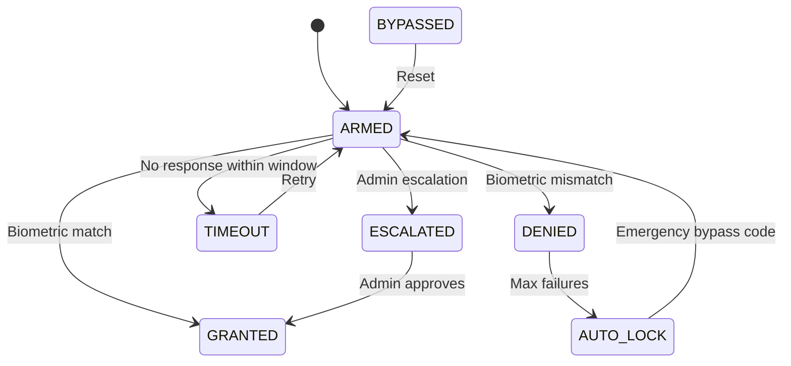
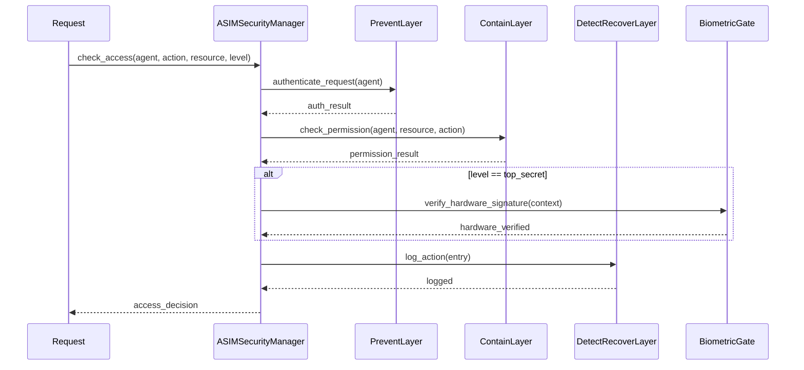
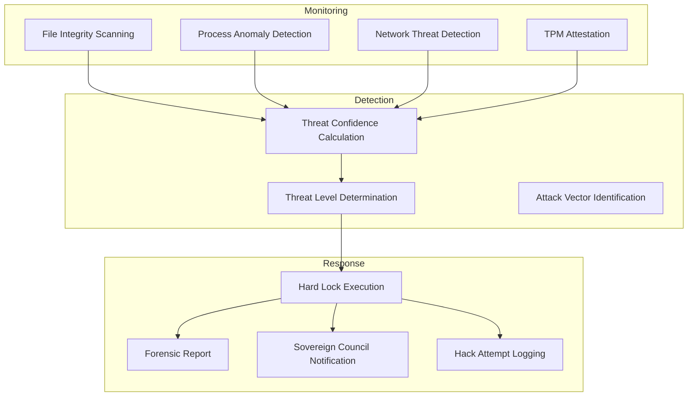

# Security Model Summary

> **AsimNexus v1.0.1** | Last updated: 2026-06-01
> Source: [`security/security_framework.py`](../../security/security_framework.py), [`security/biometric_hardware_gate.py`](../../security/biometric_hardware_gate.py), [`security/identity_quantum_vault.py`](../../security/identity_quantum_vault.py), [`security/hardware_hard_lock.py`](../../security/hardware_hard_lock.py), [`security/audit_log.py`](../../security/audit_log.py), [`os_control/sandbox/docker_sandbox.py`](../../os_control/sandbox/docker_sandbox.py)

---

## 1. Security Posture Overview

AsimNexus implements a **defense-in-depth** security architecture organized into three conceptual layers:

| Layer | Class | Responsibility |
|-------|-------|----------------|
| 🛡️ **PREVENT** | [`PreventLayer`](../../security/security_framework.py:61) | Authentication, agent registration, lockout policies |
| 🔒 **CONTAIN** | [`ContainLayer`](../../security/security_framework.py:267) | Sandboxing, permission scoping, capability enforcement |
| 🔍 **DETECT & RECOVER** | [`DetectRecoverLayer`](../../security/security_framework.py:420) | Audit logging, anomaly detection, kill switch, checkpoint rollback |

These layers are unified under the [`ASIMSecurityManager`](../../security/security_framework.py:594) facade which coordinates all access decisions via [`check_access()`](../../security/security_framework.py:665).

### Security Levels

Three sensitivity levels govern access control:

| Level | Usage | Example |
|-------|-------|---------|
| `standard` | General API access | Chat, memory retrieval |
| `sensitive` | User data operations | Biometric data, PII |
| `top_secret` | System-critical actions | Override approvals, hard-lock release |

---

## 2. Authentication

### 2.1 Methods

Supported authentication methods, defined in [`AuthMethod`](../../security/security_framework.py:40):

| Method | Status | Purpose |
|--------|--------|---------|
| `NONE` | Public | Health probes, static assets |
| `API_KEY` | Real | Machine-to-machine, service accounts |
| `OAUTH2` | Real | Third-party identity federation |
| `OIDC` | Real | OpenID Connect identity tokens |
| `MTLS` | Real | Mutual TLS for peer mesh nodes |
| `TICKET` | Real | Kerberos-style session tickets |

### 2.2 JWT Authentication

Defined in [`backend/auth.py`](../../backend/auth.py). The [`AuthManager`](../../backend/auth.py:75) implements:

- **Token format**: JWT with HS256 signing
- **Session store**: SQLite-backed active sessions table
- **Lockout policy**: Tracks failed logins per IP + username combination via [`check_lockout()`](../../backend/auth.py:131) and [`record_failed_login()`](../../backend/auth.py:146)
- **Token rotation**: Refresh tokens invalidate old access tokens on use ([`refresh_access_token()`](../../backend/auth.py:356))
- **IP pinning**: Token verification includes client IP matching ([`verify_token()`](../../backend/auth.py:303))

**Endpoints:**

| Endpoint | Method | Function |
|----------|--------|----------|
| `/api/auth/register` | POST | [`register()`](../../backend/auth.py:429) |
| `/api/auth/login` | POST | [`login()`](../../backend/auth.py:440) |
| `/api/auth/verify` | POST | [`verify()`](../../backend/auth.py:452) |
| `/api/auth/logout` | POST | [`logout()`](../../backend/auth.py:465) |
| `/api/auth/sessions` | GET | [`get_sessions()`](../../backend/auth.py:474) |
| `/api/auth/refresh` | POST | [`refresh_token()`](../../backend/auth.py:488) |

### 2.3 Biometric Hardware Gate

Defined in [`security/biometric_hardware_gate.py`](../../security/biometric_hardware_gate.py). The [`BiometricHardwareGate`](../../security/biometric_hardware_gate.py:53) provides **Level-3** biometric verification with 7 states:



Key methods:

| Method | Purpose |
|--------|---------|
| [`arm_from_threat()`](../../security/biometric_hardware_gate.py:97) | Arm gate in response to detected threat |
| [`verify_and_lock()`](../../security/biometric_hardware_gate.py:174) | Verify biometric + execute system lock |
| [`verify_admin()`](../../security/biometric_hardware_gate.py:346) | Synchronous admin biometric check |
| [`emergency_bypass()`](../../security/biometric_hardware_gate.py:456) | Bypass with override code |
| [`authenticate()`](../../security/biometric_hardware_gate.py:530) | Full MFA authentication flow |

---

## 3. Authorization

### 3.1 Capability-Based Access Control

The [`ContainLayer`](../../security/security_framework.py:267) implements a fine-grained permission model:

```python
@dataclass
class PermissionScope:
    resource: str          # e.g., "mesh", "storage", "consensus"
    action: str            # e.g., "read", "write", "admin"
    context: Dict          # Additional constraints
```

### 3.2 Access Decision Flow

The [`ASIMSecurityManager.check_access()`](../../security/security_framework.py:665) method orchestrates the full decision pipeline:



### 3.3 Domain Veto Registry

Defined in [`core/consensus/consensus_engine.py`](../../core/consensus/consensus_engine.py). The veto system enforces domain-specific access boundaries:

| Domain | Veto Holder | Scope |
|--------|-------------|-------|
| `security` | clone_01 | All security policy changes |
| `sovereignty` | clone_02 | Constitutional/air-gap decisions |
| `finance` | Finance arbiter | Transaction approvals |
| `governance` | Governance arbiter | Policy modifications |
| `network` | Network arbiter | Mesh topology changes |
| `storage` | Storage arbiter | Data retention policies |
| `identity` | Identity arbiter | DID/key management |
| `learning` | Learning arbiter | Model promotion decisions |

---

## 4. Post-Quantum Cryptography

Defined in [`security/identity_quantum_vault.py`](../../security/identity_quantum_vault.py). PQC stubs provide NIST-standard algorithm signatures:

### 4.1 Algorithm Stubs

| Algorithm | Type | Public Key | Secret Key | Ciphertext/Sig |
|-----------|------|------------|------------|----------------|
| **Kyber-512** | KEM | 800 bytes | 1,632 bytes | 768 bytes |
| **Dilithium2** | Signature | 1,312 bytes | 2,528 bytes | 2,420 bytes |
| **FALCON-512** | Signature | 897 bytes | 1,281 bytes | 666 bytes |

Current provider is `software_fallback` (`PQC_PROVIDER` constant).

### 4.2 Key Operations

Defined through [`IdentityQuantumVault`](../../security/identity_quantum_vault.py:367):

| Method | Purpose |
|--------|---------|
| [`generate_quantum_keypair()`](../../security/identity_quantum_vault.py:272) | Generate full Kyber + Dilithium + Falcon bundle |
| [`kyber_keygen()`](../../security/identity_quantum_vault.py:64) | KEM key pair generation |
| [`kyber_encapsulate()`](../../security/identity_quantum_vault.py:83) | Encrypt shared secret |
| [`kyber_decapsulate()`](../../security/identity_quantum_vault.py:103) | Decrypt shared secret |
| [`dilithium_sign()`](../../security/identity_quantum_vault.py:148) | Post-quantum signing |
| [`dilithium_verify()`](../../security/identity_quantum_vault.py:168) | Post-quantum signature verification |
| [`falcon_sign()`](../../security/identity_quantum_vault.py:213) | Compact post-quantum signing |
| [`falcon_verify()`](../../security/identity_quantum_vault.py:232) | Compact signature verification |

### 4.3 Quantum Vault Encryption

The vault uses AES-256-CTR for data encryption with HMAC-SHA256 for integrity:

```python
# From _encrypt_data
cipher = Cipher(algorithms.AES(key), modes.CTR(iv))
encryptor = cipher.encryptor()
hmac = hmac.new(hmac_key, encrypted_data, "sha256").hexdigest()
```

---

## 5. Hardware Security

### 5.1 Hardware Backend Abstraction

Defined in [`security/hardware_hard_lock.py`](../../security/hardware_hard_lock.py). The [`HardwareBackend`](../../security/hardware_hard_lock.py:50) ABC defines:

| Method | Purpose |
|--------|---------|
| [`seal()`](../../security/hardware_hard_lock.py:58) | Encrypt data bound to the device |
| [`unseal()`](../../security/hardware_hard_lock.py:72) | Decrypt sealed data |
| [`sign()`](../../security/hardware_hard_lock.py:86) | Sign a digest |
| [`verify()`](../../security/hardware_hard_lock.py:99) | Verify a signature |
| [`get_process_list()`](../../security/hardware_hard_lock.py:113) | Enumerate running processes |
| [`get_network_connections()`](../../security/hardware_hard_lock.py:123) | Enumerate active connections |
| [`get_tpm_info()`](../../security/hardware_hard_lock.py:133) | Query TPM capabilities |

Two implementations:

| Backend | Algorithm | Key Source |
|---------|-----------|------------|
| [`SoftwareBackend`](../../security/hardware_hard_lock.py:144) | AES-256-CTR + HMAC-SHA256 | Machine-local seed derived from hostname + MAC |
| [`TPMBackend`](../../security/hardware_hard_lock.py:309) | tpm2-pytss or subprocess | Hardware TPM 2.0 |

### 5.2 Hardware Hard Lock

The [`HardwareHardLock`](../../security/hardware_hard_lock.py:513) class provides continuous threat monitoring:



**Threat levels** ([`ThreatLevel`](../../security/hardware_hard_lock.py:462)): `LOW`, `MEDIUM`, `HIGH`, `CRITICAL`

**Hardware states** ([`HardwareState`](../../security/hardware_hard_lock.py:471)): `NORMAL`, `COMPROMISED`, `LOCKED`, `RECOVERING`

### 5.3 Tamper Evidence

- **File integrity**: SHA-256 snapshots compared on each scan cycle
- **Process monitoring**: Detects unauthorized debuggers, code injectors, keyloggers
- **Network monitoring**: Detects unauthorized connections, port scanning, DNS tunneling
- **Government attack detection**: Tier-2 pattern matching for state-level threats

---

## 6. OS Control Sandbox

Defined in [`os_control/sandbox/docker_sandbox.py`](../../os_control/sandbox/docker_sandbox.py). The [`DockerSandbox`](../../os_control/sandbox/docker_sandbox.py:40) provides hardened execution for high-risk operations:

### 6.1 Trusted Image Allowlist

```python
TRUSTED_IMAGES = {
    "python:3.11-slim",
    "python:3.10-slim",
    "alpine:3.19",
    "ubuntu:24.04",
    "busybox:stable",
}
```

### 6.2 Container Hardening

The [`_prepare_container_config()`](../../os_control/sandbox/docker_sandbox.py:151) method applies the following security constraints:

| Setting | Value | Purpose |
|---------|-------|---------|
| `read_only` | `true` | Read-only root filesystem |
| `security_opt` | `no-new-privileges:true` | Prevent privilege escalation |
| `user` | UID 1000 (non-root) | Low-privilege user |
| `cap_drop` | `ALL` | Drop all Linux capabilities |
| `mem_limit` | `512m` | Memory ceiling |
| `cpu_count` | 1.0 | CPU limit |
| `network_mode` | `none` (for scripts) | Network isolation |
| `tmpfs` | `/tmp:noexec,nosuid,size=100m` | Secure temp storage |

### 6.3 Command Sanitization

The [`_sanitize_command()`](../../os_control/sandbox/docker_sandbox.py:68) method rejects dangerous patterns (`rm -rf /`, `sudo`, shell=True patterns, pipe bombs).

---

## 7. Audit Trail

Defined in [`security/audit_log.py`](../../security/audit_log.py). The [`AuditLog`](../../security/audit_log.py:55) provides tamper-evident logging:

### 7.1 Event Types

| Event Type | Severity | Example |
|------------|----------|---------|
| `AUTHENTICATION` | INFO/WARNING | Login success/failure |
| `AUTHORIZATION` | INFO | Permission grant/deny |
| `DATA_ACCESS` | INFO | User data read |
| `DATA_MODIFICATION` | WARNING | Data create/update/delete |
| `CONFIGURATION_CHANGE` | WARNING | Security policy update |
| `SYSTEM_EVENT` | INFO | Service start/stop |
| `SECURITY_ALERT` | ERROR/CRITICAL | Intrusion detected |

### 7.2 Log Entry Schema

```python
@dataclass
class AuditLogEntry:
    timestamp: str           # ISO 8601
    event_type: AuditEventType
    severity: AuditSeverity
    agent_id: str
    action: str
    resource: str
    status: str              # success / failure / blocked
    details: Dict
    checksum: str            # SHA-256 of previous entry (blockchain chain)
    previous_hash: str
```

### 7.3 Key Operations

| Method | Purpose |
|--------|---------|
| [`log_event()`](../../security/audit_log.py:72) | Record an audit event |
| [`query_logs()`](../../security/audit_log.py:119) | Search audit trail by filters |
| [`get_entry()`](../../security/audit_log.py:173) | Retrieve single entry by ID |
| [`cleanup_old_entries()`](../../security/audit_log.py:198) | Prune expired entries |
| [`get_stats()`](../../security/audit_log.py:214) | Audit log statistics |

### 7.4 Consensus Audit Trail

Consensus decisions are independently logged to `consensus_audit.jsonl` by the [`ConsensusEngine`](../../core/consensus/consensus_engine.py) for cross-referencing with the security audit log.

---

## 8. Anomaly Detection & Incident Response

### 8.1 Kill Switch

The [`DetectRecoverLayer.activate_kill_switch()`](../../security/security_framework.py:548) method:

- Records the kill event in the audit log
- Triggers immediate sandbox rollback
- Notifies all registered security handlers
- Requires `top_secret` level to re-arm

### 8.2 Checkpoints

The [`DetectRecoverLayer`](../../security/security_framework.py:420) supports named checkpoints for state recovery:

- [`create_checkpoint(name)`](../../security/security_framework.py:560): Snapshot current security posture
- [`rollback_to_checkpoint(id)`](../../security/security_framework.py:577): Restore to previous safe state

### 8.3 Anomaly Types

| Type | Detection Signal |
|------|------------------|
| `RAPID_FIRE` | >100 actions in 60s from same agent |
| `ABNORMAL_SEQUENCE` | Unusual action ordering |
| `ESCALATION` | Repeated denied access attempts |
| `PATTERN_MATCH` | Known attack pattern signature |

---

## 9. Environment Variables

| Variable | Default | Purpose |
|----------|---------|---------|
| `OVERRIDE_TTL` | `600` | Override request TTL (seconds) |
| `AUDIT_MAX_ENTRIES` | `10000` | Max audit log entries before cleanup |
| `FINAL_THREE_DECISIONS` | `3` | Auto-override trigger count |
| `QUORUM_TIMEOUT` | `300` | Quorum waiting period (seconds) |
| `PQC_PROVIDER` | `"software_fallback"` | PQC implementation backend |

---

## 10. Security Test Coverage

| Test File | Focus | Lines |
|-----------|-------|-------|
| [`tests/real/test_biometric_hardware_gate.py`](../../tests/real/test_biometric_hardware_gate.py) | Biometric gate states, MFA flow | — |
| [`tests/real/test_consensus_engine.py`](../../tests/real/test_consensus_engine.py) | Veto enforcement, override flow | ~1,342 |
| [`tests/real/test_dharma_veto.py`](../../tests/real/test_dharma_veto.py) | Dharma policy veto | — |
| [`tests/real/test_air_gap_controller.py`](../../tests/real/test_air_gap_controller.py) | Air-gap sovereignty | — |
| [`tests/real/test_auth.py`](../../tests/real/test_auth.py) | JWT auth, login, session management | — |
| [`tests/real/test_compliance.py`](../../tests/real/test_compliance.py) | Regulatory compliance checks | — |

---

## References

- [`security/security_framework.py`](../../security/security_framework.py) — 3-layer security framework
- [`security/biometric_hardware_gate.py`](../../security/biometric_hardware_gate.py) — Level-3 biometric gate
- [`security/identity_quantum_vault.py`](../../security/identity_quantum_vault.py) — PQC stubs + quantum vault
- [`security/hardware_hard_lock.py`](../../security/hardware_hard_lock.py) — Hardware backend + hard lock
- [`security/audit_log.py`](../../security/audit_log.py) — Tamper-evident audit trail
- [`os_control/sandbox/docker_sandbox.py`](../../os_control/sandbox/docker_sandbox.py) — Docker sandbox hardening
- [`backend/auth.py`](../../backend/auth.py) — JWT authentication
- [`core/consensus/consensus_engine.py`](../../core/consensus/consensus_engine.py) — Domain veto registry
