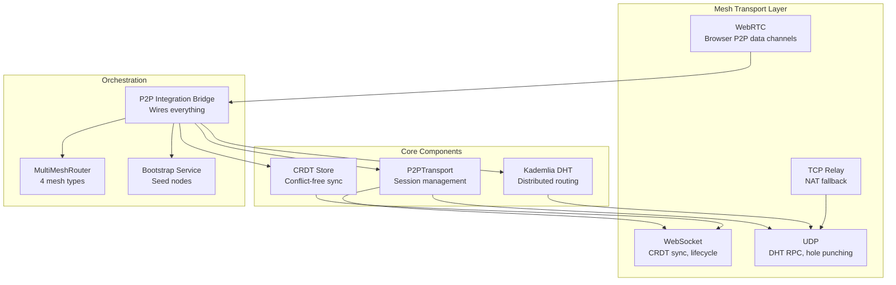
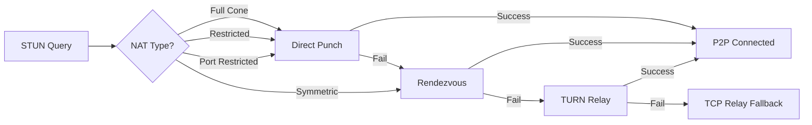
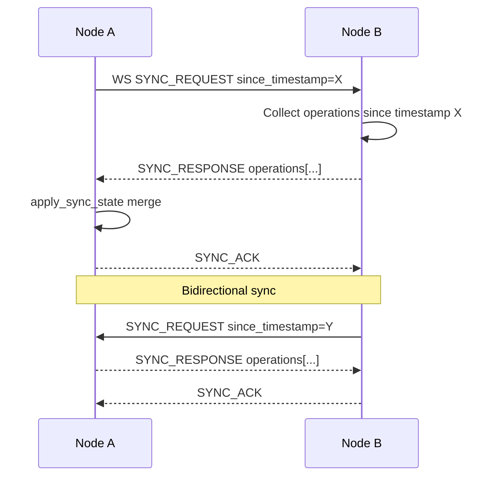

# Mesh Networking Runbook — AsimNexus v1.0.1

> **Document:** `docs/runbooks/MESH_NETWORKING_RUNBOOK.md`
> **Version:** v1.0.1
> **Status:** LIVING

---

## 1. Mesh Architecture

AsimNexus mesh networking uses **4 transport types** over a unified P2P layer, with Kademlia DHT for distributed routing and CRDT for conflict-free data sync.



### Transport Types

| Transport | Protocol | Use Case | File |
|-----------|----------|----------|------|
| WebSocket | TCP :ws_port | CRDT sync, peer lifecycle, streaming | [`mesh/p2p_transport.py`](../../mesh/p2p_transport.py) |
| UDP | UDP :udp_port | DHT RPC, hole punching, low-latency messaging | [`mesh/p2p_transport.py`](../../mesh/p2p_transport.py) |
| WebRTC | SDP/ICE | Browser-to-browser, PUBLIC mesh | [`mesh/p2p_integration.py`](../../mesh/p2p_integration.py) |
| Relay | TCP | Fallback when NAT traversal fails | [`mesh/relay.py`](../../mesh/relay.py) |

### Mesh Types

Defined in [`mesh/multi_mesh_router.py`](../../mesh/multi_mesh_router.py):

| MeshType | Scope | Use Case |
|----------|-------|----------|
| `LOCAL` | Local network | LAN peer discovery |
| `PERSONAL` | Personal devices | Phone-laptop-tablet sync |
| `CLOUD` | Internet | Federation, global routing |
| `PUBLIC` | Open mesh | Community nodes |

### Protocol Constants

Defined in [`mesh/p2p_transport.py`](../../mesh/p2p_transport.py):

| Constant | Value | Description |
|----------|-------|-------------|
| `P2P_MAGIC` | `b"ASIM"` | 4-byte magic header |
| `P2P_VERSION` | 1 | Protocol version |
| `INITIAL_RETRY_DELAY` | 1.0s | Initial retry delay |
| `MAX_RETRY_DELAY` | 60.0s | Max retry backoff |
| `HEALTH_PING_INTERVAL` | 30.0s | PING frequency |
| `HEALTH_PING_TIMEOUT` | 5.0s | PING response timeout |
| `PEER_STALE_TIMEOUT` | 300.0s | 5 min peer expiry |
| `PEER_BAD_THRESHOLD` | 3 | Consecutive failures before ban |

### Connection State Machine

```
INIT → CONNECTING → CONNECTED → DISCONNECTED
  ↓        ↓                        ↓
  |    TIMEOUT                  TIMEOUT
  ↓                                 ↓
BANNED                            BANNED
```

---

## 2. Peer Discovery

### Bootstrap Service

Defined in [`mesh/bootstrap.py`](../../mesh/bootstrap.py):

- TCP-based bootstrap server for seed node discovery
- Regional bootstrap node management (6 regions)
- Peer info exchange (WS/UDP ports, capabilities)

```python
class BootstrapRegion(Enum):
    GLOBAL = "global"
    ASIA = "asia"
    EUROPE = "europe"
    AMERICAS = "americas"
    AFRICA = "africa"
    OCEANIA = "oceania"

@dataclass
class BootstrapNode:
    node_id: str
    ip_address: str
    port: int        # TCP bootstrap port
    region: BootstrapRegion
    trust_level: str = "trusted"
    port_ws: Optional[int] = None
    port_udp: Optional[int] = None
```

### Discovery Flow

```
1. New node connects to bootstrap service via TCP
2. Bootstrap returns list of known peers
3. New node performs Kademlia DHT bootstrap
4. DHT FIND_NODE RPC discovers more peers
5. WebSocket handshake PEER_HELLO/PEER_HELLO_ACK
6. CRDT sync state exchange
```

### Environment Configuration

| Variable | Default | Description |
|----------|---------|-------------|
| `ASIM_P2P_PEER_DISCOVERY_INTERVAL` | 60 | Peer discovery interval (s) |
| `ASIM_P2P_HEALTH_PING_INTERVAL` | 30 | Health check interval (s) |
| `ASIM_P2P_MAX_PEERS_PER_MESH` | 50 | Max peers per mesh type |

---

## 3. DHT Routing

### Kademlia DHT

Defined in [`mesh/kademlia_dht.py`](../../mesh/kademlia_dht.py):

| Parameter | Default | Description |
|-----------|---------|-------------|
| `K` | 20 | Replication / bucket size |
| `ALPHA` | 3 | Concurrency parameter |
| `ID_LENGTH` | 160 | 160-bit SHA-1 node IDs |

Key features:
- **Iterative lookup**: `FIND_NODE` RPC converges to closest nodes
- **Publish/Replicate**: Values stored on K closest nodes
- **Bucket refresh**: Periodic KBucket refresh to maintain routing table
- **XOR distance metric**: `distance = node_id XOR target_id`

```python
class RPCMessageType(Enum):
    PING = "ping"
    PONG = "pong"
    FIND_NODE = "find_node"
    NODES_FOUND = "nodes_found"
    FIND_VALUE = "find_value"
    VALUE_FOUND = "value_found"
    STORE = "store"
    STORE_ACK = "store_ack"
```

---

## 4. NAT Traversal

### Strategy Chain

Defined in [`mesh/hole_punching.py`](../../mesh/hole_punching.py) and [`mesh/stun_turn.py`](../../mesh/stun_turn.py):



### 5 Punch Strategies

| # | Strategy | Description |
|---|----------|-------------|
| 1 | **Direct** | No NAT, direct connection |
| 2 | **STUN** | STUN-derived mapped address |
| 3 | **Rendezvous** | Coordinated through rendezvous server |
| 4 | **TURN** | Traffic relayed through TURN server |
| 5 | **TCP Relay** | Last resort TCP relay |

### Configuration

| Variable | Default | Description |
|----------|---------|-------------|
| `ASIM_MESH_HOLE_PUNCH_TIMEOUT` | 10s | Per-punch timeout |
| `ASIM_MESH_HOLE_PUNCH_RETRIES` | 3 | Max retry attempts |
| `ASIM_MESH_PUNCH_INTERVAL` | 0.1s | Interval between punches |
| `ASIM_MESH_RENDEZVOUS_PORT` | 7336 | Rendezvous server port |
| `ASIM_MESH_PUNCH_KEEPALIVE` | 15s | Keepalive interval |

### Punch Status

```python
class PunchStatus(Enum):
    PENDING = "pending"
    PUNCHING = "punching"
    ESTABLISHED = "established"
    FAILED = "failed"
    FALLBACK_RELAY = "fallback_relay"
    TIMEOUT = "timeout"
```

---

## 5. Data Sync (CRDT)

### CRDT Types

Defined in [`mesh/crdt_sync.py`](../../mesh/crdt_sync.py):

| CRDT Type | Description |
|-----------|-------------|
| `G_COUNTER` | Grow-only counter |
| `PN_COUNTER` | PN-counter increment/decrement |
| `LWW_REGISTER` | Last-writer-wins register |
| `OR_SET` | Observed-removed set |
| `G_MAP` | Grow-only map |
| `LWW_MAP` | Last-writer-wins map |

### Sync Flow



### CRDT Operation

```python
@dataclass
class CRDTOperation:
    id: str
    crdt_id: str
    crdt_type: CRDTType
    operation: str  # "add", "remove", "set", "increment", "decrement"
    key: Optional[str] = None
    value: Optional[Any] = None
    timestamp: float
    node_id: Optional[str] = None
```

---

## 6. Health Monitoring

### PING/PONG Protocol

- Every `HEALTH_PING_INTERVAL` (30s), connected peers exchange PING/PONG via WebSocket
- If no PONG within `HEALTH_PING_TIMEOUT` (5s), peer marked as TIMEOUT
- After `PEER_STALE_TIMEOUT` (300s / 5min) of no communication, peer removed
- After `PEER_BAD_THRESHOLD` (3) consecutive failures, peer BANNED

### WebSocket Message Types

```python
class WSMessageType(Enum):
    SYNC_REQUEST = "sync_request"
    SYNC_RESPONSE = "sync_response"
    SYNC_OPERATIONS = "sync_operations"
    SYNC_ACK = "sync_ack"
    PEER_HELLO = "peer_hello"
    PEER_HELLO_ACK = "peer_hello_ack"
    PEER_PING = "peer_ping"
    PEER_PONG = "peer_pong"
    PEER_GOODBYE = "peer_goodbye"
```

### Cleanup Loops

- **Periodic health check**: Iterates all peers, sends PING, checks staleness
- **Bucket refresh**: Kademlia KBuckets refreshed periodically
- **Stale peer reaper**: Removes peers exceeding `PEER_STALE_TIMEOUT`

---

## 7. Troubleshooting

### Common Failures

| Symptom | Likely Cause | Resolution |
|---------|-------------|------------|
| Peers unreachable | Firewall blocking ports | Open `port_udp` and `port_ws` |
| DHT lookups fail | Bootstrap node unreachable | Verify bootstrap service is running |
| NAT traversal fails | Symmetric NAT without TURN | Configure TURN server credentials |
| CRDT sync timeout | Network congestion | Increase sync timeout |
| Connection refused | Port conflict | Check port availability |
| High peer churn | Unstable network | Increase `PEER_STALE_TIMEOUT` |

### Log Patterns

| Log Message | Meaning |
|-------------|---------|
| `[P2PTransport] Failed to connect to peer` | Peer unreachable or port closed |
| `[KademliaDHT] Bucket refresh completed` | Normal DHT maintenance |
| `[HolePunching] Punch failed, falling back to relay` | NAT too restrictive |
| `[CRDTSync] Sync applied N operations` | Normal sync operation |
| `[Bootstrap] Peer registered: node_id` | New peer joined mesh |
| `[P2PIntegration] Peer stale, removing: node_id` | Peer timeout cleanup |

### Recovery Steps

```bash
# 1. Check mesh service status
docker-compose ps
docker logs asimnexus-backend --tail 50 | grep -i mesh

# 2. Verify health endpoint
curl http://localhost:8000/api/mesh/status

# 3. Check peer count
curl http://localhost:8000/api/mesh/peers

# 4. Check DHT stats
curl http://localhost:8000/api/mesh/dht/stats

# 5. If DHT corruption suspected, reset DHT
curl -X POST http://localhost:8000/api/mesh/dht/reset

# 6. If bootstrap failure, verify bootstrap node
curl http://localhost:8000/api/mesh/bootstrap/stats

# 7. Restart mesh service
docker-compose restart backend
```

---

## 8. Mesh API Endpoints

| Endpoint | Method | Purpose |
|----------|--------|---------|
| `/api/mesh/status` | GET | Overall mesh status |
| `/api/mesh/peers` | GET | List connected peers |
| `/api/mesh/dht/stats` | GET | DHT bucket statistics |
| `/api/mesh/dht/reset` | POST | Reset DHT state |
| `/api/mesh/sync/status` | GET | CRDT sync status |
| `/api/mesh/bootstrap/stats` | GET | Bootstrap service stats |
| `/api/mesh/nodes` | GET | Registered nodes |
| `/api/mesh/p2p/connections` | GET | Active P2P connections |
| `/api/mesh/p2p/stats` | GET | P2P transport statistics |

---

*Last updated: 2026-06-01 for v1.0.1 release documentation*
