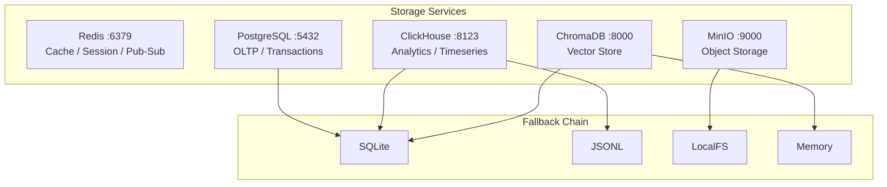

# Storage Monitoring Runbook — AsimNexus v1.0.1

> **Document:** `docs/runbooks/STORAGE_MONITORING_RUNBOOK.md`
> **Version:** v1.0.1
> **Status:** LIVING

---

## 1. Storage Architecture

AsimNexus uses a **5-layer storage architecture** with graceful fallback chains.



### What Each Service Stores

| Service | Data | Tables/Collections/Buckets |
|---------|------|---------------------------|
| **Redis** | Cache, sessions, rate limiting, pub/sub | — |
| **PostgreSQL** | User accounts, sessions, credit accounts/transactions, governance state/decisions, DID registry, node registry, federation state, notifications | 10 tables: `users`, `sessions`, `credit_accounts`, `credit_transactions`, `governance_state`, `governance_decisions`, `did_registry`, `node_registry`, `federation_state`, `notifications` |
| **ClickHouse** | Auth events, routing metrics, latency data, mesh events, websocket events, UI telemetry | 6 tables + 2 materialized views, TTL-based retention |
| **MinIO** | Raw logs, exports, snapshots, deployment artifacts, user uploads, mesh offline buffers, backups, audit archive | 8 buckets |
| **ChromaDB** | Semantic memory, agent context, retrieval cache, clone silos | 4 collections with TTL management |

### Configuration

All storage configuration is in [`config/storage.yaml`](../../config/storage.yaml) with typed dataclass access via [`storage/config.py`](../../storage/config.py). Environment variable substitution is supported with `${VAR:-default}` syntax.

---

## 2. Health Check Endpoints

### Standard Health Probes

Defined in [`backend/health.py`](../../backend/health.py):

| Endpoint | Method | Purpose |
|----------|--------|---------|
| `/health/live` | GET | Process alive check — always `200` if running |
| `/health/ready` | GET | Dependency readiness — checks DB, LLM, core modules, all 5 storage services |
| `/health/status` | GET | Full system status with detailed metrics including storage layer |

### `/health/ready` Response

```json
{
  "status": "ready",
  "version": "v1.0.1",
  "db": true,
  "storage": {
    "redis": true,
    "clickhouse": true,
    "postgres": true,
    "minio": true,
    "chromadb": true
  },
  "uptime_seconds": 3600
}
```

### Storage-Specific Health Checks

Each storage service in [`backend/health.py`](../../backend/health.py) has a dedicated check function:

| Service | Check Method | Connection Config |
|---------|-------------|-------------------|
| Redis | `health_check_redis()` | `REDIS_HOST:REDIS_PORT`, timeout 3s |
| ClickHouse | `health_check_clickhouse()` | `CLICKHOUSE_HOST:CLICKHOUSE_HTTP_PORT` (8123), timeout 5s |
| PostgreSQL | `health_check_postgres()` | `POSTGRES_HOST:POSTGRES_PORT`, user/password/DB, timeout 5s |
| MinIO | `health_check_minio()` | `MINIO_HOST:MINIO_API_PORT` (9000), access/secret key, timeout 5s |
| ChromaDB | `health_check_chromadb()` | `CHROMADB_HOST:CHROMADB_PORT` (8000), timeout 5s |

---

## 3. Monitoring Dashboards

### Prometheus Metrics

Defined in [`monitoring/metrics.py`](../../monitoring/metrics.py) — 5 metric types per storage service:

```python
# Per-service metrics
storage_up = Gauge("storage_up", "Service is reachable", ["service"])
storage_latency = Histogram("storage_latency_ms", "Query latency", ["service"])
storage_connections = Gauge("storage_connections", "Active connections", ["service"])
storage_errors = Counter("storage_errors_total", "Total errors", ["service"])
storage_disk_usage = Gauge("storage_disk_usage_bytes", "Disk usage", ["service"])
```

All 5 services monitored: `redis`, `clickhouse`, `postgres`, `minio`, `chromadb`.

### Observability Dashboard

Defined in [`monitoring/observability_dashboard.py`](../../monitoring/observability_dashboard.py) — real-time HTML dashboard:

- **Health scoring** with 50% weight allocated to storage layer
- **Per-service status cards** showing up/down, latency, connections, disk usage
- **System metrics**: CPU, memory, process count
- **Auto-refresh** at configurable interval

```python
@dataclass
class StorageStatus:
    service: str
    up: bool
    latency_ms: float
    connections: int
    disk_bytes: int
    version: str
    error: str
    last_checked: str
```

### Grafana Dashboard

Located at [`monitoring/grafana/dashboards/storage-pod-stability.json`](../../monitoring/grafana/dashboards/storage-pod-stability.json):

- **5 service rows** (ClickHouse, PostgreSQL, MinIO, ChromaDB, Redis)
- **7 panels per service**: up status, latency histogram, connections gauge, error rate, disk usage, version, health score
- **Alert thresholds** configured per service

---

## 4. Alert Thresholds

### Default Thresholds (per service)

| Metric | Warning | Critical | Notes |
|--------|---------|----------|-------|
| CPU usage | > 70% | > 90% | Per-container |
| Memory usage | > 80% | > 95% | Per-container |
| Disk usage | > 75% | > 90% | Persistent volume |
| Connection pool | > 80% | > 95% | PostgreSQL max_connections |
| Query latency (p99) | > 500ms | > 2s | ClickHouse analytical queries |
| Query latency (p99) | > 200ms | > 1s | PostgreSQL OLTP queries |
| Service up | false > 30s | false > 60s | Consecutive check failures |
| Error rate | > 1% | > 5% | Of total requests |

### Storage-Specific Thresholds

| Service | Specific Alert | Threshold |
|---------|---------------|-----------|
| Redis | maxmemory usage | > 80% of 512 MB |
| Redis | Eviction rate | > 100 keys/min |
| ClickHouse | Merge queue | > 100 pending merges |
| PostgreSQL | Replication lag | > 30 seconds |
| MinIO | Bucket count | Near quota |
| ChromaDB | Collection size | > 90% of allocated storage |

---

## 5. Common Issues

### Connection Refused

**Symptoms:** Health check returns `false` for a service, metrics show `storage_up{service="postgres"} = 0`

**Possible causes:**
- Service not started
- Port conflict
- Firewall blocking
- Container crashed (OOM)

**Diagnosis:**
```bash
docker-compose ps                    # Check container status
docker logs asimnexus-postgres --tail 50   # Check service logs
curl -f http://localhost:5432         # Test direct connection
```

### Disk Full

**Symptoms:** Slow queries, write failures, `no space left on device` errors

**Diagnosis:**
```bash
df -h /var/lib/docker/volumes/       # Check disk usage
docker system df                      # Check Docker disk usage
curl localhost:8000/health/status     # Check storage disk metrics
```

### Slow Queries

**Symptoms:** High latency metrics, timeout errors in application logs

**Diagnosis:**
```bash
# PostgreSQL
docker exec asimnexus-postgres psql -U asimnexus -c "SELECT * FROM pg_stat_activity WHERE state = 'active';"

# ClickHouse
curl "http://localhost:8123/?query=SELECT+query_duration_ms,query+FROM+system.query_log+ORDER+BY+query_duration_ms+DESC+LIMIT+10"
```

### Replication Lag

**Symptoms:** Stale reads, inconsistent data across nodes

**Diagnosis:**
```bash
# PostgreSQL
docker exec asimnexus-postgres psql -U asimnexus -c "SELECT pg_current_wal_lsn() - pg_stat_replication.sent_lsn AS lag;"
```

---

## 6. Recovery Procedures

### Restart Service

```bash
# Single service
docker-compose -f docker-compose.storage.yml restart postgres

# All storage services
docker-compose -f docker-compose.storage.yml restart

# Check recovery
curl -f http://localhost:8000/health/ready
```

### Failover

For multi-node deployments:

```bash
# PostgreSQL: Promote replica
docker exec asimnexus-postgres-replica pg_ctl promote

# Update application config to point to new primary
# Update DATABASE_URL in docker-compose.prod.yml
docker-compose -f docker-compose.prod.yml up -d backend
```

### Restore from Backup

```bash
# PostgreSQL
docker exec -i asimnexus-postgres psql -U asimnexus asimnexus < backup.sql

# MinIO
docker exec asimnexus-minio mc cp -r backup-bucket/data/ /data/

# ClickHouse
# Re-import from time-series backup bucket
```

### Full Storage Reset

```bash
# Stop all services
docker-compose -f docker-compose.storage.yml down -v

# Reset volumes (CAUTION: destroys data)
docker volume rm asimnexus_postgres_data asimnexus_redis_data asimnexus_clickhouse_data asimnexus_minio_data asimnexus_chromadb_data

# Restart
docker-compose -f docker-compose.storage.yml up -d

# Run migration
python scripts/migrate_storage.py --all
```

---

## 7. Docker Compose Storage Layout

The [`docker-compose.storage.yml`](../../docker-compose.storage.yml) defines all 5 storage services:

```yaml
services:
  redis:        # redis:7-alpine, port 6379, appendonly, maxmemory 512mb
  clickhouse:   # clickhouse/clickhouse-server:24.3, ports 8123/9000
  postgres:     # postgres:16-alpine, port 5432
  minio:        # minio/minio:latest, ports 9001/9002, console at :9001
  chromadb:     # chromadb/chroma:latest, port 8000
```

Each service has:
- Named volume for persistent data
- Health check with appropriate test command
- Network on `asimnexus-storage-network`
- Environment variable configuration

---

*Last updated: 2026-06-01 for v1.0.1 release documentation*
