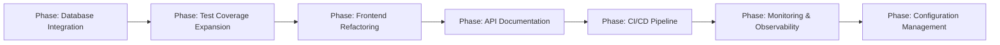

# AsimNexus — Complete Architectural Analysis

> **Purpose**: Comprehensive understanding of the entire AsimNexus system — all components, their relationships, data flows, design patterns, and improvement opportunities.
> **Date**: 2025-07-05
> **Author**: Architect Mode

---

## 1. System Overview

AsimNexus is a **modular monolith** with a **FastAPI backend** (273+ routes), **React TypeScript frontend**, and a sophisticated **self-awareness/self-building engine**. It is designed as a sovereign digital nation infrastructure with mesh networking, consensus governance, security layers, and autonomous evolution capabilities.

### 1.1 Core Philosophy

The system is built around the concept of **"AsimNexus building itself"** — an autonomous self-improving system that:
- Scans its own codebase for gaps
- Analyzes those gaps for priority
- Generates new code (routes, models, services, tests, frontend components)
- Fixes its own code quality issues (bare excepts, missing docstrings, unused imports)
- Evolves through suggestions from mirror reflections, dreaming cycles, and evolution engine
- Deploys to staging and runs smoke tests autonomously

---

## 2. Architecture Layers

```
┌─────────────────────────────────────────────────────────────┐
│                    FRONTEND (React/TypeScript)               │
│  App.tsx → SmartHub → Hubs (AI, Life, Identity, Network,    │
│                        Governance, Economy, Universe, etc.)  │
│  SoulKeyDashboard, MirrorEvolutionHub, PersonalUniverseDash  │
├─────────────────────────────────────────────────────────────┤
│                    API LAYER (FastAPI Routes)                 │
│  routes/*.py — 273+ endpoints across 20+ route modules       │
│  Health: /health/live, /health/ready, /health/status         │
│  Mesh: /mesh/nodes                                           │
├─────────────────────────────────────────────────────────────┤
│                    SERVICE LAYER                              │
│  core/self_awareness/ — Scanner, Knowledge, Builder,         │
│                         GapAnalyzer, AutoBuilder             │
│  core/evolution/ — EvolutionEngine                           │
│  core/mirror/ — MirrorModule                                 │
│  core/dreaming/ — DreamingEngine, BugTriage, LoRAEngine      │
├─────────────────────────────────────────────────────────────┤
│                    DOMAIN LAYER (Core Engines)                │
│  ┌──────────┐ ┌──────────┐ ┌──────────┐ ┌───────────────┐   │
│  │ Security │ │Consensus │ │  Mesh    │ │   Identity    │   │
│  │  ZKP     │ │ Clone    │ │ P2P      │ │  Soul Key     │   │
│  │ Biometric│ │ Voting   │ │ Kademlia │ │  Personal OS  │   │
│  │ HSM      │ │ Dharma   │ │ CRDT     │ │  Federated ID │   │
│  │ HardLock │ │ Veto     │ │          │ │               │   │
│  └──────────┘ └──────────┘ └──────────┘ └───────────────┘   │
│  ┌──────────┐ ┌──────────┐ ┌──────────┐ ┌───────────────┐   │
│  │ Economy  │ │Governance│ │Federation│ │   Gateway     │   │
│  │ Tokens   │ │Stakeholder│ │Global Fed│ │  LLM Router   │   │
│  │ Wallet   │ │Tripartite│ │Protocol  │ │  Nepal Bank   │   │
│  │Marketplace│ │Jurisdiction│ │         │ │  Google Eco   │   │
│  └──────────┘ └──────────┘ └──────────┘ └───────────────┘   │
│  ┌──────────┐ ┌──────────┐ ┌──────────┐ ┌───────────────┐   │
│  │ Dharma   │ │ Universe │ │ Founder  │ │   Knowledge   │   │
│  │ Cultural │ │ Personal │ │ Clones   │ │   RAG Engine  │   │
│  │ Delta-T  │ │ Universe │ │ World    │ │   Vector Store│   │
│  │ Veto     │ │ Lifecycle│ │ Clones   │ │   Embeddings  │   │
│  └──────────┘ └──────────┘ └──────────┘ └───────────────┘   │
├─────────────────────────────────────────────────────────────┤
│                    INFRASTRUCTURE LAYER                       │
│  Redis (cache/queue), Vector DB (knowledge), File System     │
│  Docker, Nginx, Staging Server, Monitoring                   │
└─────────────────────────────────────────────────────────────┘
```

---

## 3. Self-Awareness System (The "Brain")

This is the most architecturally significant subsystem — it's what makes AsimNexus self-building.

### 3.1 Component Diagram

```
┌─────────────────────────────────────────────────────────────────┐
│                    SELF-AWARENESS SYSTEM                          │
│                                                                   │
│  ┌──────────────┐    ┌──────────────┐    ┌──────────────────┐   │
│  │CodebaseScanner│───>│ SelfKnowledge │<───│  GapAnalyzer     │   │
│  │  (scans .py,  │    │ (module info, │    │  (detects gaps:  │   │
│  │   .tsx, .ts)  │    │  issues,      │    │   test coverage, │   │
│  └──────────────┘    │  stats)       │    │   missing exports,│   │
│        ^             └──────┬───────┘    │   naming, orphans, │   │
│        │                    │            │   docstrings,      │   │
│        │                    │            │   bare excepts,    │   │
│        │                    │            │   todos,           │   │
│        │                    │            │   missing routes,  │   │
│        │                    │            │   missing frontend │   │
│        │                    │            │   components)      │   │
│        │                    │            └────────┬─────────┘   │
│        │                    │                     │             │
│        │                    v                     v             │
│  ┌─────┴──────────────────────────────────────────────────┐     │
│  │              EvolutionBridge                           │     │
│  │  (merges suggestions from: Mirror, Dreaming, Evolution) │     │
│  └─────────────────────────┬──────────────────────────────┘     │
│                            │                                    │
│                            v                                    │
│  ┌─────────────────────────────────────────────────────────┐   │
│  │                   AutoBuilder                            │   │
│  │  (run_cycle: scan → analyze → build → test → heal)      │   │
│  │  - _execute_build_action()                               │   │
│  │  - _run_tests() / _run_targeted_tests()                  │   │
│  │  - _should_rollback() / _rollback_cycle()                │   │
│  │  - _self_heal() / _auto_generate_test()                  │   │
│  │  - _deploy_to_staging() / _run_smoke_tests()             │   │
│  └──────────────────────┬──────────────────────────────────┘   │
│                         │                                       │
│                         v                                       │
│  ┌─────────────────────────────────────────────────────────┐   │
│  │                   SelfBuilder                            │   │
│  │  (the "hands" — actual code generation & modification)   │   │
│  │                                                          │   │
│  │  GENERATION METHODS:                                     │   │
│  │  ├─ generate_route_module()     ──→ routes/*.py          │   │
│  │  ├─ generate_model_module()     ──→ models/*.py          │   │
│  │  ├─ generate_service_module()   ──→ services/*.py        │   │
│  │  ├─ generate_test_file()        ──→ tests/unit|real/*.py │   │
│  │  ├─ generate_api_client()       ──→ frontend/src/api/*.ts│   │
│  │  └─ generate_react_component()  ──→ frontend/src/components/*.tsx│
│  │                                                          │   │
│  │  HEALING METHODS:                                        │   │
│  │  ├─ fix_bare_excepts()          — AST-based fix          │   │
│  │  ├─ add_missing_docstrings()    — AST-based fix          │   │
│  │  ├─ remove_unused_imports()     — AST-based fix          │   │
│  │  └─ resolve_todos()             — regex scan → IssueRecord│   │
│  │                                                          │   │
│  │  PATCHING:                                                │   │
│  │  ├─ apply_patch()              — search/replace patch    │   │
│  │  ├─ fix_missing_imports()      — AST-based import fix    │   │
│  │  ├─ register_route_in_init()   — __init__.py registration│   │
│  │  └─ rollback()                 — backup restore          │   │
│  │                                                          │   │
│  │  TEMPLATES (Jinja2):                                     │   │
│  │  ├─ TEMPLATE_ROUTE             — FastAPI route module    │   │
│  │  ├─ TEMPLATE_MODEL             — Pydantic model          │   │
│  │  ├─ TEMPLATE_SERVICE           — Service class           │   │
│  │  ├─ TEMPLATE_TEST_UNIT         — Unit test header        │   │
│  │  ├─ TEMPLATE_TEST_INTEGRATION  — Integration test        │   │
│  │  ├─ TEMPLATE_API_CLIENT        — TypeScript API client   │   │
│  │  └─ TEMPLATE_REACT_COMPONENT   — React component         │   │
│  │                                                          │   │
│  │  SAFETY:                                                  │   │
│  │  ├─ _backup_file()             — timestamped .bak files  │   │
│  │  ├─ _record_action()           — action history log      │   │
│  │  └─ rollback()                 — restore from backup     │   │
│  └──────────────────────────────────────────────────────────┘   │
└─────────────────────────────────────────────────────────────────┘
```

### 3.2 Self-Building Cycle Flow

```
AutoBuilder.run_cycle()
│
├─ 1. SCAN: CodebaseScanner.scan() → ScanResult
│     (walks all .py/.tsx/.ts files, extracts modules, classes, functions)
│
├─ 2. ANALYZE: GapAnalyzer.analyze() → GapAnalysisResult
│     (detects 10+ gap categories, scores by priority)
│
├─ 3. SUGGEST: GapAnalyzer.suggest_build_actions() → List[Dict]
│     (maps gaps to build actions: create route, generate model, etc.)
│
├─ 4. BUILD: For each action → SelfBuilder.generate_*()
│     (creates files with backup, records action history)
│
├─ 5. TEST: _run_tests() / _run_targeted_tests()
│     (runs pytest, compares pass/fail counts before/after)
│
├─ 6. HEAL: If tests regressed → _self_heal()
│     (fix_bare_excepts, add_missing_docstrings, remove_unused_imports)
│
├─ 7. ROLLBACK: If still broken → _rollback_cycle()
│     (restores from backups, reverts all actions)
│
├─ 8. DEPLOY: _deploy_to_staging() → bool
│     (copies to staging directory, restarts server)
│
├─ 9. SMOKE: _run_smoke_tests() → (passed, total)
│     (hits staging endpoints, verifies basic functionality)
│
└─ 10. RECORD: _record_cycle() → persisted to SelfKnowledge
```

### 3.3 Evolution Suggestion Pipeline

```
MirrorModule          DreamingEngine         EvolutionEngine
(reflects on code,   (nightly dream cycles,  (analyzes patterns,
 finds contradictions) generates lessons)     suggests improvements)
        │                     │                       │
        └─────────────────────┼───────────────────────┘
                              │
                              v
                    EvolutionBridge
                    (merges, deduplicates, prioritizes)
                              │
                              v
                    EvolutionSuggestion
                    (action_id, source, priority, patch_data)
                              │
                              v
                    AutoBuilder._execute_build_action()
                    (applies the suggestion as code change)
```

---

## 4. Security Architecture

### 4.1 Three-Layer Security Model

```
┌─────────────────────────────────────────────────────────────┐
│                    SECURITY LAYER                            │
│                                                              │
│  LAYER 1: PREVENT                                             │
│  ├─ ZKP (Zero-Knowledge Proofs) — core/security/zkp.py       │
│  ├─ Biometric Gate — core/security/biometric_gate.py         │
│  ├─ HSM Interface — core/security/hard_lock.py               │
│  ├─ Rate Limiter — core/rate_limiter_middleware.py           │
│  └─ Security Headers — core/security_headers_middleware.py   │
│                                                              │
│  LAYER 2: CONTAIN                                            │
│  ├─ Soul Key Protocol — core/security/soul_key.py            │
│  │   (Merkle Tree of life events, device attestation,        │
│  │    lockout mechanism, integrity verification)              │
│  ├─ Immutable Constitution — core/security/immutable_constitution.py│
│  ├─ Security Audit — core/security/security_audit.py         │
│  └─ Dharma Veto — core/dharma/dharma_veto.py                 │
│                                                              │
│  LAYER 3: DETECT & RESPOND                                    │
│  ├─ Security Layer — core/security_layer.py                  │
│  ├─ Audit Bus — core/audit_bus.py                            │
│  ├─ Monitoring Middleware — core/monitoring_middleware.py     │
│  └─ Disaster Recovery — core/disaster_recovery.py            │
└─────────────────────────────────────────────────────────────┘
```

### 4.2 Soul Key Protocol (Identity & Attestation)

The [`SoulKeyProtocol`](core/security/soul_key.py:196) is the identity backbone:

- **SoulKey**: A citizen's identity with Merkle Tree of life events, device fingerprints, attestation status
- **Life Events**: Birth, Marriage, Education, Employment, Property, Health, Travel, Death — each hashed into the Merkle Tree
- **Attestation**: Device-level hardware attestation with trust scoring
- **Lockout**: Automated lockout mechanism with resolution workflow
- **Persistence**: JSON state file at [`data/soul_keys/soul_key_state.json`](data/soul_keys/soul_key_state.json)

---

## 5. Consensus & Governance

### 5.1 Clone Consensus Voting

```
┌─────────────────────────────────────────────────────────────┐
│                    CONSENSUS ENGINE                           │
│                                                              │
│  ┌─────────────────────┐    ┌─────────────────────────────┐  │
│  │ CloneConsensusVoting │    │     RaftEngine              │  │
│  │ (weighted voting by  │    │ (leader election, log       │  │
│  │  clone stake/role)   │    │  replication, fault tolerance│  │
│  └─────────┬───────────┘    └──────────┬──────────────────┘  │
│            │                           │                     │
│            └───────────┬───────────────┘                     │
│                        │                                     │
│                        v                                     │
│  ┌──────────────────────────────────────────────────────┐   │
│  │              ConsensusEngine                          │   │
│  │  (propose → vote → tally → execute → log)            │   │
│  └──────────────────────┬───────────────────────────────┘   │
│                         │                                    │
│                         v                                    │
│  ┌──────────────────────────────────────────────────────┐   │
│  │              Dharma Veto Engine                       │   │
│  │  (cultural override, delta-T analysis,                │   │
│  │   constitutional compliance check)                    │   │
│  └──────────────────────────────────────────────────────┘   │
└─────────────────────────────────────────────────────────────┘
```

### 5.2 Governance Structure

- **Tripartite Router**: Routes governance actions to appropriate jurisdiction (local, national, international)
- **Stakeholder Coordinator**: Manages stakeholder registration, weighted voting, reputation
- **Jurisdiction Router**: Determines which legal framework applies
- **Cross-Border Compliance**: Handles international legal interoperability
- **Blockchain Constitution Anchor**: Immutable constitution anchoring on blockchain

---

## 6. Mesh Networking

```
┌─────────────────────────────────────────────────────────────┐
│                    MESH NETWORKING                            │
│                                                              │
│  ┌──────────────┐    ┌──────────────┐    ┌──────────────┐   │
│  │   P2P Network │    │  Global Mesh │    │  Delta-T Mesh│   │
│  │  (peer disc., │    │  (node mgmt, │    │  (time-based │   │
│  │   NAT punch)  │    │   health)    │    │   sync)      │   │
│  └──────┬───────┘    └──────┬───────┘    └──────┬───────┘   │
│         │                   │                   │            │
│         └───────────────────┼───────────────────┘            │
│                             │                                │
│                             v                                │
│  ┌──────────────────────────────────────────────────────┐   │
│  │              Federation Manager                       │   │
│  │  (cross-instance communication, protocol negotiation, │   │
│  │   global state sync, federation governance)           │   │
│  └──────────────────────────────────────────────────────┘   │
└─────────────────────────────────────────────────────────────┘
```

---

## 7. Frontend Architecture

### 7.1 Component Hierarchy

```
App.tsx
├── SmartHub (tab-based navigation container)
│   ├── AIHub — AI chat, model selection, streaming
│   ├── LifeHub — Life journey, milestones, timeline
│   ├── IdentityHub — Soul Key dashboard, attestation
│   ├── NetworkHub — Peer nodes, topology visualization
│   ├── GovernanceHub — Stakeholder stats, voting
│   ├── EconomyHub — Marketplace, wallet, tokens
│   └── UniverseHub — Personal universe, layers, connections
├── MirrorEvolutionHub — Mirror reflections, evolution suggestions,
│   │                     consciousness state, dream cycles, bug triage
│   └── (sub-tabs: Overview, Mirror, Consciousness, Evolution, Dreams, Bugs)
├── SoulKeyDashboard — Soul Key CRUD, life events, attestation,
│   │                   lockout management, verification
│   └── (sub-tabs: Overview, Search, Create, Events, Lockout)
└── PersonalUniverseDashboard — Universe CRUD, layers, activities,
    │                            connections, migration, archive
    └── (sub-tabs: Overview, Layers, Activity, Connections, Settings)
```

### 7.2 API Client Structure

The [`frontend/src/api/asimnexus.ts`](frontend/src/api/asimnexus.ts) file is a **1590+ line monolithic API client** with:
- Axios instance with interceptors for auth token injection and 401 handling
- 80+ API methods organized by domain (auth, chat, models, files, economy, governance, identity, mesh, security, universe, etc.)
- TypeScript interfaces for all request/response types

---

## 8. Key Design Patterns

### 8.1 Lazy Loading

```python
# core/lazy_loader.py
class LazyImporter:
    """Defers module imports until first access."""
    
class LazySingleton:
    """Thread-safe singleton with lazy initialization."""
```

Used extensively in [`app.py`](app.py:121) via `_build_app_globals()` — all heavy modules (LLM connectors, mesh, consensus, etc.) are loaded only when first accessed.

### 8.2 Singleton Pattern

All self-awareness components use module-level singletons:
- [`get_scanner()`](core/self_awareness/__init__.py:37) → `CodebaseScanner`
- [`get_knowledge()`](core/self_awareness/__init__.py:45) → `SelfKnowledge`
- [`get_builder()`](core/self_awareness/__init__.py:53) → `SelfBuilder`
- [`get_gap_analyzer()`](core/self_awareness/__init__.py:61) → `GapAnalyzer`
- [`get_auto_builder()`](core/self_awareness/auto_builder.py:1206) → `AutoBuilder`
- [`get_soul_key_protocol()`](core/security/soul_key.py:604) → `SoulKeyProtocol`

### 8.3 Event Bus

```python
# core/event_bus.py
class EventBus:
    """Publish-subscribe event bus for inter-component communication."""
```

### 8.4 Audit Bus

```python
# core/audit_bus.py
class AuditBus:
    """Immutable audit trail for all governance actions."""
```

### 8.5 Backup & Rollback

All SelfBuilder modifications follow this pattern:
1. `_backup_file()` — copies original to `data/self_awareness/backups/` with timestamp
2. Apply modification
3. `_record_action()` — logs to `data/self_awareness/patches/action_history.json`
4. `rollback()` — restores from backup if needed

---

## 9. Data Flow: End-to-End Request

```
User/Browser
    │
    ▼
React Component (e.g., SoulKeyDashboard)
    │
    ▼
API Client (asimnexus.ts) — Axios with auth interceptor
    │
    ▼
FastAPI Route (routes/soul_key.py)
    │
    ▼
Service/Protocol (core/security/soul_key.py — SoulKeyProtocol)
    │
    ▼
Domain Logic (Merkle Tree computation, attestation, lockout)
    │
    ▼
Persistence (JSON file: data/soul_keys/soul_key_state.json)
    │
    ▼
Response ← FastAPI serializes → JSON
    │
    ▼
React Component renders result
```

---

## 10. Current Gaps & Improvement Opportunities

### 10.1 SelfBuilder Gaps (Identified & Fixed)

| Issue | Status | Description |
|-------|--------|-------------|
| Jinja2 templates unused | ✅ FIXED | `_render_template()` added, 5 `generate_*` methods wired |
| `self._knowledge` bug | ✅ FIXED | Changed to `self.knowledge` in `resolve_todos()` |
| `TEMPLATE_TEST_UNIT` missing from `_load_templates()` | ✅ FIXED | Added with proper Jinja2 template |
| `TEMPLATE_REACT_COMPONENT` import path wrong | ✅ FIXED | Added `/{service_name}` to import path |
| `generate_route_module()` still inline | ⚠️ REMAINING | Uses string concatenation instead of `TEMPLATE_ROUTE` |
| `TEMPLATE_TEST_REAL` defined but no template | ⚠️ REMAINING | Constant exists but no entry in `_load_templates()` |
| `TEMPLATE_INIT` defined but no template | ⚠️ REMAINING | Constant exists but no entry in `_load_templates()` |
| `TEMPLATE_SCHEMA` defined but no template | ⚠️ REMAINING | Constant exists but no entry in `_load_templates()` |

### 10.2 Architectural Gaps

| Area | Gap | Impact |
|------|-----|--------|
| **Database** | No SQL/NoSQL database — all persistence is JSON files | No query capability, no relationships, no ACID |
| **Testing** | Only 41 tests for 1500+ files | Critical systems (security, consensus, mesh) have minimal coverage |
| **Frontend** | Monolithic API client (1590 lines) | Hard to maintain, no code splitting |
| **Error Handling** | All routes use `try/except Exception` pattern | Swallows errors, no structured error taxonomy |
| **Configuration** | Hardcoded paths (`os.getcwd()`) | Not configurable, breaks in different environments |
| **Type Safety** | Extensive use of `Dict[str, Any]` | Loses type information, IDE support |
| **Documentation** | Architecture docs exist but no API docs | No OpenAPI/Swagger documentation |
| **Monitoring** | Basic health endpoints only | No metrics, tracing, or alerting |
| **CI/CD** | No automated pipeline | Manual testing and deployment |
| **Migration** | No database migration system | Schema changes require manual intervention |

### 10.3 Recommended Next Phases



---

## 11. File Inventory by Layer

### 11.1 Core Domain Modules (37 packages)

| Package | Files | Purpose |
|---------|-------|---------|
| `core/self_awareness/` | 6 | Scanner, Knowledge, Builder, GapAnalyzer, AutoBuilder, EvolutionBridge |
| `core/security/` | 7 | ZKP, Biometric, HSM, SoulKey, Audit, Constitution, HardLock |
| `core/consensus/` | 5 | CloneVoting, Raft, ConsensusEngine, FounderMap |
| `core/mesh/` | — | (P2P network in core/network/) |
| `core/network/` | 1 | P2P Network |
| `core/identity/` | 2 | FederatedIdentity, PersonalOS |
| `core/economy/` | 12 | Tokens, Wallet, Marketplace, Escrow, Ledger, JobMarket, etc. |
| `core/governance/` | 12 | Stakeholder, Tripartite, Jurisdiction, CrossBorder, etc. |
| `core/federation/` | 4 | FederationManager, GlobalFederation, Protocol |
| `core/gateway/` | 10 | LLM Connectors, Nepal Banking, Google Eco, Unified Gateway |
| `core/dharma/` | 6 | CulturalCompiler, Sovereignty, Delta-T, Veto |
| `core/dharma_chakra/` | 2 | Constitution, VetoEngine |
| `core/dreaming/` | 3 | DreamingEngine, BugTriage, LoRAEngine |
| `core/evolution/` | 1 | EvolutionEngine |
| `core/mirror/` | — | (referenced but not in file list) |
| `core/founder_clones/` | 2 | FounderCloneSystem, WorldClones |
| `core/universe/` | 1 | PersonalUniverse |
| `core/knowledge/` | 5 | Chunker, Embeddings, RAG, VectorStore, Cosmos |
| `core/orchestrator/` | 6 | Orchestrator, Planner, Router, ToolRegistry, Verifier, OSToolExecutor |
| `core/gateway/local/` | 1 | Palikas |
| `core/gateway/nepal/` | 1 | Government |
| `core/gateway/tourism/` | 1 | Hotels |
| `core/governance/country_packs/` | 2 | NP Pack, US Pack |
| `core/nepal/` | 6 | Banking, Cultural, Government, Language, TaxLLM, Telecom |
| `core/lifecycle/` | 1 | DataAtomizer |
| `core/mcp/` | 2 | MCPManager, BuiltinServers |
| `core/sandbox/` | 1 | Sandbox |
| `core/kernel/` | 1 | Microkernel |
| `core/routing/` | 1 | HybridRouter |
| `core/integration/` | 1 | (integration module) |

### 11.2 Routes (20+ modules)

| Route Module | Endpoints |
|-------------|-----------|
| `routes/evolution.py` | 7 (suggestions CRUD, approve/reject, events, stats, history) |
| `routes/founder_clones.py` | 5 (list, spawn, status, assign-task, terminate) |
| `routes/soul_key.py` | 8 (create, get, add-event, list-events, verify, attest, lockout, resolve, stats) |
| `app.py` (inline) | 5 (health/live, health/ready, health/status, mesh/nodes, metrics) |

### 11.3 Frontend Components

| Component | Lines | Purpose |
|-----------|-------|---------|
| `App.tsx` | — | Main app with routing |
| `SmartHub` | — | Tab-based navigation container |
| `AIHub` | 55 | AI chat interface |
| `LifeHub` | 43 | Life journey dashboard |
| `IdentityHub` | 45 | Identity management |
| `NetworkHub` | 154 | Peer network visualization |
| `GovernanceHub` | 98 | Governance dashboard |
| `SoulKeyDashboard` | 995 | Soul Key management UI |
| `MirrorEvolutionHub` | 1221 | Mirror/evolution/dreaming UI |
| `PersonalUniverseDashboard` | 939 | Personal universe management |

---

## 12. Test Coverage Analysis

| Test File | Tests | Type | Status |
|-----------|-------|------|--------|
| `tests/unit/test_self_builder.py` | 6 | Unit | ✅ PASS |
| `tests/unit/test_gap_analyzer.py` | 3 | Unit | ✅ PASS |
| `tests/unit/test_auto_builder.py` | 3 | Unit | ✅ PASS |
| `tests/integration/test_self_building_loop.py` | 17 | Integration | ✅ PASS |
| `tests/integration/test_soul_key.py` | 12 | Integration | ✅ PASS |
| **Total** | **41** | | **✅ ALL PASS** |

### 12.1 Untested Critical Modules

| Module | Risk | Priority |
|--------|------|----------|
| `core/security/zkp.py` | HIGH | Critical |
| `core/consensus/clone_consensus_voting.py` | HIGH | Critical |
| `core/network/p2p_network.py` | HIGH | Critical |
| `core/economy/*` (12 files) | MEDIUM | High |
| `core/governance/*` (12 files) | MEDIUM | High |
| `core/federation/*` (4 files) | MEDIUM | High |
| `core/gateway/*` (10 files) | MEDIUM | High |
| `core/dharma/dharma_veto.py` | HIGH | Critical |
| `core/dreaming/dreaming_engine.py` | MEDIUM | High |
| `core/identity/personal_os.py` | MEDIUM | High |

---

## 13. Summary

AsimNexus is a **remarkably ambitious system** that implements:

1. **Self-building AI** — Autonomous code generation, healing, and evolution
2. **Sovereign identity** — Soul Key protocol with Merkle Tree attestation
3. **Mesh networking** — P2P, Kademlia DHT, CRDT-based synchronization
4. **Consensus governance** — Clone voting, Raft, Dharma Veto override
5. **Multi-layer security** — ZKP, biometrics, HSM, lockout mechanisms
6. **Nepal integration** — Government APIs, banking, language support, tax LLM
7. **Economy engine** — Tokens, wallet, marketplace, escrow, job marketplace
8. **Federation protocol** — Cross-instance communication and governance
9. **Dreaming & evolution** — Nightly dream cycles, LoRA fine-tuning, bug triage
10. **Personal universe** — Lifecycle management, layers, connections, migration

The system is **functional and tested** (41/41 tests pass) with the SelfBuilder now properly using Jinja2 templates for code generation. The primary areas for future work are database integration, test coverage expansion, frontend refactoring, and operational tooling (CI/CD, monitoring, configuration management).
