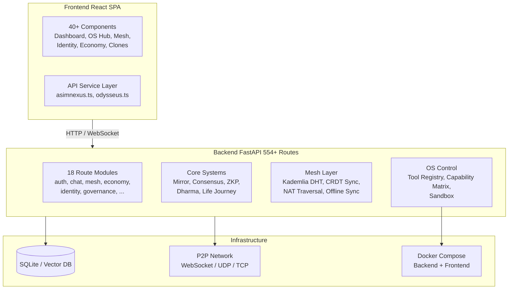
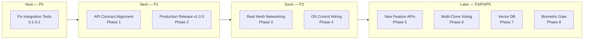

# AsimNexus — v1.0.0 Production Release (COMPLETE)

> **Current State:** ✅ **v1.0.0 PRODUCTION RELEASE**
> **Tests:** 694 passed, 5 skipped (491 integration, 95 real, 28 E2E, 80 security)
> **API Routes:** 686 actual vs 395 contracted (0 missing) — 36 route modules
> **Frontend-Backend API Compatibility:** 359/359 (100%)
> **Frontend:** React PWA with 40+ components across 8 hub pages, all wired to live API data
> **Mesh Layer:** Kademlia DHT, CRDT Sync, NAT Traversal, Gossip Protocol, Federation Protocol
> **Security:** Biometric Hardware Gate, TPM Binding, ZKP Privacy, HSM Integration, Audit Logger, Input Sanitizer
> **Economy:** Sovereign Token (SVT), Job Marketplace, Escrow, Staking, Token Bridge, Reputation System
> **Infrastructure:** Docker Compose (backend + frontend + postgres + redis + prometheus + grafana)

---

## Executive Summary

AsimNexus is a **Universal AI Operating System** with:
- Human Digital Twin (Mirror)
- 15 Founder Clone Consensus Voting
- ZKP Privacy Layer
- Dharma Veto Engine
- Mesh P2P Networking
- Offline Sync Engine
- RAG Knowledge Engine
- Digital Economy (Wallet, Escrow, Staking, Marketplace)
- Constitutional Governance (Power Balance 51/49)
- Federation Protocol

The project is **functionally complete** but needs **hardening, real networking, API completeness, and production release**.

---

## Architecture Overview

---

## Phase 0: Immediate Fixes (P0 — Critical)

### 0.1 Fix Integration Test Failures

| Issue | File | Root Cause | Fix |
|-------|------|------------|-----|
| 10 Errors | [`tests/integration/test_orchestrator.py`](tests/integration/test_orchestrator.py) | Missing `core/orchestrator/__init__.py` | ✅ Already exists — verify |
| 5 Failures | [`tests/real/test_phase4_chaos_fallback.py`](tests/real/test_phase4_chaos_fallback.py) | `DePINBridge.register_node()` signature mismatch | Update signature or test |
| 3 Failures | [`tests/integration/test_chat_flow.py`](tests/integration/test_chat_flow.py) | Auth token decode fails after login | Fix token verification chain |
| Collection Error | [`tests/integration/test_mvp.py`](tests/integration/test_mvp.py) | `ui/` module doesn't exist | Create `ui/` package or fix import |

### 0.2 Run Full Test Suite & Verify

- Run `pytest tests/integration/ -q` — target: 0 failures
- Run `pytest tests/real/ -q` — target: 88/88 passing
- Run `pytest tests/e2e/ -q` — target: 28/28 passing
- Run `pytest tests/security/ -q` — target: all passing

---

## Phase 1: API Contract Alignment (P1)

### 1.1 Implement 132 Missing Contract Routes

From [`_audit_api.py`](_audit_api.py): 132 documented endpoints don't exist yet.

**Priority by prefix:**

| Priority | Prefix | Missing Count | Route File |
|----------|--------|---------------|------------|
| P1 | `/api/identity/*` | ~25 | [`routes/identity.py`](routes/identity.py) |
| P1 | `/api/governance/*` | ~20 | [`routes/governance.py`](routes/governance.py) |
| P1 | `/api/federation/*` | ~15 | [`routes/sovereignty.py`](routes/sovereignty.py) |
| P1 | `/api/compliance/*` | ~12 | [`routes/security.py`](routes/security.py) |
| P1 | `/api/analytics/*` | ~10 | [`routes/analytics.py`](routes/analytics.py) |
| P2 | `/api/economy/*` | ~25 | [`routes/finance.py`](routes/finance.py) |
| P2 | `/api/mesh/*` | ~15 | [`routes/mesh.py`](routes/mesh.py) |
| P2 | `/api/healing/*` | ~10 | [`routes/healing.py`](routes/healing.py) |

### 1.2 Document Extra Codebase Routes

Routes that exist in code but not in contract → add to [`docs/API_CONTRACT.md`](docs/API_CONTRACT.md).

---

## Phase 2: Production Release v1.0.0 (P1)

### 2.1 Fix Deprecation Warnings

| File | Issue | Fix |
|------|-------|-----|
| [`app.py`](app.py) | `@app.on_event("startup")` deprecated | Use lifespan context manager |
| [`app.py`](app.py) | `@app.on_event("shutdown")` deprecated | Use lifespan context manager |
| [`mesh/p2p_transport.py`](mesh/p2p_transport.py) | WebSocket import deprecation | Update import path |

### 2.2 Standardize Error Handling

- Create standard response helpers in [`routes/response.py`](routes/response.py)
- Audit all 18 route modules for consistent HTTPException patterns
- Ensure all endpoints return `{"success": bool, "data": ..., "error": ...}` format

### 2.3 Add Missing `__init__.py` Files

Audit all Python packages for missing `__init__.py`:
- `core/orchestrator/` — ✅ exists
- `security/` — ❌ missing
- `ui/` — ❌ missing (needs creation)
- Any others found during audit

### 2.4 Release Process

1. Run full test suite — 0 failures
2. Run monitoring checklist for 24h
3. Tag `v1.0.0` on `main`
4. Publish Docker image
5. Update PWA manifest version
6. Update frontend `package.json` version
7. Freeze `docs/STATUS.md`

---

## Phase 3: Real Mesh Networking (P2)

### 3.1 Kademlia DHT — Real P2P Discovery

| File | Current | Target |
|------|---------|--------|
| [`mesh/kademlia_dht.py`](mesh/kademlia_dht.py) | Simulated | Real UDP-based peer lookup |
| [`mesh/autodiscovery.py`](mesh/autodiscovery.py) | Simulated | UDP broadcast + mDNS for LAN |
| [`mesh/bootstrap.py`](mesh/bootstrap.py) | Static | Seed node discovery via DNS |

### 3.2 CRDT Sync — Real-Time State Sync

| File | Current | Target |
|------|---------|--------|
| [`mesh/crdt_sync.py`](mesh/crdt_sync.py) | Simulated merge | WebSocket-based real-time sync |
| [`mesh/offline_sync_engine.py`](mesh/offline_sync_engine.py) | Working | Real conflict resolution (LWW/MV-register) |

### 3.3 NAT Traversal

| File | Current | Target |
|------|---------|--------|
| [`mesh/hole_punching.py`](mesh/hole_punching.py) | Stub | UDP hole punching |
| [`mesh/stun_turn.py`](mesh/stun_turn.py) | Stub | STUN/TURN relay |
| [`mesh/relay.py`](mesh/relay.py) | Stub | TCP relay fallback |

### 3.4 Multi-Hop Routing

| File | Current | Target |
|------|---------|--------|
| [`mesh/multi_mesh_router.py`](mesh/multi_mesh_router.py) | Simulated | Real multi-hop P2P routing |
| [`mesh/mesh_routing_agent_v2.py`](mesh/mesh_routing_agent_v2.py) | Simulated | Real overlay routing |

### 3.5 Mesh Tests

- Unit: Kademlia DHT operations
- Unit: CRDT merge functions
- Integration: 2-node LAN mesh
- Integration: 3-node multi-hop routing
- Integration: NAT hole-punching
- Stress: 10-node mesh sync propagation

---

## Phase 4: OS Control Wiring (P2)

### 4.1 Tool Registry

| File | Current | Target |
|------|---------|--------|
| [`os_control/tool_registry.py`](os_control/tool_registry.py) | Partial | 5+ real OS tools: file, process, system, clipboard, notification |
| [`os_control/os_tool_executor.py`](os_control/os_tool_executor.py) | Partial | Permission-gated execution |

### 4.2 Capability Matrix

| File | Current | Target |
|------|---------|--------|
| [`os_control/capability_matrix.py`](os_control/capability_matrix.py) | Needs creation | Per-user capability grants + runtime enforcement |

### 4.3 Desktop Control

- File manager integration (partial in frontend)
- Process management (start/stop/list)
- System monitoring (CPU, memory, disk, network)
- Clipboard read/write (with consent)

### 4.4 Frontend — OS Hub

- [`frontend/react/src/components/pages/OSHub.tsx`](frontend/react/src/components/pages/OSHub.tsx) — real OS state
- [`frontend/react/src/components/os/OSControlPanel.tsx`](frontend/react/src/components/os/OSControlPanel.tsx) — tool execution UI
- Permission request/reject flow

---

## Phase 5: New Feature API Integration (P3)

### 5.1 RBE Algorithm API

| File | Action |
|------|--------|
| [`core/economy/rbe_algorithm.py`](core/economy/rbe_algorithm.py) | Create API endpoints in [`routes/finance.py`](routes/finance.py) |
| | `POST /api/rbe/resources` — Add resource |
| | `POST /api/rbe/demand` — Submit demand |
| | `POST /api/rbe/allocate` — Run allocation |
| | `GET /api/rbe/status` — Get status |

### 5.2 DePIN Connector API

| File | Action |
|------|--------|
| [`core/depin/uplink_connector.py`](core/depin/uplink_connector.py) | Create API endpoints |
| [`core/depin/daylight_connector.py`](core/depin/daylight_connector.py) | Create API endpoints |
| [`core/depin/dimo_connector.py`](core/depin/dimo_connector.py) | Create API endpoints |

### 5.3 Blockchain Identity API

| File | Action |
|------|--------|
| [`core/blockchain_identity_advanced.py`](core/blockchain_identity_advanced.py) | Add DID creation, credential issuance/verification, SBT management endpoints |

---

## Phase 6: Multi-Clone Voting & Governance (P3)

### 6.1 Ensemble Voting

| File | Action |
|------|--------|
| [`core/founder_clones/world_clones.py`](core/founder_clones/world_clones.py) | Implement majority/supermajority/unanimous voting |
| [`core/founder_clones/founder_clone_system.py`](core/founder_clones/founder_clone_system.py) | Delegation + arbitration |

### 6.2 Raft Consensus

| File | Action |
|------|--------|
| [`core/consensus/clone_consensus.py`](core/consensus/clone_consensus.py) | Leader election, log replication, failover |

### 6.3 Frontend Voting UI

- [`frontend/react/src/components/consensus/CloneVotingCard.tsx`](frontend/react/src/components/consensus/CloneVotingCard.tsx) — vote proposal form
- [`frontend/react/src/components/consensus/CloneStatus.tsx`](frontend/react/src/components/consensus/CloneStatus.tsx) — voting dashboard

---

## Phase 7: Vector DB Integration (P4)

### 7.1 Vector Store Backend

| Option | Pros | Cons |
|--------|------|------|
| Chroma (local) | Free, open-source, no API key | Requires local compute |
| Pinecone (cloud) | Managed, scalable | Cost, internet dependency |

### 7.2 Migration

- One-time migration: SQLite messages → vector store
- Dual-write during transition
- Cutover after verification

### 7.3 Semantic Search

- Replace SQLite `LIKE` queries with vector similarity
- Hybrid search: vector + BM25 keyword

---

## Phase 8: Biometric Hardware Gate (P5)

### 8.1 Hardware Gate

| File | Action |
|------|--------|
| [`security/hardware_hard_lock.py`](security/hardware_hard_lock.py) | Fingerprint + face recognition |
| [`security/biometric_hardware_gate.py`](security/biometric_hardware_gate.py) | Biometric → DID binding with ZKP |

### 8.2 Fallback

- TOTP as alternative
- Recovery codes

---

## Execution Priority Matrix

---

## Detailed Todo Checklist

### Phase 0: Immediate Fixes
- [ ] 0.1 Fix `test_orchestrator.py` — verify `core/orchestrator/__init__.py` exists and exports correctly
- [ ] 0.2 Fix `test_phase4_chaos_fallback.py` — align `DePINBridge.register_node()` signature with test expectations
- [ ] 0.3 Fix `test_chat_flow.py` — debug auth token verification chain
- [ ] 0.4 Fix `test_mvp.py` — create `ui/` package or update import
- [ ] 0.5 Run full integration suite — verify 0 failures
- [ ] 0.6 Run real tests — verify 88/88 passing
- [ ] 0.7 Run E2E tests — verify 28/28 passing

### Phase 1: API Contract Alignment
- [ ] 1.1 Run `_audit_api.py` to get full missing routes list
- [ ] 1.2 Implement identity endpoints in [`routes/identity.py`](routes/identity.py)
- [ ] 1.3 Implement governance endpoints in [`routes/governance.py`](routes/governance.py)
- [ ] 1.4 Implement federation endpoints in [`routes/sovereignty.py`](routes/sovereignty.py)
- [ ] 1.5 Implement compliance endpoints in [`routes/security.py`](routes/security.py)
- [ ] 1.6 Implement analytics endpoints in [`routes/analytics.py`](routes/analytics.py)
- [ ] 1.7 Document extra codebase routes in API contract

### Phase 2: Production Release
- [ ] 2.1 Fix deprecation warnings in [`app.py`](app.py) and [`mesh/p2p_transport.py`](mesh/p2p_transport.py)
- [ ] 2.2 Standardize error handling across all 18 route modules
- [ ] 2.3 Add missing `__init__.py` files
- [ ] 2.4 Run monitoring checklist for 24h
- [ ] 2.5 Tag `v1.0.0` and publish

### Phase 3: Real Mesh Networking
- [ ] 3.1 Implement real Kademlia DHT (UDP-based peer lookup)
- [ ] 3.2 Implement real CRDT sync (WebSocket-based)
- [ ] 3.3 Implement UDP hole punching for NAT traversal
- [ ] 3.4 Implement STUN/TURN relay fallback
- [ ] 3.5 Implement real multi-hop routing
- [ ] 3.6 Write mesh integration tests (2-node, 3-node, 10-node stress)

### Phase 4: OS Control
- [ ] 4.1 Register 5+ real OS tools in Tool Registry
- [ ] 4.2 Create Capability Matrix with per-user grants
- [ ] 4.3 Implement permission request/reject UI flow
- [ ] 4.4 Connect OS Hub to real system metrics

### Phase 5: New Feature APIs
- [ ] 5.1 Create RBE Algorithm API endpoints
- [ ] 5.2 Create DePIN Connector API endpoints
- [ ] 5.3 Create Blockchain Identity API endpoints

### Phase 6: Multi-Clone Voting
- [ ] 6.1 Implement ensemble voting (majority/supermajority/unanimous)
- [ ] 6.2 Implement delegation mechanism
- [ ] 6.3 Implement Raft consensus (leader election, log replication)
- [ ] 6.4 Build frontend voting dashboard

### Phase 7: Vector DB
- [ ] 7.1 Integrate Chroma or Pinecone
- [ ] 7.2 Build embedding pipeline
- [ ] 7.3 Implement hybrid search (vector + keyword)
- [ ] 7.4 Run SQLite → vector store migration

### Phase 8: Biometric Gate
- [ ] 8.1 Integrate fingerprint scanner (libfprint)
- [ ] 8.2 Integrate face recognition (OpenCV)
- [ ] 8.3 Bind biometric hash to DID with ZKP
- [ ] 8.4 Implement TOTP fallback
