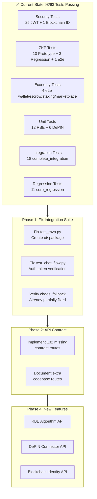

# ASIM NEXUS — Next Phase Plan

## Current State (After Cleanup Steps 1-16)
- **93/93 tests passing** across security, regression, e2e, unit, and integration suites
- **Frontend API compatibility**: 300/300 calls matched (100%)
- **Backend API audit**: 554 actual routes vs 395 contracted (132 planned endpoints not yet implemented)
- All missing modules created: ZKP, Quantum Bridge, Blockchain Identity, DePIN connectors, RBE algorithm, HSM client
- All economy engine API mismatches fixed: wallet, escrow, staking, marketplace

---

## Phase 1: Fix Remaining Integration Test Failures

### 1.1 Fix `test_mvp.py` Collection Error
**Problem**: [`tests/integration/test_mvp.py:25`](tests/integration/test_mvp.py:25) imports `from ui.asim_unified_server import app` but the `ui/` package doesn't exist.

**Fix**: Create `ui/__init__.py` and `ui/asim_unified_server.py` as a minimal module that re-exports the FastAPI `app` from `app.py`, OR update the test to import directly from `app`.

**Files to modify**:
- Create `ui/__init__.py`
- Create `ui/asim_unified_server.py` (re-export `from app import app`)
- OR modify `tests/integration/test_mvp.py` to import from `app` directly

### 1.2 Fix `test_chat_flow.py` Auth Failures
**Problem**: [`tests/integration/test_chat_flow.py`](tests/integration/test_chat_flow.py) — 3 tests fail because `decode_token()` returns 403 on tokens obtained from `admin/admin123` login. The auth middleware can't verify the token.

**Root cause**: The token creation path and verification path are inconsistent. [`core/security/jwt.py`](core/security/jwt.py) creates tokens but the auth middleware at [`core/security/auth_middleware.py`](core/security/auth_middleware.py) may use a different verification method or key.

**Fix options**:
- Option A: Fix the auth middleware to use the same `decode_token()` from `jwt.py`
- Option B: Fix the test to use a valid token path (bypass login, create token directly)
- Option C: Add a test-only auth bypass for integration tests

**Files to investigate**:
- [`core/security/jwt.py`](core/security/jwt.py) — token creation/verification
- [`core/security/auth_middleware.py`](core/security/auth_middleware.py) — auth middleware
- [`tests/integration/test_chat_flow.py`](tests/integration/test_chat_flow.py) — the failing tests

### 1.3 Verify `test_phase4_chaos_fallback.py` Status
**Note**: The `DePINBridge.register_node()` at [`core/depin_bridge.py:76`](core/depin_bridge.py:76) already accepts `location`, `protocols`, and `hardware_capabilities` kwargs. The `core/orchestrator/__init__.py` at [`core/orchestrator/__init__.py`](core/orchestrator/__init__.py) already exists. These may already be fixed — needs verification by running the full integration suite.

---

## Phase 2: API Contract Alignment

### 2.1 Implement Missing Contract Routes
**Problem**: [`_audit_api.py`](_audit_api.py) shows **132 routes** in the API contract that don't exist in the codebase. These are planned endpoints that were documented but never implemented.

**Priority missing endpoints** (by prefix):
- `/api/identity/*` — Identity management endpoints
- `/api/governance/*` — Governance endpoints
- `/api/federation/*` — Federation endpoints
- `/api/compliance/*` — Compliance endpoints
- `/api/analytics/*` — Analytics endpoints

**Fix**: Run `_audit_api.py` to get the full list, then implement missing endpoints in the appropriate route files.

### 2.2 Document Extra Routes
**Problem**: Some routes exist in the codebase but aren't in the contract. These need to be documented in `docs/API_CONTRACT.md`.

**Fix**: Run `_audit_api.py`, get the `extra_in_codebase` list, and add them to the API contract documentation.

---

## Phase 3: Deprecation & Code Quality

### 3.1 Fix Deprecation Warnings
**Problem**: [`app.py`](app.py) uses `@app.on_event("startup")` and `@app.on_event("shutdown")` which are deprecated in FastAPI. The lifespan context manager is already defined at [`app.py:251`](app.py:251) but the old decorators may still exist.

**Files to check**:
- [`app.py`](app.py) — Check for `@app.on_event` decorators
- [`mesh/p2p_transport.py`](mesh/p2p_transport.py:24) — Check websockets import deprecation

### 3.2 Standardize Error Handling
**Problem**: API endpoints use inconsistent error handling patterns — some return dicts, some raise `HTTPException`, some return plain strings.

**Fix**: Create a standard response helper and audit all route files for consistency.

### 3.3 Add Missing `__init__.py` Files
**Problem**: Some packages may be missing `__init__.py` files, causing import issues.

**Fix**: Audit all directories under `core/`, `routes/`, `tests/` for missing `__init__.py` files.

---

## Phase 4: New Feature Integration

### 4.1 Integrate RBE Algorithm into API
**Problem**: [`core/world/economy/rbe_algorithm.py`](core/world/economy/rbe_algorithm.py) exists with full RBE logic but has no API endpoints to expose it.

**Fix**: Create API routes in a new `routes/rbe.py` or add to `routes/economy.py`:
- `POST /api/rbe/resources` — Add resource
- `POST /api/rbe/demand` — Submit demand request
- `POST /api/rbe/allocate` — Run allocation
- `GET /api/rbe/status` — Get resource/demand status
- `GET /api/rbe/equilibrium` — Get equilibrium score

### 4.2 Integrate DePIN Connectors into API
**Problem**: [`core/depin/`](core/depin/) package has Uplink, Daylight, DIMO connectors but no API endpoints.

**Fix**: Create API routes exposing DePIN functionality.

### 4.3 Integrate Blockchain Identity into API
**Problem**: [`core/blockchain_identity_advanced.py`](core/blockchain_identity_advanced.py) has DID/VC/SBT/zk-proof functionality but limited API exposure.

**Fix**: Add API endpoints for DID creation, credential issuance/verification, SBT management.

---

## Phase 5: Frontend Integration

### 5.1 Verify Frontend-Backend Compatibility
**Problem**: The frontend at [`frontend/react/src/`](frontend/react/src/) may call endpoints that don't exist or have changed signatures.

**Fix**: Run `_audit_frontend_api.py` (already shows 100% match) and verify the actual frontend components work with the backend.

### 5.2 Add Missing Frontend Features
**Problem**: New backend features (RBE, DePIN, Blockchain Identity) have no frontend UI.

**Fix**: Create React components for the new features.

---

## Priority Order

| Priority | Task | Impact | Complexity |
|----------|------|--------|------------|
| P0 | 1.1 Fix `test_mvp.py` collection error | Unblocks integration suite | Low |
| P0 | 1.2 Fix `test_chat_flow.py` auth failures | Fixes 3 failing tests | Medium |
| P0 | 1.3 Verify chaos fallback tests | Confirms existing fixes work | Low |
| P1 | 3.1 Fix deprecation warnings | Future-proofing | Low |
| P1 | 3.3 Add missing `__init__.py` files | Prevents import errors | Low |
| P2 | 2.1 Implement missing contract routes | API completeness | High |
| P2 | 4.1-4.3 New feature API integration | Feature exposure | Medium |
| P3 | 3.2 Standardize error handling | Code quality | Medium |
| P3 | 5.1-5.2 Frontend integration | UX completeness | High |

---

## Architecture Diagram

