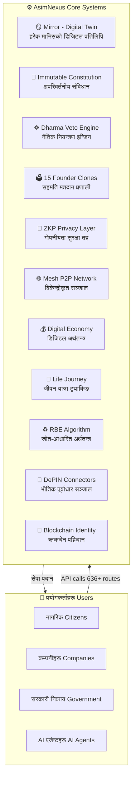
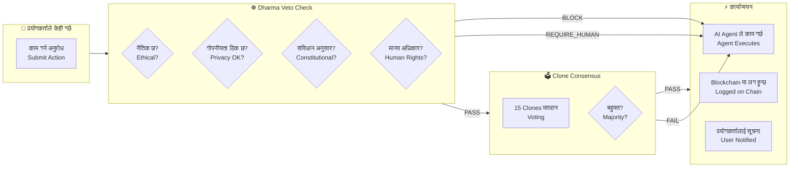
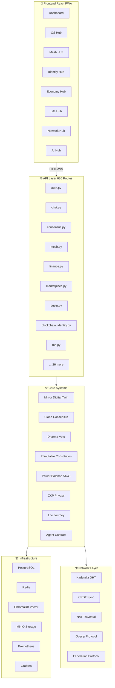

# AsimNexus — पूर्ण अवलोकन र अर्को चरणको योजना

> **AsimNexus** = "असीम" (सीमा नभएको) + "Nexus" (जडान बिन्दु) = **असीम जडान प्रणाली**

---

## 1. AsimNexus के हो?

**AsimNexus** एउटा **Universal AI Operating System** हो — जसले मानिस, सरकार, कम्पनी, र AI एजेन्टहरू सबैलाई एउटै संवैधानिक प्रणालीमा जोड्छ।

यो केवल एउटा सफ्टवेर मात्र होइन — यो एउटा **डिजिटल राष्ट्र** हो जहाँ:
- हरेक मानिसको **डिजिटल ट्विन** (Mirror) हुन्छ
- हरेक निर्णय **Dharma Veto Engine** बाट पास हुनुपर्छ
- हरेक कुरा **ZKP Privacy Layer** द्वारा सुरक्षित हुन्छ
- शक्ति सन्तुलन **51% जनता / 49% निजी** को संवैधानिक नियमले नियन्त्रित हुन्छ

---

## 2. Stakeholders — कोही कोही छन्?

### 2.1 प्रयोगकर्ता (Users) — नागरिक
- आफ्नो **Digital Twin** बनाउँछन्
- **Clone Consensus** मार्फत मतदान गर्छन्
- **Life Journey** ट्र्याक गर्छन् (जन्म → शिक्षा → काम → परिवार → अवकाश → सम्पत्ति)
- **Wallet** मार्फत कारोबार गर्छन्
- **ZKP** प्रयोग गरेर गोपनीयता सुरक्षित राख्छन्

### 2.2 सरकार (Government)
- **Nepal Government Integration** — कर, SMS, नीति
- **Country Packs** — नेपाल, भारत, अमेरिका, EU को लागि छुट्टाछुट्टै नीति
- **Power Balance Constitution** — 51% जनता / 49% निजी सन्तुलन
- **e-Residency** — डिजिटल नागरिकता

### 2.3 कम्पनीहरू (Companies)
- **Marketplace** — सेवा खरिद/बिक्री
- **Agent Contracts** — AI एजेन्टहरूसँग सम्झौता
- **Reputation System** — विश्वसनीयता स्कोर
- **Token Bridge** — SVT टोकन कारोबार

### 2.4 AI एजेन्टहरू (AI Agents)
- **15 Founder Clones** — मतदान गर्ने AI प्रतिनिधिहरू
- **Sector Agents** — बैंकिङ, शिक्षा, स्वास्थ्य, पर्यटन, कृषि
- **Agent Contracts** — समय-सीमित अधिकार सम्झौता

---

## 3. सबै कसरी मिलेर काम गर्छन्?

### 3.1 Step-by-step कार्यप्रवाह (Workflow)

1. **प्रयोगकर्ताले अनुरोध पठाउँछ** — Frontend (React) बाट API मार्फत
2. **Auth Middleware** ले JWT टोकन जाँच गर्छ
3. **Dharma Veto Engine** ले जाँच गर्छ:
   - के यो कार्य नैतिक छ? (BLOCKED_PATTERNS)
   - के यसले मानव अधिकार उल्लङ्घन गर्छ?
   - के गोपनीयता सुरक्षित छ?
   - के यो संविधान अनुसार छ?
4. **Power Balance Constitution** ले जाँच गर्छ:
   - के यसले 51/49 सन्तुलन बिगार्छ?
5. **Clone Consensus** (आवश्यक भएमा):
   - 15 Founder Clones मतदान गर्छन्
   - बहुमत चाहिन्छ
6. **कार्यान्वयन**:
   - AI Agent ले काम गर्छ
   - सबै कारबाही audit log मा रेकर्ड हुन्छ
   - Blockchain मा प्रमाणित हुन्छ

---

## 4. Core Systems — मुख्य प्रणालीहरू

| System | File | के गर्छ? |
|--------|------|----------|
| 🪞 **Mirror** | [`core/mirror/`](core/mirror/) | मानिसको डिजिटल ट्विन — consciousness, dreaming, memory |
| ☸️ **Dharma Veto** | [`core/dharma_chakra/veto_engine.py`](core/dharma_chakra/veto_engine.py) | नैतिक नियन्त्रण — हरेक AI कार्य जाँच गर्छ |
| 📜 **Immutable Constitution** | [`core/security/immutable_constitution.py`](core/security/immutable_constitution.py) | अपरिवर्तनीय संविधान — cryptographic hash |
| ⚖️ **Power Balance** | [`core/security/power_balance_constitution.py`](core/security/power_balance_constitution.py) | 51% जनता / 49% निजी सन्तुलन |
| 🗳️ **Clone Consensus** | [`core/consensus/`](core/consensus/) | 15 Founder Clones मतदान |
| 🔐 **ZKP Privacy** | [`core/security/zkp.py`](core/security/zkp.py) | Zero-Knowledge Proof गोपनीयता |
| 🌐 **Mesh Network** | [`core/mesh/`](core/mesh/) | P2P विकेन्द्रीकृत सञ्जाल |
| 💰 **Economy** | [`core/economy/`](core/economy/) | Wallet, Marketplace, Staking, Token Bridge |
| 🌱 **Life Journey** | [`core/life_journey.py`](core/life_journey.py) | 6 चरणको जीवन यात्रा |
| 📡 **DePIN** | [`core/depin/`](core/depin/) | Uplink, Daylight, DIMO connectors |
| 🔗 **Blockchain ID** | [`core/blockchain_identity_advanced.py`](core/blockchain_identity_advanced.py) | DID, VC, SBT, ZKP |
| ♻️ **RBE** | [`core/world/economy/rbe_algorithm.py`](core/world/economy/rbe_algorithm.py) | Resource-Based Economy algorithm |
| 🤝 **Agent Contract** | [`core/agent_contract.py`](core/agent_contract.py) | AI एजेन्ट सम्झौता प्रणाली |

---

## 5. API Routes — 636 वटा API मार्गहरू

| Module | Routes | Purpose |
|--------|--------|---------|
| [`routes/auth.py`](routes/auth.py) | 18 | Login, register, teams, permissions |
| [`routes/chat.py`](routes/chat.py) | 16 | Chat, brain, agent sessions |
| [`routes/consensus.py`](routes/consensus.py) | 18 | Voting, dharma, evolution, PQ |
| [`routes/mesh.py`](routes/mesh.py) | 25 | P2P network, federation |
| [`routes/finance.py`](routes/finance.py) | 22 | Wallet, transactions, staking |
| [`routes/marketplace.py`](routes/marketplace.py) | 30 | Marketplace, reputation, task-bus |
| [`routes/depin.py`](routes/depin.py) | 25 | Uplink, Daylight, DIMO |
| [`routes/blockchain_identity.py`](routes/blockchain_identity.py) | 12 | DID, VC, SBT, ZKP |
| [`routes/rbe.py`](routes/rbe.py) | 7 | Resource management, allocation |
| ... 26 more modules | 463 | Various services |

---

## 6. अब के गर्न बाँकी छ? (Next Steps)

### Current Status: ✅ Phase 12 Complete — All Consolidation Done

अबको मुख्य काम **Production Release** को लागि तयारी हो:

### Phase 13: Production Hardening

| # | Task | File | Priority |
|---|------|------|----------|
| 13.1 | **Docker Compose** ठिक गर्ने — backend + frontend + postgres + redis | [`infrastructure/docker/`](infrastructure/docker/) | P0 |
| 13.2 | **Environment variables** — सबै config लाई env मा लैजाने | `.env` template | P0 |
| 13.3 | **Database migrations** — SQLite बाट PostgreSQL मा सार्ने | [`database/migrations/`](database/migrations/) | P0 |
| 13.4 | **CORS/security headers** ठिक गर्ने | [`app.py`](app.py) | P0 |
| 13.5 | **Rate limiting** थप्ने | [`core/security/`](core/security/) | P1 |
| 13.6 | **Logging** सुधार गर्ने — structured JSON logs | [`app.py`](app.py) | P1 |
| 13.7 | **Monitoring** — Prometheus + Grafana dashboards | [`monitoring/`](monitoring/) | P1 |
| 13.8 | **CI/CD pipeline** — GitHub Actions | `.github/` | P1 |

### Phase 14: Testing & Quality

| # | Task | Priority |
|---|------|----------|
| 14.1 | सबै integration tests चलाउने — 470+ tests | P0 |
| 14.2 | सबै real tests चलाउने — 88 tests | P0 |
| 14.3 | सबै E2E tests चलाउने — 28 tests | P0 |
| 14.4 | Performance benchmarks | P2 |
| 14.5 | Security audit | P1 |

### Phase 15: Feature Completion

| # | Task | File | Priority |
|---|------|------|----------|
| 15.1 | **Frontend** लाई सबै API सँग जोड्ने | [`frontend/src/api/asimnexus.ts`](frontend/src/api/asimnexus.ts) | P1 |
| 15.2 | **WebSocket** real-time updates | [`routes/`](routes/) | P1 |
| 15.3 | **Mobile app** (React Native) | [`frontend/mobile/`](frontend/mobile/) | P2 |
| 15.4 | **Electron desktop app** | [`frontend/electron/`](frontend/electron/) | P2 |
| 15.5 | **PWA** offline support | [`frontend/public/service-worker.js`](frontend/public/service-worker.js) | P1 |

### Phase 16: Nepal Deployment

| # | Task | Priority |
|---|------|----------|
| 16.1 | **Nepal Government Integration** — tax LLM, SMS gateway | P1 |
| 16.2 | **Nepali language support** — NLP models | P1 |
| 16.3 | **Local hosting** — Nepal-based servers | P2 |
| 16.4 | **Compliance** — Nepal IT Act, Privacy Act | P1 |

---

## 7. Architecture Diagram — पूर्ण प्रणाली

---

## 8. तपाईंको भूमिका — अब के गर्ने?

तपाईंले चाहेको काम अनुसार, म यी मध्ये कुनै पनि गर्न सक्छु:

1. **Phase 13** — Production Hardening (Docker, env, DB migration)
2. **Phase 14** — Testing (सबै tests चलाउने, failures fix गर्ने)
3. **Phase 15** — Feature Completion (Frontend, WebSocket, Mobile)
4. **Phase 16** — Nepal Deployment (Government integration, NLP)
5. **नयाँ Feature** — तपाईंले चाहेको कुनै पनि नयाँ सुविधा

**कृपया भन्नुहोस् — अब कुन Phase बाट सुरु गर्ने?**
