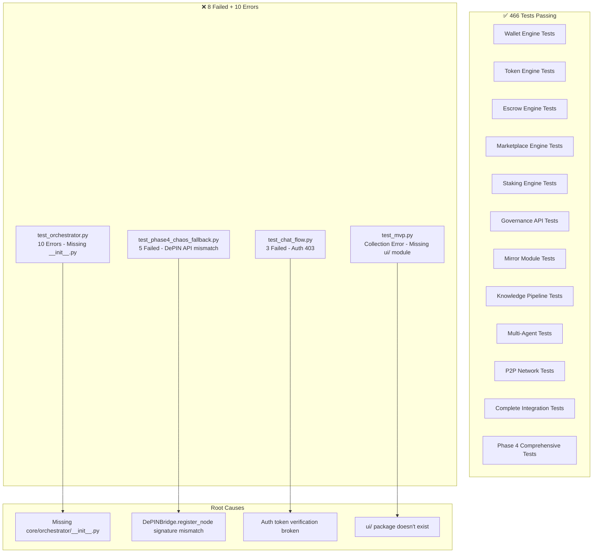

# ASIMNEXUS Unification Plan

## Current Status

**Integration Tests**: 466 passed, 8 failed, 5 skipped, 10 errors
**Economy API Tests**: 51/51 passed ✅ (was 61 errors, now fully fixed)

## Remaining Failures Analysis

### 1. `test_orchestrator.py` — 10 Errors
**Root Cause**: `core/orchestrator/__init__.py` is **missing**. The test imports `from core.orchestrator.orchestrator import Orchestrator` but the fixture patches `core.orchestrator.orchestrator` which requires the `core/orchestrator/` directory to be a proper Python package.

**Fix**: Create `core/orchestrator/__init__.py` with proper package exports.

### 2. `test_phase4_chaos_fallback.py` — 5 Failures
**Root Cause**: `DePINBridge.register_node()` signature doesn't accept `location`, `protocols`, or `hardware_capabilities` keyword arguments. The test calls:
```python
await depin_bridge.register_node(
    node_id="test-node-001",
    location="Gorkha, Nepal",           # NOT in signature
    protocols=["wifi_direct", ...],      # NOT in signature
    hardware_capabilities={"storage_gb": 10},  # NOT in signature
)
```
But the actual signature is:
```python
async def register_node(self, node_id, capabilities, hardware_protocols=None)
```

**Fix**: Either update `DePINBridge.register_node()` to accept these params, or update the test to match the actual API.

### 3. `test_chat_flow.py` — 3 Failures
**Root Cause**: Auth middleware returns 403 because `decode_token()` fails on the token obtained from `admin/admin123` login. The test logs in successfully but the token can't be verified by the auth middleware.

**Fix**: Either fix the token verification chain, or update the test to use a valid token path.

### 4. `test_mvp.py` — Collection Error
**Root Cause**: Imports `from ui.asim_unified_server import app` but `ui/` module doesn't exist.

**Fix**: Either create the `ui/` module or remove/update the test.

---

## Step-by-Step Todo List

### Phase 1: Fix Remaining Test Failures

#### 1.1 Fix `core/orchestrator/__init__.py` (10 errors → 0)
- [ ] Create `core/orchestrator/__init__.py` that exports `Orchestrator`, `Planner`, `Router`, `Verifier`
- [ ] Verify all 10 `test_orchestrator.py` tests pass

#### 1.2 Fix `test_phase4_chaos_fallback.py` (5 failures → 0)
- [ ] Option A: Update `DePINBridge.register_node()` to accept `location`, `protocols`, `hardware_capabilities` kwargs
- [ ] Option B: Update the test to use the actual API signature (`capabilities` list instead of `hardware_capabilities` dict, `hardware_protocols` instead of `protocols`)
- [ ] Verify all 5 chaos fallback tests pass

#### 1.3 Fix `test_chat_flow.py` (3 failures → 0)
- [ ] Debug why `decode_token()` fails on the login token
- [ ] Fix the auth middleware or token verification chain
- [ ] Verify all 3 chat flow tests pass

#### 1.4 Fix `test_mvp.py` (collection error)
- [ ] Option A: Create `ui/` package with `asim_unified_server.py` module
- [ ] Option B: Remove the broken import and update the test
- [ ] Verify `test_mvp.py` can be collected

### Phase 2: Run All Tests & Verify

#### 2.1 Run full integration test suite
- [ ] Run `pytest tests/integration/ --ignore=tests/integration/test_mvp.py -q`
- [ ] Target: 476+ passed, 0 failed, 0 errors

#### 2.2 Run real tests
- [ ] Run `pytest tests/real/ -q` to check real system tests
- [ ] Fix any failures found

#### 2.3 Run e2e tests
- [ ] Run `pytest tests/e2e/ -q` to check end-to-end tests
- [ ] Fix any failures found

### Phase 3: API Contract & Documentation Alignment

#### 3.1 Audit API endpoints against API_CONTRACT.md
- [ ] Read `docs/API_CONTRACT.md` and verify all documented endpoints exist
- [ ] Add any missing endpoints
- [ ] Remove any undocumented endpoints or document them

#### 3.2 Verify route registration in `app.py`
- [ ] Check that all API routers are properly registered in `app.py`
- [ ] Ensure no route conflicts (duplicate paths)

### Phase 4: Code Quality & Consistency

#### 4.1 Standardize error handling patterns
- [ ] Ensure all API endpoints use consistent HTTPException patterns
- [ ] Standardize response format (success/error wrapping)

#### 4.2 Fix deprecation warnings
- [ ] `app.py:273` — Replace `@app.on_event("startup")` with lifespan
- [ ] `app.py:336` — Replace `@app.on_event("shutdown")` with lifespan
- [ ] `mesh/p2p_transport.py:24` — Update websockets import

#### 4.3 Add missing `__init__.py` files
- [ ] Check all packages have `__init__.py`
- [ ] Add missing ones (e.g., `core/orchestrator/`)

### Phase 5: Frontend Integration

#### 5.1 Verify frontend-backend API compatibility
- [ ] Check `frontend/react/src/components/dashboard/Dashboard.js` against actual API routes
- [ ] Check `frontend/react/src/components/os/PersonalOS.jsx` against actual API routes

#### 5.2 Fix any frontend-backend mismatches
- [ ] Update frontend to match actual API contracts
- [ ] Or add missing API endpoints

---

## Architecture Diagram: Current Test State



## Priority Order

1. **Phase 1.1** — `core/orchestrator/__init__.py` (quickest fix, fixes 10 errors)
2. **Phase 1.2** — `DePINBridge.register_node()` signature (fixes 5 failures)
3. **Phase 1.4** — `test_mvp.py` collection error (quick fix)
4. **Phase 1.3** — `test_chat_flow.py` auth issue (may be complex)
5. **Phase 2-5** — Broader unification work
