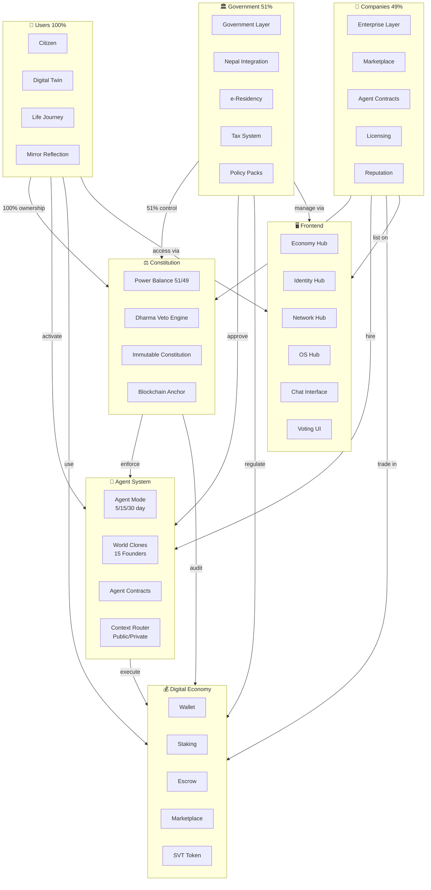
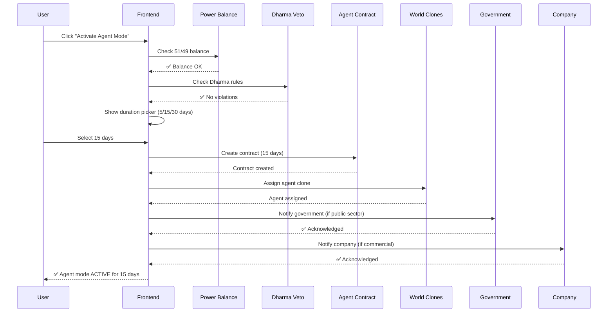
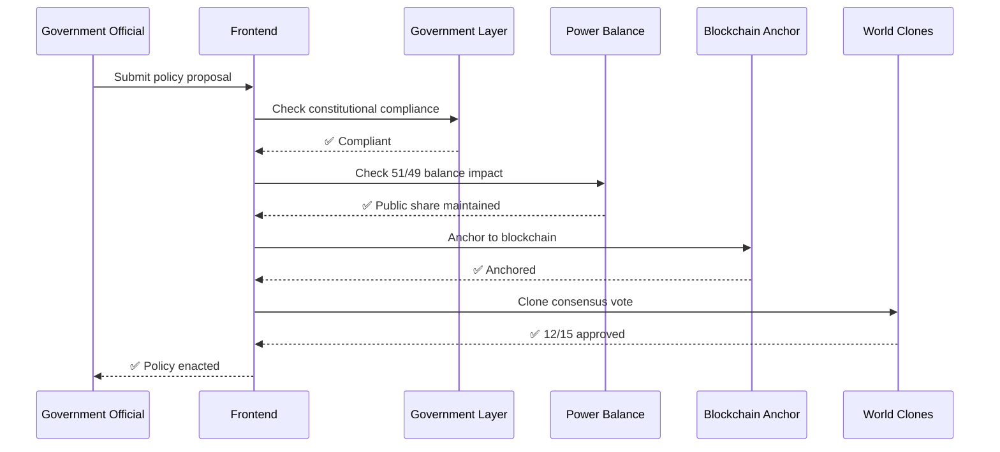
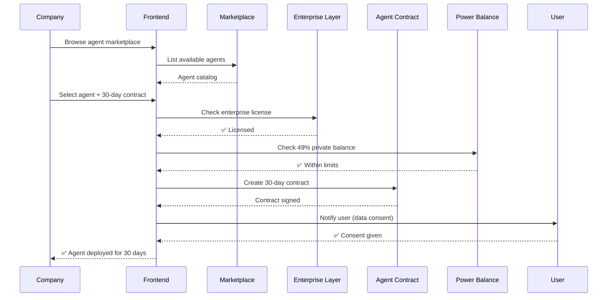

# Phase 18: Digital Nepal Governance — User × Government × Company Ecosystem

> **Goal:** Connect all three stakeholders (Users, Government, Companies) into one unified digital ecosystem where they work together through AsimNexus with proper governance (51/49), agent modes (5/15/30 day), and public/private modes.

---

## Current State Assessment

The codebase already has **all the building blocks**. What's missing is the **integration layer** that connects them together into a seamless workflow.

### ✅ What Already Exists

| Component | File | Status |
|-----------|------|--------|
| **Power Balance Constitution** (51/49) | [`core/security/power_balance_constitution.py`](core/security/power_balance_constitution.py) | ✅ 727 lines — full implementation |
| **Government Layer** (51% public) | [`core/governance/government_layer.py`](core/governance/government_layer.py) | ✅ 260 lines — veto, audit, constitutional |
| **Enterprise Layer** (49% private) | [`core/governance/enterprise_layer.py`](core/governance/enterprise_layer.py) | ✅ 241 lines — licensing, compliance |
| **Agent Contract System** (5/15/30 day) | [`core/agent_contract.py`](core/agent_contract.py) | ✅ 1155 lines — full contract lifecycle |
| **Dharma Veto Engine** | [`core/dharma_chakra/veto_engine.py`](core/dharma_chakra/veto_engine.py) | ✅ 429 lines — 6 immutable rules |
| **Agent Mode toggle** | [`routes/memory.py`](routes/memory.py) | ✅ `/api/agent/mode/on` + `/api/agent/mode/off` |
| **World Clones** (agent system) | [`core/founder_clones/world_clones.py`](core/founder_clones/world_clones.py) | ✅ Agent mode, 5/15/30 day cycles |
| **Nepal Government Routes** | [`routes/nepal.py`](routes/nepal.py) | ✅ 131 lines — status, ministries, provinces |
| **Government Routes** | [`routes/government.py`](routes/government.py) | ✅ e-Residency, tax, identity |
| **Finance Routes** | [`routes/finance.py`](routes/finance.py) | ✅ Wallet, staking, escrow, marketplace |
| **Consensus Routes** | [`routes/consensus.py`](routes/consensus.py) | ✅ Voting, Dharma, evolution |
| **Frontend Economy Hub** | [`frontend/src/components/pages/EconomyHub.tsx`](frontend/src/components/pages/EconomyHub.tsx) | ✅ Economy dashboard |
| **Frontend Identity Hub** | [`frontend/src/components/pages/IdentityHub.tsx`](frontend/src/components/pages/IdentityHub.tsx) | ✅ Identity management |
| **Frontend Consensus UI** | [`frontend/src/components/consensus/`](frontend/src/components/consensus/) | ✅ CloneVotingCard, CloneStatus, DharmaVetoPanel |
| **Frontend Marketplace** | [`frontend/src/components/marketplace/`](frontend/src/components/marketplace/) | ✅ 7 marketplace panels |
| **Frontend Confirmation UI** | [`frontend/src/components/confirmation/`](frontend/src/components/confirmation/) | ✅ Level1OTP, Level2MFA, Level3HSM |
| **Context Router** (mode system) | [`core/context_router.py`](core/context_router.py) | ✅ Mode-based agent routing |
| **Contract Executor** | [`core/economy/contract_executor.py`](core/economy/contract_executor.py) | ✅ 5/15/30 day contracts |
| **Nepal Cultural Features** | [`core/nepal/cultural_features.py`](core/nepal/cultural_features.py) | ✅ Festivals, language, regions |
| **Nepal Banking** | [`core/nepal/banking_integrations.py`](core/nepal/banking_integrations.py) | ✅ Banking API integration |
| **Nepal Tax LLM** | [`core/nepal/tax_llm.py`](core/nepal/tax_llm.py) | ✅ Tax calculation engine |
| **Nepal Telecom** | [`core/nepal/telecom_integrations.py`](core/nepal/telecom_integrations.py) | ✅ SMS/USSD gateway |
| **Nepali ASR** | [`models/nepal/whisper_finetune.py`](models/nepal/whisper_finetune.py) | ✅ Nepali speech recognition |
| **Governance Clone Bridge** | [`core/governance/governance_clone_bridge.py`](core/governance/governance_clone_bridge.py) | ✅ Bridge between governance and clones |
| **Cross-Border Compliance** | [`core/governance/cross_border_compliance.py`](core/governance/cross_border_compliance.py) | ✅ Cross-jurisdiction rules |
| **Blockchain Constitution Anchor** | [`core/governance/blockchain_constitution_anchor.py`](core/governance/blockchain_constitution_anchor.py) | ✅ On-chain constitution anchoring |
| **Compliance Engine** | [`core/compliance_engine.py`](core/compliance_engine.py) | ✅ Compliance checking |
| **API Endpoints** | [`core/api_endpoints/governance_api.py`](core/api_endpoints/governance_api.py) | ✅ Governance API |
| **API Endpoints** | [`core/api_endpoints/hardening_api.py`](core/api_endpoints/hardening_api.py) | ✅ Hardening API with power balance |

---

## Architecture — How Everything Connects



---

## Workflow: How Stakeholders Work Together

### Flow 1: User activates Agent Mode (5/15/30 days)



### Flow 2: Government approves policy via 51% control



### Flow 3: Company hires AI Agent via Marketplace



---

## What Needs to Be Built — Phase 18 Todos

### 18.1: Governance Dashboard (Frontend)

**What:** A single dashboard where Government officials can see the 51% public control, approve policies, veto actions, and monitor the system.

**Files to create/modify:**
- [`frontend/src/components/governance/GovernmentDashboard.tsx`](frontend/src/components/governance/GovernmentDashboard.tsx) — NEW: Main government dashboard
- [`frontend/src/components/governance/PolicyApprovalPanel.tsx`](frontend/src/components/governance/PolicyApprovalPanel.tsx) — NEW: Policy approval workflow
- [`frontend/src/components/governance/BalanceMonitor.tsx`](frontend/src/components/governance/BalanceMonitor.tsx) — NEW: 51/49 balance visualization
- [`frontend/src/components/governance/VetoPanel.tsx`](frontend/src/components/governance/VetoPanel.tsx) — NEW: Veto management
- [`frontend/src/api/asimnexus.ts`](frontend/src/api/asimnexus.ts) — MODIFY: Add governance API methods

**API routes needed:**
- `GET /api/governance/balance` — Current 51/49 balance per sector
- `GET /api/governance/policies` — List policies
- `POST /api/governance/policy/approve` — Approve policy
- `POST /api/governance/veto` — Veto an action
- `GET /api/governance/audit` — Audit log

### 18.2: Enterprise Dashboard (Frontend)

**What:** A dashboard where Companies can manage licenses, hire agents, list services, and track compliance.

**Files to create/modify:**
- [`frontend/src/components/enterprise/EnterpriseDashboard.tsx`](frontend/src/components/enterprise/EnterpriseDashboard.tsx) — NEW: Main enterprise dashboard
- [`frontend/src/components/enterprise/LicenseManager.tsx`](frontend/src/components/enterprise/LicenseManager.tsx) — NEW: License management
- [`frontend/src/components/enterprise/AgentHiringPanel.tsx`](frontend/src/components/enterprise/AgentHiringPanel.tsx) — NEW: Hire AI agents
- [`frontend/src/components/enterprise/CompliancePanel.tsx`](frontend/src/components/enterprise/CompliancePanel.tsx) — NEW: Compliance status

**API routes needed:**
- `GET /api/enterprise/license` — Get license info
- `POST /api/enterprise/license/register` — Register license
- `GET /api/enterprise/compliance` — Compliance status
- `POST /api/enterprise/agent/hire` — Hire agent via contract

### 18.3: Agent Mode UI (Frontend)

**What:** A user-friendly interface for activating agent mode with 5/15/30 day options, public/private mode selection, and real-time status.

**Files to create/modify:**
- [`frontend/src/components/agent/AgentModeActivator.tsx`](frontend/src/components/agent/AgentModeActivator.tsx) — NEW: Agent mode toggle with duration picker
- [`frontend/src/components/agent/AgentStatusPanel.tsx`](frontend/src/components/agent/AgentStatusPanel.tsx) — NEW: Active agent status
- [`frontend/src/components/agent/ContractTimeline.tsx`](frontend/src/components/agent/ContractTimeline.tsx) — NEW: Contract lifecycle visualization
- [`frontend/src/components/agent/ModeSelector.tsx`](frontend/src/components/agent/ModeSelector.tsx) — NEW: Public/Private mode selector

**API routes needed:**
- `POST /api/agent/mode/on` — ✅ Already exists in [`routes/memory.py`](routes/memory.py)
- `POST /api/agent/mode/off` — ✅ Already exists
- `GET /api/agent/status` — Get agent status
- `POST /api/agent/contract/create` — Create agent contract
- `GET /api/agent/contracts` — List user's contracts
- `POST /api/agent/mode/public` — Switch to public mode
- `POST /api/agent/mode/private` — Switch to private mode

### 18.4: Stakeholder Integration Layer (Backend)

**What:** A new backend module that coordinates all three stakeholders — ensuring government 51%, company 49%, and user 100% work together.

**Files to create/modify:**
- [`core/governance/stakeholder_coordinator.py`](core/governance/stakeholder_coordinator.py) — NEW: Coordinates User × Government × Company interactions
- [`routes/governance.py`](routes/governance.py) — MODIFY: Add stakeholder coordination endpoints
- [`routes/enterprise.py`](routes/enterprise.py) — NEW: Enterprise API routes

**StakeholderCoordinator responsibilities:**
1. When User activates agent mode → check Power Balance → notify Government (if public) or Company (if private)
2. When Government approves policy → update Power Balance → notify affected Companies
3. When Company hires agent → check Enterprise License → check Power Balance → create Agent Contract → notify User
4. When User gives consent → update all stakeholders → log to blockchain anchor

### 18.5: Digital Nepal Integration (Frontend + Backend)

**What:** Connect Nepal-specific features (government, banking, tax, telecom, language) into the stakeholder ecosystem.

**Files to create/modify:**
- [`frontend/src/components/nepal/NepalDashboard.tsx`](frontend/src/components/nepal/NepalDashboard.tsx) — NEW: Nepal-specific dashboard
- [`frontend/src/components/nepal/EResidencyFlow.tsx`](frontend/src/components/nepal/EResidencyFlow.tsx) — NEW: e-Residency application UI
- [`frontend/src/components/nepal/TaxFilingPanel.tsx`](frontend/src/components/nepal/TaxFilingPanel.tsx) — NEW: Tax filing UI
- [`frontend/src/components/nepal/NepaliLanguageSelector.tsx`](frontend/src/components/nepal/NepaliLanguageSelector.tsx) — NEW: Nepali language toggle

**API routes needed:**
- `GET /api/nepal/status` — ✅ Already exists
- `GET /api/nepal/ministries` — ✅ Already exists
- `GET /api/nepal/provinces` — ✅ Already exists
- `POST /api/nepal/eresidency/apply` — ✅ Already exists
- `POST /api/nepal/tax/file` — File tax return
- `GET /api/nepal/tax/status` — Tax filing status

### 18.6: Unified Chat Interface (Frontend)

**What:** A chat interface where users can do everything — activate agent mode, interact with government, hire companies, manage contracts — all through natural language.

**Files to create/modify:**
- [`frontend/src/components/chat/GovernanceChat.tsx`](frontend/src/components/chat/GovernanceChat.tsx) — NEW: Governance-aware chat
- [`frontend/src/services/GovernanceChatService.ts`](frontend/src/services/GovernanceChatService.ts) — NEW: Chat service with governance context

**Chat commands:**
- "Activate agent mode for 15 days" → Creates contract, assigns clone
- "Apply for e-Residency" → Opens e-Residency flow
- "Hire an agent for my company" → Opens hiring flow
- "Show my contract status" → Shows active contracts
- "File my taxes" → Opens tax filing
- "Switch to public mode" → Changes mode

### 18.7: Mobile Governance Screens (React Native)

**What:** Add governance, enterprise, and agent mode screens to the React Native mobile app.

**Files to create/modify:**
- [`frontend/mobile/src/screens/GovernanceScreen.tsx`](frontend/mobile/src/screens/GovernanceScreen.tsx) — NEW: Governance dashboard
- [`frontend/mobile/src/screens/AgentModeScreen.tsx`](frontend/mobile/src/screens/AgentModeScreen.tsx) — NEW: Agent mode management
- [`frontend/mobile/src/screens/NepalScreen.tsx`](frontend/mobile/src/screens/NepalScreen.tsx) — NEW: Nepal services
- [`frontend/mobile/src/App.tsx`](frontend/mobile/src/App.tsx) — MODIFY: Add new tabs

### 18.8: Integration Tests

**What:** Tests that verify the complete stakeholder workflow.

**Files to create/modify:**
- [`tests/integration/test_stakeholder_workflow.py`](tests/integration/test_stakeholder_workflow.py) — NEW: Full stakeholder workflow test
- [`tests/integration/test_governance_api.py`](tests/integration/test_governance_api.py) — MODIFY: Add governance API tests

**Test scenarios:**
1. User activates agent mode → Government notified → Company can hire
2. Government approves policy → Balance updated → Companies see change
3. Company hires agent → Contract created → User gives consent → Agent deployed
4. User files taxes → Government receives → Company tax records updated
5. Full lifecycle: Register → Activate agent → Create contract → Complete → Audit

---

## Execution Order

```
Phase 18.1  Government Dashboard (Frontend)
Phase 18.2  Enterprise Dashboard (Frontend)
Phase 18.3  Agent Mode UI (Frontend)
Phase 18.4  Stakeholder Integration Layer (Backend)
Phase 18.5  Digital Nepal Integration (Frontend + Backend)
Phase 18.6  Unified Chat Interface (Frontend)
Phase 18.7  Mobile Governance Screens (React Native)
Phase 18.8  Integration Tests
```

---

## Detailed Todo Checklist

### 18.1: Government Dashboard
- [ ] Create [`frontend/src/components/governance/GovernmentDashboard.tsx`](frontend/src/components/governance/GovernmentDashboard.tsx)
- [ ] Create [`frontend/src/components/governance/PolicyApprovalPanel.tsx`](frontend/src/components/governance/PolicyApprovalPanel.tsx)
- [ ] Create [`frontend/src/components/governance/BalanceMonitor.tsx`](frontend/src/components/governance/BalanceMonitor.tsx)
- [ ] Create [`frontend/src/components/governance/VetoPanel.tsx`](frontend/src/components/governance/VetoPanel.tsx)
- [ ] Add governance API methods to [`frontend/src/api/asimnexus.ts`](frontend/src/api/asimnexus.ts)
- [ ] Add governance API routes to [`routes/governance.py`](routes/governance.py)

### 18.2: Enterprise Dashboard
- [ ] Create [`frontend/src/components/enterprise/EnterpriseDashboard.tsx`](frontend/src/components/enterprise/EnterpriseDashboard.tsx)
- [ ] Create [`frontend/src/components/enterprise/LicenseManager.tsx`](frontend/src/components/enterprise/LicenseManager.tsx)
- [ ] Create [`frontend/src/components/enterprise/AgentHiringPanel.tsx`](frontend/src/components/enterprise/AgentHiringPanel.tsx)
- [ ] Create [`frontend/src/components/enterprise/CompliancePanel.tsx`](frontend/src/components/enterprise/CompliancePanel.tsx)
- [ ] Create [`routes/enterprise.py`](routes/enterprise.py) with enterprise API routes

### 18.3: Agent Mode UI
- [ ] Create [`frontend/src/components/agent/AgentModeActivator.tsx`](frontend/src/components/agent/AgentModeActivator.tsx)
- [ ] Create [`frontend/src/components/agent/AgentStatusPanel.tsx`](frontend/src/components/agent/AgentStatusPanel.tsx)
- [ ] Create [`frontend/src/components/agent/ContractTimeline.tsx`](frontend/src/components/agent/ContractTimeline.tsx)
- [ ] Create [`frontend/src/components/agent/ModeSelector.tsx`](frontend/src/components/agent/ModeSelector.tsx)
- [ ] Add agent mode API routes to [`routes/memory.py`](routes/memory.py) or new [`routes/agent.py`](routes/agent.py)

### 18.4: Stakeholder Integration Layer
- [ ] Create [`core/governance/stakeholder_coordinator.py`](core/governance/stakeholder_coordinator.py)
- [ ] Modify [`routes/governance.py`](routes/governance.py) with stakeholder endpoints
- [ ] Create [`routes/enterprise.py`](routes/enterprise.py) with enterprise endpoints

### 18.5: Digital Nepal Integration
- [ ] Create [`frontend/src/components/nepal/NepalDashboard.tsx`](frontend/src/components/nepal/NepalDashboard.tsx)
- [ ] Create [`frontend/src/components/nepal/EResidencyFlow.tsx`](frontend/src/components/nepal/EResidencyFlow.tsx)
- [ ] Create [`frontend/src/components/nepal/TaxFilingPanel.tsx`](frontend/src/components/nepal/TaxFilingPanel.tsx)
- [ ] Create [`frontend/src/components/nepal/NepaliLanguageSelector.tsx`](frontend/src/components/nepal/NepaliLanguageSelector.tsx)
- [ ] Add Nepal tax/banking API routes to [`routes/nepal.py`](routes/nepal.py)

### 18.6: Unified Chat Interface
- [ ] Create [`frontend/src/components/chat/GovernanceChat.tsx`](frontend/src/components/chat/GovernanceChat.tsx)
- [ ] Create [`frontend/src/services/GovernanceChatService.ts`](frontend/src/services/GovernanceChatService.ts)

### 18.7: Mobile Governance Screens
- [ ] Create [`frontend/mobile/src/screens/GovernanceScreen.tsx`](frontend/mobile/src/screens/GovernanceScreen.tsx)
- [ ] Create [`frontend/mobile/src/screens/AgentModeScreen.tsx`](frontend/mobile/src/screens/AgentModeScreen.tsx)
- [ ] Create [`frontend/mobile/src/screens/NepalScreen.tsx`](frontend/mobile/src/screens/NepalScreen.tsx)
- [ ] Modify [`frontend/mobile/src/App.tsx`](frontend/mobile/src/App.tsx) with new tabs

### 18.8: Integration Tests
- [ ] Create [`tests/integration/test_stakeholder_workflow.py`](tests/integration/test_stakeholder_workflow.py)
- [ ] Add governance API tests to [`tests/integration/test_governance_api.py`](tests/integration/test_governance_api.py)
