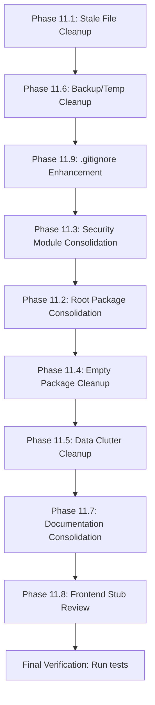

# Phase 11: Remaining Consolidation & Cleanup

## Overview

After completing Phases 1-10 (comprehensive audit, consolidation, security hardening, performance optimization, and self-building loop enhancement), this phase addresses the remaining structural issues identified in the final codebase audit.

---

## Phase 11.1: Root-Level Stale File Cleanup

**Files to remove (non-essential runtime artifacts):**

| File | Reason |
|------|--------|
| [`_stats.py`](_stats.py) | One-off project statistics script, not part of the application |
| [`stats_output.txt`](stats_output.txt) | Output of `_stats.py`, stale snapshot |
| [`server.log`](server.log) | Runtime log file (755 lines), should be in `.gitignore` |
| [`.secrets.baseline`](.secrets.baseline) | Detect-secrets baseline, dev tool artifact |
| [`.gitleaks.toml`](.gitleaks.toml) | Gitleaks config, dev tool artifact |
| [`.pre-commit-config.yaml`](.pre-commit-config.yaml) | Pre-commit config, dev tool artifact |

**Action:** Delete these files. Add `server.log`, `*.log`, `stats_output.txt` to `.gitignore`.

---

## Phase 11.2: Root-Level Package Consolidation

Several packages exist at root level that have counterparts inside [`core/`](core/). These should be consolidated into [`core/`](core/) to maintain a unified package structure.

### 11.2.1: [`agents/`](agents/) → [`core/agents/`](core/agents/)

| Root File | Core Counterpart | Action |
|-----------|-----------------|--------|
| [`agents/agent_matching.py`](agents/agent_matching.py) | — | Move to `core/agents/agent_matching.py` |
| [`agents/code_agent.py`](agents/code_agent.py) | — | Move to `core/agents/code_agent.py` |
| [`agents/digital_twin.py`](agents/digital_twin.py) | [`core/agent/digital_twin.py`](core/agent/digital_twin.py) | Consolidate (note: `core/agent/` vs `core/agents/`) |
| [`agents/economy_agent.py`](agents/economy_agent.py) | — | Move to `core/agents/economy_agent.py` |
| [`agents/health_agent.py`](agents/health_agent.py) | [`core/agents/health_agent.py`](core/agents/health_agent.py) | Merge |
| [`agents/schedule_agent.py`](agents/schedule_agent.py) | — | Move to `core/agents/schedule_agent.py` |
| [`agents/unified_agent_system.py`](agents/unified_agent_system.py) | — | Move to `core/agents/unified_agent_system.py` |
| [`agents/infra/`](agents/infra/) | — | Move to `core/agents/infra/` |

**Note:** [`core/agent/`](core/agent/) (singular, has `digital_twin.py`) vs [`core/agents/`](core/agents/) (plural, has 7 agent files). Consolidate into `core/agents/` and remove `core/agent/`.

### 11.2.2: [`mesh/`](mesh/) → [`core/mesh/`](core/mesh/)

| Root File | Core Counterpart | Action |
|-----------|-----------------|--------|
| [`mesh/autodiscovery.py`](mesh/autodiscovery.py) | — | Move to `core/mesh/autodiscovery.py` |
| [`mesh/bootstrap.py`](mesh/bootstrap.py) | — | Move to `core/mesh/bootstrap.py` |
| [`mesh/crdt_sync.py`](mesh/crdt_sync.py) | [`core/mesh/crdt_sync.py`](core/mesh/crdt_sync.py) | Merge |
| [`mesh/device_registry.py`](mesh/device_registry.py) | — | Move to `core/mesh/device_registry.py` |
| [`mesh/hole_punching.py`](mesh/hole_punching.py) | — | Move to `core/mesh/hole_punching.py` |
| [`mesh/kademlia_dht.py`](mesh/kademlia_dht.py) | [`core/mesh/dht/kademlia.py`](core/mesh/dht/kademlia.py) | Consolidate |
| [`mesh/mesh_node.py`](mesh/mesh_node.py) | — | Move to `core/mesh/mesh_node.py` |
| [`mesh/mesh_routing_agent_v2.py`](mesh/mesh_routing_agent_v2.py) | — | Move to `core/mesh/mesh_routing_agent_v2.py` |
| [`mesh/multi_hop_router.py`](mesh/multi_hop_router.py) | — | Move to `core/mesh/multi_hop_router.py` |
| [`mesh/multi_mesh_router.py`](mesh/multi_mesh_router.py) | — | Move to `core/mesh/multi_mesh_router.py` |
| [`mesh/nat_traversal.py`](mesh/nat_traversal.py) | [`core/mesh/nat_traversal.py`](core/mesh/nat_traversal.py) | Merge |
| [`mesh/network_intelligence.py`](mesh/network_intelligence.py) | — | Move to `core/mesh/network_intelligence.py` |
| [`mesh/node_registry.py`](mesh/node_registry.py) | — | Move to `core/mesh/node_registry.py` |
| [`mesh/offline_sync_engine.py`](mesh/offline_sync_engine.py) | — | Move to `core/mesh/offline_sync_engine.py` |
| [`mesh/p2p_integration.py`](mesh/p2p_integration.py) | — | Move to `core/mesh/p2p_integration.py` |
| [`mesh/p2p_transport.py`](mesh/p2p_transport.py) | — | Move to `core/mesh/p2p_transport.py` |
| [`mesh/relay.py`](mesh/relay.py) | — | Move to `core/mesh/relay.py` |
| [`mesh/sms_gateway.py`](mesh/sms_gateway.py) | — | Move to `core/mesh/sms_gateway.py` |
| [`mesh/stun_turn.py`](mesh/stun_turn.py) | — | Move to `core/mesh/stun_turn.py` |
| [`mesh/api/routes/p2p.py`](mesh/api/routes/p2p.py) | — | Move to `core/mesh/api/routes/p2p.py` |
| [`mesh/hardware_drivers/`](mesh/hardware_drivers/) | — | Move to `core/mesh/hardware_drivers/` |

### 11.2.3: [`connectors/`](connectors/) → [`core/gateway/`](core/gateway/)

| Root File | Action |
|-----------|--------|
| [`connectors/base_llm_connector.py`](connectors/base_llm_connector.py) | Move to `core/gateway/base_llm_connector.py` |
| [`connectors/google_ecosystem.py`](connectors/google_ecosystem.py) | Move to `core/gateway/google_ecosystem.py` |
| [`connectors/local_llm_connector.py`](connectors/local_llm_connector.py) | Move to `core/gateway/local_llm_connector.py` |
| [`connectors/multiversal_bridge.py`](connectors/multiversal_bridge.py) | Move to `core/gateway/multiversal_bridge.py` |
| [`connectors/nepal_banking.py`](connectors/nepal_banking.py) | Move to `core/gateway/nepal_banking.py` |
| [`connectors/nexus_secure_connector.py`](connectors/nexus_secure_connector.py) | Move to `core/gateway/nexus_secure_connector.py` |
| [`connectors/openai_connector.py`](connectors/openai_connector.py) | Move to `core/gateway/openai_connector.py` |
| [`connectors/smart_model_router.py`](connectors/smart_model_router.py) | Move to `core/gateway/smart_model_router.py` |
| [`connectors/unified_gateway.py`](connectors/unified_gateway.py) | Move to `core/gateway/unified_gateway.py` |
| [`connectors/unified_llm_gateway.py`](connectors/unified_llm_gateway.py) | Move to `core/gateway/unified_llm_gateway.py` |
| [`connectors/unified_messaging_connector.py`](connectors/unified_messaging_connector.py) | Move to `core/gateway/unified_messaging_connector.py` |
| [`connectors/health/`](connectors/health/) | Move to `core/gateway/health/` |
| [`connectors/local/`](connectors/local/) | Move to `core/gateway/local/` |
| [`connectors/nepal/`](connectors/nepal/) | Move to `core/gateway/nepal/` |
| [`connectors/tourism/`](connectors/tourism/) | Move to `core/gateway/tourism/` |

### 11.2.4: [`compliance/`](compliance/) → [`core/compliance/`](core/compliance/)

| Root File | Action |
|-----------|--------|
| [`compliance/accessibility_compliance.py`](compliance/accessibility_compliance.py) | Move to `core/compliance/accessibility_compliance.py` |
| [`compliance/vapt_process.py`](compliance/vapt_process.py) | Move to `core/compliance/vapt_process.py` |
| [`compliance/VAPT_SECURITY_AUDIT.md`](compliance/VAPT_SECURITY_AUDIT.md) | Move to `docs/compliance/VAPT_SECURITY_AUDIT.md` |

### 11.2.5: [`os_control/`](os_control/) → [`core/orchestrator/`](core/orchestrator/)

| Root File | Action |
|-----------|--------|
| [`os_control/os_tool_executor.py`](os_control/os_tool_executor.py) | Move to `core/orchestrator/os_tool_executor.py` |
| [`os_control/tool_registry.py`](os_control/tool_registry.py) | Move to `core/orchestrator/tool_registry.py` |

### 11.2.6: [`governance/`](governance/) → [`core/governance/`](core/governance/)

Already partially consolidated (Phase 1.2D). Remaining files:

| Root File | Action |
|-----------|--------|
| [`governance/cross_border_compliance.py`](governance/cross_border_compliance.py) | Move to `core/governance/cross_border_compliance.py` |
| [`governance/cross_border.py`](governance/cross_border.py) | Move to `core/governance/cross_border.py` |
| [`governance/enterprise_layer.py`](governance/enterprise_layer.py) | Move to `core/governance/enterprise_layer.py` |
| [`governance/government_layer.py`](governance/government_layer.py) | Move to `core/governance/government_layer.py` |
| [`governance/jurisdiction_router.py`](governance/jurisdiction_router.py) | Move to `core/governance/jurisdiction_router.py` |
| [`governance/country_packs/`](governance/country_packs/) | Move to `core/governance/country_packs/` |

### 11.2.7: [`knowledge/`](knowledge/) → [`core/`](core/)

No `core/rag/` directory exists, so move to `core/knowledge/`:

| Root File | Action |
|-----------|--------|
| [`knowledge/rag_engine.py`](knowledge/rag_engine.py) | Move to `core/knowledge/rag_engine.py` |
| [`knowledge/chunker.py`](knowledge/chunker.py) | Move to `core/knowledge/chunker.py` |
| [`knowledge/embeddings.py`](knowledge/embeddings.py) | Move to `core/knowledge/embeddings.py` |
| [`knowledge/vector_store.py`](knowledge/vector_store.py) | Move to `core/knowledge/vector_store.py` |
| [`knowledge/cosmos/`](knowledge/cosmos/) | Move to `core/knowledge/cosmos/` |
| [`knowledge/data/`](knowledge/data/) | Move to `core/knowledge/data/` |

### 11.2.8: [`risk_management/`](risk_management/) → [`core/`](core/)

| Root File | Action |
|-----------|--------|
| [`risk_management/__init__.py`](risk_management/__init__.py) | Move to `core/risk_management/__init__.py` |
| (Imports `guardrails`, `compliance_checker`, `hallucination_detector`, `over_automation_guard` — these modules need to be found and moved too) | |

---

## Phase 11.3: [`core/security/`](core/security/) Module Consolidation

The security module has 30 files with significant duplication. Consolidate into a clean structure:

### Current State (30 files):

```
core/security/
├── __init__.py
├── audit_log.py          ← Duplicate (237 lines, PARTIAL status)
├── audit_logger.py       ← Duplicate (105 lines, CONCEPT status)
├── auth_middleware.py    ← Keep
├── biometric_hardware_gate.py  ← Duplicate with hardware_dna.py
├── bulletproof_zkp.py    ← Duplicate ZKP (5th ZKP file)
├── hard_lock.py          ← Duplicate with hardware_hard_lock.py
├── hardware_dna.py       ← Duplicate with biometric_hardware_gate.py
├── hardware_hard_lock.py ← Duplicate with hard_lock.py
├── hsm.py                ← Bridge/re-export only (30 lines)
├── hsm_client.py         ← Keep (110 lines, real implementation)
├── hsm_integration.py    ← Keep (real HSM integration)
├── hsm_production.py     ← Duplicate/overlap with hsm_integration.py
├── identity_manager.py   ← Overlaps with core/identity/
├── immutable_constitution.py  ← Duplicate with power_balance_constitution.py
├── input_sanitizer.py    ← Keep
├── jwt.py                ← Keep
├── level3_confirmation.py ← Keep
├── mtls.py               ← Keep
├── mythos_scanner.py     ← Keep
├── post_quantum_crypto.py ← Keep
├── power_balance_constitution.py ← Duplicate with immutable_constitution.py
├── rbac.py               ← Keep
├── real_zkp.py           ← Duplicate ZKP (410 lines)
├── risk_validator.py     ← Keep
├── tpm_binding.py        ← Keep
├── zero_trust.py         ← Keep
├── zkp_privacy.py        ← PRIMARY ZKP (935 lines, production)
├── zkp_production.py     ← Duplicate ZKP
├── zkp_verification.py   ← Duplicate ZKP
└── level3_audit.db       ← Runtime DB file, should be in data/
```

### Target State (16 files):

```
core/security/
├── __init__.py
├── auth_middleware.py
├── biometric_gate.py     ← Consolidated from biometric_hardware_gate.py + hardware_dna.py
├── hard_lock.py          ← Consolidated from hard_lock.py + hardware_hard_lock.py
├── hsm_client.py         ← Primary HSM implementation
├── hsm_integration.py    ← Real HSM integration (keep, remove hsm.py bridge + hsm_production.py)
├── identity_manager.py   ← Keep (or delegate to core/identity/)
├── immutable_constitution.py  ← Consolidated from immutable_constitution.py + power_balance_constitution.py
├── input_sanitizer.py
├── jwt.py
├── level3_confirmation.py
├── mtls.py
├── mythos_scanner.py
├── post_quantum_crypto.py
├── rbac.py
├── risk_validator.py
├── security_audit.py     ← Consolidated from audit_log.py + audit_logger.py
├── tpm_binding.py
├── zero_trust.py
├── zkp.py                ← Consolidated from zkp_privacy.py + real_zkp.py + bulletproof_zkp.py + zkp_production.py + zkp_verification.py
└── level3_audit.db       ← Move to data/security/level3_audit.db
```

**Action for each duplicate group:**

1. **ZKP (5 files → 1):** [`zkp_privacy.py`](core/security/zkp_privacy.py) (935 lines, production) is the primary. Merge [`real_zkp.py`](core/security/real_zkp.py) features into it. Remove `bulletproof_zkp.py`, `zkp_production.py`, `zkp_verification.py`. Rename to `zkp.py`.

2. **HSM (4 files → 2):** [`hsm_client.py`](core/security/hsm_client.py) and [`hsm_integration.py`](core/security/hsm_integration.py) are real implementations. [`hsm.py`](core/security/hsm.py) is just a 30-line bridge/re-export — inline its logic into the caller. [`hsm_production.py`](core/security/hsm_production.py) overlaps with `hsm_integration.py` — merge.

3. **Audit (2 files → 1):** [`audit_log.py`](core/security/audit_log.py) (237 lines, PARTIAL) and [`audit_logger.py`](core/security/audit_logger.py) (105 lines, CONCEPT). Merge into `security_audit.py`.

4. **Hard Lock (2 files → 1):** [`hard_lock.py`](core/security/hard_lock.py) and [`hardware_hard_lock.py`](core/security/hardware_hard_lock.py). Merge into `hard_lock.py`.

5. **Constitution (2 files → 1):** [`immutable_constitution.py`](core/security/immutable_constitution.py) and [`power_balance_constitution.py`](core/security/power_balance_constitution.py). Merge into `immutable_constitution.py`.

6. **Biometric/Hardware Auth (2 files → 1):** [`biometric_hardware_gate.py`](core/security/biometric_hardware_gate.py) and [`hardware_dna.py`](core/security/hardware_dna.py). Merge into `biometric_gate.py`.

---

## Phase 11.4: Empty Package Cleanup

| Package | Status | Action |
|---------|--------|--------|
| [`core/tools/`](core/tools/) | Only `__init__.py` with docstring | Remove directory (empty) |
| [`core/universal/`](core/universal/) | Has stub implementations (333 lines) | Keep but mark as STUB in docstring |
| [`core/gateway/`](core/gateway/) | Only `__init__.py` | Will be populated by Phase 11.2.3 |
| [`core/compliance/`](core/compliance/) | Only `__init__.py` | Will be populated by Phase 11.2.4 |

---

## Phase 11.5: Data Clutter Cleanup

### 11.5.1: [`data/tpm_keys/`](data/tpm_keys/) — 160+ TPM Constitution Anchor JSONs

These are runtime-generated TPM anchor files. They should be:
- Kept only if actively referenced by the constitution system
- Otherwise cleaned up to the most recent N anchors
- Added to `.gitignore` if they're runtime artifacts

**Action:** Review if these are needed. If runtime artifacts, add `data/tpm_keys/*.json` to `.gitignore` and keep only the latest 5-10 anchors.

### 11.5.2: [`data/data_lake/`](data/data_lake/) — 60+ Aggregation/Snapshot Files

These are runtime-generated mirror state snapshots and aggregations. They accumulate over time.

**Action:** Add `data/data_lake/aggregations/*.json` and `data/data_lake/snapshots/*.json` to `.gitignore`. Keep only the latest snapshot and aggregation per entity type.

### 11.5.3: [`data/`](data/) — Runtime Database Files

| File | Action |
|------|--------|
| `data/*.db` (asim_core.db, asim_users.db, chat.db, etc.) | Add to `.gitignore` |
| `data/*.jsonl` (audit_bus.jsonl, bug_triage.jsonl, etc.) | Add to `.gitignore` |
| `data/chromadb/` | Add to `.gitignore` |
| `data/constitution/` | Keep (reference data) |
| `data/*.txt` (nepal_*.txt) | Keep (reference data) |

---

## Phase 11.6: Stale Backup & Temp File Cleanup

| File | Action |
|------|--------|
| [`routes/infrastructure.py.bak`](routes/infrastructure.py.bak) | Delete (stale backup) |
| [`_migrate_tokens.py`](_migrate_tokens.py) | Delete (one-off migration script) |
| [`staging_verify.py`](staging_verify.py) | Delete (staging verification script) |
| [`_monitor_staging.py`](_monitor_staging.py) | Delete (staging monitor script) |
| [`_rollback_rehearsal.py`](_rollback_rehearsal.py) | Delete (rollback rehearsal script) |
| [`_test_get_stats.py`](_test_get_stats.py) | Delete (test stats script) |

---

## Phase 11.7: Documentation Consolidation

### 11.7.1: API Contract

| File | Action |
|------|--------|
| [`docs/API_CONTRACT.md`](docs/API_CONTRACT.md) (root level) | Merge into [`docs/api/API_CONTRACT_INDEX.md`](docs/api/API_CONTRACT_INDEX.md) or remove if duplicate |
| [`docs/api/API_CONTRACT_INDEX.md`](docs/api/API_CONTRACT_INDEX.md) | Keep as primary |

### 11.7.2: Release Notes

| File | Action |
|------|--------|
| [`docs/RELEASE_NOTES_RC1.md`](docs/RELEASE_NOTES_RC1.md) | Merge into [`docs/releases/`](docs/releases/) or archive |
| [`docs/RELEASE_NOTES_RC2.md`](docs/RELEASE_NOTES_RC2.md) | Keep in `docs/releases/` |
| [`docs/releases/RC-2-next-milestone-roadmap.md`](docs/releases/RC-2-next-milestone-roadmap.md) | Keep |

### 11.7.3: Root-Level Docs

| File | Action |
|------|--------|
| [`docs/FINAL_STRUCTURE.md`](docs/FINAL_STRUCTURE.md) | Move to `docs/architecture/` |
| [`docs/FINAL_STRUCTURE_COMPLETE.md`](docs/FINAL_STRUCTURE_COMPLETE.md) | Move to `docs/architecture/` |
| [`docs/TECHNICAL_ARCHITECTURE_SPECIFICATION.md`](docs/TECHNICAL_ARCHITECTURE_SPECIFICATION.md) | Move to `docs/architecture/` |
| [`docs/Cyber_Security_Framework.md`](docs/Cyber_Security_Framework.md) | Move to `docs/security/` |

---

## Phase 11.8: Frontend Stub Cleanup

| Directory | Status | Action |
|-----------|--------|--------|
| [`frontend/arvr/`](frontend/arvr/) | Has `__init__.py` + `interface.py` | Keep as stub (AR/VR interface planned) |
| [`frontend/mobile/`](frontend/mobile/) | Has `__init__.py` + `app.py` | Keep as stub (mobile app planned) |
| [`frontend/electron/`](frontend/electron/) | Has `main.js`, `preload.js`, `package.json` | Keep (Electron desktop app) |

**Note:** The open tab references `frontend/react/src/components/dashboard/Dashboard.js` and `frontend/react/src/components/os/PersonalOS.jsx` — but `frontend/react/` doesn't exist. The actual frontend is at `frontend/src/`. These are stale tab references.

---

## Phase 11.9: `.gitignore` Enhancement

Add the following patterns to [`.gitignore`](.gitignore):

```gitignore
# Runtime data
data/*.db
data/*.jsonl
data/tpm_keys/*.json
data/data_lake/aggregations/*.json
data/data_lake/snapshots/*.json
data/chromadb/
data/evolution/
data/federation/
data/mirror/
data/self_awareness/

# Logs
*.log
server.log

# Runtime artifacts
stats_output.txt
level3_audit.db

# Dev tool configs
.secrets.baseline
.gitleaks.toml
.pre-commit-config.yaml
```

---

## Execution Order



**Key dependency:** Phase 11.3 (security consolidation) should be done before Phase 11.2 (package moves) because security files may be imported by other modules, and we need to ensure import paths are updated correctly.

---

## Risk Assessment

| Risk | Mitigation |
|------|-----------|
| Moving root packages breaks imports in `routes/` and `tests/` | Update all import paths in routes and tests after each move |
| Security module consolidation breaks existing imports | Create re-export shims in `core/security/__init__.py` for backward compatibility |
| Data cleanup removes needed runtime state | Keep latest N snapshots/anchors, add to `.gitignore` rather than delete |
| Documentation moves break external links | Add redirect/note files at original locations |
