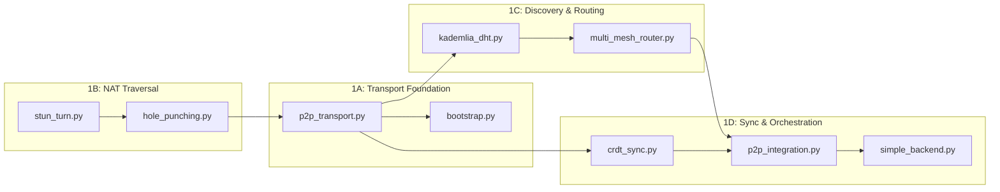

# AsimNexus — Comprehensive Remaining Work Analysis

> **Date:** 2026-06-01  
> **Version:** v1.0.1 (Production Freeze)  
> **Scope:** Complete gap analysis of all ~102 components — REAL (~70), PARTIAL (~12), CONCEPT (~8+)

---

## Current State Summary

```
REAL   ████████████████████████████████████████████   ~70 components
PARTIAL ████████░░░░░░░░░░░░░░░░░░░░░░░░░░░░░░░░░░   ~12 components
CONCEPT █████░░░░░░░░░░░░░░░░░░░░░░░░░░░░░░░░░░░░   ~8+ components
```

The 4 recently completed areas (Federation/Governance, Production Deployment, Testing, Observability) pushed ~15 components from CONCEPT → REAL. The remaining gaps are now visible as a clear priority stack.

---

## Priority 1: Real Mesh Networking (P1) — THE NEXT WORK

### Current State

The mesh layer has **~6,000+ lines across 10 files** but ALL use simulation/loopback instead of real sockets:

| File | Lines | Has | Missing |
|------|-------|-----|---------|
| [`mesh/stun_turn.py`](mesh/stun_turn.py) | 875 | STUN/TURN client, NAT classification, TURN allocation | Real UDP socket binding to actual STUN servers |
| [`mesh/hole_punching.py`](mesh/hole_punching.py) | 1,114 | Rendezvous server/client, 4 punch strategies, PunchListener | Wire to real network interfaces |
| [`mesh/multi_mesh_router.py`](mesh/multi_mesh_router.py) | 781 | 4 mesh types, auto-switching, health checks, routing rules | Real transport integration |
| [`mesh/p2p_transport.py`](mesh/p2p_transport.py) | 553 | UDP datagram protocol, WebSocket handler, RPC calls | Real peer communication |
| [`mesh/p2p_integration.py`](mesh/p2p_integration.py) | 657 | WebRTC transport, P2PIntegration orchestrator | Working WebRTC data channels |
| [`mesh/kademlia_dht.py`](mesh/kademlia_dht.py) | 579 | Kademlia DHT with KBuckets, lookup, store/find | Real UDP-based node discovery |
| [`mesh/crdt_sync.py`](mesh/crdt_sync.py) | 650 | GCounter, LWWRegister, ORSet, CRDTStore | Real P2P sync integration |
| [`mesh/bootstrap.py`](mesh/bootstrap.py) | 451 | BootstrapService with TCP handler | Real network bootstrap |
| [`mesh/relay.py`](mesh/relay.py) | 363 | RelayService with session management | Real relay connections |
| [`mesh/autodiscovery.py`](mesh/autodiscovery.py) | 460 | Broadcast, multicast, mDNS discovery | Robust production discovery |

---

### Mesh Execution Plan — 4 Subphases

#### Subphase 1A: Transport Foundation
Wire the lowest-level transport layer to real network interfaces.

**Files to modify:**
- [`mesh/p2p_transport.py`](mesh/p2p_transport.py) — Replace simulated UDP with real `asyncio.DatagramProtocol`. Add peer handshake protocol (HELLO/ACK). Add session state tracking (CONNECTING, CONNECTED, DISCONNECTED, TIMEOUT). Add error/retry handling with exponential backoff.
- [`mesh/bootstrap.py`](mesh/bootstrap.py) — Wire to real TCP sockets. Add seed node discovery via hardcoded or DNS seed list.

**Exit criteria:**
- Two instances can discover each other via bootstrap
- Reliable UDP datagram delivery between peers
- Session state machine transitions correctly
- Peers auto-reconnect on transient failures

#### Subphase 1B: NAT Traversal
Enable peer-to-peer connectivity across NAT boundaries.

**Files to modify:**
- [`mesh/stun_turn.py`](mesh/stun_turn.py) — Wire `STUNClient.query()` to real public STUN servers (Google: `stun.l.google.com:19302`, Cloudflare: `stun.cloudflare.com:3478`). Verify NAT classification (full-cone, restricted, port-restricted, symmetric). Wire `TURNClient.allocate()` to real TURN server for symmetric NAT fallback.
- [`mesh/hole_punching.py`](mesh/hole_punching.py) — Wire all 4 strategies (`_try_direct`, `_try_stun_punch`, `_try_rendezvous_punch`, `_try_turn_relay`) to real UDP sockets. Wire `RendezvousServer` to real UDP endpoint.

**Exit criteria:**
- STUN query returns real mapped address (tested behind actual NAT)
- NAT type classification works correctly
- Hole punching succeeds between two peers behind different NATs
- TURN relay fallback works for symmetric NATs

#### Subphase 1C: Discovery & Routing
Enable peer discovery and distributed routing.

**Files to modify:**
- [`mesh/kademlia_dht.py`](mesh/kademlia_dht.py) — Wire `lookup()` to real iterative UDP queries using [`mesh/p2p_transport.py`](mesh/p2p_transport.py). Wire `publish()` to real `STORE` RPCs. Wire bootstrap through [`mesh/bootstrap.py`](mesh/bootstrap.py). Add routing table maintenance (refresh stale buckets, evict bad nodes).
- [`mesh/multi_mesh_router.py`](mesh/multi_mesh_router.py) — Wire `route_through_mesh()` to real transport via [`mesh/p2p_transport.py`](mesh/p2p_transport.py). Wire `update_mesh_health()` to real connectivity metrics (latency, packet loss, bandwidth).

**Exit criteria:**
- Kademlia lookup finds nodes across real network
- Store/find value works through DHT
- Routing table self-maintains (evicts stale, refreshes buckets)
- MultiMeshRouter selects correct mesh type based on real metrics

#### Subphase 1D: Sync & Orchestration
Enable CRDT-based state synchronization and full backend integration.

**Files to modify:**
- [`mesh/crdt_sync.py`](mesh/crdt_sync.py) — Wire `request_sync()` to real P2P connections. Wire `push_operations()` to broadcast via [`mesh/p2p_transport.py`](mesh/p2p_transport.py). Wire conflict resolution with LWW (last-writer-wins) and ORSet merge rules.
- [`mesh/p2p_integration.py`](mesh/p2p_integration.py) — Wire `P2PIntegration.start()` to launch all real services (transport, DHT, CRDT). Wire `_peer_discovery_loop()` to use real Kademlia + bootstrap. Wire `route_data()` to use real MultiMeshRouter + transport.
- [`simple_backend.py`](simple_backend.py) — Add mesh status endpoints (`/mesh/status`, `/mesh/peers`, `/mesh/route`). Wire P2PIntegration into backend lifecycle.

**New files to create:**
- [`tests/real/test_mesh_networking.py`](tests/real/test_mesh_networking.py) — Integration tests for each subphase.

**Exit criteria:**
- CRDT state converges across 3+ peers
- P2PIntegration starts/stops cleanly
- Backend exposes mesh status via API
- Full integration test suite passes

---

#### Mesh Dependency Graph



---

## Priority 2: OS Control Wiring (P2)

**Do NOT start until Phase 1 mesh is stable.** Mesh provides the underlying communication layer that OS control depends on for remote device management.

### Current State

| File | Status | Has | Missing |
|------|--------|-----|---------|
| [`os_control/tool_registry.py`](os_control/tool_registry.py) | PARTIAL | Tool registration, execution framework | Real OS-level tool execution |
| [`os_control/os_tool_executor.py`](os_control/os_tool_executor.py) | PARTIAL | Tool execution logic | Integration with capability matrix |
| [`os_control/os_control_bridge.py`](os_control/os_control_bridge.py) | PARTIAL | Bridge between OS and tools | Real OS control endpoints |
| [`os_control/capability_matrix.py`](os_control/capability_matrix.py) | PARTIAL | Capability definitions | Gate enforcement |
| Sandbox tools (docker, wasm, low-priv) | PARTIAL | Isolation frameworks | Production hardening |

### Scope
1. Wire [`os_control/capability_matrix.py`](os_control/capability_matrix.py) as mandatory gate before tool execution
2. Expose OS control tools via FastAPI endpoints in backend
3. Harden sandboxes with resource limits, timeouts, audit logging

---

## Priority 3: Multi-Clone Voting (P3)

**Do NOT rush to make feature-rich.** Start simple, add modes incrementally.

### Current State

| File | Status | Has | Missing |
|------|--------|-----|---------|
| [`core/founder_clones/world_clones.py`](core/founder_clones/world_clones.py) | PARTIAL | 15 clone configs, WorldCloneOrchestrator | No ensemble consensus vote |
| [`core/founder_clones/founder_clone_system.py`](core/founder_clones/founder_clone_system.py) | PARTIAL | FounderCloneSystem, multi-model NVIDIA API | No ensemble voting |
| [`core/founder_clones/clone_specializer.py`](core/founder_clones/clone_specializer.py) | PARTIAL | Role mapping | No multi-clone vote |
| [`core/founder_clones/founder_to_clone_map.py`](core/founder_clones/founder_to_clone_map.py) | PARTIAL | Founder-to-clone mapping | Not fully integrated |

### The Voting System Must Support Multiple Modes

Not just "majority vote" — different task types need different protocols:

1. **Majority Vote** — Simple majority for low-stakes decisions (e.g., content recommendations)
2. **Pairwise Comparison** — Elo-style ranking when clones disagree (e.g., which route is best)
3. **Confidence Weighting** — Each clone votes with confidence score; weighted sum decides (e.g., financial predictions)
4. **Role-Based Arbitration** — Certain clones have veto power in their domain (e.g., Security clone blocks risky actions)

### Scope
1. Create `core/founder_clones/consensus_engine.py` with async LLM voting, multiple modes
2. Wire into WorldClones, FounderClones, and GlobalFederationGovernor
3. Add mode selection based on task type

---

## Deferred: Concept-Only Tracks

**Do NOT work on these. They are research tracks, not production milestones.**

| Item | File | Reason |
|------|------|--------|
| seL4 Microkernel | [`core/kernel/microkernel.py`](core/kernel/microkernel.py) | Requires Rust/C rewrite. Python sim is placeholder |
| National Gov Layer | — | Political/legal framework, not code |
| Blockchain Constitution | — | No smart contract platform selected |
| TPM/Hardware Attestation | — | Mentioned, zero code. Requires hardware |
| Quantum-Resistant Crypto | [`core/security/quantum_resistant_crypto.py`](core/security/quantum_resistant_crypto.py) | Placeholder algorithms. Not urgent |
| Neural Interface | — | Future vision only |
| DePIN Bridge | [`core/depin/depin_bridge.py`](core/depin/depin_bridge.py) | Simulated rates. No real network |
| Sovereign Kernel | [`core/sovereign_kernel.py`](core/sovereign_kernel.py) | Resource sim. Not OS kernel |
| Fractal Universe | [`core/visualization/fractal_universe.py`](core/visualization/fractal_universe.py) | Visualization toy |
| Wave Propagation Mesh | [`core/mesh/wave_propagation_mesh.py`](core/mesh/wave_propagation_mesh.py) | Not integrated |
| Air Gap Controller | [`core/mesh/air_gap_controller.py`](core/mesh/air_gap_controller.py) | Design doc |
| Nepal Digital Dharma | [`core/dharma/nepal_digital_dharma.py`](core/dharma/nepal_digital_dharma.py) | Cultural framework, not enforced |

---

## Recommended Execution Order

```
Phase 1A ── Transport Foundation      real UDP sockets, peer handshake, session state
Phase 1B ── NAT Traversal             STUN/TURN binding, hole punching, relay fallback
Phase 1C ── Discovery & Routing       Kademlia DHT, peer store, routing table
Phase 1D ── Sync & Orchestration      CRDT merge, multi-mesh router, backend integration
    ↓ (mesh must be STABLE first)
Phase 2  ── OS Control Wiring         Capability gate, tool registry, backend API
Phase 3  ── Multi-Clone Voting        Consensus engine, multiple voting modes
    ↓ (everything else independent)
Phase 4+ ── RLS, ZKP, Auto-Learning,  Standalone work, no mesh dependency
             Schema Standardization
```

---

## Key Principle

> **Mesh stable नभएसम्म OS control को full rollout नगर्नु।**  
> **Clone voting लाई feature-rich बनाउने हतार नगर्नु।**  
> **Concept-only tracks लाई अहिले प्राथमिकता नदिनु।**
