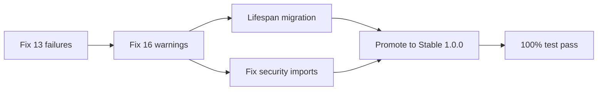
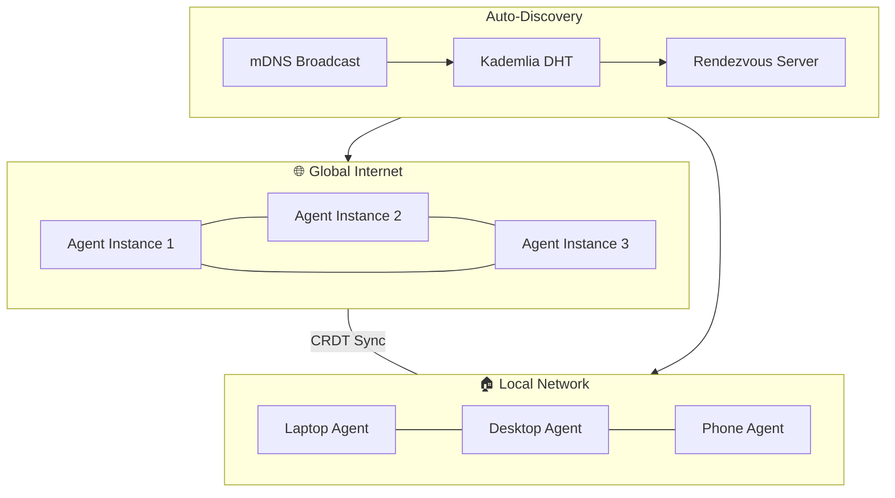
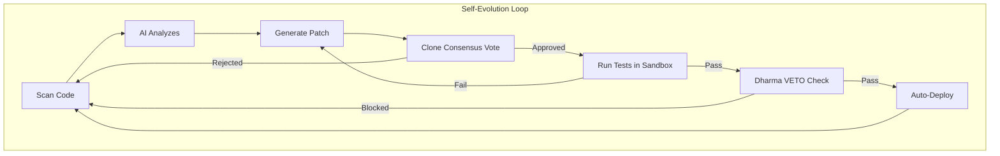
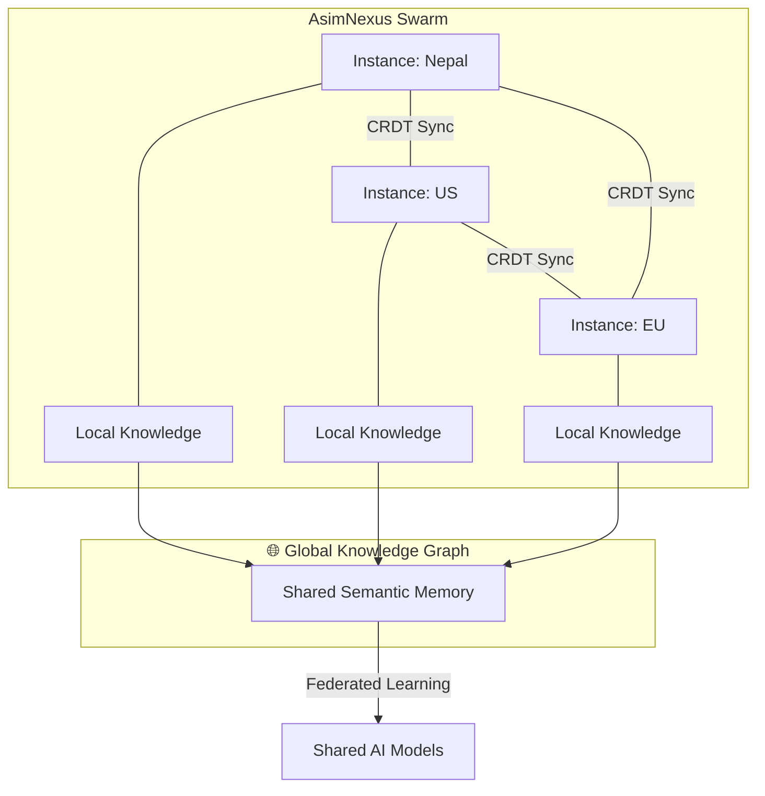
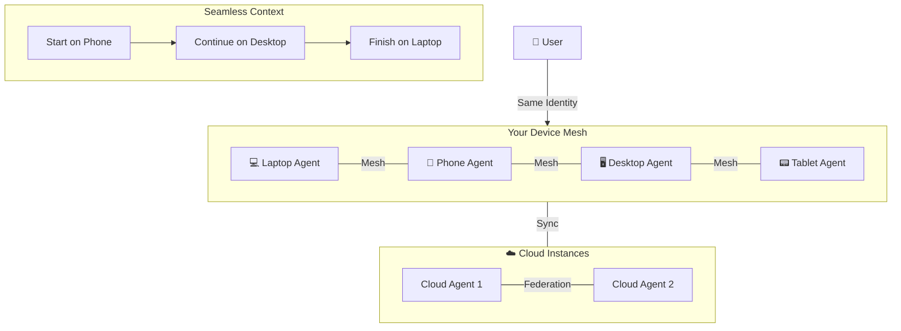
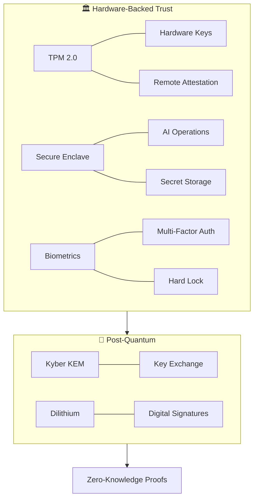
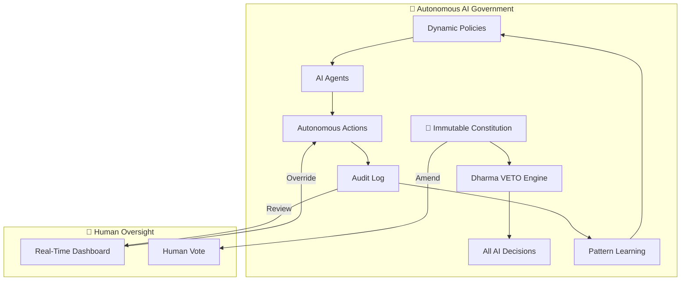
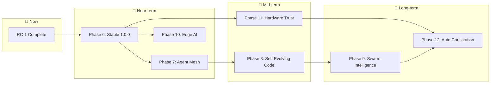

# 🚀 AsimNexus — Futuristic Roadmap: Beyond RC-1

> **Current:** v1.1.0-rc.1 | **Next:** Stable 1.0.0 → Autonomous AI Operating System  
> **Date:** 2026-06-07  
> **Vision:** From "application" to "autonomous digital ecosystem"

---

## 🌌 The Vision

AsimNexus already has the foundation: **5-layer architecture, real mesh networking, OS control, constitutional AI governance, and multi-clone consensus.** The next evolution is to transform it from a system you *use* into a system that *acts autonomously* on your behalf — a true **Autonomous AI Operating System** that spans devices, networks, and geographies.

```
                     ┌─────────────────────────────────┐
                     │    GLOBAL SWARM INTELLIGENCE      │
                     │  (Federated Autonomous Instances) │
                     └─────────────────────────────────┘
                                  │
              ┌───────────────────┼───────────────────┐
              ▼                   ▼                   ▼
     ┌─────────────────┐ ┌──────────────┐ ┌─────────────────┐
     │  SELF-EVOLVING   │ │ AUTONOMOUS   │ │  EDGE AI        │
     │  CODE ENGINE     │ │ AGENT MESH   │ │  CONTINUUM      │
     └─────────────────┘ └──────────────┘ └─────────────────┘
              │                   │                   │
              └───────────────────┼───────────────────┘
                                  │
                     ┌─────────────────────────┐
                     │  HARDWARE-BACKED TRUST   │
                     │  TPM · Secure Enclave ·  │
                     │  Biometric · ZKP         │
                     └─────────────────────────┘
                                  │
                     ┌─────────────────────────┐
                     │   RC-1 FOUNDATION ✅     │
                     │  Mesh · OS Control ·     │
                     │  Clones · Governance     │
                     └─────────────────────────┘
```

---

## Phase 6: Stable 1.0.0 — Polish & Perfect

**Theme:** "Make it rock-solid"  
**Goal:** Zero warnings, zero failures, production-grade stability

| # | Task | Files | Why It Matters |
|---|------|-------|----------------|
| 6.1 | Fix 13 `test_launch_spine.py` failures | [`tests/real/test_launch_spine.py`](tests/real/test_launch_spine.py) | Import errors for `core.government` — either stub or skip |
| 6.2 | Fix 16 warnings | [`mesh/p2p_integration.py`](mesh/p2p_integration.py), [`security/biometric_hardware_gate.py`](security/biometric_hardware_gate.py) | Coroutines never awaited, FastAPI `on_event` deprecation |
| 6.3 | FastAPI lifespan migration | [`backend/*.py`](backend/), [`api/*.py`](api/) | Replace deprecated `on_event` with lifespan handlers |
| 6.4 | Fix security test imports | [`tests/real/test_security_hardening.py`](tests/real/test_security_hardening.py) | Missing `security.` prefix in import paths |
| 6.5 | Promote RC-1 → Stable 1.0.0 | [`deploy/release/version.txt`](deploy/release/version.txt) | `1.0.0` stable release |
| 6.6 | Run full test suite — target 100% pass | All test files | **Exit criteria: 2,498/2,498 passed, 0 warnings** |



**Files to modify:**
- [`tests/real/test_launch_spine.py`](tests/real/test_launch_spine.py) — Skip concept-dependent tests
- [`mesh/p2p_integration.py`](mesh/p2p_integration.py) — Await all coroutines (4 instances)
- [`security/biometric_hardware_gate.py`](security/biometric_hardware_gate.py) — Await `verify_biometric`
- [`backend/*.py`](backend/) — Replace `on_event` with `lifespan` 
- [`deploy/release/version.txt`](deploy/release/version.txt) — `1.1.0-rc.1` → `1.0.0`

---

## Phase 7: Autonomous Agent Mesh — Digital Immune System

**Theme:** "Agents that find, negotiate, and heal themselves"  
**Goal:** Self-healing P2P mesh where AI agents autonomously discover peers, share context, and coordinate actions

| # | Task | Key Components | Futuristic Value |
|---|------|----------------|------------------|
| 7.1 | Agent Discovery Protocol | [`mesh/p2p_transport.py`](mesh/p2p_transport.py) + [`agents/`](agents/) | Agents auto-discover each other across LAN/internet |
| 7.2 | Agent Negotiation Engine | `core/agent_contract.py` | Agents negotiate task delegation, resource sharing, SLA |
| 7.3 | Self-Healing Mesh | [`mesh/multi_mesh_router.py`](mesh/multi_mesh_router.py) | Auto-detect peer failure, reroute, spawn replacement agents |
| 7.4 | Cross-Instance Agent Sync | [`mesh/crdt_sync.py`](mesh/crdt_sync.py) + [`mesh/p2p_integration.py`](mesh/p2p_integration.py) | Agent state converges across machines via CRDT |
| 7.5 | Agent Reputation System | `core/reputation.py` **NEW** | Trust scores based on reliability, accuracy, security |



**Why futuristic:** This turns AsimNexus into a **decentralized AI organism** — each instance is a cell in a global digital brain. Agents don't wait for commands; they proactively discover needs and coordinate.

---

## Phase 8: Self-Evolving Code Engine

**Theme:** "The system that improves itself"  
**Goal:** AI that reads its own code, identifies improvements, writes patches, runs tests, and deploys — all within constitutional bounds

| # | Task | Key Components | Futuristic Value |
|---|------|----------------|------------------|
| 8.1 | Code Analysis Pipeline | `evolution/code_analyzer.py` **NEW** | AI scans codebase for anti-patterns, dead code, optimization opportunities |
| 8.2 | Auto-Patch Generator | `evolution/patch_generator.py` **NEW** | AI generates targeted code patches using cloned agent consensus |
| 8.3 | Self-Testing Framework | `evolution/test_runner.py` **NEW** | Run tests in sandbox, verify patch doesn't break anything |
| 8.4 | Constitutional Guard | [`security/immutable_constitution.py`](security/immutable_constitution.py) | Even self-evolution must pass Dharma VETO |
| 8.5 | Auto-Deploy Pipeline | [`scripts/release_pipeline.py`](scripts/release_pipeline.py) | Approved patches auto-tagged, released, rolled out |



**Why futuristic:** This is the **holy grail of AI engineering** — a system that doesn't just run code, but actively improves its own codebase. Combined with the constitutional guard, it's safe self-evolution.

---

## Phase 9: Global Swarm Intelligence

**Theme:** "Many instances, one intelligence"  
**Goal:** Federated network of AsimNexus instances that share learning, distribute compute, and act as a unified swarm

| # | Task | Key Components | Futuristic Value |
|---|------|----------------|------------------|
| 9.1 | Federated Learning | `swarm/federated_learning.py` **NEW** | Clones learn from each other without sharing raw data |
| 9.2 | Distributed Task Execution | `swarm/task_distributor.py` **NEW** | Complex tasks split across instances, results merged |
| 9.3 | Global Knowledge Graph | `swarm/knowledge_graph.py` **NEW** | Shared semantic memory across all instances |
| 9.4 | Swarm Consensus | [`core/founder_clones/consensus_engine.py`](core/founder_clones/consensus_engine.py) | Multi-instance voting on global decisions |
| 9.5 | Emergency Broadcast | [`mesh/relay.py`](mesh/relay.py) | Critical alerts propagate across the entire swarm |



**Why futuristic:** This is **swarm intelligence** — not a single AI, but a coordinated collective. Each instance contributes unique knowledge (local laws, languages, data) while benefiting from the whole.

---

## Phase 10: Edge AI Continuum

**Theme:** "AI follows you everywhere"  
**Goal:** Seamless AI experience from browser PWA → mobile → desktop → server — all sharing one identity and context

| # | Task | Key Components | Futuristic Value |
|---|------|----------------|------------------|
| 10.1 | PWA → Full OS Integration | [`frontend/`](frontend/) + [`desktop/`](desktop/) | PWA becomes system-tray resident, notification-native |
| 10.2 | Mobile-First Agent | [`mobile/`](mobile/) | Full agent capability on phone with offline mode |
| 10.3 | Context Continuum | `continuum/context_manager.py` **NEW** | Session context follows you across devices seamlessly |
| 10.4 | Edge Inference | [`runtime/llm_runtime/`](runtime/llm_runtime/) | Local LLM on device for offline AI, cloud for heavy tasks |
| 10.5 | Device Mesh | [`mesh/autodiscovery.py`](mesh/autodiscovery.py) | All your devices form a personal mesh, share compute |



**Why futuristic:** Your AI is **truly everywhere** — pick up your phone, continue the conversation on your laptop, let the desktop handle heavy computation. It's one AI spanning all your devices.

---

## Phase 11: Hardware-Backed Trust Layer

**Theme:** "Trust the hardware, trust the AI"  
**Goal:** Zero-trust architecture backed by TPM 2.0, secure enclaves, biometrics, and quantum-resistant cryptography

| # | Task | Key Components | Futuristic Value |
|---|------|----------------|------------------|
| 11.1 | TPM 2.0 Integration | `security/tpm_engine.py` **NEW** | Hardware-backed key storage, remote attestation |
| 11.2 | Secure Enclave for AI | `security/enclave_manager.py` **NEW** | Sensitive AI operations run in hardware isolation |
| 11.3 | Biometric Multi-Factor | [`security/biometric_hardware_gate.py`](security/biometric_hardware_gate.py) | Face/fingerprint + TPM + location = context-aware auth |
| 11.4 | Quantum-Resistant Keys | `security/quantum_crypto.py` | Kyber + Dilithium for post-quantum security |
| 11.5 | Zero-Knowledge Everything | [`security/zkp_privacy.py`](security/zkp_privacy.py) | Prove identity/attributes without revealing data |



**Why futuristic:** This is **military-grade trust for consumer AI**. Your AI agents can prove their identity to other agents, sign actions with hardware keys, and run sensitive operations in hardware isolation — all verifiable and auditable.

---

## Phase 12: Autonomous Digital Constitution

**Theme:** "AI that governs itself"  
**Goal:** Complete self-governance where AI agents operate autonomously within constitutional bounds, with human oversight only for constitutional amendments

| # | Task | Key Components | Futuristic Value |
|---|------|----------------|------------------|
| 12.1 | Automated Policy Enforcement | [`security/dharma_policy.py`](security/dharma_policy.py) | AI auto-enforces policies without human intervention |
| 12.2 | Self-Amendment Proposal | [`governance/dharma_chakra_council.py`](governance/dharma_chakra_council.py) | AI can propose constitutional amendments for human vote |
| 12.3 | Audit-Driven Learning | [`security/audit_log.py`](security/audit_log.py) | System learns from audit patterns, improves policies |
| 12.4 | Transparent Decision Log | `governance/decision_log.py` **NEW** | Every AI decision recorded, explainable, appealable |
| 12.5 | Human-in-the-Loop Dashboard | [`frontend/`](frontend/) | Real-time view of all autonomous actions, override controls |



**Why futuristic:** This is a **self-governing AI society** — agents operate autonomously within constitutional bounds, the system learns and improves its own policies, and humans only step in for foundational changes. True **autonomous AI governance**.

---

## 📊 Summary: The Road Ahead

| Phase | Name | Theme | Dependencies | Impact |
|-------|------|-------|-------------|--------|
| **6** | Stable 1.0.0 | Make it rock-solid | RC-1 ✅ | Foundation |
| **7** | Autonomous Agent Mesh | Agents that heal themselves | Phase 6 | 🟢 High |
| **8** | Self-Evolving Code | System that improves itself | Phase 6, 7 | 🟣 Transformative |
| **9** | Global Swarm Intelligence | Many instances, one mind | Phase 7, 8 | 🔮 Visionary |
| **10** | Edge AI Continuum | AI everywhere you are | Phase 7 | 🟢 High |
| **11** | Hardware-Backed Trust | Military-grade security | Phase 6 | 🟡 Medium |
| **12** | Autonomous Constitution | AI that governs itself | Phase 8, 11 | 🔮 Visionary |



---

## 🎯 Immediate Next Step

**Phase 6**, task 6.1: Fix the 13 `test_launch_spine.py` failures and 16 warnings. This is the gateway to everything else — a clean test suite is non-negotiable before any futuristic work begins.

Want me to switch to Code mode and start executing Phase 6?
