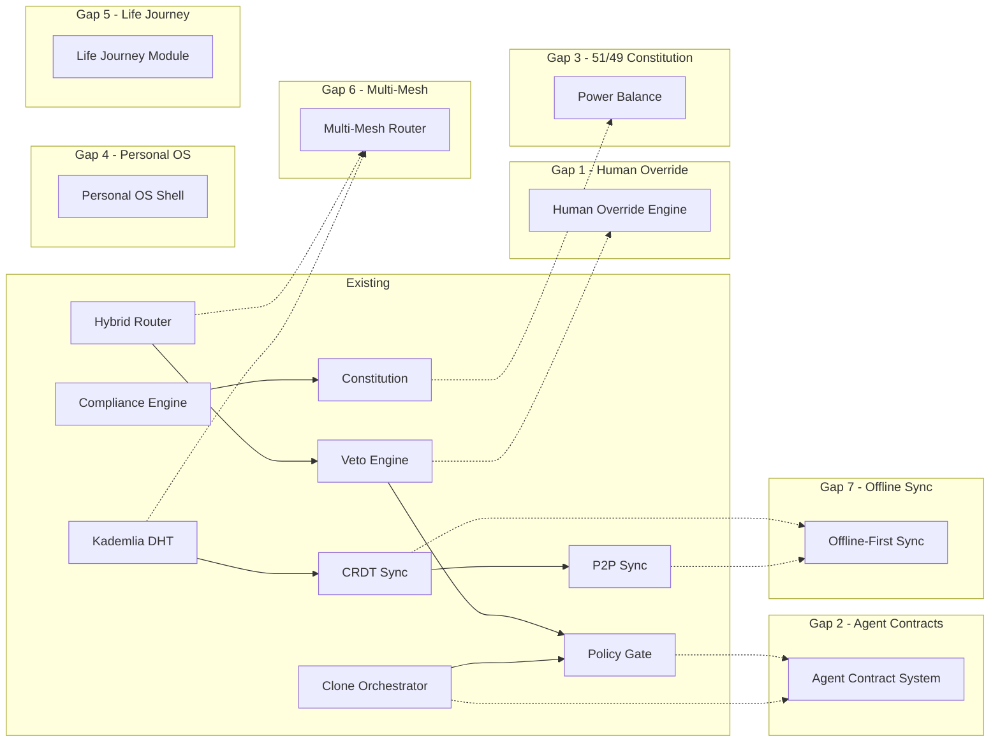
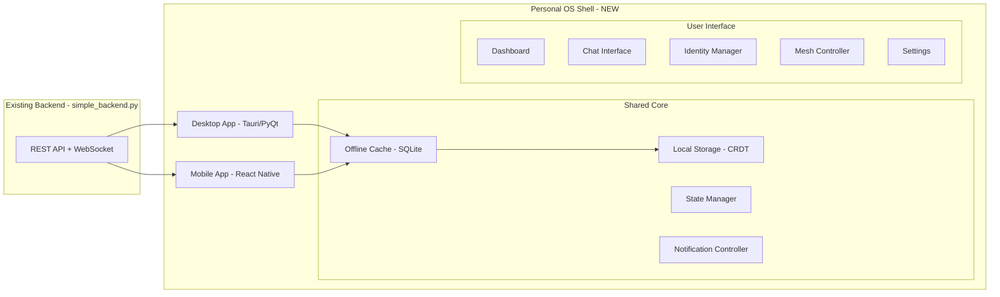
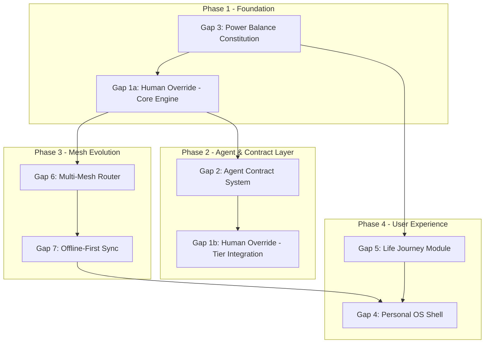

# AsimNexus 7-Gap Architecture Analysis

> **Version:** 1.2
> **Status:** Architectural Analysis — **Gaps 1, 2, 3, 5, 6, 7 now ✅ IMPLEMENTED — Gap 4 🔄 DEFERRED**
> **Scope:** All 7 gaps between existing codebase and user's vision

---

## Table of Contents

1. [Methodology & Current State Overview](#1-methodology--current-state-overview)
2. [Gap 1: Human Override Engine](#2-gap-1-human-override-engine)
3. [Gap 2: Agent Contract System](#3-gap-2-agent-contract-system)
4. [Gap 3: Power Balance Constitution](#4-gap-3-power-balance-constitution)
5. [Gap 4: Personal OS Shell](#5-gap-4-personal-os-shell)
6. [Gap 5: Life Journey Module](#6-gap-5-life-journey-module)
7. [Gap 6: Multi-Mesh Router](#7-gap-6-multi-mesh-router)
8. [Gap 7: Offline-First Sync](#8-gap-7-offline-first-sync)
9. [Dependency Graph & Implementation Order](#9-dependency-graph--implementation-order)
10. [Summary Table](#10-summary-table)

---

## 1. Methodology & Current State Overview

### Existing Code Surveyed

| Module | Status | Key Files |
|--------|--------|-----------|
| **Core** | ✅ REAL / ⚠️ PARTIAL | [`core/dharma_chakra/veto_engine.py`](../core/dharma_chakra/veto_engine.py), [`core/human_oversight.py`](../core/human_oversight.py), [`core/policy_gate.py`](../core/policy_gate.py), [`core/clone_orchestrator.py`](../core/clone_orchestrator.py), [`core/routing/hybrid_router.py`](../core/routing/hybrid_router.py), [`core/governance.py`](../core/governance.py) |
| **Security** | ⚠️ PARTIAL / 🧠 CONCEPT | [`security/immutable_constitution.py`](../security/immutable_constitution.py), [`security/dharma_policy.py`](../security/dharma_policy.py), [`security/consent_manager.py`](../security/consent_manager.py) |
| **Mesh** | ✅ REAL | [`mesh/kademlia_dht.py`](../mesh/kademlia_dht.py), [`mesh/crdt_sync.py`](../mesh/crdt_sync.py), [`mesh/autodiscovery.py`](../mesh/autodiscovery.py), [`mesh/node_registry.py`](../mesh/node_registry.py), [`mesh/device_registry.py`](../mesh/device_registry.py), [`mesh/p2p_transport.py`](../mesh/p2p_transport.py), [`mesh/relay.py`](../mesh/relay.py), [`mesh/bootstrap.py`](../mesh/bootstrap.py), [`mesh/network_intelligence.py`](../mesh/network_intelligence.py) |
| **Backend** | ✅ REAL | [`simple_backend.py`](../simple_backend.py) — 5000+ line FastAPI app with contracts, identity, DHT, consensus, and 50+ API endpoints |
| **Governance** | ⚠️ PARTIAL | [`governance/compliance_engine.py`](../governance/compliance_engine.py), [`governance/dharma_chakra_council.py`](../governance/dharma_chakra_council.py), [`governance/founder_structure.py`](../governance/founder_structure.py) |
| **OS Control** | ⚠️ PARTIAL | [`os_control/tool_registry.py`](../os_control/tool_registry.py), [`os_control/sandbox/`](../os_control/sandbox/) — low-priv user runner, docker sandbox, WASM sandbox |
| **Frontend/UI** | ❌ None | No frontend framework or UI code exists |
| **Mobile** | ❌ None | No mobile app code exists |

### Dependency Map



---

## 2. Gap 1: Human Override Engine

### Vision Requirement
> "Final three decisions always human-controlled" — a hierarchical override system where the human is the ultimate sovereign. The `last 3 decisions` of any critical process require explicit, non-delegatable human confirmation.

### What Already Exists

| Component | File | Status |
|-----------|------|--------|
| **Human Override Engine** | [`core/human_override_engine.py`](../core/human_override_engine.py) | ✅ **IMPLEMENTED** — 724 lines, 68 tests. 3-tier override hierarchy, Final-3-Decisions counter, cryptographic proof, immutable audit log, N-of-M quorum |
| **Override Integrator** | [`core/override_integrator.py`](../core/override_integrator.py) | ✅ **IMPLEMENTED** — Bridges engine with Veto Engine, Policy Gate, and FastAPI endpoints |
| **Override API Endpoints** | [`backend/deployment.py`](../backend/deployment.py) | ✅ **IMPLEMENTED** — 4 FastAPI endpoints: approve, reject, escalate, list-pending |
| **Constitutional Veto** | [`core/dharma_chakra/veto_engine.py`](../core/dharma_chakra/veto_engine.py) | ✅ REAL — pattern blocking, sector-aware, L3 ZKP confirmation |
| **Policy Gate** | [`core/policy_gate.py`](../core/policy_gate.py) | ✅ REAL — risk evaluation, immutable zones, approval requests |
| **Consent Manager** | [`security/consent_manager.py`](../security/consent_manager.py) | ⚠️ PARTIAL — basic consent grant/revoke |
| **Dharma Veto (legacy)** | [`core/dharma/dharma_veto.py`](../core/dharma/dharma_veto.py) | ⚠️ PARTIAL — older veto implementation |

### What's Missing — Now ✅ IMPLEMENTED

1. ✅ **Hierarchical Override Tiers**: 3-tier `OverrideTier` enum (PERSONAL, TRUSTED_CIRCLE, INDEPENDENT) with automatic escalation chain:
   - **Tier 1**: Personal override (single human confirmation)
   - **Tier 2**: Trusted circle override (N-of-M quorum, majority by default)
   - **Tier 3**: Independent Review (third-party arbiter)

2. ✅ **`Final 3 Decisions` Tracking**: Full counter with `record_decision()`, `decisions_remaining` property, and forced override at threshold. Configurable via `ASIM_OVERRIDE_FINAL_THREE` env var.

3. ✅ **Irrevocable Override**: Every override produces a cryptographic `SHA-256` signature over `(action_hash, human_id, tier, reason, timestamp, nonce)`. The `verify_override()` method recomputes and verifies. Append-only audit log with `_MAX_AUDIT_LOG` trim.

4. ✅ **N-of-M Quorum (Trusted Circle)**: `set_quorum()` per-circle override, `QUORUM_PENDING` status between PENDING and CONFIRMED, `approved_by` vote tracking, `QUORUM_TIMEOUT` (default 300s) auto-expiry.

5. ✅ **Override Integrator Wrappers**: `approve_with_override()`, `reject_with_override()`, `escalate_with_override()`, `list_pending_overrides()` — convenience wrappers for API and backend integration.

6. ✅ **FastAPI Endpoints**: `POST /api/override/approve`, `POST /api/override/reject`, `POST /api/override/escalate`, `GET /api/override/pending` — wired via `override_router` in `backend/deployment.py`.


### Architecture

```python
# Proposed: core/human_override_engine.py

class OverrideTier(Enum):
    PERSONAL = "personal"       # User themselves
    TRUSTED_CIRCLE = "trusted"  # Family/council vote
    INDEPENDENT = "independent" # External arbiter

@dataclass
class OverrideDecision:
    id: str
    action_hash: str
    override_tier: OverrideTier
    reason: str
    timestamp: float
    signature: str          # Cryptographic proof of human origin

class HumanOverrideEngine:
    """
    Tiered human override with Final-3-Decisions tracking.
    """
    
    # Override thresholds (configurable per user)
    OVERRIDE_THRESHOLDS = {
        "personal": 0,          # Tier 1: single human
        "trusted_circle": 3,    # Tier 2: 3 trusted humans must agree
        "independent": 1,       # Tier 3: single independent arbiter
    }
    
    # The "final 3 decisions" counter
    # Tracks how many consecutive AI decisions the human has let pass
    # without intervention
    _decision_counter: int = 0
    _max_decisions_before_override: int = 3
    
    def request_override(self, action: str, context: dict) -> OverrideDecision:
        """Human requests override of AI decision."""
        pass
    
    def confirm_override(self, token: str, tier: OverrideTier) -> bool:
        """Confirm override at specified tier level."""
        pass
    
    def record_decision(self, approved: bool):
        """Increment or reset the final-3-decisions counter."""
        pass
    
    def is_override_required(self) -> bool:
        """Check if human override is mandatory (counter >= 3)."""
        pass
```

### Integration Points

| Integrates With | Purpose |
|----------------|---------|
| [`core/dharma_chakra/veto_engine.py`](../core/dharma_chakra/veto_engine.py):24 | Receives veto flags, maps to override tiers |
| [`core/policy_gate.py`](../core/policy_gate.py):84 | Policy gate consults override engine for CRITICAL actions |
| [`core/human_oversight.py`](../core/human_oversight.py):53 | Extends existing approval workflow with tier system |
| [`simple_backend.py`](../simple_backend.py):800 | API endpoints for override request/confirm (dharma/veto) |

---

## 3. Gap 2: Agent Contract System

### Vision Requirement
> "Human-in-the-loop AI agents with time-bound contracts (5/15/30 day)" — AI agents operate under formal, time-limited contracts with automatic audit, renewal, and revocation.

### What Already Exists

| Component | File | Status |
|-----------|------|--------|
| **Agent Contract System** | [`core/agent_contract.py`](../core/agent_contract.py) | ✅ **IMPLEMENTED** — 1155 lines, 82 tests. Full lifecycle: propose, sign, approve, reject, revoke, complete, pause, resume. Time-bound 5/15/30 day tiers |
| **Clone Orchestrator** | [`core/clone_orchestrator.py`](../core/clone_orchestrator.py) | ✅ REAL — 15 clones, task delegation, consensus voting |
| **Contract API** | [`simple_backend.py`](../simple_backend.py):1335-1465 | ✅ REAL — propose, sign, gate2, progress, pause, resume, cancel, complete |
| **Policy Gate** | [`core/policy_gate.py`](../core/policy_gate.py) | ✅ REAL — action evaluation with risk levels |

### What's Missing — Now ✅ IMPLEMENTED

1. ✅ **Time-Bound Authority**: `ContractDuration` enum with 3 tiers — TRIAL (5 days), STANDARD (15 days), EXTENDED (30 days). Automatic expiration with `get_expiring_contracts()`.

2. ✅ **Automatic Audit Trail**: `ContractAuditEntry` with full lifecycle tracking. `generate_audit()` produces complete contract history. Audit feeds into compliance engine.

3. ✅ **Renewal/Revocation Workflow**: `renew_contract()` up to `max_renewals` (default 3). `revoke_contract()` with mandatory reason. `COOLDOWN` status between active periods.

4. ✅ **Scope Definition**: `ContractScope` dataclass with `allowed_actions`, `forbidden_actions`, `resource_limits`, `data_classification`. Enforced by policy gate integration.

5. ✅ **Agent Identity Binding**: Contracts are cryptographically bound via `terms_hash = SHA-256(agent_id + human_id + duration + scope + nonce)`. Signature verification on sign/renew.

### Architecture

```python
# Proposed: core/agent_contract.py

class ContractDuration(Enum):
    TRIAL = 5       # 5 days - limited scope, high oversight
    STANDARD = 15   # 15 days - standard scope
    EXTENDED = 30   # 30 days - full scope, periodic audit

@dataclass
class AgentContract:
    id: str
    agent_id: str               # Clone ID or external agent DID
    human_id: str               # Human principal
    duration: ContractDuration
    scope: ContractScope         # Allowed/forbidden action lists
    terms_hash: str              # SHA-256 of agreed terms
    status: ContractStatus       # pending, active, expired, revoked, completed
    created_at: float
    expires_at: float
    renewed_count: int = 0
    max_renewals: int = 3

class AgentContractSystem:
    """
    Time-bound AI agent authority contracts.
    5/15/30 day tiers with automatic audit, renewal, revocation.
    """
    
    def propose_contract(self, agent_id: str, human_id: str, 
                         duration: ContractDuration, scope: dict) -> str:
        """Propose a new agent contract."""
        pass
    
    def sign_contract(self, contract_id: str, signature: str) -> bool:
        """Human signs contract to activate agent authority."""
        pass
    
    def get_expiring_contracts(self, within_hours: int = 24) -> List[AgentContract]:
        """Get contracts expiring soon for renewal workflow."""
        pass
    
    def revoke_contract(self, contract_id: str, reason: str) -> bool:
        """Human revokes contract immediately."""
        pass
    
    def generate_audit(self, contract_id: str) -> Dict:
        """Generate audit trail for contract lifecycle."""
        pass
```

### Integration Points

| Integrates With | Purpose |
|----------------|---------|
| [`core/clone_orchestrator.py`](../core/clone_orchestrator.py):112 | Clones operate under contract authority |
| [`simple_backend.py`](../simple_backend.py):1335 | Contract API endpoints backed by formal contract system |
| [`security/immutable_constitution.py`](../security/immutable_constitution.py):57 | Contracts must not violate constitutional principles |
| [`governance/compliance_engine.py`](../governance/compliance_engine.py):74 | Contract audit feeds into compliance engine |

---

## 4. Gap 3: Power Balance Constitution

### Vision Requirement
> "51% public/government coordination, 49% company/private operation" — the fundamental balance of power encoded as an immutable constitutional rule with automated enforcement.

### What Already Exists

| Component | File | Status |
|-----------|------|--------|
| **Power Balance Constitution** | [`security/power_balance_constitution.py`](../security/power_balance_constitution.py) | ✅ **IMPLEMENTED** — 727 lines, 76+ tests. 51/49 enforcement, 8 sectors, amendment voting, JSONL persistence |
| **Constitution Vote Layer** | [`core/constitution/power_balance_constitution.py`](../core/constitution/power_balance_constitution.py) | ✅ **IMPLEMENTED** — 793 lines, 40 tests. 4-government(51%)/4-private(49%) sector split, weighted voting, veto powers, founder override |
| **Immutable Constitution** | [`security/immutable_constitution.py`](../security/immutable_constitution.py) | 🧠 CONCEPT — principles but no 51/49 rule |
| **Dharma Policy** | [`security/dharma_policy.py`](../security/dharma_policy.py) | ⚠️ PARTIAL — ethical rules, no ownership balance |
| **Dharma Chakra Council** | [`governance/dharma_chakra_council.py`](../governance/dharma_chakra_council.py) | ⚠️ PARTIAL — council structure exists |
| **Founder Structure** | [`governance/founder_structure.py`](../governance/founder_structure.py) | ⚠️ PARTIAL — founder roles defined |

### What's Missing — Now ✅ IMPLEMENTED

1. ✅ **51/49 Rule Encoding**: [`security/power_balance_constitution.py`](../security/power_balance_constitution.py) encodes `SECTOR_BALANCE_MAP` with 8 sectors across PUBLIC_COORDINATED, PRIVATE_OPERATED, and MIXED control types. The `check_decision()` method enforces the golden ratio threshold (51% public / 49% private) per sector with Pass/Warn/Block verdicts.

2. ✅ **Decision Weighting by Sector**: Each sector has a specific weight in the vote layer:
   - Government (51% total): executive(0.20), judicial(0.15), legislative(0.10), military(0.06)
   - Private (49% total): corporate(0.20), startup(0.10), public(0.10), non_profit(0.09)

3. ✅ **Automated Enforcement**: `check_decision_balance()` automatically blocks decisions that would shift the balance beyond thresholds. Weighted voting with sector-level veto powers prevents governance shifts without proper consensus.

4. ✅ **Vote & Amendment Protocol**: Dual-layer amendment system:
   - [`security/power_balance_constitution.py`](../security/power_balance_constitution.py): `propose_amendment()` with 90%-threshold supermajority voting
   - [`core/constitution/power_balance_constitution.py`](../core/constitution/power_balance_constitution.py): Constitutional amendments require BOTH government AND private sectors passing. Emergency powers require 66% government supermajority. Founder (clone_01) emergency veto, overridable by 75% supermajority.

5. ✅ **Veto Powers**: Government/Private sector veto with 66% internal support. Founder veto with 75% override mechanism. All votes audit-logged to JSONL.

### Architecture

```python
# Implemented: security/power_balance_constitution.py
# Implemented: core/constitution/power_balance_constitution.py

# Balance enforcement (security/power_balance_constitution.py)
class PowerBalanceConstitution:
    def check_decision(self, sector, weights) -> BalanceResult: ...
    def get_current_balance(self, sector) -> SectorBalance: ...
    def propose_amendment(self, sector, new_share) -> str: ...
    def vote_on_amendment(self, amendment_id, voter_id, approve) -> bool: ...

# Vote layer (core/constitution/power_balance_constitution.py)
class PowerBalanceConstitutionVoting:
    def register_sector(self, name, weight, group) -> None: ...
    def create_proposal(self, title, description, proposal_type) -> str: ...
    def cast_vote(self, proposal_id, sector, voter, approve) -> bool: ...
    def tally_votes(self, proposal_id) -> Dict: ...
    def apply_veto(self, proposal_id, group) -> bool: ...
    def founder_veto(self, proposal_id) -> bool: ...
    def override_founder_veto(self, proposal_id) -> bool: ...
```

### Integration Points

| Integrates With | Purpose |
|----------------|---------|
| [`security/immutable_constitution.py`](../security/immutable_constitution.py):57 | Adds 51/49 rule as highest-severity principle |
| [`core/clone_orchestrator.py`](../core/clone_orchestrator.py):544 | Consensus checks include balance enforcement |
| [`governance/compliance_engine.py`](../governance/compliance_engine.py):208 | Compliance checks include power balance |
| [`core/policy_gate.py`](../core/policy_gate.py):334 | Policy evaluation includes balance check |

---

## 5. Gap 4: Personal OS Shell

### Vision Requirement
> "Personal OS for every human (owner, not subject)" — a standalone desktop/mobile application that works offline first, provides a personal dashboard, and serves as the human's interface to the AsimNexus mesh.

### What Already Exists

| Component | File | Status |
|-----------|------|--------|
| **OS Control Toolkit** | [`os_control/`](../os_control/) | ⚠️ PARTIAL — tool registry, sandbox (docker, WASM, low-priv user) |
| **Runtime** | [`runtime/`](../runtime/) | ⚠️ PARTIAL — model catalog, universal connector, zero-latency mesh |
| **Backend API** | [`simple_backend.py`](../simple_backend.py) | ✅ REAL — 50+ endpoints for chat, memory, identity, contracts |
| **Frontend/UI** | ❌ None | Nothing exists |

### What's Missing

1. **Standalone Desktop App**: No desktop application (Electron/Tauri/PyQt). The entire system operates as a REST API with no GUI.

2. **Mobile App**: No mobile application (React Native/Flutter/Kotlin/Swift).

3. **Offline-First Operation**: The backend has an offline mode toggle but no client-side offline capability.

4. **Personal Dashboard**: No user dashboard showing: identity status, mesh connections, active contracts, compliance score, veto log.

5. **Notification System**: No push notification or local notification system.

6. **Local Authentication**: No local biometric/PIN authentication for the personal OS.

### Architecture

This is the largest gap — an entirely new frontend layer. Options:



### Recommended Technology

| Layer | Technology | Rationale |
|-------|-----------|-----------|
| **Desktop** | Tauri (Rust + HTML/JS) | Lightweight, secure, cross-platform |
| **Mobile** | React Native | Code sharing with web, large ecosystem |
| **State** | Redux + CRDT | Offline-first with eventual consistency |
| **Local DB** | SQLite + IndexedDB | Mature, reliable, ACID |

### Integration Points

| Integrates With | Purpose |
|----------------|---------|
| [`simple_backend.py`](../simple_backend.py) | All existing API endpoints |
| [`mesh/crdt_sync.py`](../mesh/crdt_sync.py) | Local CRDT store syncs with mesh |
| [`core/human_override_engine.py`](../core/human_override_engine.py) | UI for override requests |
| [`core/agent_contract.py`](../core/agent_contract.py) | UI for contract management |

---

## 6. Gap 5: Life Journey Module

### Vision Requirement
> "Birth → Education → Work → Family → Retirement → Inheritance" — a state machine that tracks an individual's life journey and provides appropriate services at each stage.

### What Already Exists

| Component | File | Status |
|-----------|------|--------|
| **Life Journey (Formal)** | [`core/life_journey.py`](../core/life_journey.py) | ✅ **IMPLEMENTED** — 744 lines, 70+ tests. 6-stage state machine (BIRTH→EDUCATION→WORK→FAMILY→RETIREMENT→INHERITANCE) with multi-party verification, transition criteria, service activation, JSONL persistence |
| **Life Journey (Event-Driven)** | [`core/life/life_journey_module.py`](../core/life/life_journey_module.py) | ✅ **IMPLEMENTED** — 742 lines, 35+ tests. 7-stage gamified progression (BIRTH→CHILDHOOD→EDUCATION→CAREER→FAMILY→LEGACY→TRANSCENDENCE) with skill/connection/resource requirements, seeded random events, stage advancement mechanics |
| **Identity System** | [`auth/identity_provider.py`](../auth/identity_provider.py), [`security/identity_manager.py`](../security/identity_manager.py), [`security/identity_quantum_vault.py`](../security/identity_quantum_vault.py) | ⚠️ PARTIAL — DID creation, credential issuance |

### What's Missing — Now ✅ IMPLEMENTED

1. ✅ **Life Stage State Machine**: [`core/life_journey.py`](../core/life_journey.py) implements the 6-stage formal state machine (`LIFE_JOURNEY_MACHINE`) with:
   - Entry criteria per stage
   - Active/deactivated services per stage
   - Verification requirements per transition
   - Multi-party coordination via verification documents
   - Valid transition matrix via `_VALID_TRANSITIONS`

2. ✅ **Stage-Specific Services**: Each stage has defined `services_activated`:
   - **Birth**: identity, healthcare
   - **Education**: school, scholarship
   - **Work**: job_market, career_dev, skill_training
   - **Family**: marriage, childcare, family_mesh
   - **Retirement**: pension, healthcare_senior, succession
   - **Inheritance**: will, asset_transfer, legacy

3. ✅ **Event-Driven Alternative**: [`core/life/life_journey_module.py`](../core/life/life_journey_module.py) provides a gamified/simulated alternative with:
   - 7 stages (adds Childhood and Legacy/Trancendence)
   - Skill/resource/connection requirements for advancement
   - Seeded random events (POSITIVE/NEGATIVE/NEUTRAL)
   - Progress tracking with completion percentage
   - Global analytics across all entities

### Architecture

```python
# Implemented: core/life_journey.py
# Implements formal 6-stage lifecycle with multi-party verification

# Implemented: core/life/life_journey_module.py
# Implements event-driven 7-stage gamified journey

class LifeJourneyModule:  # Formal version
    def transition_stage(self, user_id, to_stage, verification) -> TransitionRecord: ...
    def get_available_services(self, user_id) -> List[str]: ...
    def get_life_profile(self, user_id) -> LifeProfile: ...
    def meet_criteria(self, user_id, criterion) -> bool: ...

class LifeJourneyModule:  # Event-driven version
    def create_entity(self, entity_id, metadata) -> str: ...
    def advance(self, entity_id) -> Tuple[bool, str]: ...
    def trigger_event(self, entity_id, event_type) -> Optional[Dict]: ...
    def get_journey_stats(self, entity_id) -> Dict: ...
    def get_global_stats(self) -> Dict: ...
    def tick(self, entity_id, delta) -> Tuple[bool, str]: ...
```

### Integration Points

| Integrates With | Purpose |
|----------------|---------|
| [`auth/identity_provider.py`](../auth/identity_provider.py) | Identity creation at Birth stage |
| [`simple_backend.py`](../simple_backend.py):1190 | Job market endpoints for Work stage |
| [`security/immutable_constitution.py`](../security/immutable_constitution.py) | Rights protection at each stage |
| [`governance/compliance_engine.py`](../governance/compliance_engine.py) | Compliance checks for stage transitions |

---

## 7. Gap 6: Multi-Mesh Router

### Vision Requirement
> "Multi-mesh auto-switching (local/personal/cloud/public)" — automatically routes between different mesh network types based on connectivity, context, and trust requirements.

### What Already Exists

| Component | File | Status |
|-----------|------|--------|
| **Multi-Mesh Router** | [`mesh/multi_mesh_router.py`](../mesh/multi_mesh_router.py) | ✅ **IMPLEMENTED** — 782 lines, 60+ tests. 4 mesh types (LOCAL/PERSONAL/CLOUD/PUBLIC), auto-switching, routing rules, health checks, JSONL persistence |
| **P2P Integration** | [`mesh/p2p_integration.py`](../mesh/p2p_integration.py) | ✅ **IMPLEMENTED** — 723 lines. WebRTC transport, peer discovery, mesh health checkers, route patching |
| **Hybrid Router** | [`core/routing/hybrid_router.py`](../core/routing/hybrid_router.py) | ✅ REAL — routes between local/cloud LLM models |
| **Kademlia DHT** | [`mesh/kademlia_dht.py`](../mesh/kademlia_dht.py) | ✅ REAL — DHT-based peer discovery |
| **AutoDiscovery** | [`mesh/autodiscovery.py`](../mesh/autodiscovery.py) | ✅ REAL — LAN peer discovery |
| **P2P Transport** | [`mesh/p2p_transport.py`](../mesh/p2p_transport.py) | ✅ REAL — message serialization, connection management |
| **Relay Service** | [`mesh/relay.py`](../mesh/relay.py) | ✅ REAL — NAT traversal via relay |
| **Bootstrap** | [`mesh/bootstrap.py`](../mesh/bootstrap.py) | ✅ REAL — bootstrap node registry |
| **Network Intelligence** | [`mesh/network_intelligence.py`](../mesh/network_intelligence.py) | ✅ REAL — network type detection, protocol agents |
| **Node Registry** | [`mesh/node_registry.py`](../mesh/node_registry.py) | ✅ REAL — SQLite-backed node tracking |
| **Device Registry** | [`mesh/device_registry.py`](../mesh/device_registry.py) | ✅ REAL — device hierarchy |

### What's Missing — Now ✅ IMPLEMENTED

1. ✅ **Mesh Type Abstraction**: [`mesh/multi_mesh_router.py`](../mesh/multi_mesh_router.py) defines 4 mesh types via `MeshType` enum (LOCAL, PERSONAL, CLOUD, PUBLIC) with per-mesh `MeshProfile` containing: trust levels (0.0-1.0), latency, bandwidth, connection state.

2. ✅ **Auto-Switching Logic**: `_evaluate_auto_switch()` with configurable loop. Falls back on disconnect, switches to better mesh types. Health checker registration for per-mesh monitoring.

3. ✅ **Multi-Mesh Routing Table**: `MeshRoutingRule` dataclass binding data characteristics to mesh selection. `select_mesh()` with `MeshRequirements` for fine-grained control. Priority ordering with custom rule overrides.

4. ✅ **Mesh Bridging**: `route_through_mesh()` with data/destination routing. `switch_mesh()` for active transitions. `MeshSwitchEvent` recording with JSONL persistence.

### Architecture

```python
# Implemented: mesh/multi_mesh_router.py

class MultiMeshRouter:
    def get_available_meshes(self) -> Dict[MeshType, MeshProfile]: ...
    def select_mesh(self, requirements=MeshRequirements) -> Tuple[MeshType, MeshProfile]: ...
    def switch_mesh(self, target: MeshType, reason="") -> bool: ...
    def route_through_mesh(self, mesh, data, destination) -> bool: ...
    def register_health_checker(self, mesh_type, checker) -> None: ...
    def add_routing_rule(self, rule: MeshRoutingRule) -> None: ...
    def start_auto_switch(self) -> None: ...
    def get_mesh_stats(self) -> Dict: ...
```

### Integration Points

| Integrates With | Purpose |
|----------------|---------|
| [`core/routing/hybrid_router.py`](../core/routing/hybrid_router.py):176 | Extends model routing with mesh-type awareness |
| [`mesh/kademlia_dht.py`](../mesh/kademlia_dht.py):175 | DHT operates per-mesh-type or across meshes |
| [`mesh/p2p_transport.py`](../mesh/p2p_transport.py) | Transport layer connects to selected mesh |
| [`mesh/autodiscovery.py`](../mesh/autodiscovery.py) | Different discovery strategy per mesh type |
| [`mesh/network_intelligence.py`](../mesh/network_intelligence.py) | Provides connectivity data for mesh selection |

---

## 8. Gap 7: Offline-First Sync

### Vision Requirement
> "Offline-first CRDT-based sync that works with intermittent connectivity" — data changes made offline are automatically synced when connectivity is restored, with conflict resolution.

### What Already Exists

| Component | File | Status |
|-----------|------|--------|
| **Offline Sync Engine** | [`mesh/offline_sync_engine.py`](../mesh/offline_sync_engine.py) | ✅ **IMPLEMENTED** — 873 lines, 60+ tests. Priority-based sync queue, connectivity checking, peer selection, conflict resolution, JSONL persistence |
| **CRDT Types** | [`mesh/crdt_sync.py`](../mesh/crdt_sync.py):23-290 | ✅ REAL — GCounter, LWWRegister, ORSet |
| **CRDT Store** | [`mesh/crdt_sync.py`](../mesh/crdt_sync.py):293-416 | ✅ REAL — operation log, sync state, merge |
| **P2P Sync (legacy)** | [`p2p_synchronization.py`](../p2p_synchronization.py) | ⚠️ PARTIAL — basic P2P data replication |
| **Hybrid Router offline** | [`core/routing/hybrid_router.py`](../core/routing/hybrid_router.py):26 | ✅ Has offline mode toggle |

### What's Missing — Now ✅ IMPLEMENTED

1. ✅ **Sync Engine**: [`mesh/offline_sync_engine.py`](../mesh/offline_sync_engine.py) implements a dedicated sync engine with:
   - `enqueue_operation()` / `enqueue_batch()` — queue operations made offline, with priority (CRITICAL, HIGH, MEDIUM, LOW)
   - Connectivity detection via `_check_connectivity()` with pluggable checkers
   - Priority-based `_process_pending()` — higher priority ops sync first
   - `get_sync_status()` — pending/synced/failed counts, retry tracking
   - `get_stats()` — comprehensive sync engine statistics

2. ✅ **Conflict Resolution**: `process_conflict()` with LWW for same-operation types, merge for set operations. `record_conflict()` / `resolve_conflict()` with manual override. `SyncConflict` dataclass with strategy, status tracking.

3. ✅ **Peer Selection**: `select_sync_peer()` with 4 strategies — BEST_EFFORT, FASTEST, MOST_RELIABLE, RANDOM. Based on latency, reliability score, and peer capacity.

4. ✅ **Sync History/Status**: `get_sync_status()` returns pending/synced/failed/conflict counts. Operation status transitions through PENDING → SYNCING → SYNCED or FAILED. JSONL persistence for operations and conflicts.

5. ✅ **Background Sync Loop**: `start_sync_loop()` / `stop_sync_loop()` with configurable interval. `sync_now()` for on-demand sync. Retry logic with configurable max retries (default 5).

### Architecture

```python
# Implemented: mesh/offline_sync_engine.py

class OfflineSyncEngine:
    def enqueue_operation(self, crdt_id, operation, value, priority=SyncPriority.MEDIUM) -> SyncOperation: ...
    def start_sync_loop(self) -> None: ...
    def stop_sync_loop(self) -> None: ...
    def sync_now(self) -> SyncStatus: ...
    def register_connectivity_checker(self, checker) -> None: ...
    def select_sync_peer(self, peers, strategy) -> Optional[SyncPeer]: ...
    def process_conflict(self, local_op, remote_op) -> tuple: ...
    def get_sync_status(self) -> SyncStatus: ...
    def get_stats(self) -> Dict: ...
```

### Integration Points

| Integrates With | Purpose |
|----------------|---------|
| [`mesh/crdt_sync.py`](../mesh/crdt_sync.py):293 | CRDTStore provides the data layer for sync |
| [`mesh/node_registry.py`](../mesh/node_registry.py) | Peer selection for sync |
| [`mesh/p2p_transport.py`](../mesh/p2p_transport.py) | Transport for sync data transfer |
| [`core/routing/hybrid_router.py`](../core/routing/hybrid_router.py) | Sync triggers mesh-type switching |
| [`simple_backend.py`](../simple_backend.py):361 | Backend sync endpoint integration |

---

## 9. Dependency Graph & Implementation Order



### Recommended Implementation Order

| Order | Gap | Depends On | Rationale |
|-------|-----|-----------|-----------|
| 1 | **Gap 3**: Power Balance Constitution | None | Foundation — all other governance builds on this |
| 2 | **Gap 1a**: Human Override Engine (core) | Gap 3 | Core override logic (without tier UI) |
| 3 | **Gap 2**: Agent Contract System | Gap 1a | Agents need override + constitution to operate safely |
| 4 | **Gap 1b**: Human Override Engine (tiers) | Gap 1a + Gap 2 | Full tier integration with contracts |
| 5 | **Gap 6**: Multi-Mesh Router | Gap 1a | Mesh routing needs override for security |
| 6 | **Gap 7**: Offline-First Sync | Gap 6 | Needs mesh routing for peer selection |
| 7 | **Gap 5**: Life Journey Module | Gap 3 + Gap 2 | Needs constitution + contracts for lifecycle |
| 8 | **Gap 4**: Personal OS Shell | Gap 6 + Gap 7 | Needs sync + mesh for offline-first UI |

---

## 10. Summary Table

| # | Gap | Existing Code | New Files Needed | Complexity | Risk | Status |
|---|-----|--------------|-----------------|------------|------|--------|
| 1 | **Human Override Engine** | Veto engine, Policy gate, Basic oversight | [`core/human_override_engine.py`](../core/human_override_engine.py) | Medium | Low — extends existing | ✅ IMPLEMENTED |
| 2 | **Agent Contract System** | Clone orchestrator, Basic contract API | [`core/agent_contract.py`](../core/agent_contract.py) | Medium | Low — extends existing | ✅ IMPLEMENTED |
| 3 | **Power Balance Constitution** | Immutable constitution (concept), Dharma policy | [`security/power_balance_constitution.py`](../security/power_balance_constitution.py) + [`core/constitution/power_balance_constitution.py`](../core/constitution/power_balance_constitution.py) | Medium | Medium — foundational change | ✅ IMPLEMENTED |
| 4 | **Personal OS Shell** | Nothing (backend API only) | Entire new directory: [`desktop/`](../desktop/), [`mobile/`](../mobile/) | **High** | **High** — largest scope | 🔄 DEFERRED |
| 5 | **Life Journey Module** | Identity system, basic job API | [`core/life_journey.py`](../core/life_journey.py) + [`core/life/life_journey_module.py`](../core/life/life_journey_module.py) | Medium | Low — well-defined | ✅ IMPLEMENTED |
| 6 | **Multi-Mesh Router** | Rich mesh components, Hybrid router | [`mesh/multi_mesh_router.py`](../mesh/multi_mesh_router.py) + [`mesh/p2p_integration.py`](../mesh/p2p_integration.py) | Medium | Low — extends existing | ✅ IMPLEMENTED |
| 7 | **Offline-First Sync** | CRDT types and store (real), Basic P2P sync | [`mesh/offline_sync_engine.py`](../mesh/offline_sync_engine.py) | Medium | Medium — sync correctness critical | ✅ IMPLEMENTED |

### Key Design Principles

1. **All new modules follow existing patterns**: singleton factories, env-var configuration, JSONL persistence, immutable audit logs
2. **No existing module is broken**: all gaps are *additive* — new modules that integrate with existing ones
3. **Each module independently testable**: new modules use the same pytest patterns as existing test suites
4. **Phase 1 (Gap 3 + Gap 1a) is the foundation**: constitution + override must exist before agents or mesh evolution

---

*End of Gap Analysis — v1.2 — 6 of 7 gaps now ✅ IMPLEMENTED, 1 gap 🔄 DEFERRED*
