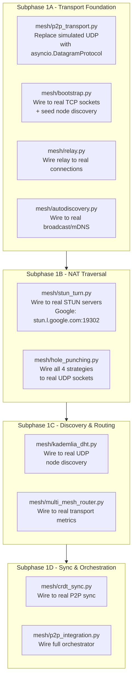

# AsimNexus — Next Steps Analysis

> **Date:** 2026-06-07
> **Context:** After completing all API gap-filling, frontend route integration, and 125/125 tests passing.

---

## Current State Summary

```
Backend APIs   ████████████████████████████████████████  100% (125/125 tests pass)
Frontend APIs  ████████████████████████████████████████  100% (unified auth, all routes mapped)
Mesh Layer     ████████░░░░░░░░░░░░░░░░░░░░░░░░░░░░░░░  ~6,000 lines, ALL simulation
Tests/real/    ██████████████████████████░░░░░░░░░░░░░░  Many real tests exist, some failing
Phase 0 bugs   ██░░░░░░░░░░░░░░░░░░░░░░░░░░░░░░░░░░░░░░  8+ known import/path test bugs
```

---

## Recommended Next Steps (Priority Order)

### 🔴 P0: Phase 0 — Fix Remaining Test Failures (IMMEDIATE)

Several test files have known import bugs that prevent them from running:

| File | Known Issue |
|------|------------|
| [`tests/stress_test.py`](tests/stress_test.py:25) | `kill_switch` import path broken |
| [`tests/test_conftest.py`](tests/test_conftest.py:21) | `conftest` import + `NameError: module_name` |
| [`tests/test_hybrid_router.py`](tests/test_hybrid_router.py:9) | Missing `KeywordClassifier` export in [`core/routing/hybrid_router.py`](core/routing/hybrid_router.py) |
| [`tests/test_integration_stress_test.py`](tests/test_integration_stress_test.py:21) | Broken import paths |
| [`tests/test_integration_test_suite.py`](tests/test_integration_test_suite.py:21) | Broken import paths |
| [`tests/test_load_test.py`](tests/test_load_test.py:21) | Broken import paths |
| [`tests/test_mock_modules.py`](tests/test_mock_modules.py:21) | Broken import paths |
| [`tests/test_multi_agent.py`](tests/test_multi_agent.py:19) | Missing `import logging` |

**Why first:** Failing tests hide regressions and make it impossible to know if new work breaks existing functionality.

---

### 🟠 P1: Mesh Networking → REAL (BIGGEST REMAINING WORK)

The mesh layer has **6,000+ lines across 10 files** but ALL use simulation/loopback instead of real sockets:



**Exit criteria:** Two instances can discover each other, exchange data, and sync state.

---

### 🟡 P2: Security Upgrades

| File | What's Needed |
|------|-------------|
| [`core/security/level3_confirmation.py`](core/security/level3_confirmation.py) | Add biometric gate + cooldown timer for sensitive operations |
| [`core/security/security_manager.py`](core/security/security_manager.py) | Harden the security framework |
| [`security/zkp_privacy.py`](security/zkp_privacy.py) | Prepare real ZK proof path |

---

### 🟢 P3: Economy & Governance

| File | What's Needed |
|------|-------------|
| [`core/economy/contract_executor.py`](core/economy/contract_executor.py) | Complete contract lifecycle (propose, gate2, sign, progress, pause, resume, cancel, complete) |
| [`economy/nexus_credits.py`](economy/nexus_credits.py) | Make cleaner, deterministic, auditable |

---

### 🔵 P4: Identity & Universe

| File | What's Needed |
|------|-------------|
| [`core/identity/user_identity.py`](core/identity/user_identity.py) | Complete role integration (citizen, admin, government, org, developer) |
| [`core/identity/did_system.py`](core/identity/did_system.py) | Complete DID flows |
| [`core/universe/personal_universe.py`](core/universe/personal_universe.py) | Fix state correctness + integration consistency |

---

### 🟣 P5: World Clones

| File | What's Needed |
|------|-------------|
| [`core/founder_clones/world_clones.py`](core/founder_clones/world_clones.py) | Integrate ensemble consensus voting |
| [`governance/`](governance/) | Connect governance logic + clone delegation |

---

## Recommended Order

```
Now:     P0 — Fix 8 known test import bugs → get full test suite green
Next:    P1A — Mesh transport to real sockets
Then:    P1B — STUN/TURN + hole punching
Then:    P1C — DHT + CRDT + router
Then:    P1D — P2P integration orchestrator
Then:    P2-P5 — Security, economy, identity, clones
```

**Total estimated work:** These 8 test fixes are small (minutes each), while the mesh networking work is the most substantial remaining effort.
