# Phase: Comprehensive Audit & Smart Advancement

## Current State Assessment

After auditing the entire AsimNexus codebase, here are the key findings:

### Structural Issues Found

| Issue | Location | Severity |
|-------|----------|----------|
| 100+ forensic_report JSON files cluttering root | `./forensic_report_*.json` | High |
| Old `frontend/react/` references in VSCode tabs (directory doesn't exist) | VSCode config | Medium |
| `security/` directory at root doesn't exist but referenced | Root level | Low |
| `core/security/hsm_production.py` exists but `core/security/hsm.py` may be duplicate | `core/security/` | Medium |
| `core/dreaming/` and `core/mirror/dreaming_engine.py` — duplicate dreaming engines | `core/` | High |
| `core/mirror/lora_engine.py` and `core/dreaming/lora_engine.py` — duplicate | `core/` | High |
| `core/economy/marketplace.py` and `core/economy/marketplace_engine.py` — potential overlap | `core/economy/` | Medium |
| `core/consensus/clone_consensus_voting.py` and `core/consensus/consensus_engine.py` — duplicate | `core/consensus/` | High |
| `core/governance/` and `governance/` at root — split governance logic | Both | High |
| `os_control/` at root and `routes/os_control.py` — split | Both | Medium |
| `asim_tools/` at root and `core/tools/` — split tool systems | Both | High |
| `mesh/` at root and `core/mesh/` — split mesh logic | Both | High |
| `core/security/power_balance_constitution.py` and `security/power_balance_constitution.py` (referenced in tabs) | Both | Medium |
| `core/audit_bus.py` and `core/security/audit_log.py` / `audit_logger.py` — triple audit systems | `core/` | High |
| `core/security/zkp_privacy.py`, `zkp_production.py`, `zkp_verification.py`, `bulletproof_zkp.py`, `real_zkp.py` — 5 ZKP files | `core/security/` | High |
| `core/security/hsm.py`, `hsm_client.py`, `hsm_integration.py`, `hsm_production.py` — 4 HSM files | `core/security/` | High |
| `core/security/hard_lock.py` and `hardware_hard_lock.py` — duplicate | `core/security/` | Medium |
| `core/identity/personal_os.py` and `core/identity/federated_identity.py` — split identity | `core/identity/` | Medium |
| `core/federation/` and `core/mesh/federation_protocol.py` — split federation | `core/` | High |
| `core/dharma/` and `core/dharma_chakra/` — split dharma systems | `core/` | Medium |
| `core/lifecycle/data_atomizer.py` standalone | `core/lifecycle/` | Low |
| `core/universe/personal_universe.py` standalone | `core/universe/` | Low |
| `core/world/economy/rbe_algorithm.py` standalone | `core/world/economy/` | Low |
| `core/security/level3_audit.db` — binary file in source | `core/security/` | Medium |
| `core/audit_store.json` — data file in source | `core/` | Medium |
| `server.log` — log file in root | `./` | Low |
| `_stats.txt` — generated stats in root | `./` | Low |
| `health_check.py` — standalone script in root | `./` | Low |
| `run_all.ps1` — script in root | `./` | Low |
| `staging_verify.py`, `_monitor_staging.py`, `_rollback_rehearsal.py` — staging scripts in root | `./` | Medium |
| `_migrate_tokens.py`, `_test_get_stats.py` — temp scripts in root | `./` | Low |
| `_audit_routes.py`, `_audit2.py`, `_deep_audit.py`, `_extract_all_routes.py`, `_extract_routes.py`, `_verify_imports.py`, `_debug_zkp.py`, `_test_chat_hang.py` — audit scripts in root | `./` | Medium |
| `backups/` directory with old backup data | `./backups/` | Low |
| `worktree_sandbox/` directory | `./worktree_sandbox/` | Low |
| `models/adapters/` with test binary files | `./models/adapters/` | Low |
| `knowledge/vector_store/` with ChromaDB binary files | `./knowledge/vector_store/` | Low |
| `data/tpm_keys/` with 50+ TPM key JSON files | `./data/tpm_keys/` | Medium |

---

## Comprehensive Plan

### Phase 1: Cleanup & Organization (Housekeeping)

**Goal**: Remove clutter, consolidate duplicates, organize project structure.

#### 1.1 — Remove Root-Level Clutter
- Move all `forensic_report_*.json` files to `./forensics/archive/`
- Move `_stats.txt`, `server.log`, `health_check.py` to `./logs/` or delete
- Move `_audit_*.py`, `_extract_*.py`, `_verify_imports.py`, `_debug_zkp.py`, `_test_chat_hang.py` to `./scripts/audit/`
- Move `_migrate_tokens.py`, `_test_get_stats.py` to `./scripts/`
- Move `staging_verify.py`, `_monitor_staging.py`, `_rollback_rehearsal.py` to `./scripts/deploy/`
- Move `run_all.ps1` to `./scripts/`
- Delete `worktree_sandbox/` if no longer needed
- Delete `backups/` old backup data (backup system exists in `scripts/db_backup.py`)
- Add `*.db`, `*.log`, `*.bin`, `forensic_report_*.json` to `.gitignore`

#### 1.2 — Consolidate Duplicate Systems

**A. Dreaming Engine Consolidation**
- Files: `core/dreaming/dreaming_engine.py`, `core/mirror/dreaming_engine.py`
- Action: Merge into `core/dreaming/dreaming_engine.py` as the single source
- Update all imports in `app.py` and other files

**B. LoRA Engine Consolidation**
- Files: `core/dreaming/lora_engine.py`, `core/mirror/lora_engine.py`
- Action: Merge into `core/mirror/lora_engine.py` (MirrorModule uses it)
- Update imports

**C. Consensus Engine Consolidation**
- Files: `core/consensus/clone_consensus_voting.py`, `core/consensus/consensus_engine.py`, `core/consensus/clone_consensus.py`
- Action: Merge into `core/consensus/consensus_engine.py` as primary
- Remove `clone_consensus_voting.py` and `clone_consensus.py`

**D. ZKP System Consolidation**
- Files: `core/security/zkp_privacy.py`, `zkp_production.py`, `zkp_verification.py`, `bulletproof_zkp.py`, `real_zkp.py`
- Action: Create `core/security/zkp/` package with:
  - `__init__.py` — exports unified ZKP interface
  - `core.py` — core ZKP logic
  - `bulletproof.py` — bulletproof implementation
  - `production.py` — production-ready ZKP
  - `verification.py` — verification logic
- Remove old 5 files

**E. HSM System Consolidation**
- Files: `core/security/hsm.py`, `hsm_client.py`, `hsm_integration.py`, `hsm_production.py`
- Action: Create `core/security/hsm/` package with:
  - `__init__.py` — exports unified HSM interface
  - `client.py` — HSM client
  - `integration.py` — integration logic
  - `production.py` — production config
- Remove old 4 files

**F. Audit System Consolidation**
- Files: `core/audit_bus.py`, `core/security/audit_log.py`, `core/security/audit_logger.py`
- Action: Merge into `core/security/audit/` package
- Remove old files

**G. Governance Consolidation**
- Files: `core/governance/` and `governance/` at root
- Action: Move `governance/` root content into `core/governance/`
- Remove root `governance/` directory

**H. Mesh Consolidation**
- Files: `mesh/` at root and `core/mesh/`
- Action: Move `mesh/` root content into `core/mesh/`
- Remove root `mesh/` directory

**I. Tools Consolidation**
- Files: `asim_tools/` at root and `core/tools/`
- Action: Move `asim_tools/` into `core/tools/asim_tools/`
- Remove root `asim_tools/` directory

**J. OS Control Consolidation**
- Files: `os_control/` at root and `routes/os_control.py`
- Action: Move `os_control/` into `core/os_control/`
- Remove root `os_control/` directory

**K. Hard Lock Consolidation**
- Files: `core/security/hard_lock.py`, `core/security/hardware_hard_lock.py`
- Action: Merge into `core/security/hard_lock.py`
- Remove `hardware_hard_lock.py`

**L. Identity Consolidation**
- Files: `core/identity/personal_os.py`, `core/identity/federated_identity.py`
- Action: Merge into `core/identity/` package with clear separation

**M. Federation Consolidation**
- Files: `core/federation/` and `core/mesh/federation_protocol.py`
- Action: Move federation_protocol into `core/federation/`
- Remove from `core/mesh/`

**N. Dharma Consolidation**
- Files: `core/dharma/` and `core/dharma_chakra/`
- Action: Merge into `core/dharma/` package
- Remove `core/dharma_chakra/`

**O. Marketplace Consolidation**
- Files: `core/economy/marketplace.py`, `core/economy/marketplace_engine.py`
- Action: Merge into `core/economy/marketplace.py`

---

### Phase 2: Missing `__init__.py` & Package Structure Fix

**Goal**: Ensure every Python package has a proper `__init__.py`.

#### 2.1 — Add Missing `__init__.py` Files
Check and add for:
- `core/agent/` — has files but check if `__init__.py` exists
- `core/agents/` — has `base_agent.py`, `education_agent.py`, `finance_agent.py`
- `core/analytics/` — has `data_lake.py`
- `core/api/` — check
- `core/api_endpoints/` — has `wallet_api.py`
- `core/asim_brain/` — check
- `core/compliance/` — check
- `core/data/` — has `__init__.py` ✓
- `core/depin/` — has `__init__.py` ✓
- `core/dharma/` — has `__init__.py` ✓
- `core/dharma_chakra/` — has `__init__.py` ✓
- `core/dreaming/` — has `__init__.py` ✓
- `core/economy/` — has `__init__.py` ✓
- `core/evolution/` — has `__init__.py` ✓
- `core/federation/` — has `__init__.py` ✓
- `core/finance/` — has `__init__.py` ✓
- `core/founder_clones/` — has `__init__.py` ✓
- `core/gateway/` — has `__init__.py` ✓
- `core/governance/` — has `__init__.py` ✓
- `core/government/` — has `__init__.py` ✓
- `core/identity/` — has `__init__.py` ✓
- `core/integration/` — has `__init__.py` ✓
- `core/kernel/` — has `__init__.py` ✓
- `core/lifecycle/` — has `__init__.py` ✓
- `core/mcp/` — has `__init__.py` ✓
- `core/mesh/` — has `__init__.py` ✓
- `core/mirror/` — has `__init__.py` ✓
- `core/nepal/` — has `__init__.py` ✓
- `core/network/` — has `__init__.py` ✓
- `core/orchestrator/` — has `__init__.py` ✓
- `core/policy/` — has `__init__.py` ✓
- `core/routing/` — has `__init__.py` ✓
- `core/sandbox/` — has `__init__.py` ✓
- `core/security/` — has `__init__.py` ✓
- `core/self_awareness/` — has `__init__.py` ✓
- `core/sync/` — has `__init__.py` ✓
- `core/tools/` — has `__init__.py` ✓
- `core/universal/` — has `__init__.py` ✓
- `core/universe/` — has `__init__.py` ✓
- `core/world/` — has `__init__.py` ✓

#### 2.2 — Fix `__init__.py` Content
- Ensure all `__init__.py` files have proper `__all__` exports
- Add docstrings to all `__init__.py` files

---

### Phase 3: Import Path Fixes

**Goal**: Fix all import paths broken by consolidation moves.

#### 3.1 — Update `app.py` Imports
- Fix dreaming engine import path
- Fix mesh import paths
- Fix governance import paths
- Fix all consolidated module imports

#### 3.2 — Update Route Files
- Check all `routes/*.py` files for broken imports
- Fix any import paths

#### 3.3 — Update Test Files
- Check all `tests/*.py` files for broken imports
- Fix any import paths

---

### Phase 4: Test Suite Organization

**Goal**: Organize tests logically and ensure they all pass.

#### 4.1 — Reorganize Test Files
- `tests/real/` — keep as integration tests
- `tests/unit/` — keep as unit tests
- `tests/integration/` — merge with `tests/real/` or keep separate
- `tests/e2e/` — keep as end-to-end tests
- `tests/smoke/` — keep as smoke tests
- `tests/security/` — keep as security tests
- `tests/performance/` — keep as performance tests
- `tests/regression/` — keep as regression tests
- `tests/prototype/` — move to `tests/archive/` or delete

#### 4.2 — Fix Test Imports
- Update all test imports to match new package structure

#### 4.3 — Run Full Test Suite
- Execute `python -m pytest tests/ -x -q` and fix failures

---

### Phase 5: Configuration & Environment

**Goal**: Centralize configuration and environment management.

#### 5.1 — Create Central Config
- Enhance `asim_config.py` to load all settings from `.env`
- Create config sections for each subsystem

#### 5.2 — Clean Up `.env`
- Remove unused variables
- Add documentation for each variable
- Create `.env.example` with all documented vars

#### 5.3 — Docker Compose Enhancement
- Update `infrastructure/docker/docker-compose.prod.yml`
- Add Prometheus, Grafana services
- Add Redis service
- Add PostgreSQL service (optional)

---

### Phase 6: Documentation & API Contract

**Goal**: Ensure all APIs are documented and tested.

#### 6.1 — API Contract Verification
- Run `tests/real/test_api_contract.py` and fix failures
- Add missing endpoint tests

#### 6.2 — OpenAPI Schema Generation
- Generate OpenAPI JSON schema from FastAPI app
- Serve at `/openapi.json` and `/docs`

#### 6.3 — Update API_DOCS.md
- Verify all 634 routes are documented
- Add missing route documentation

---

### Phase 7: Security Hardening (Deep)

**Goal**: Deep security audit and hardening.

#### 7.1 — Run Security Audit
- Execute `scripts/security_audit.py` and fix findings
- Check for hardcoded secrets
- Verify JWT implementation

#### 7.2 — Input Sanitization Audit
- Check all route files for input validation
- Ensure `input_sanitizer.py` is used everywhere

#### 7.3 — Rate Limiting Review
- Verify `rate_limiter_middleware.py` is applied to all routes
- Add rate limits for sensitive endpoints

---

### Phase 8: Performance Optimization

**Goal**: Identify and fix performance bottlenecks.

#### 8.1 — Run Performance Benchmarks
- Execute `tests/real/test_performance_benchmarks.py`
- Identify slow endpoints

#### 8.2 — Database Query Optimization
- Review SQLite queries for performance
- Add indexes where needed

#### 8.3 — Caching Strategy
- Implement Redis caching for frequently accessed data
- Add response caching middleware

---

### Phase 9: Frontend-Backend Integration

**Goal**: Ensure frontend properly connects to all backend APIs.

#### 9.1 — API Client Audit
- Verify `frontend/src/api/asimnexus.ts` covers all endpoints
- Add missing API methods

#### 9.2 — Component-API Wiring
- Ensure all frontend components use the API layer
- Remove direct fetch calls

#### 9.3 — Error Handling
- Add consistent error handling across all API calls
- Add loading states and error displays

---

### Phase 10: Self-Building Loop Enhancement

**Goal**: Make the AutoBuilder smarter and more autonomous.

#### 10.1 — Gap Analyzer Enhancement
- Add more gap detectors:
  - Missing error handling in routes
  - Missing type hints
  - Circular imports
  - Dead code detection
  - Performance anti-patterns

#### 10.2 — AutoBuilder Enhancement
- Add parallel action execution
- Add smarter rollback (partial rollback)
- Add build scheduling with priority queues
- Add self-healing for common issues

#### 10.3 — Self-Healing Expansion
- Add auto-fix for missing type hints
- Add auto-fix for circular imports
- Add auto-fix for common security issues

---

## Implementation Order

```
Phase 1: Cleanup & Organization
  ├── 1.1 Remove root clutter
  ├── 1.2A Dreaming Engine consolidation
  ├── 1.2B LoRA Engine consolidation
  ├── 1.2C Consensus consolidation
  ├── 1.2D ZKP consolidation
  ├── 1.2E HSM consolidation
  ├── 1.2F Audit consolidation
  ├── 1.2G Governance consolidation
  ├── 1.2H Mesh consolidation
  ├── 1.2I Tools consolidation
  ├── 1.2J OS Control consolidation
  ├── 1.2K Hard Lock consolidation
  ├── 1.2L Identity consolidation
  ├── 1.2M Federation consolidation
  ├── 1.2N Dharma consolidation
  └── 1.2O Marketplace consolidation

Phase 2: Package Structure Fix
  ├── 2.1 Add missing __init__.py
  └── 2.2 Fix __init__.py content

Phase 3: Import Path Fixes
  ├── 3.1 Update app.py imports
  ├── 3.2 Update route files
  └── 3.3 Update test files

Phase 4: Test Suite Organization
  ├── 4.1 Reorganize test files
  ├── 4.2 Fix test imports
  └── 4.3 Run full test suite

Phase 5: Configuration & Environment
  ├── 5.1 Central config
  ├── 5.2 Clean up .env
  └── 5.3 Docker Compose enhancement

Phase 6: Documentation & API Contract
  ├── 6.1 API contract verification
  ├── 6.2 OpenAPI schema generation
  └── 6.3 Update API_DOCS.md

Phase 7: Security Hardening
  ├── 7.1 Run security audit
  ├── 7.2 Input sanitization audit
  └── 7.3 Rate limiting review

Phase 8: Performance Optimization
  ├── 8.1 Run benchmarks
  ├── 8.2 Database optimization
  └── 8.3 Caching strategy

Phase 9: Frontend-Backend Integration
  ├── 9.1 API client audit
  ├── 9.2 Component-API wiring
  └── 9.3 Error handling

Phase 10: Self-Building Loop Enhancement
  ├── 10.1 Gap analyzer enhancement
  ├── 10.2 AutoBuilder enhancement
  └── 10.3 Self-healing expansion
```

---

## Architecture Diagram: Current vs Target State

```mermaid
flowchart TD
    subgraph CURRENT["Current State - Duplicated Systems"]
        D1["core/dreaming/dreaming_engine.py"]
        D2["core/mirror/dreaming_engine.py"]
        L1["core/dreaming/lora_engine.py"]
        L2["core/mirror/lora_engine.py"]
        C1["core/consensus/consensus_engine.py"]
        C2["core/consensus/clone_consensus_voting.py"]
        Z1["core/security/zkp_privacy.py"]
        Z2["core/security/zkp_production.py"]
        Z3["core/security/zkp_verification.py"]
        Z4["core/security/bulletproof_zkp.py"]
        Z5["core/security/real_zkp.py"]
        H1["core/security/hsm.py"]
        H2["core/security/hsm_client.py"]
        H3["core/security/hsm_integration.py"]
        H4["core/security/hsm_production.py"]
        A1["core/audit_bus.py"]
        A2["core/security/audit_log.py"]
        A3["core/security/audit_logger.py"]
        G1["core/governance/"]
        G2["governance/ root"]
        M1["core/mesh/"]
        M2["mesh/ root"]
        T1["core/tools/"]
        T2["asim_tools/ root"]
        O1["os_control/ root"]
        O2["routes/os_control.py"]
        F1["core/federation/"]
        F2["core/mesh/federation_protocol.py"]
        DH1["core/dharma/"]
        DH2["core/dharma_chakra/"]
    end

    subgraph TARGET["Target State - Consolidated"]
        D["core/dreaming/dreaming_engine.py"]
        L["core/mirror/lora_engine.py"]
        C["core/consensus/consensus_engine.py"]
        Z["core/security/zkp/ package"]
        H["core/security/hsm/ package"]
        A["core/security/audit/ package"]
        G["core/governance/"]
        M["core/mesh/"]
        T["core/tools/"]
        O["core/os_control/"]
        F["core/federation/"]
        DH["core/dharma/"]
    end

    D1 --> D
    D2 --> D
    L1 --> L
    L2 --> L
    C1 --> C
    C2 --> C
    Z1 --> Z
    Z2 --> Z
    Z3 --> Z
    Z4 --> Z
    Z5 --> Z
    H1 --> H
    H2 --> H
    H3 --> H
    H4 --> H
    A1 --> A
    A2 --> A
    A3 --> A
    G1 --> G
    G2 --> G
    M1 --> M
    M2 --> M
    T1 --> T
    T2 --> T
    O1 --> O
    O2 --> O
    F1 --> F
    F2 --> F
    DH1 --> DH
    DH2 --> DH
```



---

## Risk Assessment

| Risk | Impact | Mitigation |
|------|--------|------------|
| Broken imports after consolidation | High | Run full test suite after each consolidation step |
| Missing functionality after merge | High | Keep old files until new consolidated files are verified |
| Test failures from path changes | Medium | Fix imports incrementally, run tests after each change |
| Data loss from cleanup | Low | Use `scripts/db_backup.py` before cleanup |
| Frontend build breaks | Medium | Verify frontend builds after each change |
| Runtime errors from import changes | High | Test server startup after each consolidation phase |

---

## Success Criteria

1. All duplicate files consolidated into single sources
2. All `__init__.py` files present and correct
3. All imports resolve correctly
4. Full test suite passes (734+ tests)
5. Server starts without import errors
6. Frontend builds without errors
7. All 634 API routes functional
8. Security audit passes with zero critical findings
9. Performance benchmarks within acceptable thresholds
10. AutoBuilder can run a complete self-building cycle
