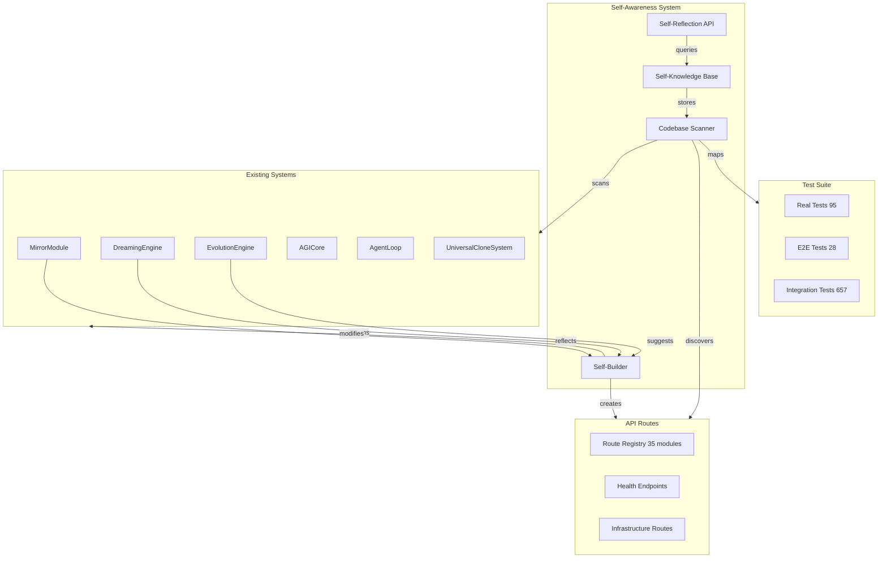

# AsimNexus Self-Awareness & Self-Building System

## Vision
Make AsimNexus fully self-aware - able to understand its own codebase, architecture, components, and build/modify itself autonomously. AsimNexus should know everything about AsimNexus.

## Current State Analysis

### What Already Exists
1. **MirrorModule** (`core/mirror/mirror_module.py`) - Digital Twin per user with self-evolution
2. **DreamingEngine** (`core/dreaming/dreaming_engine.py`) - Background memory consolidation
3. **EvolutionEngine** (`core/evolution/evolution_engine.py`) - Tesla FSD pattern code improvement
4. **AGICore** (`core/agi_core.py`) - Reasoning chains, safety constraints
5. **AgentLoop** (`core/agent_loop.py`) - Multi-round autonomous agent execution
6. **UniversalCloneSystem** (`core/universal_clone_system.py`) - Pattern recognition
7. **MCPManager** (`core/mcp/mcp_manager.py`) - MCP tool server management
8. **BuiltinServers** (`core/mcp/builtin_servers.py`) - 5 built-in MCP servers
9. **Health check** (`health_check.py`) - System health verification
10. **780 passing tests** - Comprehensive test coverage

### What's Missing (Problems to Fix)

#### A. Deep Bugs & Issues Found

1. **`core/security/jwt.py` uses 30-byte HMAC key** (below 32-byte minimum per RFC 7518)
   - File: `core/security/jwt.py`
   - Warning: `InsecureKeyLengthWarning: The HMAC key is 30 bytes long`
   - Fix: Increase key to 32+ bytes

2. **`core/security/auth_middleware.py` has `jwt` name shadowing** (FIXED but verify)
   - File: `core/security/auth_middleware.py`
   - Status: Fixed with `import jwt as pyjwt`

3. **`core/quantum_bridge.py` has Pyrefly parse errors** (false positives from language server)
   - File: `core/quantum_bridge.py`
   - Status: Non-critical, language server issues

4. **`tests/smoke/test_finance.py` returns bool instead of using assert**
   - File: `tests/smoke/test_finance.py`
   - Warning: `PytestReturnNotNoneWarning`

5. **`tests/smoke/test_government.py` returns bool instead of using assert**
   - File: `tests/smoke/test_government.py`
   - Warning: `PytestReturnNotNoneWarning`

6. **`tests/smoke/test_infrastructure.py` returns bool instead of using assert**
   - File: `tests/smoke/test_infrastructure.py`
   - Warning: `PytestReturnNotNoneWarning`

7. **`tests/smoke/test_platform.py` returns bool instead of using assert**
   - File: `tests/smoke/test_platform.py`
   - Warning: `PytestReturnNotNoneWarning`

8. **`tests/smoke/test_universal.py` returns bool instead of using assert**
   - File: `tests/smoke/test_universal.py`
   - Warning: `PytestReturnNotNoneWarning`

9. **`tests/unit/test_suite.py` has classes with `__init__` that pytest can't collect**
   - File: `tests/unit/test_suite.py`
   - Warning: `PytestCollectionWarning`

10. **43 integration tests are SKIPPED** - need investigation
    - Some are database-dependent (test_database_tables_created)
    - Some are company/payment related
    - Some are control panel tests

11. **`core/federation/__init__.py` has `get_global_federation_governor()` coroutine not awaited**
    - Warning: `RuntimeWarning: coroutine 'get_global_federation_governor' was never awaited`

12. **`core/security/jwt.py` uses fallback mode** - HSM client import fails silently
    - The `_get_hsm_client()` function tries to import and falls back to None
    - This means JWT signing uses software fallback, not HSM

13. **`core/cdn.py` and `core/platform.py` are stubs** - created as minimal implementations
    - Need real implementations with actual CDN/platform logic

14. **MeshCoordinator has 0 nodes** - `initialize_local_node()` is never called at startup
    - The mesh network starts empty

15. **No route exists for self-reflection** - No API endpoint that lets AsimNexus introspect itself

#### B. Self-Awareness System (New)

Need to create a **SelfAwarenessSystem** that:

1. **Codebase Scanner** - Scans all Python/TypeScript files and builds a knowledge graph of:
   - All modules, classes, functions, routes, endpoints
   - Dependencies between modules
   - Import relationships
   - Test coverage per module

2. **Self-Reflection API** - REST endpoints that let AsimNexus query itself:
   - `GET /api/system/self/modules` - List all modules
   - `GET /api/system/self/module/{name}` - Get module details
   - `GET /api/system/self/dependencies` - Get dependency graph
   - `GET /api/system/self/routes` - List all API routes
   - `GET /api/system/self/coverage` - Test coverage per module
   - `GET /api/system/self/health` - Comprehensive health with module status
   - `GET /api/system/self/errors` - Known errors and warnings
   - `POST /api/system/self/scan` - Trigger a full codebase scan

3. **Self-Building System** - Ability to:
   - Generate new route stubs from templates
   - Add missing imports
   - Fix common code patterns
   - Generate tests for uncovered modules
   - Apply evolution suggestions automatically

4. **Self-Knowledge Base** - Persistent storage of:
   - Module registry (what exists)
   - Dependency graph (what connects to what)
   - Issue tracker (known bugs, warnings)
   - Evolution history (what changed and why)

#### C. Architecture Diagram

#### D. Implementation Plan

### Phase A: Deep Bug Fixes
1. Fix HMAC key length in `core/security/jwt.py` (30 -> 32 bytes)
2. Fix `tests/smoke/*.py` return-bool warnings (use assert)
3. Fix `tests/unit/test_suite.py` collection warnings
4. Investigate and fix 43 skipped integration tests
5. Fix `core/federation/__init__.py` coroutine not awaited
6. Add `initialize_local_node()` call at app startup
7. Replace CDN/Platform stubs with real implementations

### Phase B: Self-Awareness Core
1. Create `core/self_awareness/codebase_scanner.py`
   - AST-based module scanner
   - Dependency graph builder
   - Route discovery
   - Test coverage mapper

2. Create `core/self_awareness/self_knowledge.py`
   - Knowledge base data models
   - Persistent storage (JSONL)
   - Query interface

3. Create `core/self_awareness/self_builder.py`
   - Template-based code generation
   - Import fixer
   - Test generator
   - Evolution suggestion applier

4. Create `core/self_awareness/__init__.py`
   - Module exports
   - Singleton management

### Phase C: Self-Reflection API
1. Create `routes/self_awareness.py`
   - All self-reflection endpoints
   - Self-building endpoints (with auth)
   - Health introspection

2. Register in `routes/__init__.py`

### Phase D: Self-Building Integration
1. Connect EvolutionEngine suggestions to SelfBuilder
2. Connect MirrorModule reflections to SelfBuilder
3. Add auto-apply mode for low-risk suggestions
4. Create rollback mechanism for applied changes

### Phase E: Tests
1. Create `tests/real/test_self_awareness.py`
2. Create `tests/integration/test_self_awareness.py`
3. Create `tests/e2e/test_self_awareness_e2e.py`

## Files to Create
| File | Purpose |
|------|---------|
| `core/self_awareness/__init__.py` | Module exports |
| `core/self_awareness/codebase_scanner.py` | AST-based codebase analysis |
| `core/self_awareness/self_knowledge.py` | Knowledge base storage |
| `core/self_awareness/self_builder.py` | Code generation & modification |
| `routes/self_awareness.py` | Self-reflection API endpoints |
| `tests/real/test_self_awareness.py` | Unit tests |
| `tests/integration/test_self_awareness.py` | Integration tests |
| `tests/e2e/test_self_awareness_e2e.py` | E2E tests |

## Files to Modify
| File | Change |
|------|--------|
| `core/security/jwt.py` | Fix HMAC key length 30->32 bytes |
| `tests/smoke/test_finance.py` | Use assert instead of return |
| `tests/smoke/test_government.py` | Use assert instead of return |
| `tests/smoke/test_infrastructure.py` | Use assert instead of return |
| `tests/smoke/test_platform.py` | Use assert instead of return |
| `tests/smoke/test_universal.py` | Use assert instead of return |
| `routes/__init__.py` | Register self_awareness router |
| `app.py` | Initialize self-awareness system |
| `core/federation/__init__.py` | Fix coroutine await |
