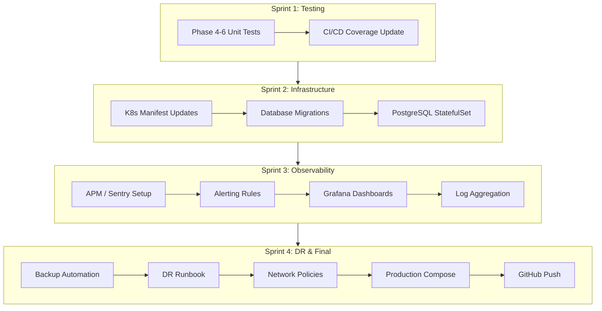
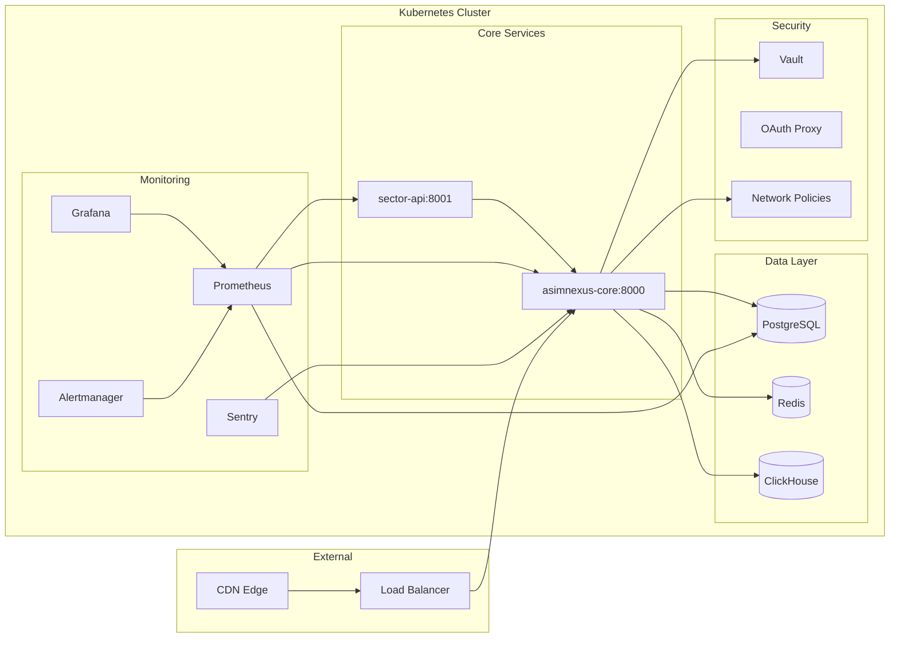

# ASIMNEXUS Production-Readiness Architecture Plan

## Executive Summary

The Production-Readiness Check Report assessed ASIMNEXUS at **55% overall**. My survey found **several false negatives** in that report (CI/CD, K8s manifests, security scanning, tests, .env.example all already exist). Below is the **corrected assessment** with **REAL gaps** identified and prioritized.

### Corrected Readiness Scores

| Category | Report Claim | Actual | Verdict |
|---|---|---|---|
| Code Architecture | 90% | 90% | ✅ Accurate |
| Documentation | 85% | 85% | ✅ Accurate |
| Security Framework | 75% | 75% | ✅ Accurate |
| Testing | 40% | **65%** | ⚠️ Report understated — 45+ tests exist, but Phase 4-6 untested |
| DevOps/Deployment | 45% | **70%** | ⚠️ Report understated — CI/CD, K8s, HPA, multi-cloud all exist |
| Monitoring/Logging | 25% | 25% | ✅ Accurate — Real gap |

**Corrected Overall: ~68%** (was 55%)

---

## REAL Gaps vs False Claims

### ❌ FALSE CLAIMS in Report (Already Exist)

| Report Said | Reality | Evidence |
|---|---|---|
| "No CI/CD pipeline" | ✅ Full CI/CD exists | `.github/workflows/ci-cd.yml` (317 lines) |
| "No K8s manifests" | ✅ Full K8s manifests | `k8s/` with deployment, HPA, ingress, configmap, secret, kustomization |
| "No auto-scaling" | ✅ HPA configured | `k8s/asimnexus-hpa.yaml` — 3-10 replicas, CPU 70%/mem 80% |
| "No security scanning" | ✅ 5 scanners in CI | Trivy, Bandit, Semgrep, custom audit, Safety |
| "No code coverage" | ✅ Pushes to Codecov | CI/CD step: `codecov/codecov-action@v4` |
| "No tests" | ✅ 45+ test files | `tests/real/`, `tests/e2e/`, `tests/integration/`, `tests/smoke/`, `tests/regression/` |
| ".env.example needs work" | ✅ Comprehensive | 377 lines covering all providers, integrations, services |

---

### 🔴 REAL GAPS (Priority-Ordered)

## Priority 1: Phase 4-6 Test Coverage

**Files to create:**
- `tests/real/test_sector_hospital_api.py` — Hospital sector endpoint tests
- `tests/real/test_sector_hotel_api.py` — Hotel sector endpoint tests
- `tests/real/test_sector_education_api.py` — Education sector endpoint tests
- `tests/real/test_sector_banking_api.py` — Banking sector endpoint tests
- `tests/real/test_global_agent_api.py` — Global agent mode endpoint tests
- `tests/real/test_hardening_api.py` — Hardening/security endpoint tests
- `tests/real/test_sector_integration.py` — Cross-sector integration tests

**CI/CD update:**
- Add `core.sectors` and `core.api_endpoints` to pytest `--cov` in ci-cd.yml

## Priority 2: K8s Manifests Update

**Updates needed:**

| File | Change |
|---|---|
| `k8s/configmap.yaml` | Add sector service endpoints, global agent config, hardening config |
| `k8s/secret.yaml` | Add sector-specific API keys, database credentials |
| `k8s/kustomization.yaml` | Add sector deployment resources |

**New files:**
- `k8s/sector-api-deployment.yaml` — Dedicated deployment for sector APIs with resource isolation
- `k8s/sector-api-service.yaml` — Service for sector API deployment
- `k8s/sector-api-hpa.yaml` — HPA for sector APIs (2-8 replicas)

**Architecture Decision:**
Sector APIs can run in the main `asimnexus-core` deployment OR as a separate microservice. Given the 51/49 constitutional model, sector APIs should remain in the core monolith but with separate HPA thresholds.

## Priority 3: Database Migration System

**Files to create:**
- `migrations/` directory with Alembic setup
- `migrations/env.py` — Alembic environment config
- `migrations/script.py.mako` — Migration template
- `migrations/versions/001_initial_schema.py` — Initial schema migration
- `migrations/versions/002_sector_tables.py` — Sector module tables
- `migrations/versions/003_agent_global_tables.py` — Global agent tables
- `docker/postgres/init/02_sector_schema.sql` — Sector-specific PG schema

## Priority 4: APM & Error Tracking

**Files to create:**
- `monitoring/sentry_config.py` — Sentry SDK initialization
- `monitoring/apm_integration.py` — Generic APM wrapper (supports Sentry/DataDog/OpenTelemetry)

**Config changes:**
- Add `SENTRY_DSN` to `.env.example`
- Add APM middleware to `simple_backend.py`

## Priority 5: Database Backup & Disaster Recovery

**Files to create:**
- `scripts/backup_pg.sh` — PostgreSQL automated backup script
- `scripts/backup_sqlite.sh` — SQLite backup script (for dev)
- `scripts/restore.sh` — Restore procedure script
- `docs/operations/DISASTER_RECOVERY.md` — DR runbook
- `k8s/backup-cronjob.yaml` — K8s CronJob for automated backups

## Priority 6: Monitoring & Alerting

**Files to create:**
- `monitoring/prometheus/rules.yml` — Alerting rules
- `monitoring/grafana/dashboards/asimnexus-overview.json` — Grafana dashboard
- `monitoring/logging/filebeat.yml` — Log shipping config
- `monitoring/alertmanager/config.yml` — Alertmanager config

## Priority 7: Production Finalization

**Files to create/update:**
- `docker-compose.prod.yml` — Production-only compose with all services enabled
- `.env.example` — Finalize remaining placeholder values with documentation
- `scripts/health_check.sh` — Comprehensive health check script
- `deployment/kubernetes/postgres-statefulset.yaml` — Production PG with persistent storage
- `k8s/network-policy.yaml` — Network isolation policies

---

## Implementation Order



---

## Detailed Implementation Steps

### Step 1: Phase 4-6 Tests

Create test files following the existing pattern in `tests/real/test_deployment_build.py` — use `pytest` + `httpx.AsyncClient` against the FastAPI test client.

**Test coverage targets:**
- Hospital sector: 10+ tests (create patient, schedule appointment, get medical records, billing)
- Hotel sector: 10+ tests (book room, check-in, check-out, manage inventory)
- Education sector: 10+ tests (enroll student, create course, grade, attendance)
- Banking sector: 10+ tests (open account, transfer, loan application, transaction history)
- Global agent: 8+ tests (discovery, region management, cross-border sync, personal OS mode)
- Hardening: 6+ tests (audit status, run audit, config validation)

### Step 2: Update CI/CD

Modify line 54 of `.github/workflows/ci-cd.yml`:
```
pytest tests/ -v --cov=core --cov=agents ... --cov=core.sectors --cov=core.api_endpoints --cov-report=xml
```

### Step 3: K8s Manifests

Update `k8s/configmap.yaml` to add sector API configurations, global agent settings, and hardening parameters. Update `k8s/kustomization.yaml` to reference any new resources.

### Step 4: Database Migrations

Initialize Alembic with:
```
alembic init migrations
```
Create initial migration for existing schema, then sector-specific migration.

### Step 5: APM Integration

Add `sentry-sdk` to `requirements.txt`, initialize in `simple_backend.py` `create_app()`:
```python
import sentry_sdk
from sentry_sdk.integrations.fastapi import FastApiIntegration

sentry_sdk.init(
    dsn=os.getenv("SENTRY_DSN"),
    integrations=[FastApiIntegration()],
    traces_sample_rate=1.0,
    environment=os.getenv("ASIM_ENV", "development"),
)
```

### Step 6: Backup & DR

Create K8s CronJob that runs `pg_dump` daily, stores to S3-compatible storage. Create DR runbook.

### Step 7: Monitoring

Create Prometheus alerting rules for:
- High error rate (>5% 5xx responses)
- High latency (p99 > 2s)
- Pod crash loops
- Disk space > 80%
- Memory pressure

### Step 8: Final Production Configuration

- Update `docker-compose.prod.yml` with all services enabled (Redis, PostgreSQL, ClickHouse)
- Finalize `.env.example` with clear documentation for each variable
- Add network policies in K8s

---

## Architecture Diagram



---

## Files to Create (Summary)

| # | File | Purpose |
|---|---|---|
| 1 | `tests/real/test_sector_hospital_api.py` | Hospital sector endpoint tests |
| 2 | `tests/real/test_sector_hotel_api.py` | Hotel sector endpoint tests |
| 3 | `tests/real/test_sector_education_api.py` | Education sector endpoint tests |
| 4 | `tests/real/test_sector_banking_api.py` | Banking sector endpoint tests |
| 5 | `tests/real/test_global_agent_api.py` | Global agent mode tests |
| 6 | `tests/real/test_hardening_api.py` | Hardening API tests |
| 7 | `tests/real/test_sector_integration.py` | Cross-sector integration tests |
| 8 | `k8s/sector-api-deployment.yaml` | Sector API K8s deployment |
| 9 | `k8s/sector-api-service.yaml` | Sector API K8s service |
| 10 | `k8s/sector-api-hpa.yaml` | Sector API HPA |
| 11 | `k8s/network-policy.yaml` | Network isolation policies |
| 12 | `k8s/backup-cronjob.yaml` | Automated backup CronJob |
| 13 | `migrations/env.py` | Alembic environment |
| 14 | `migrations/script.py.mako` | Alembic migration template |
| 15 | `migrations/versions/001_initial_schema.py` | Initial schema |
| 16 | `migrations/versions/002_sector_tables.py` | Sector tables migration |
| 17 | `monitoring/sentry_config.py` | Sentry SDK initialization |
| 18 | `monitoring/apm_integration.py` | APM wrapper |
| 19 | `monitoring/prometheus/rules.yml` | Alerting rules |
| 20 | `monitoring/grafana/dashboards/asimnexus-overview.json` | Grafana dashboard |
| 21 | `monitoring/alertmanager/config.yml` | Alertmanager config |
| 22 | `scripts/backup_pg.sh` | PostgreSQL backup script |
| 23 | `scripts/backup_sqlite.sh` | SQLite backup script |
| 24 | `scripts/restore.sh` | Restore procedure |
| 25 | `docs/operations/DISASTER_RECOVERY.md` | DR runbook |
| 26 | `docker/postgres/init/02_sector_schema.sql` | Sector PG schema |
| 27 | `docker-compose.prod.yml` | Production compose file |

## Files to Modify (Summary)

| # | File | Change |
|---|---|---|
| 1 | `.github/workflows/ci-cd.yml` | Add `core.sectors` and `core.api_endpoints` to pytest --cov |
| 2 | `k8s/configmap.yaml` | Add sector/global agent/hardening config |
| 3 | `k8s/secret.yaml` | Add sector-specific secrets |
| 4 | `k8s/kustomization.yaml` | Reference new sector resources |
| 5 | `.env.example` | Add SENTRY_DSN, finalize placeholders |
| 6 | `simple_backend.py` | Add Sentry initialization |
| 7 | `requirements.txt` | Add sentry-sdk, alembic |
