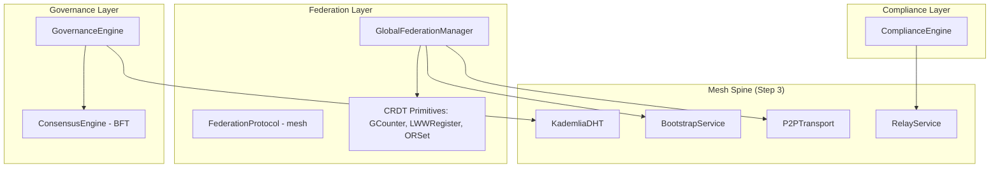

# Step 4: Federation & Governance — Plan

## Current State Assessment

### Existing Code Inventory (all UNTESTED)

| Module | Path | Status | Lines | Priority |
|--------|------|--------|-------|----------|
| Global Federation | `core/federation/global_federation.py` | PARTIAL | 351 | **HIGH** |
| BFT Consensus | `core/infrastructure/consensus_engine.py` | CONCEPT | 295 | **HIGH** |
| Governance Engine | `core/governance/consensus.py` | CONCEPT | 300 | **HIGH** |
| Compliance Engine | `governance/compliance_engine.py` | PARTIAL | 414 | MEDIUM |
| Mesh Federation | `core/mesh/federation_protocol.py` | CONCEPT | 276 | MEDIUM |
| Federated Mesh | `core/infrastructure/federated_mesh.py` | PARTIAL | 456 | LOW |
| Dharma Council | `governance/dharma_chakra_council.py` | CONCEPT | 413 | LOW |
| Founder Structure | `governance/founder_structure.py` | PARTIAL | 298 | LOW |
| Founder Sync | `governance/founder_sync_protocol.py` | CONCEPT | 771 | LOW |

### Critical Issues Found
1. **Name collision**: `get_federation()` in both `core/federation/global_federation.py` and `core/mesh/federation_protocol.py`
2. **Name collision**: `get_consensus_engine()` in both `core/infrastructure/consensus_engine.py` and `core/consensus/clone_consensus.py`
3. **Zero tests** across all 9 governance/federation modules
4. **No env var hardening** in any governance/federation module
5. **No integration** with the mesh spine completed in Step 3

---

## Phase A: Federation Layer (HIGH priority)

### Files to modify:
- `core/federation/global_federation.py`
- `core/mesh/federation_protocol.py`

### Tasks:

**A1: Fix name collision** — Rename `get_federation()` in `core/mesh/federation_protocol.py` to `get_mesh_federation()`

**A2: Harden GlobalFederationManager** with env vars:
- `ASIM_FED_NODE_ID` — override node_id
- `ASIM_FED_DATA_DIR` — override data directory (default: `data/federation/`)
- `ASIM_FED_SYNC_INTERVAL` — sync interval in seconds
- `ASIM_FED_MAX_PEERS` — max peers limit

**A3: Add missing features:**
- Add `remove_peer()` method
- Add `get_stats()` method returning dict
- Add `__init__.py` exports to `core/federation/`

**A4: Create test file:** `tests/real/test_federation.py`
Test cases:
- GCounter CRDT: increment, value, merge, state serialization
- LWWRegister CRDT: set, get, merge with timestamp ordering
- ORSet CRDT: add, remove, elements, merge
- FederatedNodeState: to_sync_packet, merge_packet counts changes
- GlobalFederationManager: add_peer, consent_peer, revoke_peer
- receive_sync: rejects without consent, accepts with consent
- status() returns dict with expected keys
- Env var overrides for data dir and sync interval

---

## Phase B: Governance Engine (HIGH priority)

### Files to modify:
- `core/governance/consensus.py`

### Tasks:

**B1: Add env var support:**
- `ASIM_GOV_QUORUM_PERCENT` — default quorum (default: 51)
- `ASIM_GOV_VOTING_PERIOD_HOURS` — default voting period (default: 72)
- `ASIM_GOV_MIN_VOTING_WEIGHT` — minimum voting weight

**B2: Add missing methods:**
- `get_stats()` returns dict with total_proposals, total_votes, active_count
- Proper error handling with try/except wrappers
- Add logging consistency with mesh modules

**B3: Create test file:** `tests/real/test_governance.py`
Test cases:
- GovernanceEngine init creates empty state
- add_member creates member with correct fields
- create_proposal creates proposal in DRAFT status
- activate_proposal transitions to ACTIVE with voting_ends_at
- cast_vote updates vote counts correctly with weight
- calculate_consensus returns correct percentages
- finalize_proposal sets PASSED/REJECTED
- execute_proposal transitions from PASSED to EXECUTED
- Cannot execute non-passed proposal
- get_active_proposals filters correctly
- get_governance singleton works
- Env var overrides for quorum and voting period

---

## Phase C: Consensus Engine (MEDIUM priority)

### Files to modify:
- `core/infrastructure/consensus_engine.py`

### Tasks:

**C1: Add env var support:**
- `ASIM_CONSENSUS_TIMEOUT` — proposal timeout (default: 30s)
- `ASIM_CONSENSUS_TOTAL_NODES` — total nodes for BFT calculation (default: 7)
- `ASIM_CONSENSUS_THRESHOLD` — override auto-calculated threshold

**C2: Create test file:** `tests/real/test_consensus_engine.py`
Test cases:
- ConsensusEngine init with correct BFT parameters
- propose creates pending proposal
- prevote adds to votes_for/votes_against
- Consensus reached with 2/3 majority
- validate_block verifies hash integrity
- get_consensus_status returns expected keys
- get_blockchain returns committed blocks
- is_byzantine_fault_tolerant calculation

---

## Phase D: Compliance Engine (MEDIUM priority)

### Files to modify:
- `governance/compliance_engine.py`

### Tasks:

**D1: Add env var support:**
- `ASIM_COMPLIANCE_AUDIT_HOURS` — default audit trail window (default: 24)

**D2: Create test file:** `tests/real/test_compliance.py`
Test cases:
- ComplianceEngine init creates policies
- get_policy returns correct policy
- get_policies_by_sector filters correctly
- check_data_compliance: compliant data passes, SECRET data fails
- log_violation creates violation with correct fields
- resolve_violation marks as resolved
- get_compliance_report returns correct score
- get_audit_trail filters by time window

---

## Phase E: Integration (MEDIUM priority)

### Tasks:

**E1: Create integration test:** `tests/real/test_federation_governance_integration.py`
Test cases:
- GovernanceEngine proposal → vote → finalize → execute flow
- Federation add_peer → consent_peer → receive_sync flow
- ComplianceEngine check → violation → resolve flow
- Cross-module: governance decision triggers compliance check

---

## Architecture Diagram

---

## Execution Order

1. **Phase A** (Federation) — hardest, most foundational
2. **Phase B** (Governance) — dependent on nothing
3. **Phase D** (Compliance) — independent, simplest
4. **Phase C** (Consensus) — can run parallel with D
5. **Phase E** (Integration) — depends on A+B+D done
