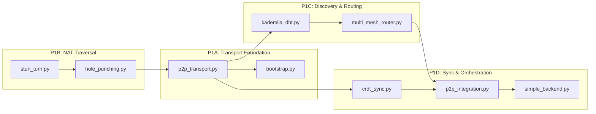

# v1.2 Roadmap — Platform Expansion

> **Status:** Planning Phase  
> **Previous:** v1.0.1 — Core Infrastructure Freeze (Stabilization Complete)  
> **Theme:** Platform Expansion — Real Mesh, Real OS Control, Real Consensus

---

## Execution Strategy

The v1.2 roadmap is organized by **dependency order**. Each phase unlocks the next.
Phase 1 (Mesh) is critical path — everything else depends on real P2P transport.

```
Phase  │ Focus                              │ Dependencies
────────┼────────────────────────────────────┼─────────────
   P1   │ Real Mesh Networking                │ v1.0.1 stable
   P2   │ OS Control Wiring                   │ P1 (mesh for remote device mgmt)
   P3   │ Multi-Clone Voting                  │ P1 (mesh for inter-clone comms)
   P4   │ Multi-User & Social UX              │ P1, P2
   P5   │ Platform Clients: Desktop/Mobile    │ P1, P2, P4
   P6   │ Production PQC & Hardware Security  │ P1 (device mesh)
```

---

## P1: Real Mesh Networking — THE NEXT WORK

### Current State

The mesh layer has **~6,000+ lines across 10 files** but ALL use simulation/loopback instead of real network sockets:

| File | Lines | Status | Missing |
|------|-------|--------|---------|
| [`mesh/p2p_transport.py`](mesh/p2p_transport.py) | 553 | **PARTIAL** | Real UDP socket binding to `asyncio.DatagramProtocol` |
| [`mesh/bootstrap.py`](mesh/bootstrap.py) | 451 | **PARTIAL** | Real TCP socket seed discovery |
| [`mesh/stun_turn.py`](mesh/stun_turn.py) | 875 | **PARTIAL** | Real STUN server queries |
| [`mesh/hole_punching.py`](mesh/hole_punching.py) | 1,114 | **PARTIAL** | Wire to real UDP interfaces |
| [`mesh/kademlia_dht.py`](mesh/kademlia_dht.py) | 579 | **PARTIAL** | Real UDP-based lookup/store |
| [`mesh/crdt_sync.py`](mesh/crdt_sync.py) | 650 | **PARTIAL** | Real P2P sync via WebSocket |
| [`mesh/multi_mesh_router.py`](mesh/multi_mesh_router.py) | 781 | **PARTIAL** | Real transport integration |
| [`mesh/p2p_integration.py`](mesh/p2p_integration.py) | 657 | **PARTIAL** | Real WebRTC data channels |
| [`mesh/autodiscovery.py`](mesh/autodiscovery.py) | 460 | **PARTIAL** | Real UDP broadcast/mDNS |
| [`mesh/relay.py`](mesh/relay.py) | 363 | **PARTIAL** | Real relay connections |

### Execution Plan — 4 Subphases



#### P1A — Transport Foundation

**Files to modify:**
- [`mesh/p2p_transport.py`](mesh/p2p_transport.py):
  - Replace simulated UDP with real `asyncio.DatagramProtocol`
  - Add peer handshake protocol (HELLO/ACK)
  - Add session state tracking (CONNECTING, CONNECTED, DISCONNECTED, TIMEOUT)
  - Add error/retry handling with exponential backoff
  - Wire WebSocket handler to real TCP connections
- [`mesh/bootstrap.py`](mesh/bootstrap.py):
  - Wire to real TCP sockets
  - Add seed node discovery via hardcoded or DNS seed list
  - Add bootstrap response protocol

**New files:**
- [`tests/real/test_mesh_transport.py`](tests/real/test_mesh_transport.py) — Integration tests for transport layer

**Exit criteria:**
- Two instances can discover each other via bootstrap
- Reliable UDP datagram delivery between peers
- Session state machine transitions correctly
- Peers auto-reconnect on transient failures

#### P1B — NAT Traversal

**Files to modify:**
- [`mesh/stun_turn.py`](mesh/stun_turn.py):
  - Wire `STUNClient.query()` to real public STUN servers (Google: `stun.l.google.com:19302`, Cloudflare: `stun.cloudflare.com:3478`)
  - Verify NAT classification (full-cone, restricted, port-restricted, symmetric)
  - Wire `TURNClient.allocate()` to real TURN server for symmetric NAT fallback
- [`mesh/hole_punching.py`](mesh/hole_punching.py):
  - Wire all 4 strategies (`_try_direct`, `_try_stun_punch`, `_try_rendezvous_punch`, `_try_turn_relay`) to real UDP sockets
  - Wire `RendezvousServer` to real UDP endpoint
- [`mesh/relay.py`](mesh/relay.py):
  - Wire relay session management to real TCP/UDP sockets
  - Add relay authentication

**Exit criteria:**
- STUN query returns real mapped address (tested behind actual NAT)
- NAT type classification works correctly
- Hole punching succeeds between two peers behind different NATs
- TURN relay fallback works for symmetric NATs

#### P1C — Discovery & Routing

**Files to modify:**
- [`mesh/kademlia_dht.py`](mesh/kademlia_dht.py):
  - Wire `lookup()` to real iterative UDP queries via [`p2p_transport.py`](mesh/p2p_transport.py)
  - Wire `publish()` to real `STORE` RPCs
  - Wire bootstrap through [`bootstrap.py`](mesh/bootstrap.py)
  - Add routing table maintenance (refresh stale buckets, evict bad nodes)
- [`mesh/multi_mesh_router.py`](mesh/multi_mesh_router.py):
  - Wire `route_through_mesh()` to real transport via [`p2p_transport.py`](mesh/p2p_transport.py)
  - Wire `update_mesh_health()` to real connectivity metrics (latency, packet loss, bandwidth)
  - Add multi-hop routing fallback
- [`mesh/autodiscovery.py`](mesh/autodiscovery.py):
  - Wire LAN discovery via UDP broadcast and mDNS
  - Wire WAN discovery via DHT bootstrap + relay nodes

**Exit criteria:**
- Kademlia lookup finds nodes across real network
- Store/find value works through DHT
- Routing table self-maintains (evicts stale, refreshes buckets)
- MultiMeshRouter selects correct mesh type based on real metrics
- Auto-discovery finds peers on LAN within 5 seconds

#### P1D — Sync & Orchestration

**Files to modify:**
- [`mesh/crdt_sync.py`](mesh/crdt_sync.py):
  - Wire `request_sync()` to real P2P connections
  - Wire `push_operations()` to broadcast via [`p2p_transport.py`](mesh/p2p_transport.py)
  - Wire conflict resolution with LWW and ORSet merge rules
  - Add sync queue drain via real WebSocket connections
- [`mesh/p2p_integration.py`](mesh/p2p_integration.py):
  - Wire `P2PIntegration.start()` to launch all real services (transport, DHT, CRDT)
  - Wire `_peer_discovery_loop()` to use real Kademlia + bootstrap
  - Wire `route_data()` to use real MultiMeshRouter + transport
- [`simple_backend.py`](simple_backend.py):
  - Add mesh status endpoints (`/mesh/status`, `/mesh/peers`, `/mesh/route`)
  - Wire P2PIntegration into backend lifecycle (start/stop)

**New files:**
- [`tests/real/test_mesh_networking.py`](tests/real/test_mesh_networking.py) — Full integration test suite

**Exit criteria:**
- CRDT state converges across 3+ peers within 1 second (LAN)
- P2PIntegration starts/stops cleanly
- Backend exposes mesh status via API (real data, not simulated)
- Full integration test suite passes
- Existing E2E tests still pass

---

## P2: OS Control Wiring

### Current State

| File | Status | Has | Missing |
|------|--------|-----|---------|
| [`os_control/tool_registry.py`](os_control/tool_registry.py) | **PARTIAL** | Tool registration, execution framework | Real OS-level tool execution |
| [`os_control/os_tool_executor.py`](os_control/os_tool_executor.py) | **PARTIAL** | Tool execution logic | Integration with capability matrix |
| [`os_control/os_control_bridge.py`](os_control/os_control_bridge.py) | **PARTIAL** | Bridge between OS and tools | Real OS control endpoints |
| [`os_control/capability_matrix.py`](os_control/capability_matrix.py) | **PARTIAL** | Capability definitions | Gate enforcement |
| Sandbox tools (docker, wasm, low-priv) | **PARTIAL** | Isolation frameworks | Production hardening |

### Scope

1. **Capability Gate Enforcement**
   - Wire [`capability_matrix.py`](os_control/capability_matrix.py) as mandatory gate before every tool execution
   - Define per-user capability grants with runtime checks
   - Add audit logging for all tool executions

2. **Real OS Tool Registration**
   - File system tools (navigate, read, write — sandboxed)
   - Process management (start, stop, list)
   - System monitoring (CPU, memory, disk, network via [`system_monitor.py`](os_control/openclaw_like_tools/system_monitor.py))
   - Clipboard read/write with consent (via [`clipboard_tools.py`](os_control/openclaw_like_tools/clipboard_tools.py))
   - Notification relay
   - USB device management (permissions, hotplug detection)
   - Bluetooth device pairing and control

3. **Backend Integration**
   - Expose OS control tools via FastAPI endpoints
   - Add permission request/approve/reject UI flow
   - Wire OS Hub frontend to show real OS state

4. **Sandbox Hardening**
   - Resource limits (CPU, memory, disk) per tool
   - Timeout enforcement
   - Path traversal protection
   - Command injection prevention

### Exit Criteria

- Capability Matrix enforces grants on every tool call
- 7+ real OS tools registered and working (file, process, system, clipboard, notification, USB, Bluetooth)
- Permission request UI works end-to-end
- OS Hub shows real system metrics
- All tool executions are audit-logged
- No sandbox escape in 100 attempted bypass scenarios

---

## P3: Multi-Clone Voting & Governance

### Current State

The [`ConsensusEngine`](core/consensus/consensus_engine.py) exists with 4 voting modes (Majority, Pairwise, Confidence-Weighted, Role-Based). The 15-clone system exists in [`world_clones.py`](core/founder_clones/world_clones.py) and [`founder_clone_system.py`](core/founder_clones/founder_clone_system.py) but lacks ensemble LLM voting integration.

### Scope

1. **Clone-to-Consensus Wiring**
   - Wire [`WorldCloneOrchestrator`](core/founder_clones/world_clones.py) to [`ConsensusEngine`](core/consensus/consensus_engine.py)
   - Add per-clone LLM async voting via [`CloneConsensusFacade`](core/consensus/consensus_engine.py:1490)
   - Wire [`founder_to_clone_map.py`](core/founder_clones/founder_to_clone_map.py) for domain routing

2. **Vote Lifecycle**
   - Propose → Debate → Vote → Tally → Execute
   - Mode selection based on task type (majority for low-stakes, role-based for security)
   - Delegation chain support

3. **Governance Dashboard**
   - Real-time vote visualization
   - Clone participation tracking
   - Domain veto display

4. **Federation Integration**
   - Mesh-aware multi-node governance
   - Cross-mesh proposal relay via P1 mesh layer

### Exit Criteria

- 15 clones can vote via LLM through ConsensusEngine
- All 4 voting modes produce correct results
- Vote lifecycle completes end-to-end
- Governance dashboard shows live voting state
- 3-node mesh can coordinate a governance decision

---

## P4: Multi-User & Social UX

### Scope

1. **Shared Workspaces**
   - Presence tracking (online/offline/away)
   - Typing indicators
   - Shared dashboard views
   - Concurrent edit awareness

2. **Role-Based Dashboard Views**
   - Admin view (system status, all controls)
   - User view (personal tools, permissions)
   - Observer view (read-only monitoring)

3. **Notification System**
   - Push notifications for override/consensus events
   - Alert escalation
   - User preference management

### Dependencies
- P1 (mesh for presence relay)
- P2 (OS control for notification delivery)

---

## P5: Platform Clients

### Desktop App

**Technology:** Electron or Tauri (determine in P4)

**Scope:**
- Native OS integration (file system, notifications, system tray)
- Offline-first with background sync via P1 mesh
- Local LLM inference for air-gapped operation
- System tray with quick actions
- Auto-update mechanism

### Mobile App

**Technology:** React Native

**Scope:**
- Push notifications for override/consensus events
- Biometric authentication via device sensors
- Mesh peer discovery over BLE
- Offline CRDT sync queue
- Camera/gallery access for document scanning

### Dependencies
- P1 (mesh for sync)
- P2 (OS control for native integration)
- P4 (multi-user UX patterns)

---

## P6: Production PQC & Hardware Security

### Scope

1. **liboqs Integration**
   - Real lattice-based KEM (Kyber-1024) for key exchange
   - Real lattice-based signatures (Dilithium-5) for identity
   - Hybrid (classical + PQC) TLS handshake

2. **TPM-Backed Key Storage**
   - TPM 2.0 integration for secure key generation
   - PQC key storage in TPM NV index
   - Attestation support

3. **Mesh Security Hardening**
   - Noise protocol on all P2P channels
   - mTLS for WebSocket connections
   - Perfect forward secrecy

### Dependencies
- P1 (mesh for protocol hardening)

---

## Deferred Items (Not in v1.2 Scope)

These are research tracks, not production milestones, and remain deferred:

| Item | Reason |
|------|--------|
| seL4 Microkernel | Requires Rust/C rewrite. Python sim is placeholder |
| Blockchain Constitution Anchor | No smart contract platform selected |
| Neural Interface / BCI | Future vision only |
| Fractal Universe / Wave Propagation | Visualization toys, not integrated |
| National Governance Layer | Political/legal framework, not code |
| DePIN Bridge | Simulated rates. No real network integration |

---

## Quick Reference — File Map

| Phase | Primary Files | Test Files |
|-------|--------------|------------|
| P1A | [`mesh/p2p_transport.py`](mesh/p2p_transport.py), [`mesh/bootstrap.py`](mesh/bootstrap.py) | [`tests/real/test_mesh_transport.py`](tests/real/test_mesh_transport.py) |
| P1B | [`mesh/stun_turn.py`](mesh/stun_turn.py), [`mesh/hole_punching.py`](mesh/hole_punching.py), [`mesh/relay.py`](mesh/relay.py) | |
| P1C | [`mesh/kademlia_dht.py`](mesh/kademlia_dht.py), [`mesh/multi_mesh_router.py`](mesh/multi_mesh_router.py), [`mesh/autodiscovery.py`](mesh/autodiscovery.py) | |
| P1D | [`mesh/crdt_sync.py`](mesh/crdt_sync.py), [`mesh/p2p_integration.py`](mesh/p2p_integration.py), [`simple_backend.py`](simple_backend.py) | [`tests/real/test_mesh_networking.py`](tests/real/test_mesh_networking.py) |
| P2 | [`os_control/tool_registry.py`](os_control/tool_registry.py), [`os_control/capability_matrix.py`](os_control/capability_matrix.py), [`os_control/os_control_bridge.py`](os_control/os_control_bridge.py), [`os_control/os_tool_executor.py`](os_control/os_tool_executor.py) | |
| P3 | [`core/consensus/consensus_engine.py`](core/consensus/consensus_engine.py), [`core/founder_clones/world_clones.py`](core/founder_clones/world_clones.py), [`core/founder_clones/founder_clone_system.py`](core/founder_clones/founder_clone_system.py) | |
| P4 | Frontend: dashboard components, notification system | |
| P5 | New: Electron/Tauri app, React Native app | |
| P6 | [`security/security_framework.py`](security/security_framework.py), new: liboqs adapter | |
